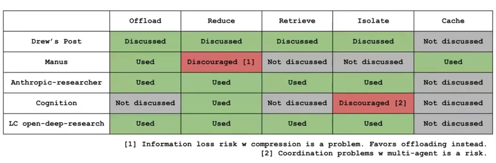
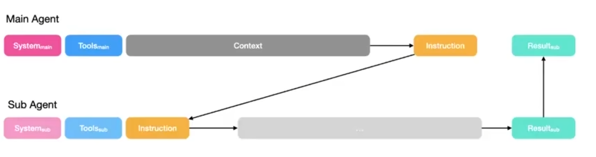
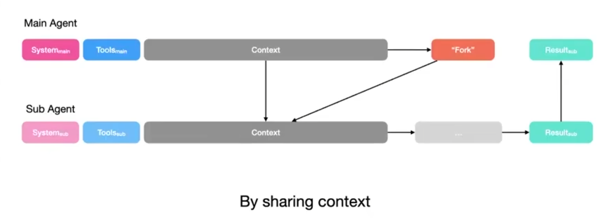

https://manus.im/zh-cn/blog/Context-Engineering-for-AI-Agents-Lessons-from-Building-Manus

https://www.bilibili.com/video/BV12x1xB8E7b/?spm_id_from=333.788.top_right_bar_window_custom_collection.content.click&vd_source=e6a26642f7f1d14e5b11a109a4dfffe9

https://hub.baai.ac.cn/view/51790

## 常用的五类上下文工程方法

offload 利用文件存储上下文 比如网页信息、只给最精华的部分

reduce 使用summary概括上下文 剪枝处理  （ 通过分层动作空间（函数调用 → 沙盒工具 → 包/API）以及基于文件系统的状态管理来进行卸载

retrieve 索引+语义检索 或者用命令grep等

iolate sub agnet独立上下文 使用最小子智能体（规划器、知识管理器、执行器）并采用“智能体即工具”的范式来实现隔离

cach

在 Agent 的构建过程中，会发现一个现象：上下文会持续增长，并且是以一种非常特殊的方式增长。

Agent 每调用一次工具，就会返回一个工具的观测结果，这个结果会被追加到聊天记录中。随着时间的推移，消息列表会越来越长，导致 Agent 在运行时消息数量出现无限制的爆炸性增长。

Manus 之前提到，典型的任务大约需要调用 50 次工具。Anthropic 也提到过类似的情况，生产环境中的 Agent 可能会进行长达数百轮的对话。

上下文长度的持续增长，会导致推理性能断崖式的下跌。业内叫做「上下文腐烂」（Context Rot），具体表现是：推理变慢、质量下降、甚至开始无意义地重复。

## manus reduce

Cursor 提出了「动态上下文发现」（Dynamic Context Discovery）模式。核心是，别急着把信息塞给模型，而是让模型在需要的时候自己去找。

Cursor 把这套模式用到了他们的多个实际场景中：

* **将冗长的工具结果转化为文件**

工具调用，特别是 Shell 命令或第三方 MCP（模型上下文协议），经常返回巨大的 JSON 响应，瞬间就能撑爆上下文。目前的编程 Agent 通常采取的简单粗暴做法是：直接截断过长的 Shell 命令或 MCP 结果，但很可能会丢失最关键的信息。

Cursor 的做法是，将这些输出直接写入到一个文件，然后在上下文中只告诉 Agent：「结果在 output.log 里，你自己去看。」Agent 可以先用 tail 命令查看文件末尾，如果需要更多细节，再读取整个文件。

* **在「总结」阶段引用聊天记录**

当模型的上下文窗口被填满，Cursor 会触发一个「总结」步骤，给 Agent 腾出一个新的上下文窗口，其中包含之前工作的摘要。

但 Agent 的知识会在这个过程中「退化」，因为「总结」本质上是对上下文的一种有损压缩。 Cursor 把完整的聊天历史记录也看做是一个文件。当触发总结时，Agent 会拿到一份摘要，以及一个指向「历史记录文件」的引用。如果 Agent 意识到摘要中缺少某些它需要的细节，它就可以通过搜索这份历史记录文件来找回这些信息。

**Manus ：一套结构化的可逆、缩减系统**

对比 Cursor「简单粗暴」的解决思路，Manus 的做法是，把「上下文缩减」设计成了一套有明确触发机制、分阶段执行的结构化流程。

首先，Manus 的系统会持续监控上下文长度，设定一个远低于模型硬件极限的「腐烂前阈值」（Pre-rot Threshold）。

> 季逸超：你的模型有一个硬性的上下文限制，比如说 100 万个 Token，这在今天是相当普遍的。但实际上，大多数模型在远低于这个值时性能就开始下降，通常可能在 20 万个 Token 左右，你会开始看到我们所说的「上下文腐烂」，比如重复、推理变慢、质量下降等。
>
> 所以，通过大量的评估，识别出那个「腐烂前」的阈值非常重要，通常是 12.8 万到 20 万个 Token，并将其作为触发上下文缩减的条件。

当信号被触发后，系统会启动第一阶段的操作：

**第一步：紧凑化（Compaction）**

这是一种无损、可逆的缩减。核心是，剥离掉任何能从外部状态（比如文件系统）重建的信息。

举个例子，Agent 调用了一个向文件写入内容的工具，这个操作在历史记录中可能包含 path 和 content 两个字段。一旦执行成功，那个可能极其冗长的 content 字段就可以被安全地从上下文中剥离，只保留 path。

信息并没有丢失，它只是被「外部化」了。如果 Agent 在 10 步之后需要再次读取该文件，它凭借保留的 path 就能轻易将其检索回来。

Manus 提到，**这种可逆性是非常关键的，因为你永远不知道哪个过去的动作会成为未来的关键。**

通常情况下，紧凑化只会用作最早的 50% 的历史记录，来保留最新的、完整的工具调用作为模型学习的范例（Few-shot Examples）。

但紧凑化收益有限。多轮操作后，上下文削减的收益变得微乎其微时，系统会启动第二阶段：

**第二步：摘要化（Summarization）**

这是一种有损、但带保险的压缩。把它当做最后手段，在执行时需要极其谨慎。

它的「保险」在于：在生成摘要之前，系统会更激进地将整个摘要前的完整上下文，转储（Dump）到一个文本或日志文件中。 相当于给历史创建了一个完整的快照存档。如果模型足够聪明，它甚至能用 grep 或 glob 自己去这个日志里捞数据。

> 季逸超：紧凑化是可逆的，而摘要化不是。两者都减少了上下文长度，但它们的行为方式非常不同。

在进行摘要化时，总是会使用完整版本的数据，不是紧凑版本。

摘要化依然会保留最后几次完整的工具调用记录。 这能让模型清楚地知道自己从哪中断，能平滑地继续工作，保持风格和语气的连贯性。

两个步骤下来，通过「紧凑化」（Compaction）剥离可重建信息，以及在「摘要化」（Summarization）之前，将完整的上下文转储（Dump）到日志文件中。实现上下文缩减。

**我们的压缩策略始终设计为可恢复的。例如，只要保留URL，网页内容就可以从上下文中移除；如果沙盒中仍然保留文档路径，则可以省略文档内容。这使得Manus能够缩短上下文长度，而不会永久丢失信息。**

完整形式（Full Form）： 记录原始的、未经处理的调用结果，作为“事实真相”存储在后台，供系统回溯或深层调用。

紧凑形式（Compact Form）： 这是 Agent 真正“看到”的部分。它经过了策略驱动的压缩（Policy-based compression）模式驱动的摘要（Schema-driven summary）。

这种架构设计的精妙之处在于，它利用 Schema（模式）引导模型只提取与当前任务强相关的核心信号。通过这种方式，Agent 的上下文始终保持清爽且高效，从而从根本上规避了冗余信息导致的“认知负担”。

模型在接近128k 开始压缩 避免上下文腐烂

## isolation

很贵 没有kv cache

## offloading

**在 RAG（检索增强生成）大行其道的当下，许多人的首选是使用向量存储（Vector Store）。但在处理复杂的工程任务时，Manus 却做出了一个反直觉但极具逻辑之美的选择：放弃向量索引，转向****基于文件系统的状态管理（File-system based state management）** **。**

**为什么？因为向量存储本质上是***概率性** **和***语义化** **的。在需要精确操作代码或环境的场景下，语义检索往往会带来“模糊”的错误结果。相比之下，文件系统是****确定性** **且****有状态** **的。当 Agent 需要在沙盒中进行迭代时，它必须确切地知道每一个文件的状态。**

Manus 认为，常见的方法对工具描述进行动态的 RAG，不可行。 因为动态加载工具定义，会「干掉」KV 缓存，且历史记录里的旧调用会成为陷阱。

> 季逸超：目前一个常见的方法是对工具描述进行动态的 RAG，比如，根据当前任务或状态按需加载工具。
>
> 但会导致两个问题：首先，由于工具定义位于上下文的开头，每次变动都会导致你的 KV 缓存重置；最重要的是，模型过去对那些已被移除的工具的调用记录仍然存在于上下文中，这可能会误导模型去调用无效的工具或使用无效的参数。

为了解决这个问题，Manus 设计了一套分层行动空间。把 Agent 的能力划分为三个层次：函数调用、沙盒工具、软件包和 API。

* **第一层：原子函数调用（Function Calling）**

核心层，只包含极少数固定的、正交的原子函数，比如：读写文件、执行 shell 命令、在文件和互联网中搜索。因为这层是固定的，所以对 KV 缓存友好，且功能边界清晰，不会导致混淆。

* **第二层：沙盒工具（Sandbox Tools）**

卸载层。Manus 将绝大多数工具，格式转换器、语音识别工具，甚至 MCP 调用本身（通过一个 MCP CLI 命令行工具），都作为预装软件放在一个定制的 Linux 虚拟机沙箱里。 Agent 不在上下文中「看到」这些工具的详细定义，更像是一个真正的开发者，通过第一层的 shell 命令来动态地与它们交互。比如，它可以用 ls /bin 来查看有哪些可用的工具，或者用 mcp_cli --help 来学习如何使用 MCP 命令行工具。

* **第三层：软件包与 ****API****（Packages & APIs）**

代码层。对于需要大量内存计算或者需要与复杂第三方服务交互的任务，允许 Agent 编写并执行 Python 脚本。比如，分析一整年的股票数据，Agent 不会把原始数据加载到上下文中，而是会写一个脚本去完成计算，只把摘要结果返回。

**函数调用 (Function calling) → 沙盒工具 (Sandbox tools) → 包/API (Packages/API)**

Function calling：读文件 浏览器 shell 其他卸到sandbox

Sandbox tools：vm sandbox 可已用shell mcp（by cli）

Packages/API：使用api秘钥？ 查询天气啥的吧

## 多 Agent 协作，

## 需要反复使用模式、结构化输出

多个 Agent 之间如何协作，也是个难题。

Cognition 之前在博客中提到：不要滥用多 Agent 设置，因为当你有很多 Agent 时，它们之间的信息同步会成为一场噩梦。

怎么利用多 Agent，实现「上下文隔离」，让每个子 Agent 都有自己独立的上下文窗口，从而实现关注点分离。是一个核心问题。

Manus 的解决思路是，借鉴 Go 语言：**不要通过共享内存来通信，而是通过通信来共享内存。**

把这句话里的「内存」替换为「上下文」，就是两种截然不同的 Agent 协作模式。

**两种 Agent 协作模式**

* **任务委托模式：「通过通信」实现隔离**

这是经典的主-子 Agent（Master-Sub-agent）设置。主 Agent 将一个任务封装成一条简短、清晰的指令，然后发送给子 Agent。子 Agent 的上下文是完全独立的，从零开始，只包含这条指令。

简单来说，**主 Agent 发任务，子 Agent 交结果，中间过程免打扰。**

这个模式，适用于「过程不重要，只关心结果」的任务。举个例子，主 Agent 需要在一个大型代码库中搜索特定的代码片段。它只需要委托子 Agent：「在 A 项目中找到所有调用了 some_function 的地方」，然后等待返回结果列表即可。主 Agent 不关心子 Agent 是如何使用 grep 或其他工具完成搜索的。

在内部，Manus 将这种模式叫做「Agent 即工具」。从主 Agent 视角，它只是调用了 advanced_search 函数，但背后实际上是另一个拥有独立工作流的子 Agent 在执行。

* **信息同步模式：「通过共享上下文」实现协作**

但对于更复杂、需要完整历史记录的场景，简单的任务委托是远远不够的。

Manus 的思路是，通过共享上下文来实现协作。子 Agent 被创建时，能够看到主 Agent **完整的先前上下文** ，包括所有的历史工具调用和观察。但这个子 Agent 拥有自己独立的系统提示词和新的行动空间。

这种模式，更适用于高度依赖历史信息、需要综合分析的任务。比如，在进行一项深度研究任务时，最终的研究报告需要综合大量的中间搜索结果和笔记。

如果使用第一种通信模式，主 Agent 需要将所有中间产物写入文件，再让子 Agent 去一一读取，这会造成巨大的延迟和额外的 Token 消耗。在这种情况下，直接让子 Agent 继承完整的上下文反而会更高效。

但 Manus 也提到，**共享上下文的模式成本是相当昂贵的。** 因为每个子 Agent 启动时都需要 Prefill 一个非常大的输入，并且因为系统提示词不同，无法复用主 Agent 的 KV 缓存，所以必须支付全价。

所以，需要根据任务的性质，灵活地在这两种模式中间进行选择。

### 多 Agent 通信，发信息不难，难的是收结果

多 Agent 通信的一个难点是「接收」，如何从多个并行工作的子 Agent 那里，获得结构一致、内容准确的输出？

Manus 设计了一套内部代号叫做「Agent 化的 MapReduce」的系统。简单来说，

* **共享沙箱**

每个 Manus 会话都在一个完整的虚拟机沙箱中运行。当主 Agent 创建子 Agent 时，共享同一个沙箱。这意味着，共享同一个文件系统，信息的传递可以简单到只传递不同的文件路径，解决了输入信息同步的问题。

* **输出模式（Schema）**

这是关键。主 Agent 在创建子 Agent 之前，**必须先定义一个输出的 Schema ** 。这个模式就是一份强制执行的 API 合同，规定了子 Agent 最终必须返回什么样的数据结构。

* **约束解码**

子 Agent 有一个专用工具 submit_result。Manus 使用约束解码（Constrained Decoding）技术，强制子 Agent 提交的结果，必须严格符合主 Agent 定义的 Schema。

这套设计的核心思路是，无论是做摘要还是 Agent 间通信，都反复使用模式和结构化输出作为一种「契约」，来保证信息以结构化、完整的方式传递。
