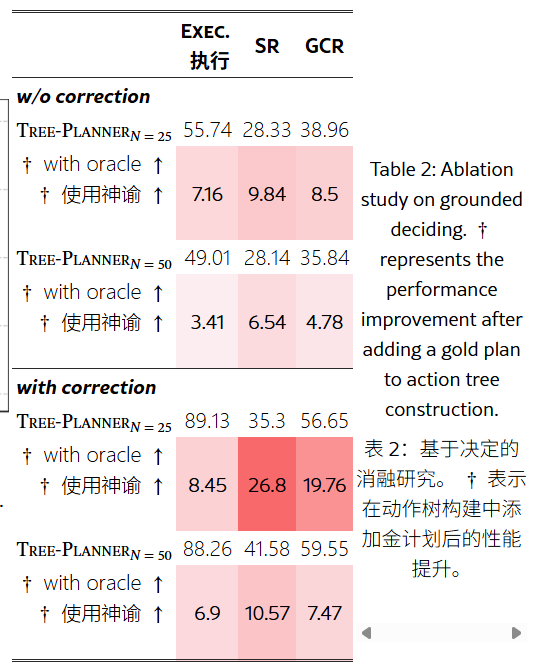

2025.12.01-12.07

# **Tree-Planner**: Efficient Close-loop Task Planning with Large Language Models

https://tree-planner.github.io/

主卖点是Efficient 

通过提示 LLMs 迭代生成动作已成为一种普遍范式，因其性能优越，但该范式存在两个效率问题：高 token 消耗和冗余的错误纠正，这阻碍了其在大规模测试和应用中的可扩展性。

我们提出了 Tree-Planner，将基于 LLMs 的任务规划重新划分为三个不同阶段：计划采样、动作树构建和grounded deciding。Tree-Planner 首先使用 LLM 在执行前采样一组潜在计划，然后将这些计划聚合形成动作树。最后，LLM 对树进行自上而下的决策过程，考虑实时环境信息。

1 plan采样

通过利用预训练 LLM 中嵌入的常识推理能力，Tree-Planner 通过策略性设计的提示提取可行的计划。这些提示包括指令、全局环境信息、初始观察和上下文示例。采样过程旨在创建一个多样化的计划集，以便在后续阶段中选择最优的计划。  主要是提取丰富的动作

2 动作树构建

基于树的表示的转换促进了替代计划的效率探索，避免了相同动作路径的冗余重新执行。

3 基于（grounded 事实的）决策

模拟了人类决策过程，人类首先提出几个行动选项，然后结合他们当前的实时世界观察来做出决策。

就是多次call LLM 选择树的分支

错误纠正方法。当选择的行动在环境中无法执行时，Tree-Planner (i) 将以失败节点为根的子树上的节点标记为无效节点； (ii) 在行动树上回溯以找到具有可用有效子节点的先前有效分支节点。如果一个特定节点的所有子节点都无效，那么该分支节点也应该被标记为无效。 (iii) 执行先前已执行动作的逆过程（例如，[SwitchOn]的逆是[SwitchOff]）以恢复代理的状态； (iv) 在分支节点重新决策。

## 实验

Tree-Planner 相比Iterative-Planner.消耗的 token 更少

GCR 是通过将真实目标条件与生成的计划所实现的目标条件之间的差异除以目标条件总数来计算的

随着 N 的增加， G⁢C⁢Rm⁢a⁢x 有明显的增加，但最终达到一个阈值。因此， N 的值较大会导致 token 消耗增加，但不一定能提高性能上限。在使用 Tree-Planner 时，选择一个平衡 token 假设和模型性能的 N 值至关重要。 (iii) G⁢C⁢Ra⁢v⁢g 并不总是随着 N 的增加而增加。这意味着当 N 变得更大时，“正确”的计划占采样计划的比例不一定增加。 （生成的样本丰富性有一个上限 重复退回resampling可能有用？ ）

oracle就是标准答案计划 将每个任务的标准计划纳入到动作树的构建中 都有一定的提升  当计划数量增加，但正确计划的比例减少时，性能可能会受到负面影响

## ai锐评

Tree-Planner 将 LLM 任务规划拆分为“多计划采样 → 动作树构建 → 基于实时观察的树上决策”，目标是降低 token 成本并减少重复纠错。尽管结构新颖，但从方法论、假设、鲁棒性、可扩展性与实验设置来看，该方法存在明显局限，其 claimed 优势并不足以构成真正的突破。

**1 动作树依赖 LLM 多样性，但 LLM 的多样性是虚假的**

动作树的核心价值来自：

> “Plans with common prefixes are aggregated.”

但 LLM 的多计划采样通常出现：

* 大量重复 plan（前几步几乎一致，后半段随机漂移）
* plans 之间的差异极小
* 难以得到真正有意义的 alternative strategies

  （如 nap 只能去 bed, couch, sofa → 本质上就 2–3 路）

这会导致：

* 动作树迅速退化为一条几乎线性的“伪树”
* 分支极少，无法发挥 Tree-Planner 的优势
* 多样性不足→ grounded deciding 阶段决策空间极小

本质上：**Tree-Planner 重度依赖 LLM 内在 commonsense 的多样性，但该多样性是有限且不可控的。

2 **“Grounded-Deciding” 本质仍旧是多次 LLM 调用 → 并没有减少调用次数，只是改变调用结构**

> **LLM 调用次数与任务长度仍线性相关，甚至更大（因 backtracking）。**

Tree-Planner 只是把：

* Iterative-Planner 的**1 次大调用（重复 prompt）**

换成

* Tree-Planner 的**多次小调用（减少 prompt，但增加频率）**

**3 几乎无法在真实机器人中使用：方法根本依赖“逆动作存在”这一强假设**

4 **“闭环（closed-loop）”实际上非常弱：Tree-Planner 仅在树上局部导航，不是真正的 closed-loop planning  （这个倒是过了）**
