参考链接：

https://fareskalaboud.github.io/LearnPDDL/ （直接是例子 新手先看其他

https://users.cecs.anu.edu.au/~patrik/pddlman/writing.html （语法逐步

* [X] typing没见过 还不太熟悉
* [ ] 规划质量动作成本那块还没有涉猎 理解不深
* [ ] 链接一还有个难一点的例子没看

# 1 引言

PDDL 是少数几种为创建人工智能（AI）规划标准而设计的语言之一。它于 1998 年开发，并在 ICAPS 大会上首次推出，多年来不断改进和扩展

目前最流行的 PDDL 版本是 PDDL2.1，它是用于表达时序域的 PDDL 扩展[2]；PDDL 3[3]在 PDDL 2.1 的基础上增加了轨迹约束和偏好；以及 PDDL+[4]，它允许在 PDDL 中建模混合离散-连续域。

一个 PDDL 定义由两部分组成：领域和问题描述。

**Note:** Although not required by the PDDL standard, most planners require that the two parts are in separate files.
注意：虽然 PDDL 标准没有要求，但大多数规划器要求这两部分分别存储在不同的文件中

# 2 PDDL 问题描述的组成部分

## 2.1 注释

PDDL 文件中的注释以分号开头（" ; "），并持续到行尾。

## 2.2 Requirements

由于 PDDL 是一种非常通用的语言，而大多数规划器只支持其子集，因此领域可以声明要求。最常用的要求有：

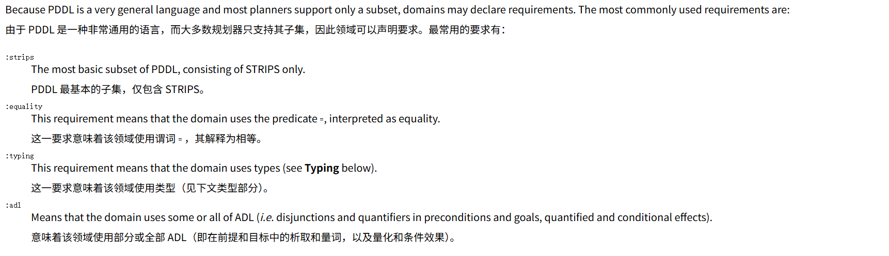

strips解释

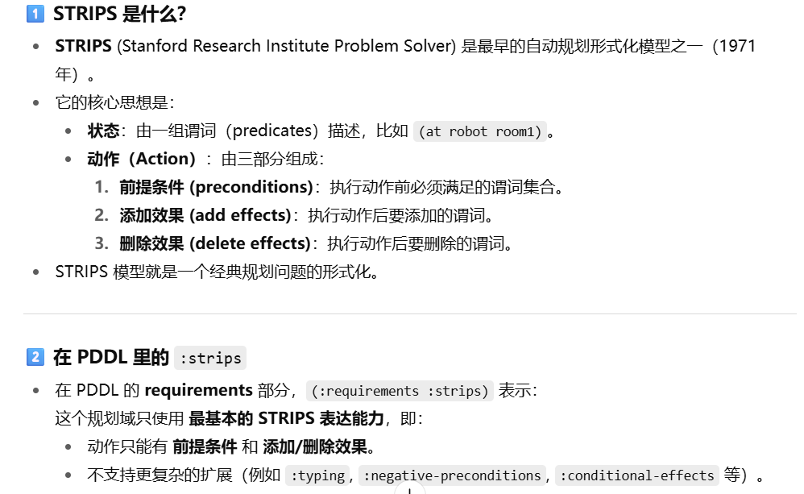

# 3 The Domain Definition  领域定义

领域定义包含领域谓词和算子（在 PDDL 中称为动作）。它还可能包含类型（见下文类型部分）、常量、静态事实以及其他许多内容，但再次强调，这些内容大多数规划器都不支持。

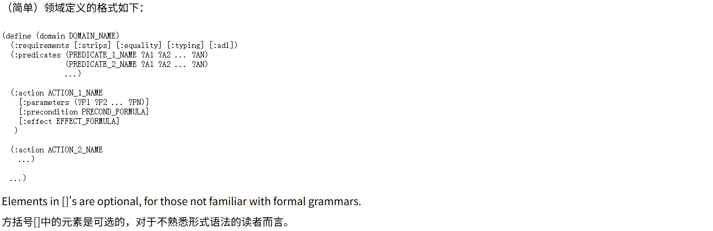

名称（领域、谓词、动作等）通常由字母数字字符、连字符（" - "）和下划线（" _ "）组成，但可能有些规划器允许更少。

Parameters of predicates and actions are distinguished by their beginning with a question mark ("?").
谓词和动作的参数通过以问号("？")开头来区分。

谓词声明中使用的参数（即 :predicates 部分）除了指定谓词应有的参数数量外没有其他作用，也就是说参数名称并不重要（只要它们是不同的）。谓词可以有零个参数（但在这种情况下，谓词名称仍然必须在括号内写出）

## 3.1 谓词意味着什么？

需要理解的一点是，除了特殊的谓词 = 之外，领域定义中的谓词没有内在含义。领域定义的 :predicates **部分仅指定领域中使用的谓词名称及其参数数量**（如果领域使用类型系统，还包括参数类型）。谓词的"含义"，即它能在哪些参数组合下为真以及与其他谓词的关系，是由**领域中的动作对谓词产生的影响以及问题定义的初始状态中列出的谓词实例决定的。**

通常会将静态谓词和动态谓词区分开来：静态谓词不会因任何动作而改变。因此，在一个问题中，静态谓词的真实例和假实例将始终与问题定义的初始状态规范中列出的完全一致。请注意，在 PDDL 中，静态谓词和动态谓词在句法上没有区别：它们在域的 :predicates 声明部分看起来完全一样。尽管如此，一些规划器可能对静态谓词和动态谓词支持不同的构造，例如允许静态谓词在动作前置条件中被否定，但不允许动态谓词。

## 3.2 Action Definitions  动作定义

根据 PDDL 规范，动作定义的所有部分**除了名称都是可选的**（当然，没有效果的动作为之无用）。然而，对于没有前置条件的动作，一些规划器可能需要一种形式的"空"前置条件，如 :precondition () 或 :precondition (and) ，并且一些规划器可能还要求没有参数的动作有一个空的 :parameter 列表）。

## 3.3 Precondition Formulas  前置条件公式

在 STRIPS 领域中，一个前置条件公式可能是：

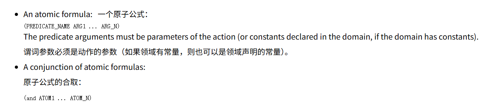

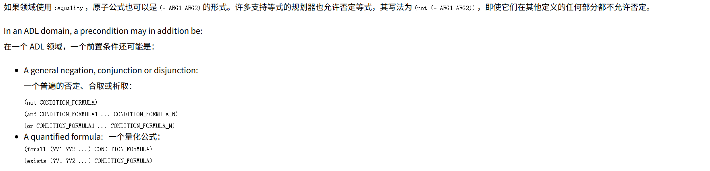

## 3.4 Effect Formulas  效果公式

在 PDDL 中，动作的效果并没有明确地分为“添加”和“删除”。相反，负效果（删除）通过否定来表示。

在 STRIPS 领域，一个效果公式可能由以下内容组成：

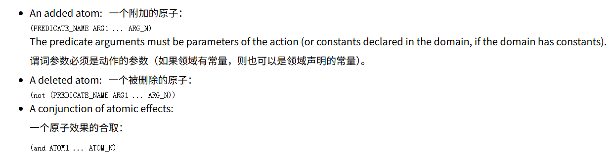

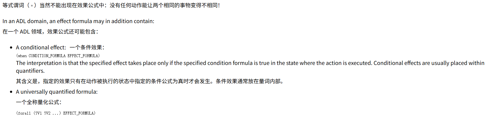

# 4 The Problem Definition  问题定义

问题描述包含问题实例中存在的对象、初始状态描述和目标。

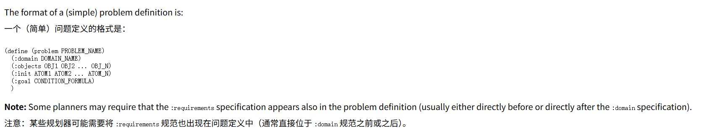

初始状态描述（ :init 部分）仅仅是一个在初始状态下为真的所有 grounded atoms 的列表。所有其他原子根据定义都是假的。目标描述是一个与动作前置条件相同形式的公式。初始状态和目标描述中使用的所有谓词自然应该在相应的领域中进行声明。

然而**，与动作前置条件不同**，初始状态和目标描述应该是 grounded 的，**这意味着所有谓词参数应该是对象或常量名称，而不是参数。**（ADL 领域中的量化目标是一个例外，其中当然可以在量化符的作用范围内使用量化变量。但是请注意，即使某些声称支持 ADL 的规划器也不支持目标中的量化符。）

# 5 Typing  类型

PDDL 有一种（非常）特殊的语法用于声明 **参数** 和 **对象类型** 。

如果要在领域（domain）中使用类型，领域应该在 `:requirements` 部分声明 **`:typing`** 。

类型名称必须在使用之前进行声明（这通常意味着要在 `:predicates` 声明之前）。

类型的声明语法是：

```lisp
(:types NAME1 ... NAME_N)
```

要声明某个谓词（predicate）或动作（action）的参数类型，可以这样写：

```lisp
?X - TYPE_OF_X
```

如果多个参数属于同一类型，可以写成：

```lisp
?X ?Y ?Z - TYPE_OF_XYZ
```

请注意，参数和类型名称之间的连字符（`-`）必须是**独立的** ，也就是说，它前后都要有空格。

在 **问题定义（problem definition）** 中声明对象的类型时，语法是相同的。

# 6 Plan Quality Criterion  规划质量标准

PDDL 的较新版本有一种机制用于表达规划质量的度量，规划器应尝试优化的度量。然而，大多数规划器只会优化特定的一个度量，而且很多根本不尝试优化任何东西（只是为了尽可能快地找到任何计划）。

## 6.1 Sum of Action Costs 动作成本之和

为了指定动作成本，需要添加一个“流变量”来跟踪成本。流变量类似于状态变量/谓词，但其值是一个数字而不是 true 或 false。同样，请注意 PDDL 的流变量语法非常具有表现力，大多数规划器只会接受有限的使用。

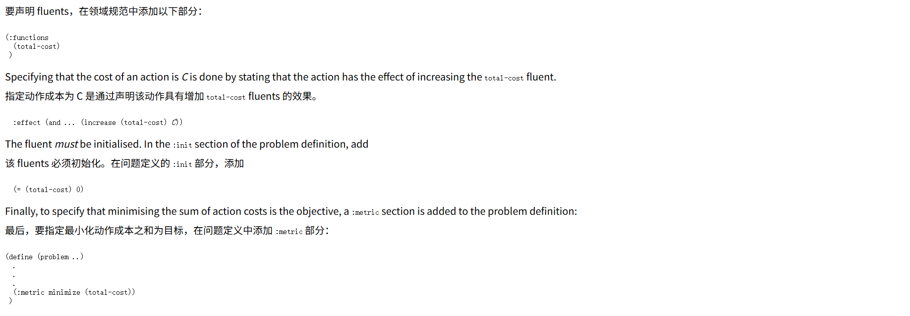

注意：PDDL 计划验证器（VAL）要求在域的 :requirements 部分中使用任何流动态时，都必须包含关键字 :fluents 。有些规划器会要求它包含 :action-costs ，而有些则可能不识别这两种情况中的任何一种。

要使动作的成本取决于其参数，可以声明静态函数，并在 increase 效果中使用这些函数。例如：

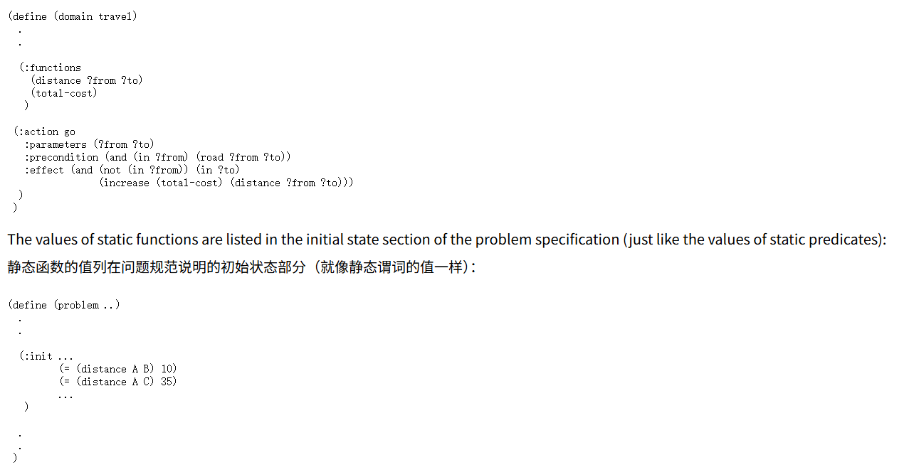

原则上，PDDL 允许在 increase 效果的左侧以及问题部分的 :metric 中使用任何函数、常量和算术运算（ + 、 - 、 * 、 / ）。然而，许多规划器要求度量流动态命名为 total-cost ，并且只在 increase 效果中接受常量，或许还有静态函数。

# 7 例子

**查看test文件夹中的cake-domain 和cake-problen**

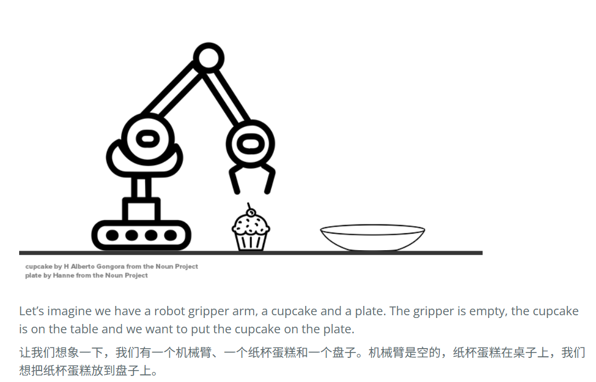

在用 PDDL 建模之前，让我们先看看 PDDL 问题的组成部分：

```markdown
# PDDL 示例：letseat 域

## 定义领域
首先我们定义领域。

```lisp
(define (domain letseat)
```

---

## 7.2 定义对象类型

然后我们定义对象：盘子、夹子、纸杯蛋糕。我们还将标记纸杯蛋糕和机械臂为可定位的，这是一个小技巧，以帮助我们使用稍后创建的谓词查询这些对象的位置。

```lisp
(:requirements :typing) 

(:types     
    location locatable - object
    bot cupcake - locatable
    robot - bot
)
```


`location locatable - object`

* 声明了两种类型：`location` 和`locatable`。
* 它们都是**object** 的子类（`object` 是所有东西的根类型）。
* 解释：
  * `location` 表示位置（比如桌子、盘子）。
  * `locatable` 表示“可以被定位的东西”（比如机器人、纸杯蛋糕），意思是它们可以出现在某个`location`。

---

`bot cupcake - locatable`

* 声明了两种类型：`bot` 和`cupcake`。
* 它们都是`locatable` 的子类。
* 解释：
  * `bot` 表示机器人（或机械臂）。
  * `cupcake` 表示纸杯蛋糕。
* 因为它们继承了`locatable`，所以它们都能被放在某个`location`。

---

`robot - bot`

* 声明了 `robot` 类型，它是 `bot` 的子类。
* 解释：

  * `bot` 可以是一个泛指（例如不同种类的机器人或机械臂）。
  * `robot` 则是其中的一种具体实现。
*
* 这样写的好处是，可以扩展：比如以后还可以加 `drone - bot` 来表示无人机。

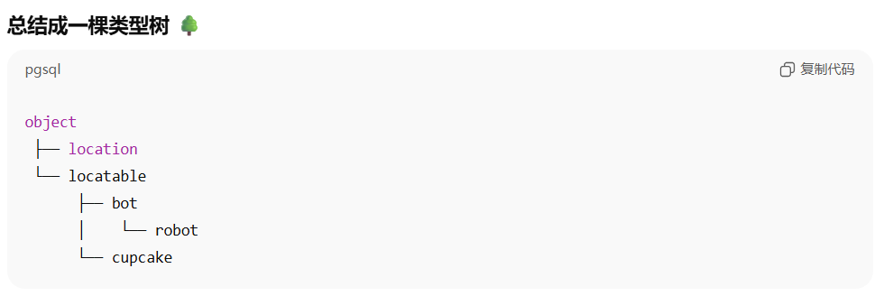

这样定义后，你就可以写：

* `?x - location` → 表示一个位置参数
* `?y - cupcake` → 表示一个纸杯蛋糕
* `?z - bot` → 表示一个机器人

这比全都用 `?obj - object` 要清晰和高效得多

---

## 7.3 定义谓词

我们还需要定义一些谓词。夹子臂是空的吗？纸杯蛋糕在哪里？

```lisp
(:predicates
    (on ?obj - locatable ?loc - location)
    (holding ?arm - locatable ?cupcake - locatable)
    (arm-empty)
    (path ?location1 - location ?location2 - location)
)
```

---

## 7.4 定义动作（操作符）

我们还需要定义动作/操作符。

我们需要能够：

* 拿起纸杯蛋糕
* 放下纸杯蛋糕
* 在桌子和盘子之间移动手臂

---

### 1. 拿起（pick-up）

```lisp
(:action pick-up
  :parameters
   (?arm - bot
    ?cupcake - locatable
    ?loc - location)
  :precondition
   (and 
      ; 注意我们在下面两行中使用相同的变量 ?loc
      ; 这样确保它们指向同一个位置
      (on ?arm ?loc) 
      (on ?cupcake ?loc) 
      (arm-empty)
    )
  :effect
   (and 
      (not (on ?cupcake ?loc))
      (holding ?arm ?cupcake)
      (not (arm-empty))
   )
)
```

---

### 2. 放下（drop）

```lisp
(:action drop
  :parameters
   (?arm - bot
    ?cupcake - locatable
    ?loc - location)
  :precondition
   (and 
      (on ?arm ?loc)
      (holding ?arm ?cupcake)
    )
  :effect
   (and 
      (on ?cupcake ?loc)
      (arm-empty)
      (not (holding ?arm ?cupcake))
   )
)
```

---

### 3. 移动（move）

```lisp
(:action move
  :parameters
   (?arm - bot
    ?from - location
    ?to - location)
  :precondition
   (and 
    (on ?arm ?from) 
    (path ?from ?to)
   )
  :effect
   (and 
    (not (on ?arm ?from))
    (on ?arm ?to)
   )
)
```

---

## 7.5 输出

问题比较简单 直接看代码就行 这里是结果

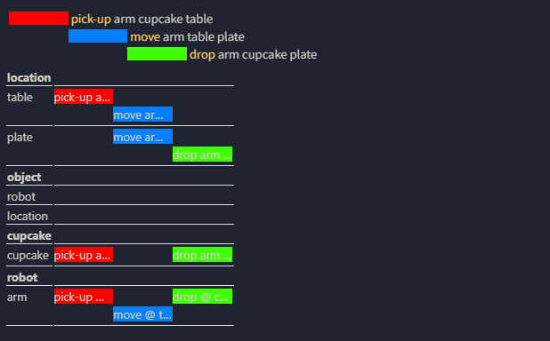
