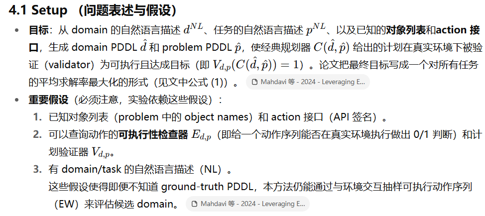
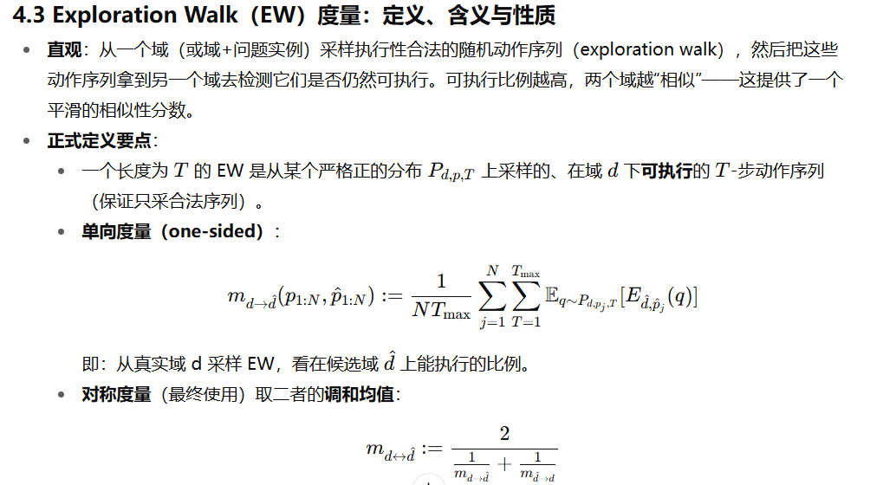
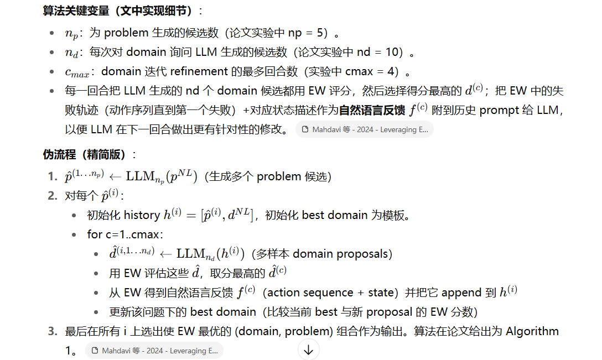

注释都在zotero中，这里只做大体概括

# Leveraging Environment Interaction for Automated PDDL Translation and Planning with Large Language Models

作者要解决的问题是：让大型语言模型（LLM）自动把自然语言描述的规划环境翻成 PDDL（domain + problem）并用经典规划器求解，而不需要人工修正。关键在于：当直接生成 PDDL 出错导致规划失败（planner 返回 nothing）时，如何给 LLM 有用、可微的反馈去迭代修正域（domain）定义？作者提出了一个基于与真实环境交互的Exploration Walk（EW）度量，并用它作为 LLM 迭代生成/筛选 domain 的评价信号，形成一个 EW 指导的树/链式搜索与自我修正流程，从而显著提升自动建模和求解成功率。

## 算法内容

**实际计算细节** ：

* 论文在实验里用最简单的 EW：每一步在当前状态对所有动作做合法性检查，均匀选取一个合法动作（即“uniform over valid actions”）。
* 为了评估一个域对另一域的相似度，要在多问题、多步长（Tmax，论文用 Tmax=10）上求平均。
* 重要结论：EW 分数会随着 domain term 差异数增加而下降（论文用一系列环境实验证明了这种单调性），因此是个有意义的相似性指标

这是第 4 节的重心（你特别关心）。我把算法步骤化并解释每一步的目的与直观为什么有效：

**高层思路** ：

1. 先用 LLM 把自然语言问题翻译出若干个 candidate problem-PDDL（因为 problem 通常比 domain 简单且能马上用来做 EW）。
2. 对每个问题候选项，初始化一个简单的 domain 模板（基于 action 接口），反复向 LLM 请求 domain 提案（多样性采样），用 EW 对这些 domain 提案评分，选择最佳提案并把 EW 的执行轨迹/失败状态以自然语言形式反馈给 LLM，作为下一轮上下文（history）继续生成更好的 domain。循环若干轮后在所有问题候选中选出最终的 (domain, problem) 对。

## 优缺点和改进

**为什么这种流程有效（直观）** ：

* LLM 本身对 PDDL 语法与 predicate 设计常犯细节错误（例如 Grippers 中漏掉 robot 参数的 free predicate 会导致“混用 gripper”的错误——论文在附录给了这个致命例子）。单次生成容易犯错；**而多采样 + 用一个能够反映“可执行性差异”的评分（EW）做筛选，能在样本空间里抓住正确/接近真实语义的候选。=**
* 用“问题先译码再译 domain”的策略可以立刻利用生成的 problem 去做 EW，从而在 domain 生成早期就能得到可用的环境交互反馈（比起先只生成 domain 更快收敛）。
* 把 EW 的**动作序列 + 失败状态** 转成自然语言反馈给 LLM（而不是仅给分数），可以让 LLM 在后续生成时“有上下文信息”去修正 predicate/参数组合（相当于把实验数据转换为可被 LLM 理解的训练信号）。

**计算成本** ：

EW 的计算在整个成本中很小（作者统计 LLM token 成本远大于 EW 计算）。在他们的机器上，单域-问题对的 EW 计算 < 2 分钟（64-core CPU），而 LLM inference 花费的 token 数量巨大（论文列出用 GPT-4 的 token 总量）。

使用 GPT-4 模型的结果，我们使用了 12.40 百万个输入 token 和 8.73 百万个输出 token。与 LLM 推理成本相比，计算 EW 的成本相对可以忽略不计。

**可改进方向（建议）**

* 用更智能的 EW 策略（基于启发式、信息增益或 RL 的探索）减少采样量同时得到更有判别力的反馈。Mahdavi 等 - 2024 - Leveraging E…
* 在反馈里加入更结构化的失败信息（若环境/validator 能提供细节），或对 LLM 提供 predicate-level 的对比示例以便更精准修正。
* 在 LLM 侧加入 PDDL 语法/类型检查器作为“二次过滤器”，减少明显的语法错误。论文和附录也强调 predicate 设计的细节会严重影响最终结果（例如 Grippers 的 free predicate 示例）。

# SPAR: Scalable LLM-based PDDL Domain Generation  for Aerial Robotics

## 方法详解（流程与关键技术）

1. 总体流程（Action-by-action + 反馈回路）

将域的每个动作按「逐动作」生成：对每个动作输入 (域描述 Nd、动作自然语言 Nai、额外声明 Extern) → 检索语义相关示例 → 用 Chain-of-Thought (CoT) 提示逐步推理（对象 → 先决条件 → 效果） → 生成 PDDL action → 语法检查器校验 → 若有错误，用语法反馈重新提示，直到通过或达到最大迭代次数。

2. 检索增强的 in-context learning（RAG 风格）

将数据集中所有动作先抽象为占位符形式（例如把具体名词/数值替换为 [object]、[value] 等），用 all-mpnet-base-v2 将抽象动作编码为向量并建立索引；检索时先粗排（余弦相似度），再用 LLM 对 top-K 候选重排序以选出最语义相关的示例用于提示上下文。

3. Chain-of-Thought 提示模板（CoT）

三步对象中心化推理：
a. “哪些对象参与？”（确定参数与类型）
b. “每个对象的先决条件是什么？”（以谓词/函数表达并给自然语言解释）
c. “每个对象的效果是什么？”（同上）

最后要求模型按规范格式输出 PDDL action，增强结构化与一致性。

4. 语法与数值检查器（自动反馈）

扩展了先前的 STRIPS 语法验证器以支持数值函数（numeric fluents）检查，并能把错误信息直接反馈进 prompt（例如“(+ (uav-number ?r) (is-uav ?u)) 是错误的 —— 第一个是函数、第二个是谓词，不能相加”），实现自我修正循环。若超过最大尝试仍未修复，论文中会进行人工修正。

5. 动态 fluent 列表

因为 fluents 未必预先完整，系统在生成过程中维护并扩展一个动态 fluent 列表，后续动作可复用已有 fluent，减少不一致与冗余。

在文献[ 22 ]中扩展了一个简单的STRIPS风格的语法验证器，以支持数值检查并产生可直接用于提示的错误反馈，从而实现了一个自我完善的循环。

## 评价

测评GPT好于deepseek

* **语法正确性** ：

  * GPT 模型：Format 提示错误 41 个，Ours 错误 23 个（减少 43.9%）。
  * DeepSeek 模型：Format 提示错误 62 个，Ours 错误 15 个（减少 75.8%）。
  * → 提示策略和反馈回路的确有效，尤其 DeepSeek 提升幅度更大。
* **语义正确性** ：

  * **Executability** ：Ours 在 GPT 上达到了**95.19%** （比 Format 高 ~14%）。
  * **Feasibility / Interpretability** ：Interpretability 整体 > Feasibility，说明生成域能“解释 GT 行为”的能力比“生成域的计划在 GT 上跑通”更强。
  * Retrieval+CoT（Ours）在三项语义指标上均优于基线，说明**检索+CoT+语法反馈** 是核心贡献。

自创数据集 没开源 数据及其实也很小 

*给定数据集中领域 D^ 的输入元组 (Nd,NA,Extern) ，我们分别应用这四种不同方法来生成相应的 PDDL 领域 D^ 。总共，我们评估了 30 个领域，包括 14 个简单（S.）领域和 16 个复杂（C.）领域，这些领域的复杂度由领域复杂度评分确定，我们在表 I 中总结了这些领域类别。这些领域被分为七个类别：导航（自主飞行），运输（物流），操作（物体交互），监控（评估），探索（覆盖），空中作业，和适应。*

而且用RAG vs 其他单独思维链的 有点过于欺负人

* **评估指标单薄**

  * 三个语义指标（Executability, Feasibility, Interpretability）本质上还是在**PDDL 层面** 验证，没有触及真实物理/感知层的不确定性。
  * 没有对**生成时间、提示长度、计算开销** 进行量化，无法评估方法在大规模任务下的实用性。
* **人工修复的干扰**

  * 作者承认当反馈循环超过上限仍失败时，会进行人工修复。
  * 这意味着最终结果可能被高估（混入了人类干预的成分），影响实验的“端到端”真实性。
* **仿真验证的“秀肌肉”成分大**

  * 仅展示了两个案例，而不是系统化对 20 个 Gazebo 环境的统计。
  * 看起来更像 proof-of-concept，而不是完整 benchmark。
* **缺乏对负面情况的分析**

  * 没有展示“失败案例长什么样”，比如为什么有些域/动作在 executability 上还是失败（仅给了错误类型统计）。
  * 没有分析 CoT 或检索在哪些场景最关键。
