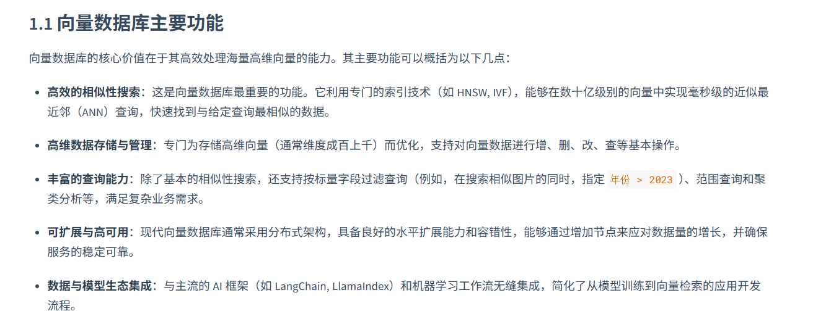
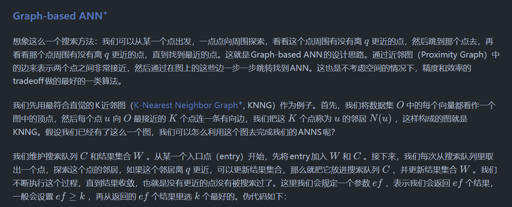
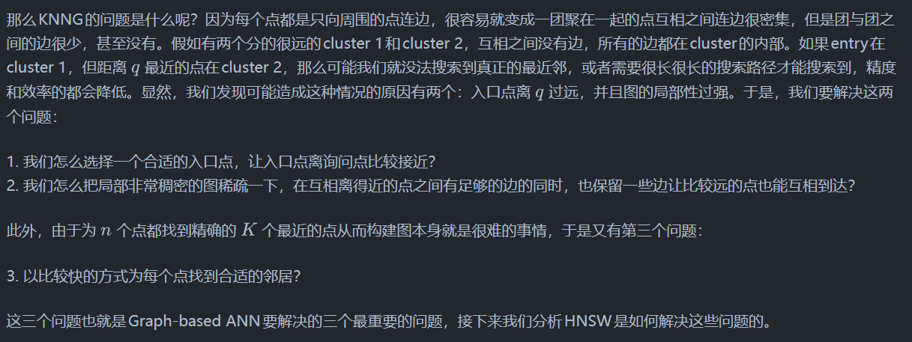
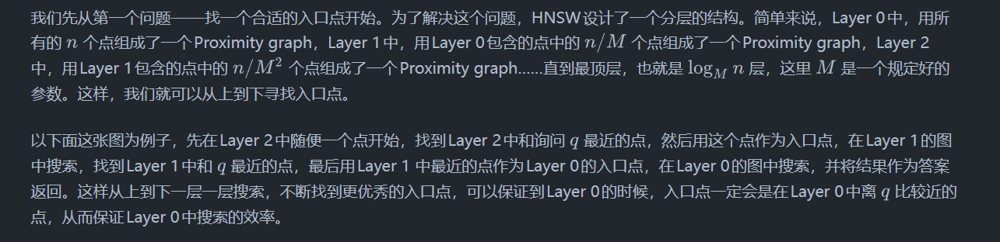
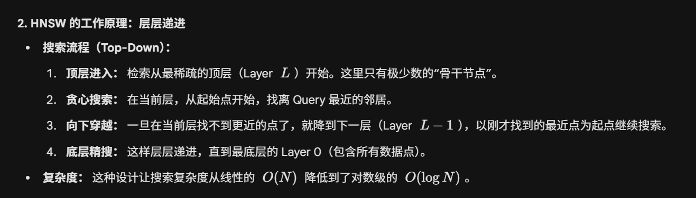
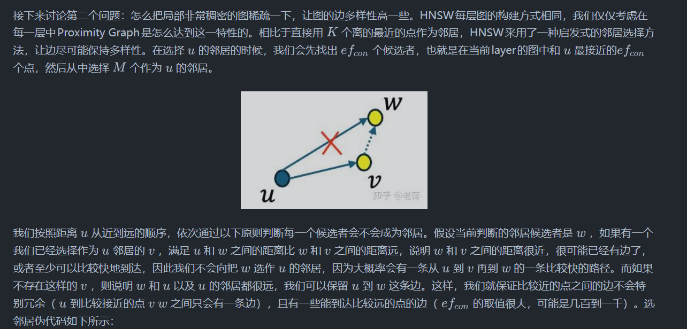
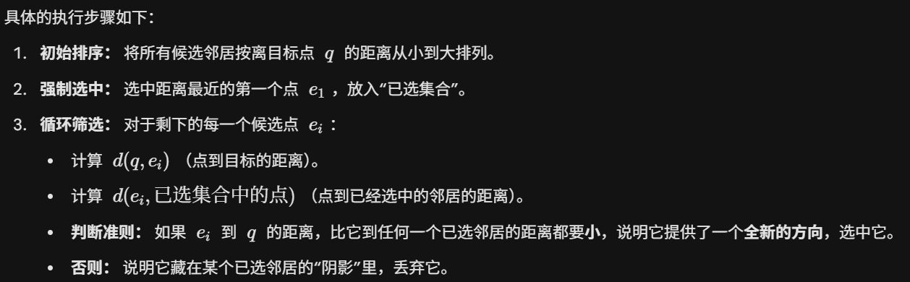
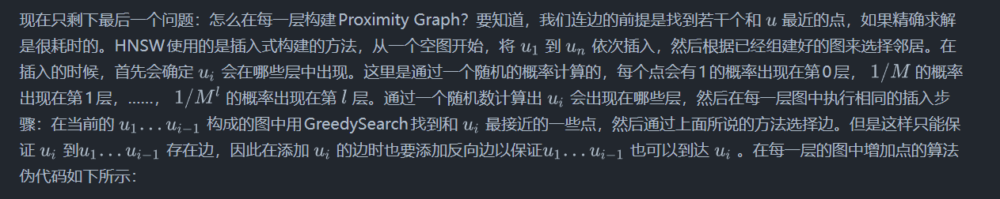
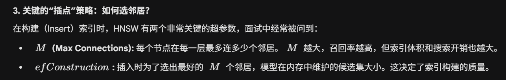
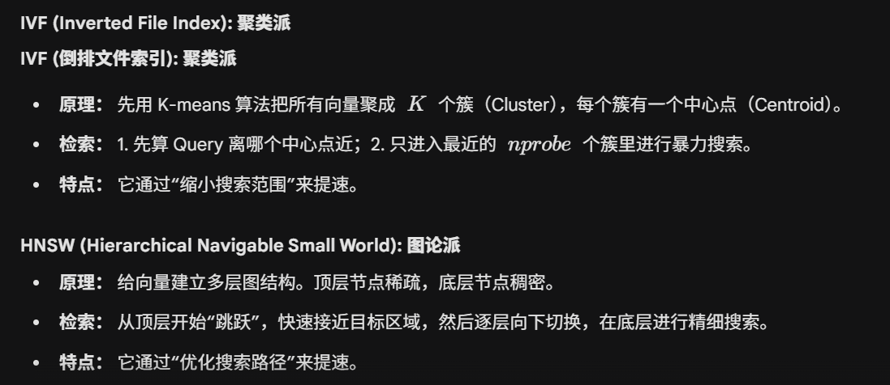

## ANN算法

https://zhuanlan.zhihu.com/p/31034412010

[近似最近邻 (ANN)](https://www.elastic.co/cn/blog/introducing-approximate-nearest-neighbor-search-in-elasticsearch-8-0) 算法会从数据集中找到与给定查询点十分接近的数据点，但*并非*要找到最接近的唯一数据点。NN 算法会搜遍所有数据以找出最完美的匹配项，但 ANN 算法在找到*足够接近的*匹配项后就会停止。

这可能听起来是个更不尽如人意的解决方案，但它实际上却是实现快速相似性搜索的关键所在。ANN 会使用智能捷径和数据结构来高效地在搜索空间中进行查找。所以，ANN 算法不会占用大量的时间和资源，让您花费少得多的精力，便能找到足够接近且在大部分实际场景中有用的数据点。

## HNSW

HNSW 是目前公认的**召回率（Recall）与响应速度（Latency）平衡得最好** 的算法之一

## IVF算法

| **维度**            | **IVF (Inverted File)  IVF (倒排文件)** | **HNSW (Graph-based)  HNSW（基于图的）**          |
| ------------------------- | --------------------------------------------- | ------------------------------------------------------- |
| **检索速度**        | 较快（受**$nprobe$** 影响）                 | **极快** （对数级复杂度 **$O(\log N)$**） |
| **召回率 (Recall)** | 中等（容易丢掉边缘点）                        | **优秀且稳定**                                    |
| **内存消耗**        | **非常低** （只存向量和中心点）         | **非常高** （除了向量，还要存大量的边）           |
| **是否需要训练**    | **必须训练** （训练聚类中心）           | **无需训练** （即插即用）                         |
| **数据动态更新**    | 较差（新增点多了需重训）                      | **良好** （支持动态增删点）                       |
| **构建速度**        | 快                                            | 慢（每加一个点都要找邻居建边）                          |

## recall vs latency tradeoff

****在工业界，我们几乎不可能同时获得 100% 的准确率和毫秒级的响应，因此工程师的工作本质上就是在坐标轴上寻找那个最适合业务的** 平衡点** 。

**法律/医疗 RAG****极高 (>0.95)**中 (100-500ms)采用 HNSW + 较大的 **$ef$**，配合 Rerank 机制。

## milvus

Milvus 支持各种类型的搜索功能，以满足不同用例的需求：

* [ANN 搜索](https://milvus.io/docs/zh/single-vector-search.md#Basic-search)：查找最接近查询向量的前 K 个向量。
* [过滤搜索](https://milvus.io/docs/zh/single-vector-search.md#Filtered-search)：在指定的过滤条件下执行 ANN 搜索。
* [范围搜索](https://milvus.io/docs/zh/single-vector-search.md#Range-search)：查找查询向量指定半径范围内的向量。
* [混合搜索](https://milvus.io/docs/zh/multi-vector-search.md)：基于多个向量场进行 ANN 搜索。
* [全文搜索](https://milvus.io/docs/zh/full-text-search.md)：基于 BM25 的全文搜索。
* [Rerankers](https://milvus.io/docs/zh/weighted-ranker.md)：根据附加标准或辅助算法调整搜索结果顺序，完善初始 ANN 搜索结果。
* [获取](https://milvus.io/docs/zh/get-and-scalar-query.md#Get-Entities-by-ID)：根据主键检索数据。
* [查询](https://milvus.io/docs/zh/get-and-scalar-query.md#Use-Basic-Operators)使用特定表达式检索数据
