## TF-IDF

**结果：** 一个词如果在当前文档频率高，且在全集里稀有，它就会获得极高的分值。这就是这篇文档的“关键词

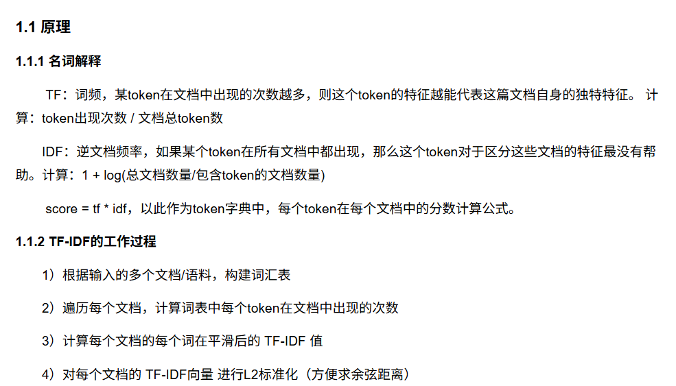

## BM25

https://zhuanlan.zhihu.com/p/670322092

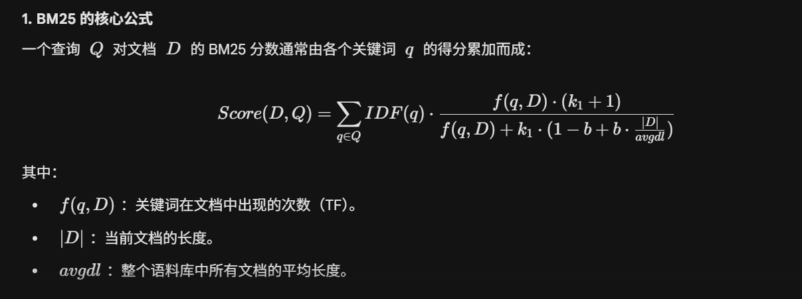

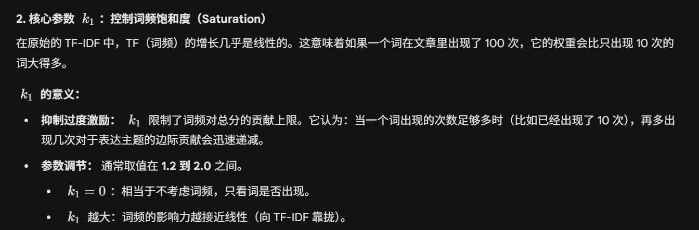

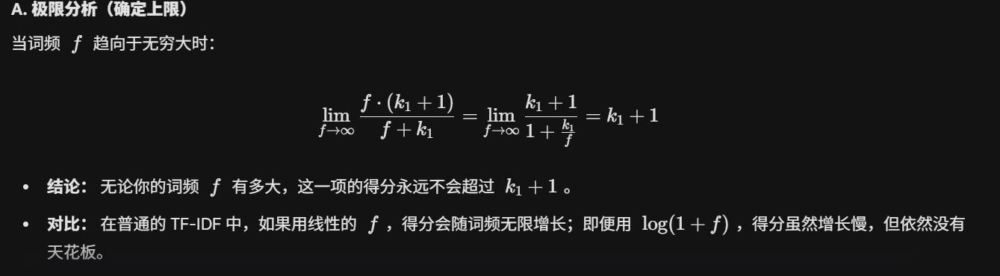

**工程直觉：** 通常我们取 **$1.2 < k_1 < 2.0$**，这是一种经验上的平衡——既认可词频的重要性，又防止某些关键词被恶意堆砌（Keyword Stuffing）导致评分失真。

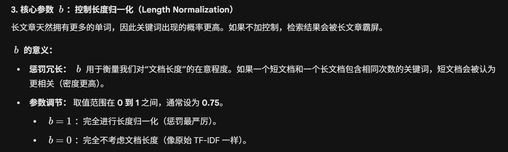

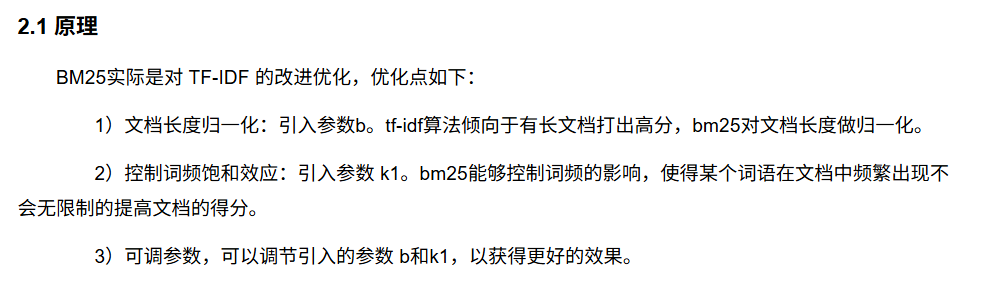

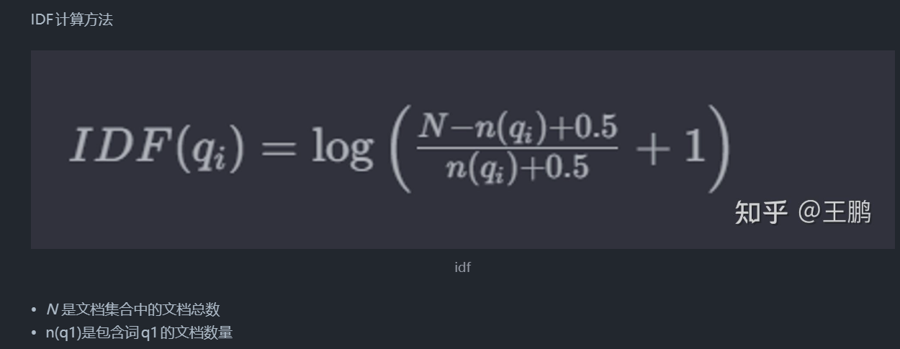

## dense检索

bge/m3  https://www.cnblogs.com/xiaoqi/p/18143552/bge-m3

### Dense 检索的核心原理：语义空间映射

Dense 检索不再像 BM25 那样去数“关键词出现了几次”，而是把一段文字（Query 或 Document）转化成一个**固定维度的实数向量** （通常是 768、1024 或 4096 维）。

* **双编码器架构（Bi-Encoder）：** 检索系统通常包含两个编码器，一个负责算问题的向量（**$v_q$**），一个负责算文档的向量（**$v_d$**）。
* **语义近邻：** 在这个高维向量空间里，意思相近的句子，它们的向量距离（如**余弦相似度** 或**点积** ）会非常小；意思无关的句子，距离会非常远。
* **检索过程：** 当你搜一个词时，系统算出它的向量，然后在向量数据库（如 Milvus, Faiss）里通过**ANN（近似最近邻算法）** 快速捞出离它最近的那几个文档。

* **生成式 Embedding：** 训练目标是**$P(Token_{n} | Token_{1...n-1})$**，关注的是序列的局部连贯性。
* **检索式 Embedding：** 训练目标是让**$Similarity(Query, Positive\_Doc)$** 尽可能大，而**$Similarity(Query, Negative\_Doc)$** 尽可能小。

## **余弦相似度、点积**

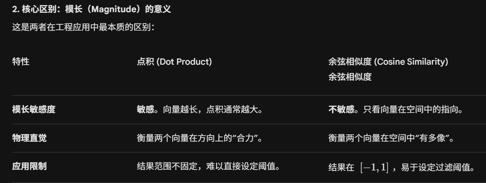

在实际构建 RAG（检索增强生成）系统时，我们该选哪一个？

* **什么时候选余弦相似度？**
  当你的文本长度差异很大时。例如，一个文档是短标题，另一个是长段落。由于长段落包含更多 Token，其 Embedding 模长可能天然偏大。使用余弦相似度可以消除“字数多”带来的权重红利，只看语义相关性。
* **什么时候选点积？**
  1. **性能至上：** 点积的计算速度比余弦相似度快（少了两步开根号和除法）。
  2. **预归一化（Pre-normalization）：** 这是工业界的黑话。如果我们提前把所有的 Embedding 都做一次**L2 归一化** （让**$\|A\|=1$**），那么点积就等于余弦相似度。
     > **面试官，这就是为什么很多向量数据库（如 Faiss, Milvus）默认推荐使用内积（Inner Product），前提是模型输出已经归一化过了。**
     >

“模型输出已归一化”意味着向量的长度信息被剥离了，只保留了纯粹的方向信息。这样我们在推理阶段就可以放心地使用更快的**点积（Dot Product）**来代替较慢的** 余弦相似度** 。

现在很多主流的 Embedding 模型（比如 **BGE** 、**OpenAI text-embedding-3** ）在返回结果前都会默认进行这一步。

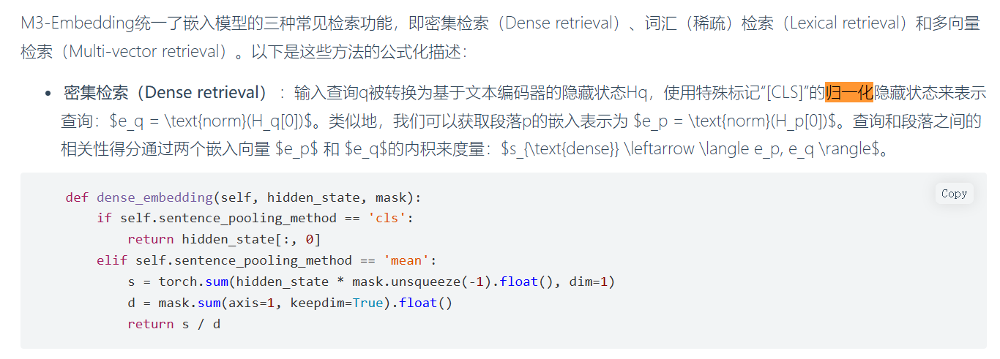

## 混合检索

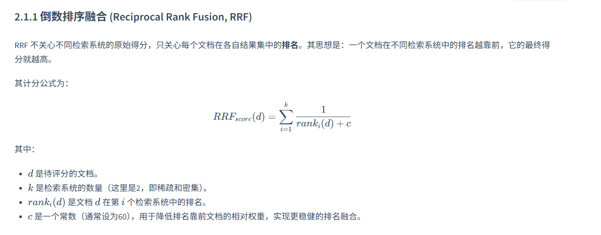

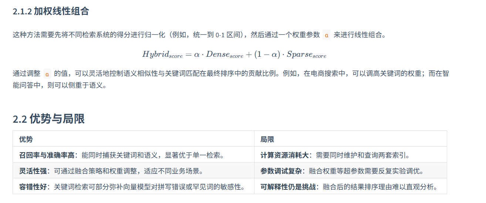
