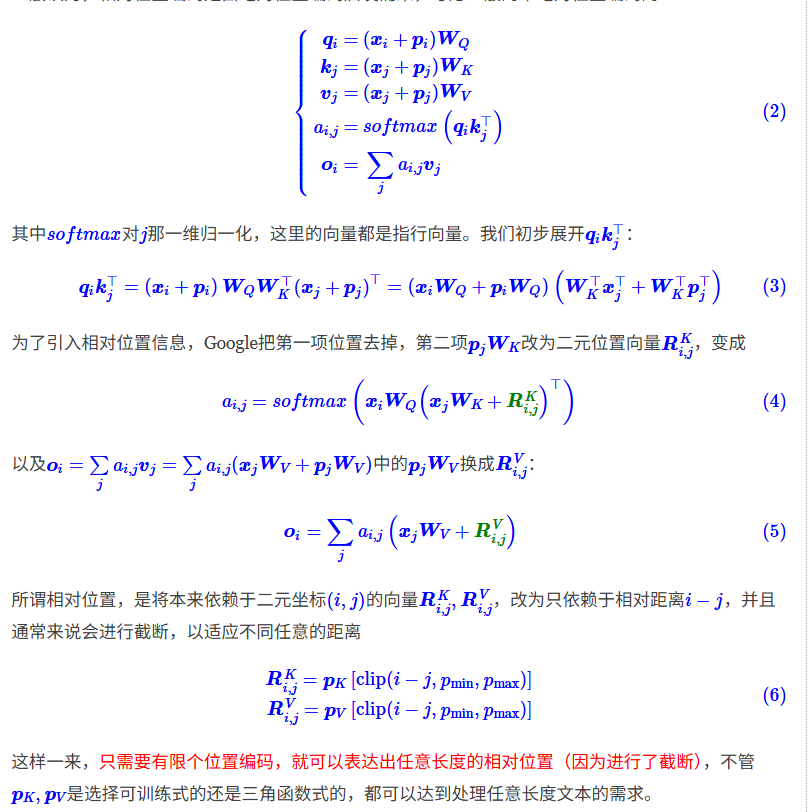
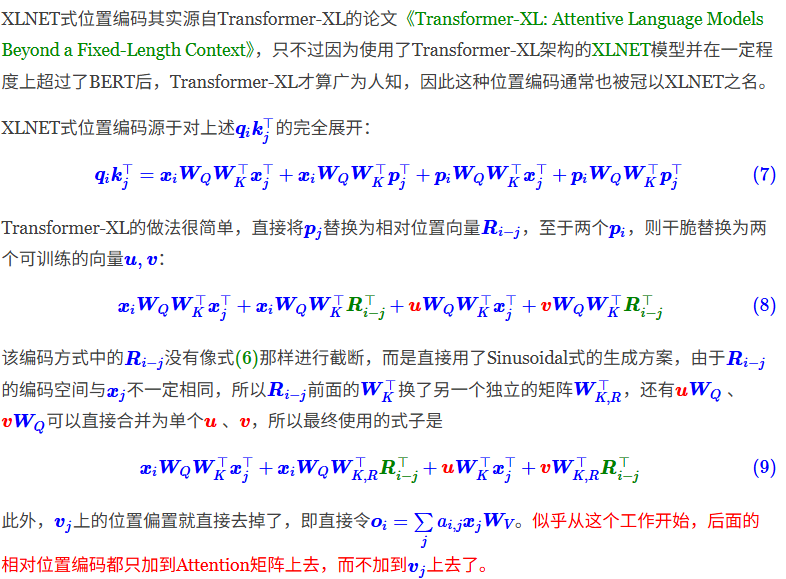
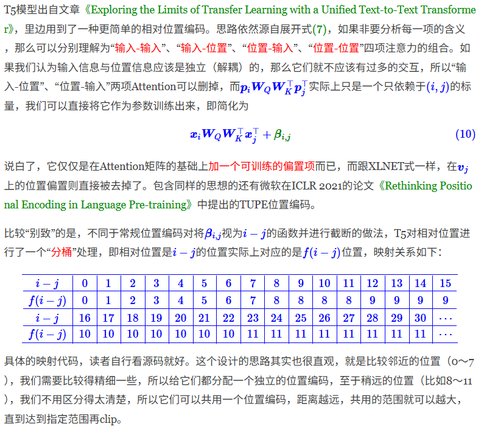
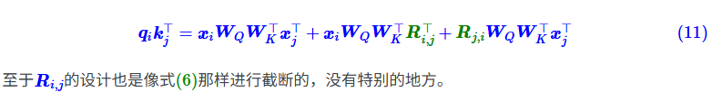
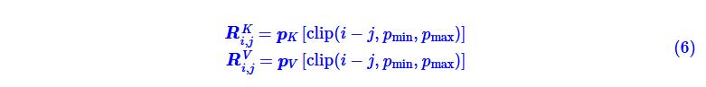
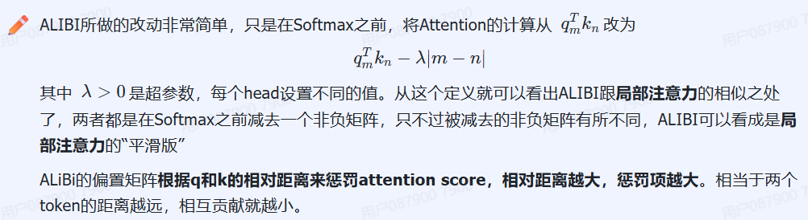

对于Transformer模型来说，位置编码的加入是必不可少的，因为纯粹的Attention模块是无法捕捉输入顺序的，即无法区分不同位置的Token。为此我们大体有两个选择:

1、想办法将位置信息融入到输入中，这构成了绝对位置编码的一般做法;
2、想办法微调一下Attention结构，使得它有能力分辨不同位置的Token，这构成了相对位置编码的一般做法。
来自苏剑林  https://kexue.fm/archives/8130

# 绝对位置编码
## 训练式
直接将位置编码当作可训练参数，比如最大长度为512，编码维度为768，那么就初始化一个512×768的矩阵作为位置向量，让它随着训练过程更新。

现在的BERT、GPT等模型所用的就是这种位置编码

## 三角式   
《Attention is All You Need》
https://zhuanlan.zhihu.com/p/454482273首页

由于sin是周期函数，因此从纵向来看，如果函数的频率偏大，引起波长偏短，则不同t下的位置向量可能出现重合的情况。比如在下图中(d_model = 3），图中的点表示每个token的位置向量，颜色越深，token的位置越往后，在频率偏大的情况下，位置响亮点连成了一个闭环，靠前位置（黄色）和靠后位置（棕黑色）竟然靠得非常近：

为了避免这种情况，我们尽量将函数的波长拉长。一种简单的解决办法是同一把所有的频率都设成一个非常小的值。

# 相对位置编码

## 经典式

## XLNET式

## T5式
注意力公式可以分别理解为“输入-输入”、“输入-位置”、“位置-输入”、“位置-位置”四项注意力的组合

## DeBERTa式
T5是干脆去掉了第2、3项，只保留第4项并替换为相对位置编码，而DeBERTa则刚刚相反，它扔掉了第4项，保留第2、3项并且替换为相对位置编码（果然，科研就是枚举所有的排列组合看哪个最优）

pK,pV是选择可训练式的还是三角函数式的，都可以达到处理任意长度文本的需求。

# 旋转位置编码
绝对和相对的统一

和相对位置编码相比，RoPE 具有更好的外推性，目前是大模型相对位置编码中应用最广的方式之一。

备注：什么是大模型外推性？

外推性是指大模型在训练时和预测时的输入长度不一致，导致模型的泛化能力下降的问题。例如，如果一个模型在训练时只使用了512个 token 的文本，那么在预测时如果输入超过512个 token，模型可能无法正确处理。这就限制了大模型在处理长文本或多轮对话等任务时的效果。

Sinusoidal 位置编码是加性的，而 RoPE 可以视为乘性的

目前很多的大模型，都选择了使用了这种编码方式（LLAMA、GLM等）。

https://www.zhihu.com/tardis/zm/art/647109286?source_id=1003
代码部分可以多看看写的不错

上文的续作  https://zhuanlan.zhihu.com/p/675243992

NTK－aware Scaled RoPE  https://zhuanlan.zhihu.com/p/20328774059

# ALibi
