参考链接：

https://www.bilibili.com/video/BV1BYXRYWEMj/?spm_id_from=333.337.search-card.all.click&vd_source=98e4164f2cbf19bf54ad534e5875112c （简单易懂的介绍）

https://kexue.fm/archives/10091 （苏神

https://zhuanlan.zhihu.com/p/16730036197 （从显存占用 kv cache讲起 徐徐道来 主要参考）

# 0 引言

deepseek最近比较出圈，本人也一直关注deepseek发布的一些技术报告。在模型训练、推理性能和计算成本上一直能给大家惊喜。读了deepseek的技术报告，我个人有两个比较强的感受。第一：deepseek在模型细节上扣的比较极致，魔改了一些模型框架（比如模型优化方面： MLA， GRPO，MTP）；第二：工程能力上确实比较强，对于主流的一些框架和技术点能敏捷地整合到自己的系统内（比如：在Infra方面，能看到deepspeed, Megatron，DistServer、vLLM等框架的核心技术点）。后面准备用几篇笔记学习和整理下deepseek的技术。

本文重点讲解下MLA（Multi-Head Latent Attention）

> 注：我在学习的过程中，通常会有些知识盲点，或掌握不精确的地方，我会递归学习一些扩展的脉络。本文也是沿着一些必要的背景知识，逐层解读下MLH的提出背景、要解决的问题和最终的效果。

MLA主要通过优化[KV-cache](https://zhida.zhihu.com/search?content_id=252368029&content_type=Article&match_order=1&q=KV-cache&zhida_source=entity)来减少显存占用，从而提升推理性能。直接抛出这个结论可能不太好理解。首先我们来看下，对于生成模型，一个完整的推理阶段是什么样的，推理性能上有什么问题。

# 1 LLM模型推理过程

---

LLM推理分为两个阶段：**prefill阶段**和 **decode阶段**

* **prefill阶段**：是模型对全部的Prompt tokens一次性并行计算，最终会生成第一个输出token
* **decode阶段**：每次生成一个token，直到生成EOS（end-of-sequence）token，产出最终的response

在推理过程中，由于模型堆叠了多层transformer，所以核心的计算消耗在Transformer内部，包括MHA，FFN等操作，其中MHA要计算Q，K ，V 矩阵，来做多头注意力的计算。

在LLM生成过程中，是一个基于前向序token列预测下一个token的过程，序列中的token（无论是prefill阶段，还是decode阶段）只与它前面的token交互来计算attention，我们也称这种Attention为[Causal Attention](https://zhida.zhihu.com/search?content_id=252368029&content_type=Article&match_order=1&q=Causal+Attention&zhida_source=entity)。矩阵计算上通过一个下三角的Causal Attention Mask来实现token交互只感知前向序列。如图1所示，展现的Transformer内部的细节：

图1、Transformer 内部的计算细节

我们以一个序列的 t 位置的token为例，计算一层Tansformer的attention过程，如列下公式所示：

图2、 DeepSeek-V3 中的Attention计算公式

在计算Attention时， t位置的 q只与 t位置前的 k，v做计算，所以我们有如下两个结论：

1. 计算前面的 k,v 并不受后面token的影响。
2. 后面计算 t+1， t+2，...., t+nt+1， t+2，...., t+n 位置的Attention，要使用前序的 1-t 位置的 k，vk，v 的值是始终不变的。

所以为了加速训练和推理的效率，在token-by-token生成过程中，避免重复计算前序的 k,v。研究者们提出把前序计算好的 k,vk,v 缓存起来，这也就是目前主流的KV-cache的机制。KV-cache本质是通过空间换时间的方法。我们知道当前LLM size都比较大，GPU的显存空间也是比较宝贵的，通过显存来保存KV-cache势必会带来访存的瓶颈。换句话说，如果不用KV-cache模型直接计算（重复计算前序 k,vk,v ），是个计算密集型任务；增加了KV-cache，现在 k,v不是通过计算得到，而是从「存储介质」里读出来，GPT内核与存储介质之间要频繁读写，这样就变成了一个访存密集型任务。所以使用了KV-cache的机制，解决的重复计算的问题，但访存的速率也就直接影响到训练和推理的速度。

接下来我们再详细看看对于一个典型的推理架构有几级访存速率，模型推理过程中又有哪些数据要做存储下来，应该如何分配存储。

# 2\. LLM推理阶段显存使用情况

---

## 2.1 访存速率分级

为了直观理解访存的速率，我们以一个分布式推理架构为例。

> 比如2台机器，每台机器有8张A100， 那么在这样一个系统内，卡内，单机卡间，机器之间的数据访问效率如图3所示。
> 注：我们的例子中，只描述了一种访存介质HBM (也就是我们常说的显卡的显存)，我们知道通常GPU的存储介质除了显存，还有SRAM和DRAM。SRAM也被成为片上存储，是GPU计算单元上即时访问更快的存储，所有的计算都要先调度到片上存储SRAM才能做计算，一般只有几十M大小，带宽可达到20T/s左右，SRAM是跟计算单元强绑定的，推理阶段一般不考虑将SRAM作为存储单元使用。而DRAM是我们常说的CPU的内存，由于访问速率较慢，推理阶段一般也不考虑使用。所以我们讨论的推理存储介质，一般就指的是HBM（显存）

图3、分布式推理架构卡内、卡间、跨机存储和带宽

由上图的访存带宽可知，卡内的带宽是单机卡间的带宽的3倍，是跨机带宽的20倍，所以我们对于存储的数据应该优先放到卡内，其次单机内，最后可能才考虑跨机存储。

接下来我们再看下，推理过程中，有哪些数据要存储到显存上。

## 2.2. 模型推理阶段显存分配

下面我画了一张图，如图4所示，推理阶段主要有三部分数据会放到显存里。

* **KV Cache** ： 如上一节所述，前序token序列计算的 k,vk,v 结果，会随着后面tokent推理过程逐步存到显存里。存储的量随着Batch，Sequence\_len长度动态变化
* **模型参数**：包括Transformer、Embedding等模型参数会存到显存里。模型大小固定后，这个存储空间是固定的。
* **运行时中间数据**： 推理过程中产出的一些中间数据会临时存到显存，即用即释放，一般占用空间比较小

图4. 推理阶段显存占用

由上述可知，推理阶段主要存储消耗是两部分： **模型参数**和 **KV Cache**。那么模型参数占多少，KV Cache又占多少？

首先我们先以一个token的计算过程为例，看下一个token计算要存储多少KV？为了方便理解，我们以Qwen-72B模型为例，模型配置详见： [Qwen-72B-Chat](https://huggingface.co/Qwen/Qwen-72B-Chat/blob/main/config.json)。

> 模型共80层，每层有64个Head，每个Head的向量维度是128，
> l=80， n\_h =64 ， d\_h = 128
> 注：这里先不考虑qwen 72B GQA的设置（实际KV做了压缩处理），只考虑朴素的MHA的模型结构（假设未做任何处理），GQA后面再详细讨论。

如下图5所示，计算一个token，每个Transformer层的每个Head都要存储一对 k,v。

图5、单token kv缓存数据

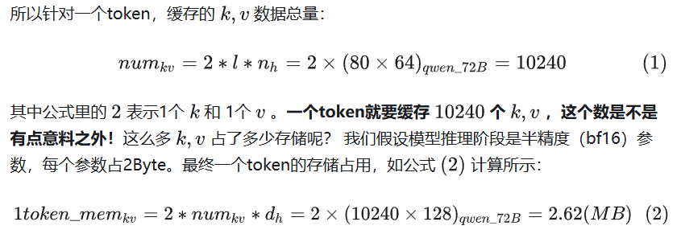

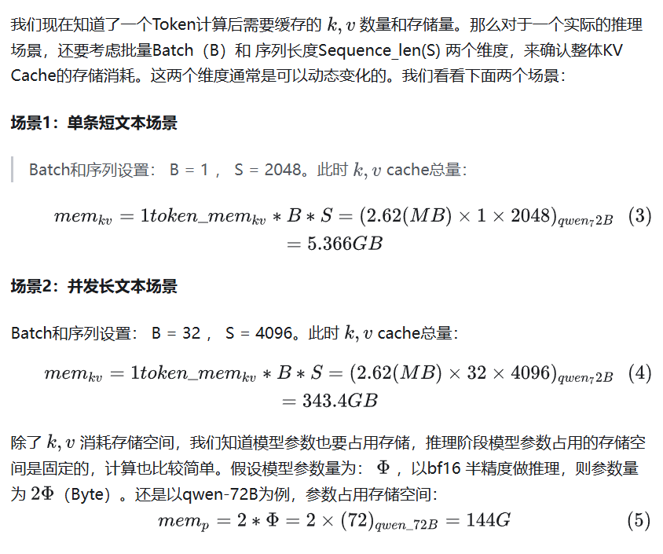

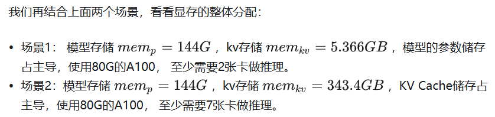

这里还要多啰嗦几句，推理阶段根据离线、在线的业务场景，到底组多大的Batch，其实是一个Balance的过程，Batch选择比较小，虽然并发度不高，但可能单卡就能装下完整模型参数和KV Cache，这时候卡内带宽会比较高，性能可能依然出众，可以考虑适当增加Batch把单卡显存用满，进一步提升性能。但当Batch再增大，超出单卡范围、甚至超出单机范围，此时并发会比较大，但跨卡或跨机访存性能会降低，导致访存成为瓶颈，GPU计算资源使用效率不高，可能实际导致整体推理性能不高。所以单从推理Batch设置角度来看，要实测找到性能最佳的平衡点。

# 3 KV Cache 优化方法汇总

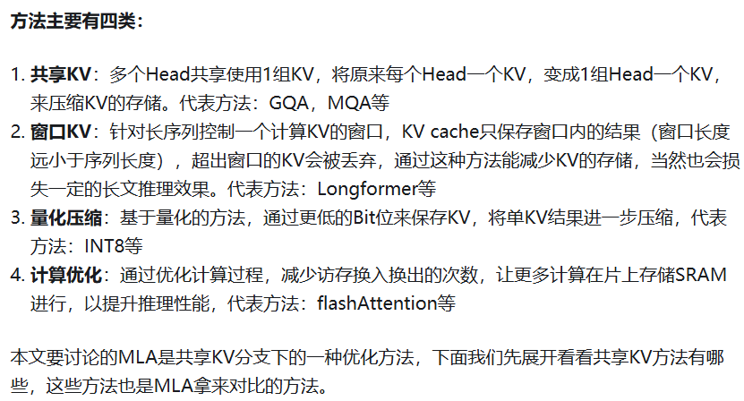

# 4 MLA

## 4.1 概括

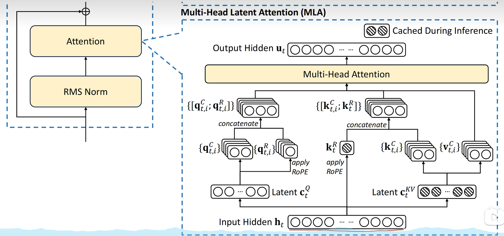

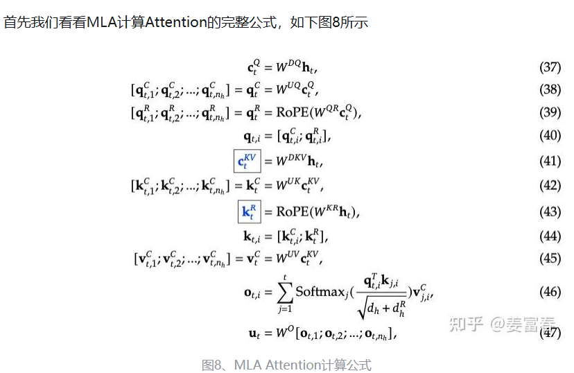

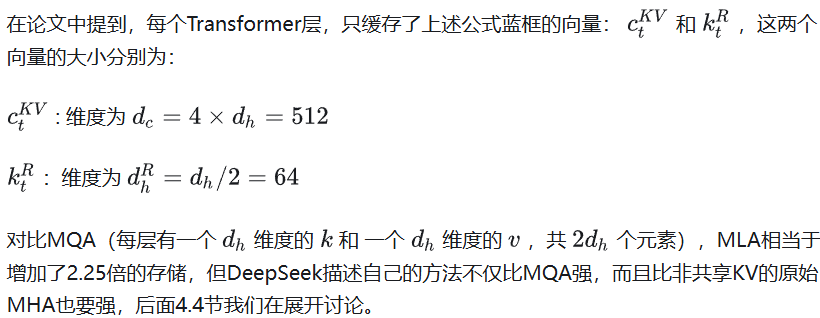

## 4.2 讲解

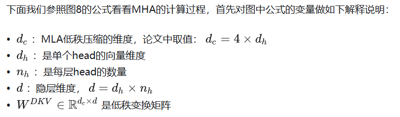

### **先看下KV的计算过程**

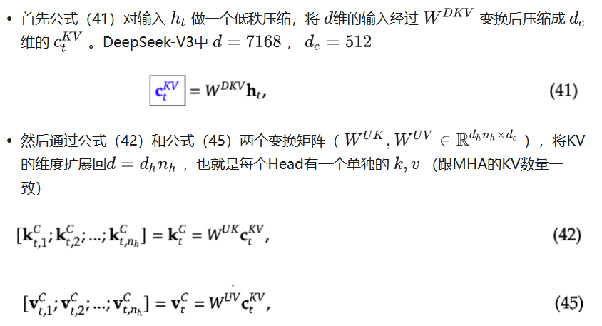

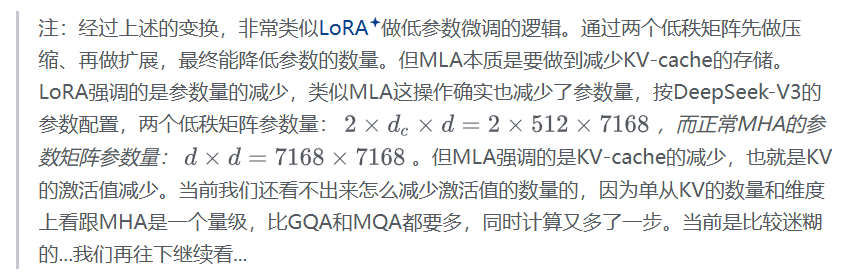

### 后续计算

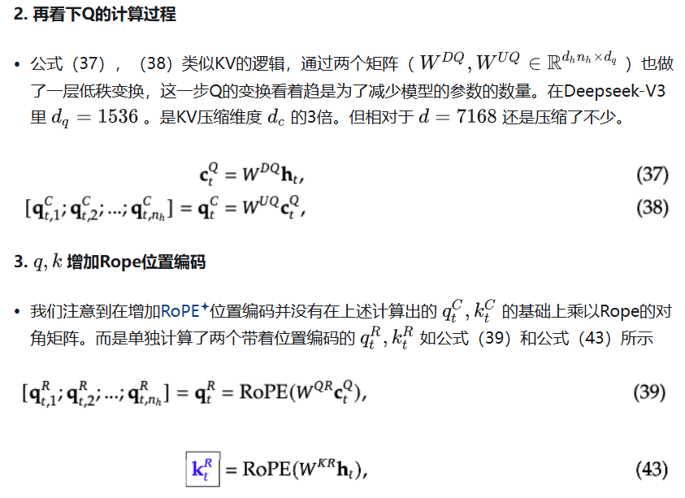

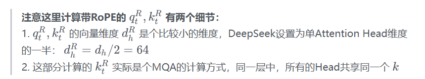

这里单独出来一块矩阵是因为加上rope后 矩阵不吸收

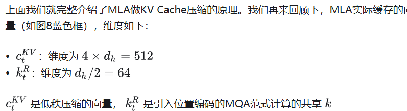

## 实际应用中

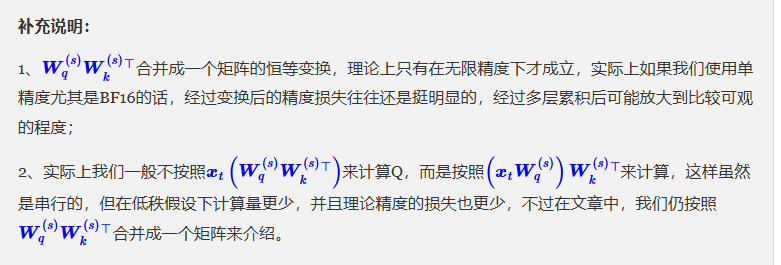
