参考链接:

https://zhuanlan.zhihu.com/p/663932651 （递推推导详细）

https://zhuanlan.zhihu.com/p/651280772

https://fancyerii.github.io/2023/10/23/flashattention/ （写得最好 完全替代上面那篇）

https://www.bilibili.com/video/BV1UT421k7rA/?spm_id_from=333.1391.0.0&vd_source=e6a26642f7f1d14e5b11a109a4dfffe9

FlashAttention是一种加速注意力计算方法，目前已经应用在：GPT-3、Falcon2（阿联酋大模型）、Llama2、Megatron-LM、GPT-4等知名LLM上。

Flash Attention已经集成到了pytorch2.0中，可以很便捷的调用。

# 1 简介

FlashAttention旨在加速注意力计算并减少内存占用。FlashAttention利用底层硬件的内存层次知识，例如GPU的内存层次结构，来提高计算速度和**减少内存访问开销**。 FlashAttention的核心原理是通过将输入分块并在每个块上执行注意力操作，从而**减少对高带宽内存（HBM）的读写操作**。具体而言，FlashAttention使用平铺和重计算等经典技术，将输入块从HBM加载到SRAM（快速缓存），在SRAM上执行注意力操作，并将结果更新回HBM。FlashAttention减少了内存读写量，从而实现了**2-4倍**的时钟时间加速。

Timeline: 最新的FlashAttention-2版本进一步优化了FlashAttention算法，使用了更好的并行化和工作分区方法，使得计算速度提高了2倍。FlashAttention-2还支持更高的头维数和多查询注意力等新特性，进一步提升了性能和灵活性。

图1 FlashAttention-timeline

# 2\. 先验知识

根据计算和内存访问之间的比率，操作可以分为以下两种:

* 计算约束 ：矩阵乘法
* 内存约束:元素操作(激活，dropout，masking)，归并操作(softmax， layer norm，sum等)

在当前的AI加速器（GPU）上是受内存大小限制的。因为它“主要由元素操作组成”，或者更准确地说，注意力的算术密度不是很高。

可以看到，masking，softmax和dropout是占用大量时间的操作，而不是矩阵乘法(即使大部分FLOPS是在matmul中)。内存不是一个单一的工件，它在本质上是分层的，一般的规则是:内存越快，越昂贵，容量越小。

**1) HBM（High Bandwidth Memory）和SRAM（Static Random-Access Memory）**

两种不同类型的计算机内存。

* HBM是一种高带宽内存接口，用于3D堆叠的SDRAM，具有较高的带宽和较低的功耗。
* SRAM是一种静态随机访问存储器，用于高速缓存等内部存储器，具有**更快的访问速度和更低的延迟**，但成本更高且占用更多芯片空间。

下图是GPU A100的内存分布：

图2 GPU A100的内存分布

**2） MAC**

MAC（Memory Access Cost，存储访问开销）是指在计算机系统中，访问内存或存储器所需的时间和资源开销。它是衡量计算机程序或算法性能的重要指标之一。 MAC的值取决于多个因素，包括内存层次结构、缓存命中率、内存带宽、存储器延迟等。较低的MAC值表示访问内存的开销较小，而较高的MAC值表示访问内存的开销较大。

# 3. FlashAttention原理

## 3.1 传统Attention回顾

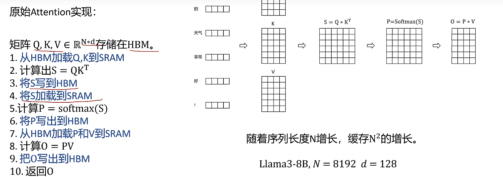

标准实现如何显示对HW操作方式不大尊重。它基本上将HBM加载/存储操作视为0成本(它不是“io感知”)。

我们首先考虑如何使这个实现更有效(时间和内存方面)。最简单的方法是删除冗余的HBM读/写。

如何把S写回HBM只是为了(重新)加载它来计算softmax，那么我们可以将其保存在SRAM中，执行所有中间步骤，然后将最终结果写回HBM。

融合则可以将多个操作融合在一起。所以只从HBM加载一次，执行融合的op，然后将结果写回来。这样做可以减少通信开销。

下面我们将看到如何直接将内存复杂度从O(N²)降低到O(N)。

## 3.2 FlashAttention算法

**核心思想**：传统减少HBM的访问，将QKV切分为小块后放入SRAM中

**核心方法**：tiling, recomputation

**Tiling** (在向前和向后传递时使用)-基本上将NxN softmax/scores矩阵分块成块。

**Recomputation** (仅在向后传递中使用

### **3.2.1 tiling(平铺):** 分块计算

因为Attention计算中涉及Softmax，所以不能简单的分块后直接计算。

softmax操作是row-wise的，即每行都算一次softmax，所以需要用到平铺算法来分块计算softmax。

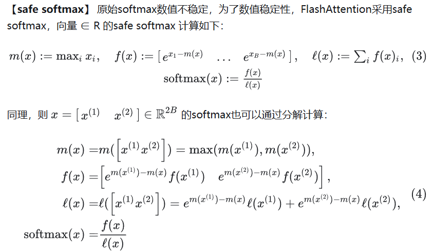

f(x)和l(x)都可以通过分块计算得出，所以FlashAttention在计算时通过分块将Q，K，V分块后，按块加载到内存中。

### 3.2.2 recomputation（重新计算）

FlashAttention算法的目标：在计算中减少显存占用，从O(N2)大小降低到线性，这样就可以把数据加载到SRAM中，提高IO速度。

**解决方案**：传统Attention在计算中需要用到Q，K，V去计算S，P两个矩阵，FlashAttention引入softmax中的统计量 (m,ℓ) ，结合output O和在SRAM中的Q，K，V块进行计算。

### 3.3.3 算法细节

FlashAttention前向过程

图5

前向过程步骤详解：

**第1步**

计算行/列块大小。为什么ceil(M / 4 d) ?因为查询、键和值向量是d维的，所以我们还需要将它们组合成输出的d维向量。所以这个大小基本上允许我们用q k v和0个向量最大化SRAM的容量。

行与n取小是因为控制 O Q最大是一个n*n的方阵 避免中间矩阵过大

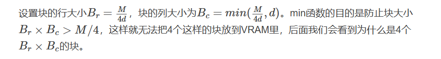

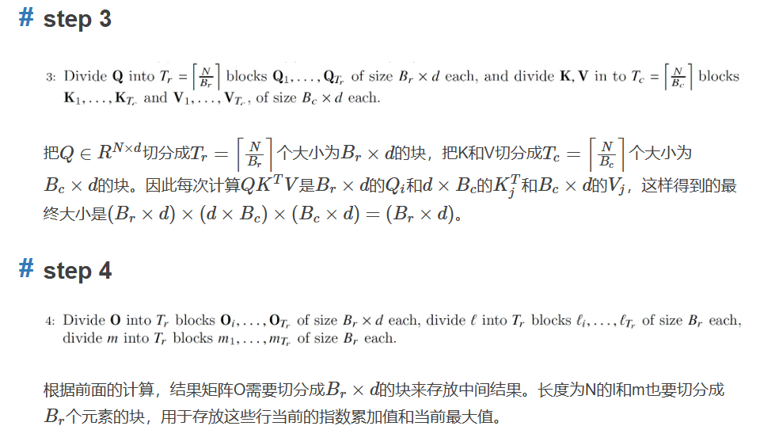

核心算法图

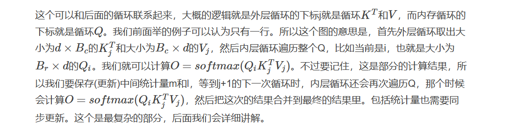

* 6-7：遍历K，V的每一块（Outer Loop）将K_j和V_j块从HBM加载到SRAM。在这个时间点上我们仍然有50%的SRAM未被占用(专用于Q和O)
* 8：遍历Q的每一块 (Inner Loop)
* 9：将分块后的QKV的小块加载到SRAM (Copy Block to SRAM)
* 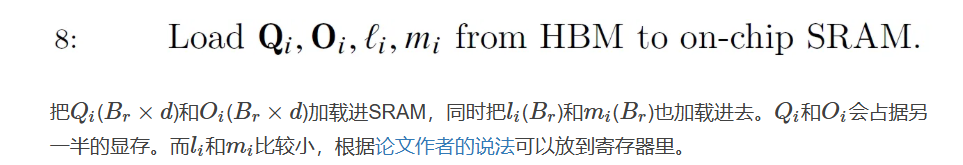
* 10：计算Sij (Compute Block on SRAM)
* 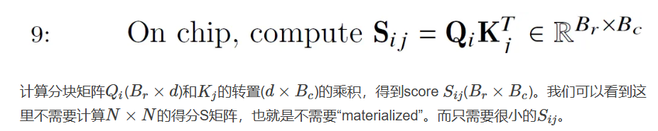
* 11：计算Sij mask (Compute Block on SRAM)
* 12：计算m,l统计量 (Compute Block on SRAM)
* 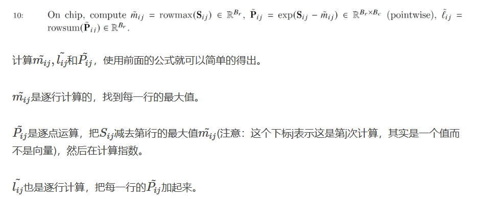
* 13：计算m,l统计量 (Compute Block on SRAM)
* 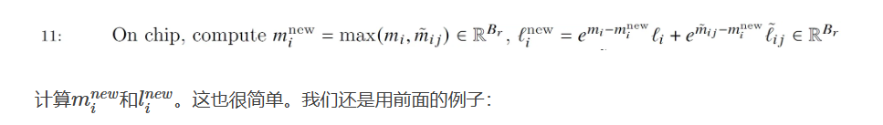
* 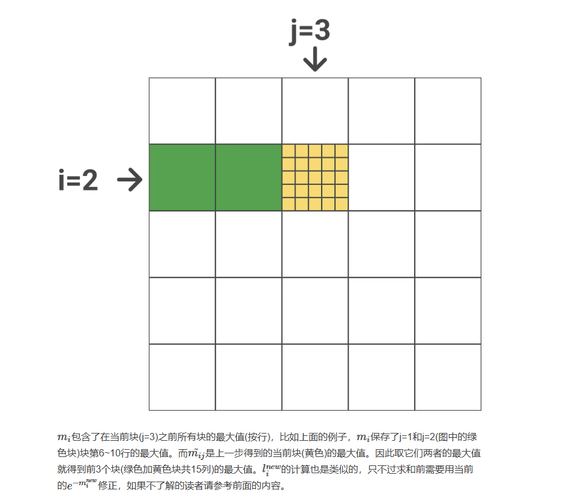
* 14：dropout (Compute Block on SRAM)
* 15：计算Oi并写入HBM (Output to HBM)
* 这个公式是迭代推导出来的详细看 https://zhuanlan.zhihu.com/p/663932651
* 或者可以简单理解成 原来的结果乘原来的L 然后更换为新的L' 加上最后一个QK^TV的乘积加缩放即可
* 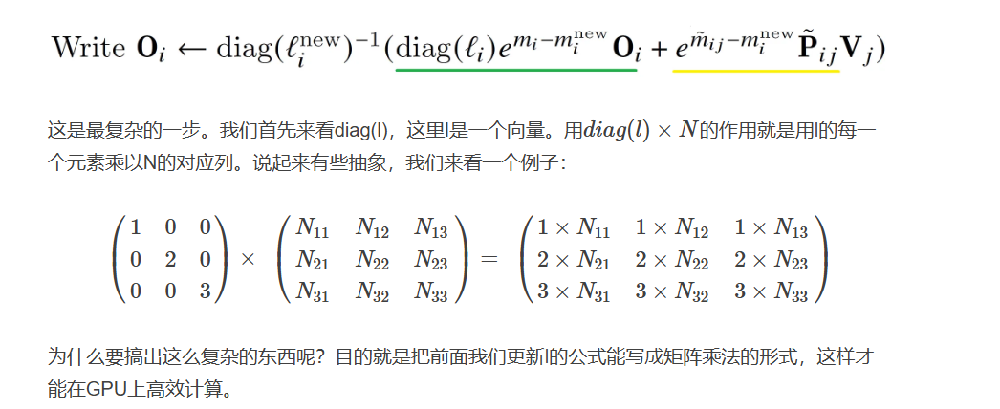
* 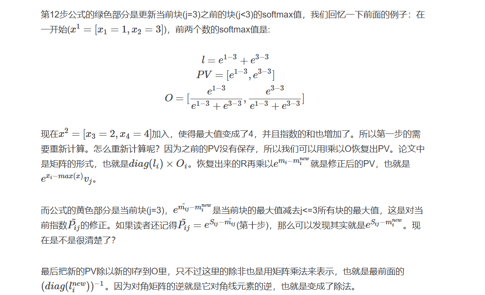
* 16：把li,mi写入HBM (Output to HBM)

FlashAttention反向过程，反向传播也是通过引入统计量，实现分块计算：

图8
