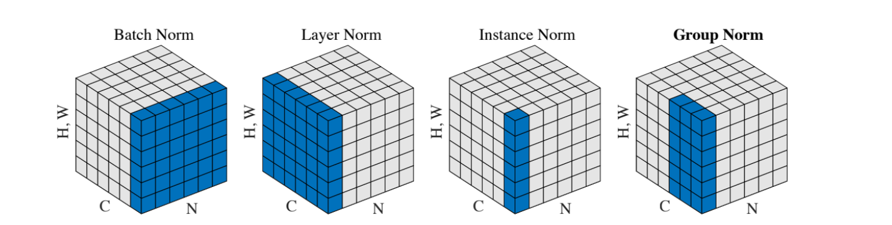
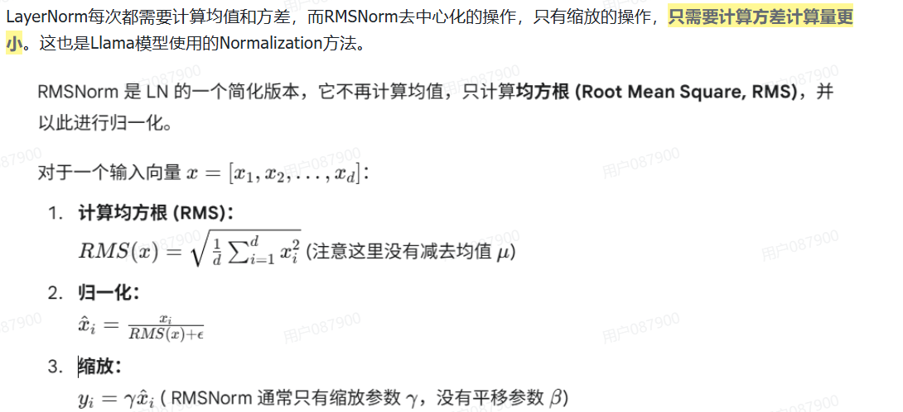
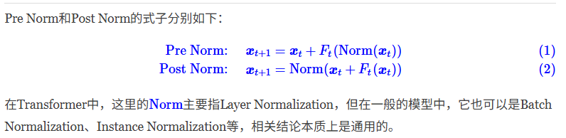
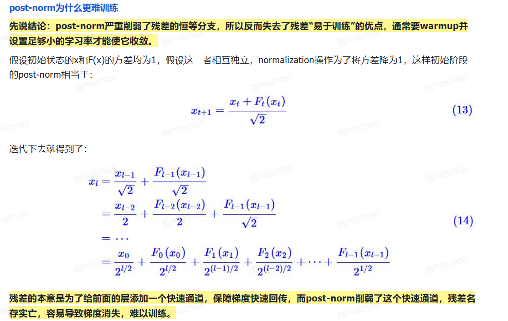
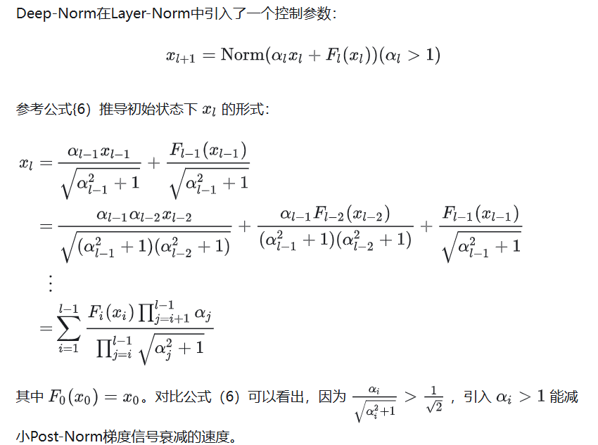

# 1 norm分类

batch norm
layer norm
RMSNorm

## BN LN

BN，LN，IN，GN从学术化上解释差异：
BatchNorm：batch方向做归一化，算NHW的均值，对小batchsize效果不好；BN主要缺点是对batchsize的大小比较敏感，由于每次计算均值和方差是在一个batch上，所以如果batchsize太小，则计算的均值、方差不足以代表整个数据分布
LayerNorm：channel方向做归一化，算CHW的均值，主要对RNN作用明显；
InstanceNorm：一个channel内做归一化，算H*W的均值，用在风格化迁移；因为在图像风格化中，生成结果主要依赖于某个图像实例，所以对整个batch归一化不适合图像风格化中，因而对HW做归一化。可以加速模型收敛，并且保持每个图像实例之间的独立。
GroupNorm：将channel方向分group，然后每个group内做归一化，算(C//G)HW的均值；这样与batchsize无关，不受其约束。
SwitchableNorm是将BN、LN、IN结合，赋予权重，让网络自己去学习归一化层应该使用什么方法。

## RMSNorm

# 2 pre-norm vs post-norm

参考资料：

1. https://kexue.fm/archives/9009

2. https://zhuanlan.zhihu.com/p/674704060

3. https://zhuanlan.zhihu.com/p/30580480776

目前比较明确的结论是：同一设置之下，Pre Norm结构往往更容易训练，但最终效果通常不如Post Norm。

通过迭代可知，Pre Norm结构无形地增加了模型的宽度而降低了模型的深度，而我们知道深度通常比宽度更重要，所以是无形之中的降低深度导致最终效果变差了。

warmup学习率对post-norm的作用

warmup学习率指学习率随着轮数逐渐增长到目标学习率。如果不进行warmup学习率，那么后面的层学习会很快但由于前面的层梯度消失，学习的并不好，导致后面的层是建立在糟糕的输入上的。这会导致模型陷入局部最优。

最坏的情况下，前面的层学习效果过于差，后面层每轮的更新变成了随机常数，loss发散成NAN。

而使用warmup，就留给模型足够多的时间进行“预热"，在这个过程中，主要是抑制了后面的层的学习速度，并且给了前面的层更多的优化时间，以促进每个层的同步优化。

结论是：在层数较少，Post Norm和Pre Norm都能正常收敛的情况下，Post Norm的效果更好一些；但是在层数较多情况下，为保证模型训练，可以选择Pre Norm。

在Bert时代由于层数较浅，往往采用的是Post-Norm，而到了大模型时代，由于transformer的层数开始加深，为了训练稳定性开始使用Pre-Norm。

# Deep-Norm

针对Post-Norm的问题，研究者提出了一些改进方案 这里列1个典型的方案：deepnorm

