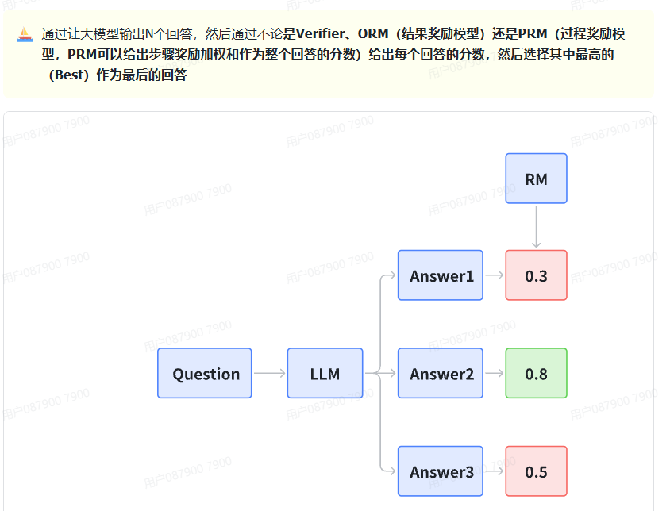
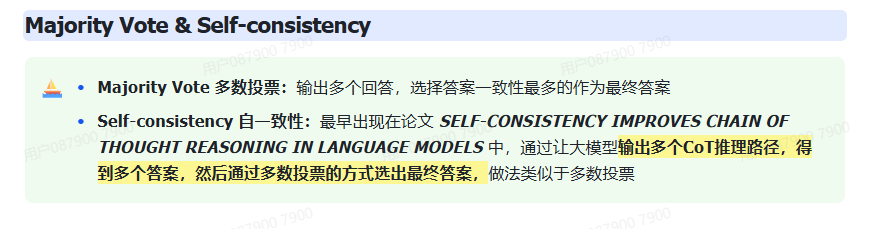

参考
https://zhuanlan.zhihu.com/p/689472725
https://www.zhihu.com/tardis/bd/art/647813179?source_id=1001

# 贪婪搜索、束搜索

贪心解码（Greedy Decoding）：直接选择概率最高的单词。这种方法简单高效，但是可能会导致生成的文本过于单调和重复。
随机采样（Random Sampling）：按照概率分布随机选择一个单词。这种方法可以增加生成的多样性，但是可能会导致生成的文本不连贯和无意义。
Beam Search：维护一个大小为 k 的候选序列集合，每一步从每个候选序列的概率分布中选择概率最高的 k 个单词，然后保留总概率最高的 k 个候选序列。这种方法可以平衡生成的质量和多样性，但是可能会导致生成的文本过于保守和不自然。
以上方法都有各自的问题，而 top-k 采样和 top-p 采样是介于贪心解码和随机采样之间的方法，也是目前大模型解码策略中常用的方法。

# Top-k & Top-p & Temperature

## Top-k 采样

对前面“贪心策略”的优化，它从排名前 k 的 token 中进行抽样，允许其他分数或概率较高的token 也有机会被选中。在很多情况下，这种抽样带来的随机性有助于提高生成质量。

top-k 采样的思路是，在每一步，只从概率最高的 k 个单词中进行随机采样，而不考虑其他低概率的单词。例如，如果 k=2，那么我们只从女孩、鞋子中选择一个单词，而不考虑大象、西瓜等其他单词。这样可以避免采样到一些不合适或不相关的单词，同时也可以保留一些有趣或有创意的单词。

## Top-p 采样
top-k 有一个缺陷，那就是“k 值取多少是最优的？”非常难确定。于是出现了动态设置 token 候选列表大小策略——即核采样（Nucleus Sampling）。

top-p 采样的思路是，在每一步，只从累积概率超过某个阈值 p 的最小单词集合中进行随机采样，而不考虑其他低概率的单词。这种方法也被称为核采样（nucleus sampling），因为它只关注概率分布的核心部分，而忽略了尾部部分。例如，如果 p=0.9，那么我们只从累积概率达到 0.9 的最小单词集合中选择一个单词，而不考虑其他累积概率小于 0.9 的单词。这样可以避免采样到一些不合适或不相关的单词，同时也可以保留一些有趣或有创意的单词。

## Temperature采样
Temperature 采样受统计热力学的启发，高温意味着更可能遇到低能态。在概率模型中，logits 扮演着能量的角色，我们可以通过将 logits 除以温度来实现温度采样，然后将其输入 Softmax 并获得采样概率。

在较低的温度下，我们的模型更具确定性，而在较高的温度下，则不那么确定。

## 联合采样（top-k & top-p & Temperature）

通常我们是将 top-k、top-p、Temperature 联合起来使用。使用的先后顺序是 top-k->top-p->Temperature。

# best of N

# 多数投票 
