参考链接：

https://zhuanlan.zhihu.com/p/18056041194

https://www.cnblogs.com/rossiXYZ/p/18880573#17-hass

MTP（Multi-Token Prediction，多 token 预测）在大模型（LLM）里主要属于 训练范式 / 训练目标设计 这一方面的内容。

# 1.为什么要做MTP

在学习具体的方法前，我们首先了解下为什么要做MTP(Multi-Token Prediction)?

**背景**

我们都知道，当前主流的大模型(LLMs)都是decoder-base的模型结构，也就是无论在模型训练还是在推理阶段，对于一个序列的生成过程，都是token-by-token的。每次在生成一个token的时候，都要频繁跟访存交互，加载KV-Cache，再通过多层网络做完整的前向计算。对于这样的访存密集型的任务，通常会因为访存效率形成训练或推理的瓶颈。

针对token-by-token生成效率的瓶颈，业界很多方法来优化，包括减少存储的空间和减少访存次数等，进而提升训练和推理性能。

**MTP方法的作用**

本文要学习的MTP方法，也是优化训练和推理效率的一个分支系列。

核心思想：**通过解码阶段的优化，将1-token的生成，转变成multi-token的生成，从而提升训练和推理的性能。具体来说，在训练阶段，一次生成多个后续token，可以一次学习多个位置的label，进而有效提升样本的利用效率，提升训练速度；在推理阶段通过一次生成多个token，实现成倍的推理加速来提升推理性能。**

本文主要通过3篇paper把MTP业界探索的主线讲清楚；最后再详细讲解和对比下deepseek 的MTP方法。

# 2\. MTP 方法的一些探索

## 2.1. Blockwise Parallel Decoding

首先我们来看一篇Google的工作，这是Google在18年发表在NIPS上的工作（18年是Transformer诞生的元年）。

paper：[Blockwise Parallel Decoding for Deep Autoregressive Models](https://link.zhihu.com/?target=https%3A//proceedings.neurips.cc/paper_files/paper/2018/file/c4127b9194fe8562c64dc0f5bf2c93bc-Paper.pdf)

> 题外话：18年Transformer才刚出来，那时候模型只有BERT和GPT-1，模型的参数量也都只有0.1B左右，所以可以说MTP的研究并不是大模型时代的新物种，而是在第一代Transformer base的模型上，就有相应的研究了。

这是一篇重点研究推理阶段加速的方法，从论文标题『块并行解码』可以看出隐含在推理阶段不是token-by-token 生成的方式。我们先看下论文中的网络结构图（图1）：

图1、Blockwise Parallel Decoding 网络框图

从上图能看到Blockwise Parallel Decoding网络是个并行计算的过程，但遗漏了很多文中表述的细节，也不像是在描述一个Transformer base的网络（这也可以理解，18年，还是SVM、LSTM统治的时代，确实不像现在，Transformer那时候不是个共识性的产物）

为了直观理解作者的方法，也更符合当前描述tranformer网络结构的方式，我按照自己的理解补充了一些细节，如图2所示：

图2、Blockwise Parallel Decoding 网络框图（yy版）

**基于上图我们看看网络结构的细节：**

* 主干网络是训练好的多层decode-only的Transformer网络，经过多层前向计算后，最终隐层输出 hh 维度的 logitlogit 。
* logitlogit 上面接了多个输出Head，每个Head负责预估一个token， Head\_1Head\_1 负责预估 next token， Head\_2Head\_2 负责预估 next next token ， 以此类推
* 每个Head 有三层：
* 首先是一个共享的FFN层，这层FFN每个Head是特化的、非共享的。该层计算的结果再与原始模型的logit做残差连接；
* 最后再将结果送入到词表投影层（vocabulary projection 包括一个线性变换和一个Softmax），预估每个词的概率分布，最终通过某种采样方法（如：greedy，beam search等）生成token。注意，这个词表投影层是原预训练网络（original model）的投影矩阵+Softmax，**多Head是共享的**。
* 主干网络+ Head\_1Head\_1 是original model，也就是pretrain的模型。**其他Head是论文说的辅助网络**（auxiliary model）

理解了网络细节，再看看论文中的并行推理过程就很好理解了。推理过程，论文中给出了三阶段描述，如图3所示：

图3、Blockwise Parallel Decoding 推理

**推理过程**

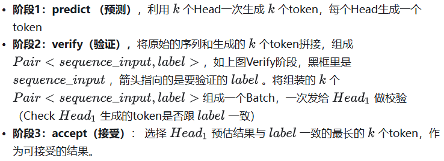

接下来我们看下相比于token-by-token的生成，上述流程推理阶段加速效果怎么样？

> 假设：我们要生成的序列长度为：m ，并行Head数为：k 。
> 我们只考虑最优情况下：所有辅助Head预测结果跟Head1完全一样，即Verify阶段全部token都一次性被接受

算法需要一次在预测子步骤中对 head1,…,headk 的并行调用，以及一次在验证子步骤中对 head1 的调用

推理阶段才需要verify，而推理阶段没有ground truth，所以需要把predict阶段生成的东西再喂给main model进行验证。

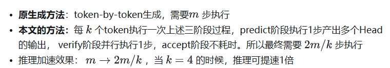

> 注：这里我们注意到，token-by-token生成过程每一步的计算更轻量，而本文的方法Predict和verify要么计算多头，要么输入一个Batch，在衡量计算效率上，是否要考虑不同任务步骤的时间差异？ 答案：这个时间差异我们一般是忽略掉的，认为不同任务每个步骤执行时间一样。因为GPU的设计就是擅长并行计算的，计算一个批次序列和计算单个序列时间差异可以忽略，计算多头和单头时间差异也可忽略。而且GPU计算过程一般都是访存瓶颈，计算过程在整体执行时间消耗相对都很短。

作者也提出，可以进一步重叠第 n 步的verify阶段和第 n+1 步的predict阶段，能进一步提高推理性能。如图4所示：

图4、Predict和Verify重叠设计

我们看看重叠n步的verify阶段和第 n+1 步的predict阶段的过程： 验证时包含k个预测和head1的验证

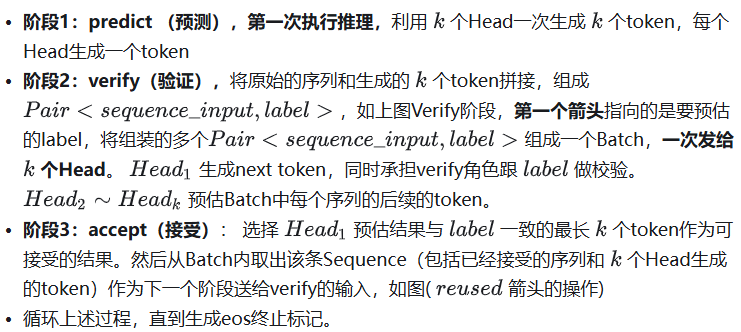

我们再看看上述流程的推理效率：（这里也考虑最优情况，即所有辅助模型生成的token都被接受）

模型第一次推理只执行predict阶段（ 1 步），然后进入verify和predict重叠的阶段，每次处理序列往前走 kk 长度，直到生成终止标记(共 m/km/k 步)。所以总推理步数： 1+m/k 。推理加速效果：当 k=4 的时候，可加速3倍。

至此，我们完整描述了Blockwise Parallel Decoding 的核心内容，该**方法主要是为了做推理阶段的并行加速而设计的**。虽然命名上没有遵循MPT类，但后面一些演进的方法比如Speculative Sample和下面要介绍的Meta's MTP等，都有该方法设计的影子。

## **2.2. Meta's MTP**

这是meta 于2024年4月发表的一篇工作。

paper : [Better & Faster Large Language Models via Multi-token Prediction](https://link.zhihu.com/?target=https%3A//arxiv.org/abs/2404.19737)

**首先简述该工作的motivation**

传统方法的问题（预测下一个token）：

* 训练阶段：token-by-token生成，是一种感知局部的训练方法，难以学习长距离的依赖关系。
* 推理阶段：逐个token生成，推理速度较慢

MTP方法（一次预测多个token）：

* 训练阶段：通过预测多步token，迫使模型学到更长的token依赖关系，从而更好理解上下文，避免陷入局部决策的学习模式。同时一次预测多个token，可大大提高样本的利用效率，相当于一次预估可生成多个<predict, label>样本，来更新模型，有助于模型加速收敛。
* 推理阶段：并行预估多个token，可提升推理速度

**方法实现**

首先看下模型架构，如图5所示。一个共享的transformer的主网络，上面接入4个并行预估头，针对输入token t\_i分别预估后续的 t\_{i+1}, t\_{i+2}, t\_{i+3},t\_{i+4}。

图5、Meta&#39;s MTP 网络框图

我们再根据论文中的描述，详细解释下模型的网络结构：

* 主干网络就是训练好的decoder-only的多层Transformer的网络
* z\_{t:1} 上面接了多输出Head，每个Head负责预估一个token， Head\_1负责预估 next token， Head\_2负责预估 next next token ， 以此类推
* Head 是一个Transformer层（包括 MHA + 2层FFN），且每个Head的Transformer层是独立的，非共享的，
* 最后再送入到词表投影层( f\_uf\_u 包括1个投影矩阵+1个Softmax)，预估每个词的概率分布。最终通过某种采样方法（如：greedy，beam search等）生成token。注意，这个词表投影层是原预训练网络（original model）的投影矩阵+Softmax，**多Head是共享的**。

> 这里我们注意一个细节，上面描述的网络结构，与2.1节 Blockwise Parallel Decoding方法描述的网络结构，仔细对比，发现除了符号不一样，好像网络结构并没有什么差别。

为了清晰地理解本文的方法的模型细节，按图2类似的作图风格，本人重新画下Meta's MTP 网络框图，如下图6所示：

我们**仔细对比下图2和图6，网络结构基本一致，有两个微小的不同：**

* 图2是2层FFN， 图6是一个Transformer
* 图6 除了可按图2方法一样可做并行推理，本文也重点考虑模型加速训练的优化，在模型训练时，多个头都会并行计算loss时，提升样本利用效率和加速模型收敛。

至此，我们讲完了两篇paper的主要工作，方法比较直观，接下来，我们再来看看DeepSeek 的 MTP

# 3\. DeepSeek MTP

DeepSeek之前的MTP实现方式有一个问题：n 个词元是独立生成的，可能导致模型过度关注局部的模式，忽略了长程的依赖关系，最终可能导致输出不连贯甚至模式崩溃（mode collapse）。为了解决这个问题，DeepSeek 通过保持每个词元预测的完整因果链来实现多词元预测，这种做法一方面提高了预测效率，另一方面也可以让模型具有更好的上下文理解能力，关注到更多的token。

首先我们还是从网络结构出发，看看DeepSeek的MTP的设计。如下图7所示，乍看上去也是多头，但结构略复杂。且论文中也强调，在实现上保留了序列推理的连接关系**（causal chain）**如图中，从一个Module链接到后继Module的箭头。

图7、Deepseek MTP实现

我们先结合Deepseek V3论文中的公式详细讲解下MTP的实现。

## 3.1 流程

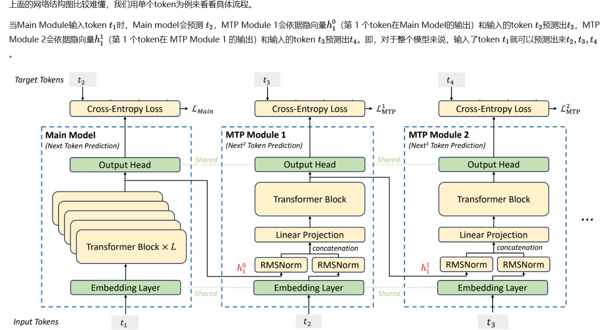

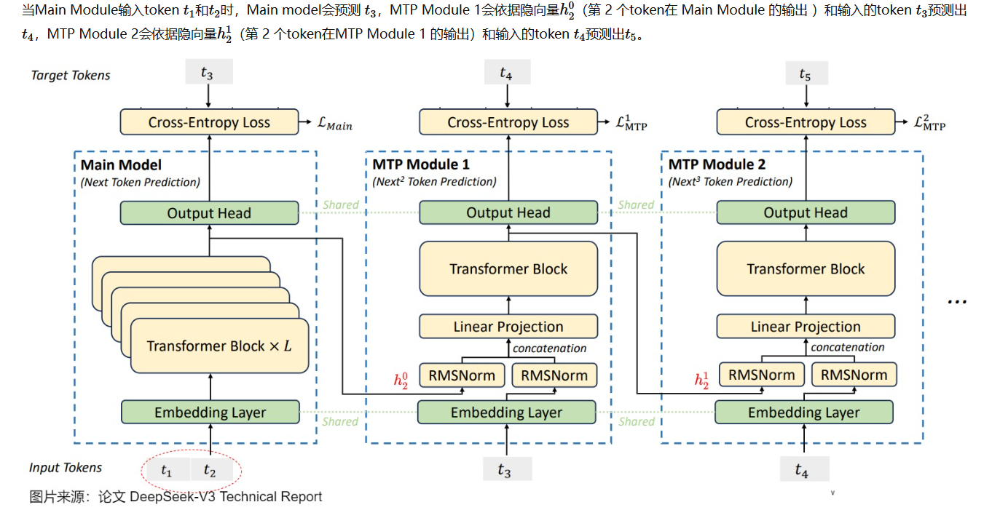

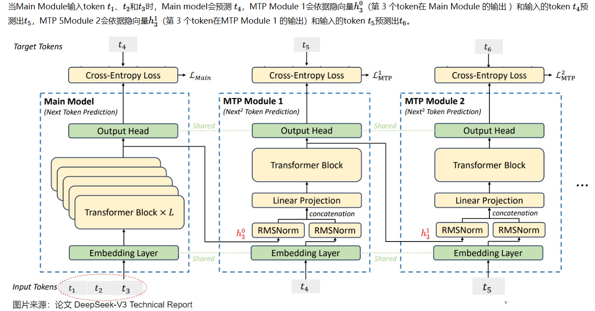

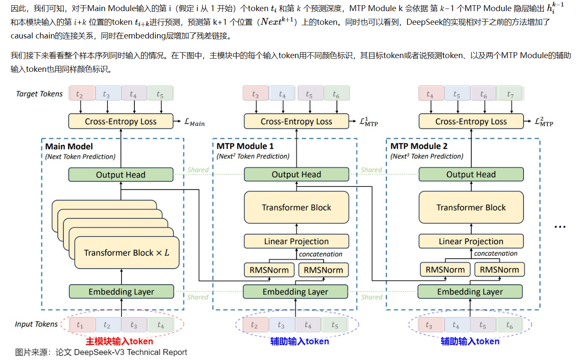

## 3.2 MTP模块细节实现

如上图7所示，用 D个顺序的模块，预测 D个tokens。每个MTP模块的具体结构(如图7红框内）：

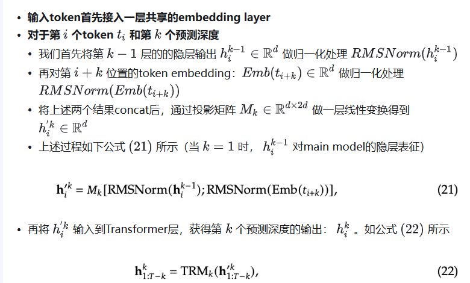

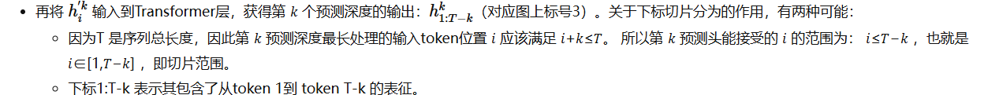

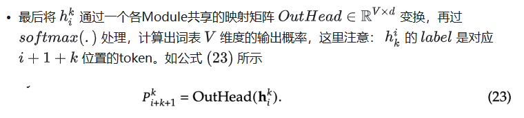

下面我们举个简单的例子： T = 10 T = 10 ，对于 kk 预测深度，模型训练期间样本构建方式，如下图8所示。Main Model 是预测next token，所以input和label序列错1位。MTP Module 1是预测next next token，input和label序列错2位，在T+1总长度下，输入的后续token和输出的前序token都要按错位做裁剪。

图8、MTP多头训练，样本构建示意图

## 3.3 MTP模型训练

通过CrossEntropyLoss计算每个MTP Module Head的损失，如公式 (24)所示

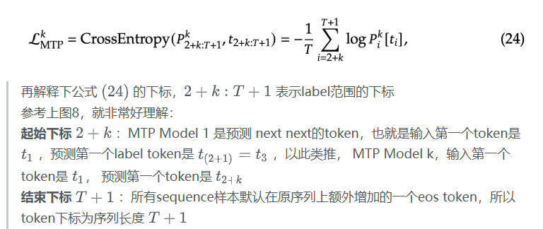

至此我们描述了deepseek V3 MTP的完整流程！！

> 插曲，我在看论文中的流程图和公式时，总是很难对应起来，论文中画的流程图输入token太多了。我总是被多token的输入干扰。从一个token串起，串着串着就乱了。为了帮助自己理解，也希望按相同的作图风格画下DeepSeek的实现，方便跟其他2个模型的网络架构做对比。按单token的输入格式，我自己画了一个流程图，如图 9所示
> **注：如果对DeepSeek MTP的公式和论文中的流程图理解已经非常清晰，请忽略下图**

图9、Deepseek MTP实现（yy版）

建议对比图2、图6、图9对比下几种方法实现上的差异。**DeepSeek的实现相对于之前的方法增加了causal chain的连接关系，同时在embedding层增加了残差链接**。

画完上面的图9，一个有意思的问题，不知道大家是否有注意到。

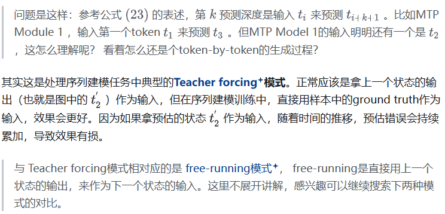

## 3.4 MTP模型推理

DeepSeek V3中强调，MTP的设计主要是为了训练过程能加速收敛，更充分的使用训练样本。所以针对推理阶段只是简单介绍了一段。这里也稍微展开讲下推理的过程。

DeepSeek V3推理可以有两种方法：

**方法1**：直接把MTP Model头全部删掉，模型变成了一个Predict Next Token的 Main Model。然后部署模型做推理，这个就跟正常LLM模型推理一样。没有什么加速效果

**方法2** 保留MTP Model 做self-speculative decoding，这样充分使用多Head预测能力，提升推理加速性能。类似2.1中介绍的三阶段

这里要再注意一个细节，**阶段1：predict(预测)的的流程图，跟图9长得一样吗？**当然不一样。Teacher forcing 只能用于训练阶段。推理阶段要用上一个状态的预估值作为下一个状态的输入（free-running模式），我也画了下推理阶段的流程图，如图10所示 ：

图10、Deepseek MTP推理阶段模型图

## 3.5 代码实现

我们使用vLLM的代码来进行学习。

参考https://www.cnblogs.com/rossiXYZ/p/18880573#17-hass **3.4代码实现**  也可以看MTP.py
