# 一、DPO在做一件什么事

在文章的开始，**我们来思考一个问题：如果想让你训练一个能听得懂人类问题，并给出人类满意答案的模型，你会怎么设计大致的训练步骤？**
一口吃成一个大胖子是困难的，所以不如让我们**循序渐进**地来设计这个训练过程：

* 首先，你的模型必须要有充足的知识储备，以应对你可能提出的任何问题
* 其次，你的模型需要明白“你在提出问题”或者“你在下达指令”这个动作，它在理解这一点的基础上，尝试按照你的指令给出相应的回答
* **最后，你希望模型不仅能对你的问题给出答案，还需要给出令你满意的回答，也就是你希望模型对齐你的偏好。**

我们以[chatGPT](https://zhida.zhihu.com/search?content_id=248369051&content_type=Article&match_order=1&q=chatGPT&zhida_source=entity)的训练为例，看看它是如何贴合这个训练步骤的：

* 首先，它使用大量的数据(文本、代码、数学等)，先训练出一个base模型。这个训练过程赋予模型对文本上下文的理解能力和通用的知识，你也可以理解成它训练出了一个能做好词语接龙的base模型
* 然后，我们在这个base模型上做微调，使得模型能够听懂人类的指令，这个过程得到的模型我们称为 \\pi\_{sft}\\pi\_{sft}
* **最后，我们采用rlhf的方式（奖励模型 + ppo），使得模型不仅能够听懂人类指令，还能产出符合人类偏好的回答。**

现在，我们把焦点放在第三步上：如何训练模型对齐人类的偏好。在以chatGPT为代表的训练方法中：

**训练奖励模型（Reward Model， RM）**：

* 首先，我们需要有一个【标准】，这个标准在告诉待训练的模型，什么回答才是人类喜欢的。这个标准就是奖励模型，它将对各个回答进行打分。
* 然后，在训练奖励模型时，我们可以采用【偏好排序】来标注数据集。即对于一个prompt，我们可以产出若干个回答。然后让人工对这若干个回答进行偏好排序，我们就用这些数据来训练模型
* **训练对齐模型：**
* **在这篇文章中，我们称经过偏好对齐训练后的模型为【对齐模型】**，这个模型也是我们训练的最终目的
* **设计对齐模型的优化目标**：这个优化目标不仅考虑到奖励模型的得分，也尽量让对齐模型参数更新后输出的分布不要偏移 \\pi\_{sft}\\pi\_{sft} 太远，防止模型越训越差。
* **使用强化学习的方法，采用PPO手段来训练这个优化目标，因为用到了强化学习，所以这种方法又被称为rlhf-ppo。**在这个过程中，我们让对齐模型根据prompt自生成回答，并采用训练好的奖励模型对回答进行打分，对齐模型会根据评分结果不断调整自己的输出分布。更多细节在上面提到的rlhf相关文章中，这里不赘述。

**当你仔细端详【对齐人类偏好】这个训练步骤时，你可能会感觉有些疑惑：**

* 看起来，在训练奖励模型的过程中，我们就已经在考虑“什么回答是好的，什么回答是不好的”这个问题了。而对齐模型依然是在考虑这个问题。**所以，我们能不能避开奖励模型的训练，直接一步到位训练对齐模型呢？**
* 在实际rlhf-ppo的训练中，存在【显存占据大】、【超参多】、【模型训练不稳定】等一系列问题。**那么在考虑“一步到位训练对齐模型”的过程中，我们是不是也能顺手做到绕过强化学习，采用一个更简单的方式（比如类似于sft）来使用偏好数据训练对齐模型呢？**

**基于这些考虑，DPO（Direct Preference Optimization）应运而生**，正如它名字中**Direct**蕴含的含义一样，比起传统基于强化学习PPO的方式，它改进了以下两点：

* **不再训练奖励模型，直接使用人类标注的偏好数据，一步到位训练对齐模型。**
* **不再使用强化学习的方法，通过数学推理，将原始的偏好对齐优化目标步步简化，最后通过类似于sft的方式，用更简化的步骤训练出对齐模型。**

我们借用DPO论文中的配图，来直观比较RLHF-PPO和DPO之间的差异：

# 二、偏好对齐模型的优化目标

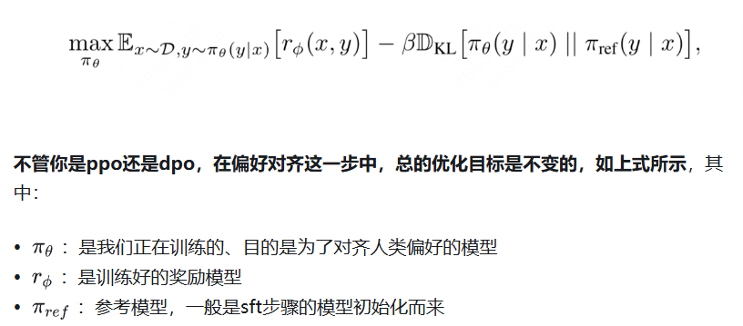

下面开始循序渐进解释dpo loss函数是如何从这个总体优化目标中推导而出的**，大家在这个过程中依然牢记两件事：**

* **绕过奖励模型**
* **最大可能简化优化目标**

# 三、步骤1：从优化目标中直接求解最优对齐模型

推导自己看https://zhuanlan.zhihu.com/p/721073733

总结下来

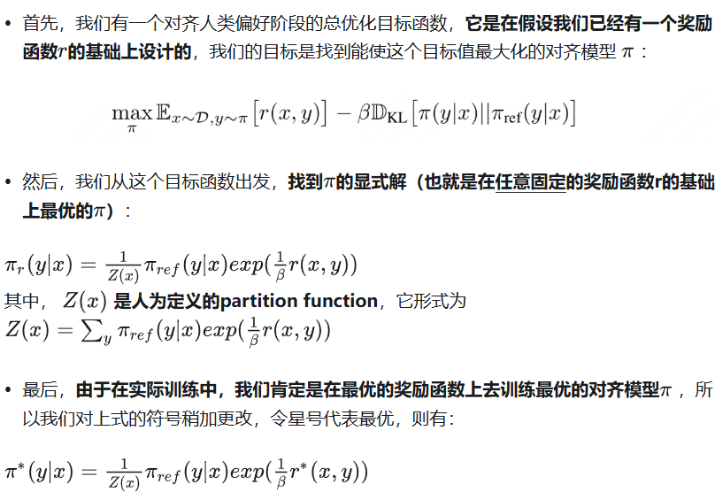

# 四、步骤2：跳过奖励模型的训练

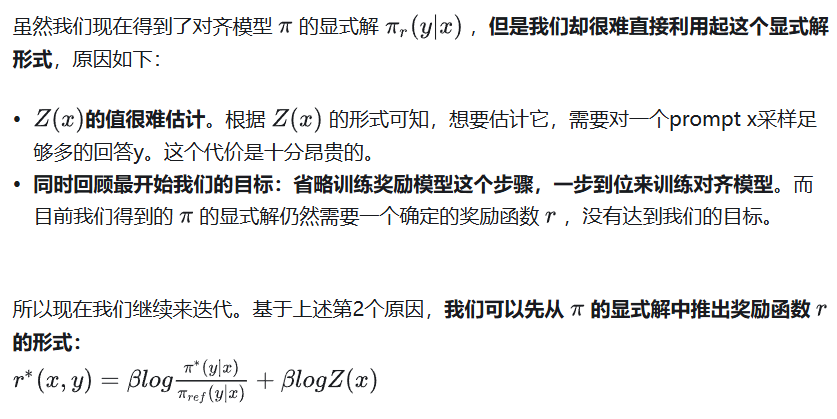

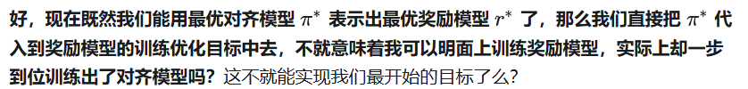

**现在，问题回到“奖励模型的训练上”来了。我们通常使用“偏好排序”这种数据标注方式来对奖励模型进行训练，一般有2种偏好排序方法：**

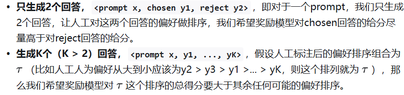

在某些框架（比如chatGPT）的训练中，当生成的回答>2个时，它会把回答拆成两两pair对，这样就可以和只生成2个回答时的目标函数做统一。**但在更一般的场景中，对于>2个回答的场景，我们是把每一种可能的回答偏好排序当成一个整体数据进行处理的** ，然后希望真值排序 τ 的得分最高。即DPO的思想

## 4.1 BT模型

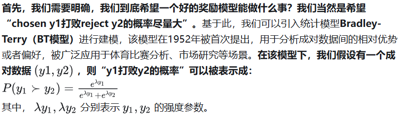

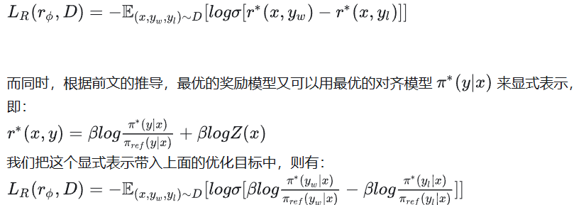

**到这里，你是否惊奇地发现：我们已经把训练奖励模型的目标函数转化成只和对齐模型** π **相关了！也就是说，我们可以一步到位，绕开训练奖励模型的过程，直接用标注好的【成对】偏好数据，以类似于sft的过程直接训练对齐模型了！**

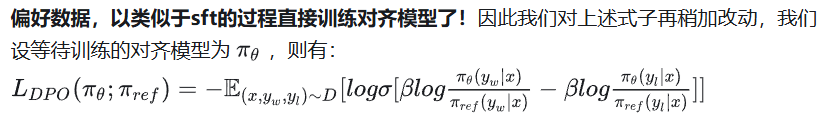

## 4.2 PT模型：生成K（K>2）个回答

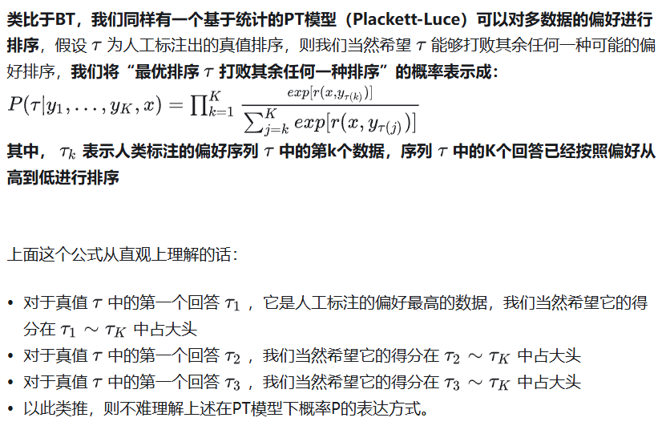

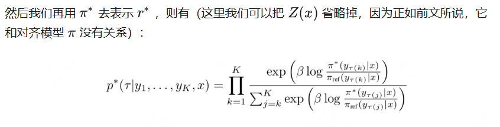

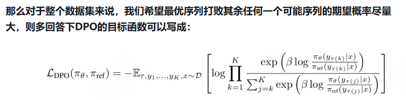
