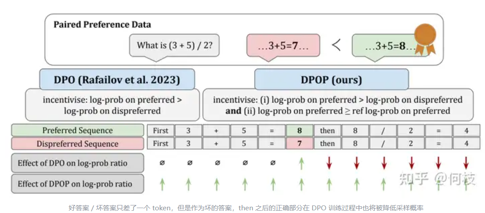
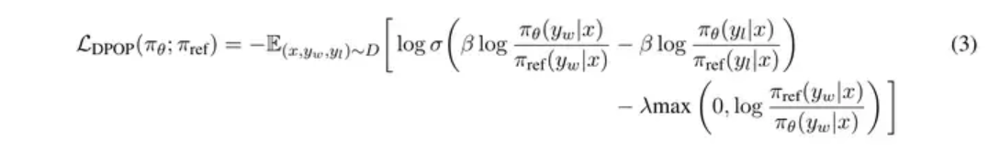
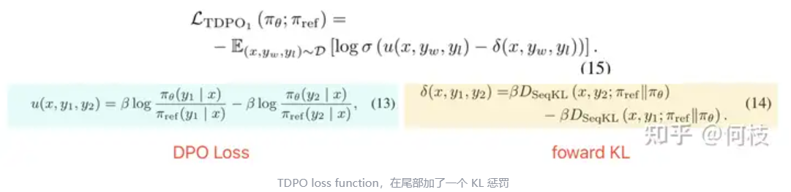
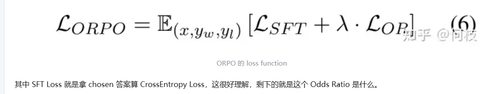
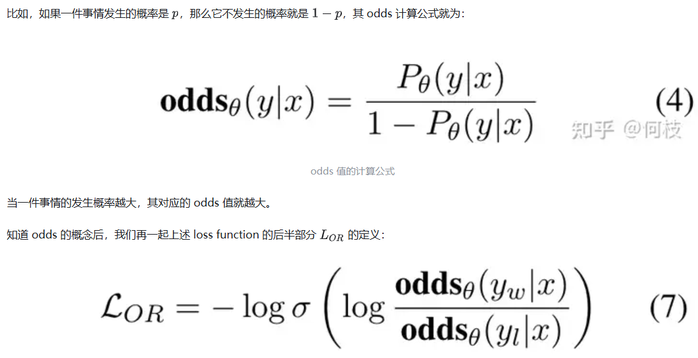

参考链接：
https://www.zhihu.com/question/651021172/answer/3513159005

以 [DPO]为代表的Off Policy 路线

# 1 Fixing Failure Modes of Preference Optimisation with DPO-Positive（DPOP）

DPO 有一个非常致命的问题，

由于 DPO 的训练 loss 目标是「尽可能最大化好答案和坏答案之间的采样概率差」，

一种常见的情况是：**好答案 & 坏答案被采样的概率同时在变低，只不过坏答案降低的比好答案更多** 。

这样一来，虽然好坏答案之间的概率差变大了，但这个过程中「好答案」被采样的概率也降低了，

这并不是我们想要的！

这种情况在 **chosen 和 rejected 答案有大部分内容相同，仅有少部分内容不同时较为常见** 。

DPOP在 DPO loss 的基础上加入了一个正则项：

* 若当前 chosen 答案在 SFT 模型中采样概率 > 当前 Policy 模型的采样概率，则减去一个正则化系数（当前的 chosen 答案 policy 还没有拟好，别再更新那么猛了）；
* 若当前 chosen 答案在 Policy 模型中采样概率更高，证明 Policy 已经对这个 chosen 答案拟合的比较充分了，此时着重降低一下坏答案的采样概率。

使用这种方法，相当于在「好答案」和「坏答案」中添加了一个截断式的 “attention”，让模型优先学会 chosen 答案，当对好答案学的足够好时再着重考虑惩罚坏答案，从而降低 DPO 模型 “训崩” 的可能性，最起码也要不弱于单拿 chosen 数据出来做 SFT 的效果。

# 2 TDPO

在 PPO 训练的时候，我们通常会加上 KL 惩罚来约束模型不要偏离 reference model 过远，

但在 DPO 的实现中却没有并没有添加这一项。

TDPO 提出了这一改进，在原来的 DPO loss 上新增了 kl 惩罚项：

不过，不同于 PPO 中使用 backward KL，**TDPO 则是使用 forward KL 来计算 KL 惩罚** ，

因为 KL 是一个非对称的距离函数，所谓 forward 和 backward 其意思就是「以 SFT 计算采样概率」还是「以 Policy Model 计算采样概率」。

由于 backward KL 的目标是拟合整个分布中的「一部分」，而 forward KL 的目标是尽可能 cover 整个分布中的大部分。因此，**TDPO 训练后的模型会比 PPO 训练后的模型，在输出多样性上更加自由** 。

# 3 Monolithic Preference Optimization without Reference Model（ORPO）

上述一系列类 DPO 的方法已经将 RLHF 的训练成本从 4 个模型砍到 2 个，

在这种情况下，咱们还能再省吗？

不管是哪种 DPO，除了 policy model 外，都还有一个 reference model，我们能不能把 ref_model 也干掉。

回想一下，在 DPOP 中，我们使用 ref_model 来保证模型在 chosen 上的概率不要过低，

如果只是为了保证模型能够拟合 chosen 答案，那我们是不是直接把 chosen 答案拿出来做 SFT 就好，

这不就不需要 ref_model 来吗？

ORPO的目标函数一共由两部分组成（SFT Loss + Odds Ratio Loss）：

通过 minimize 这个 loss 值，我们就需要 maximize  括号内的值，**也就是尽可能的让「好句子」发生的概率增大，「坏句子」发生的概率减小** 。

由此可见，**ORPO 通过定义了一个神奇的 odds 值来提升好样本的概率，降低坏样本的概率，并通过一个 SFT loss 来保证模型对 chosen response 的基本拟合** 。
