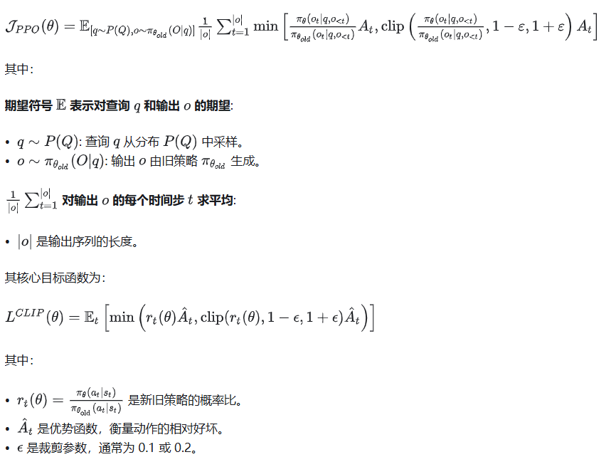
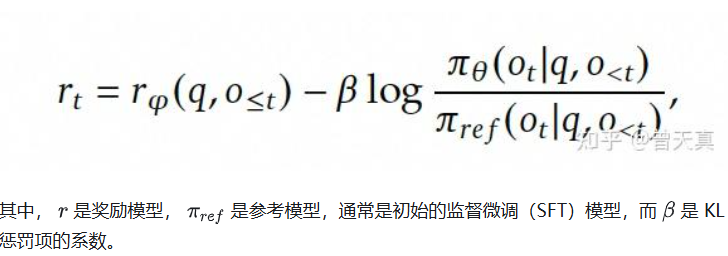
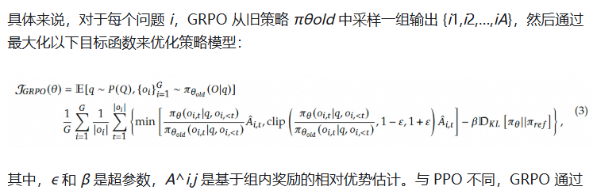
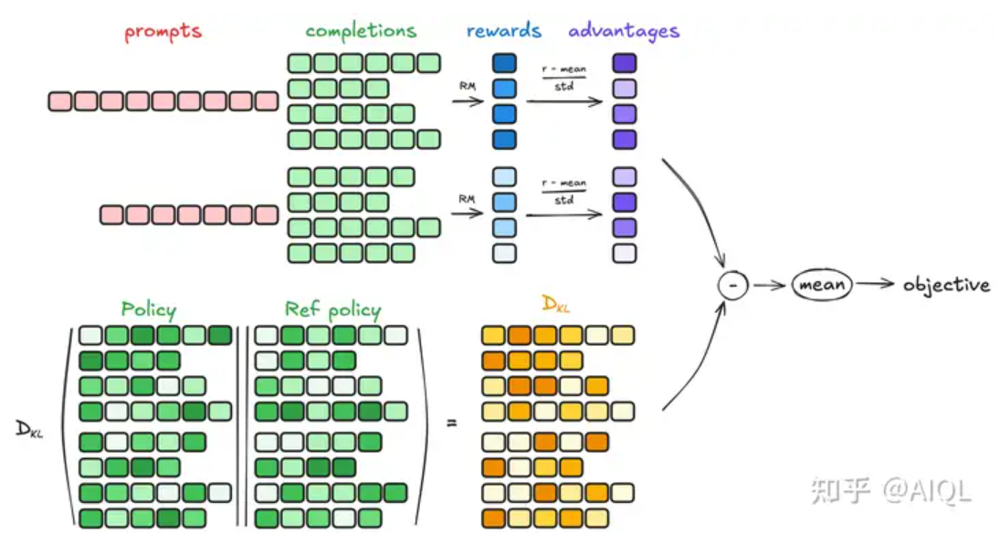
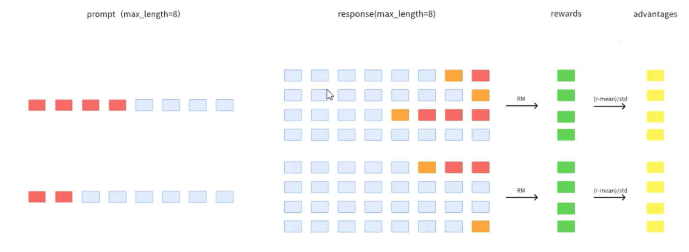
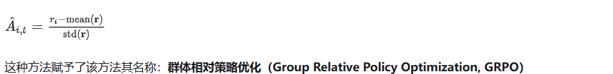
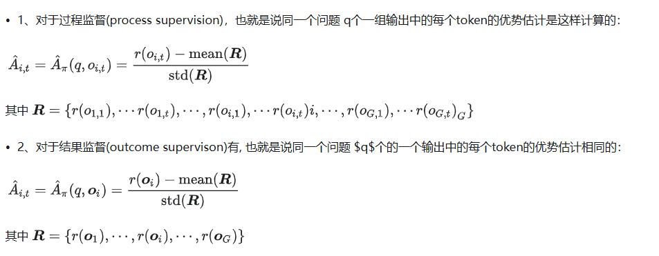
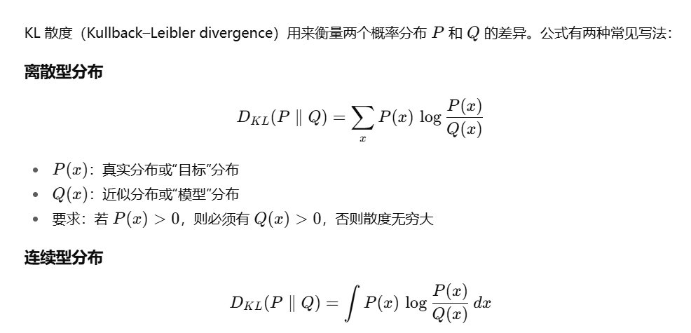
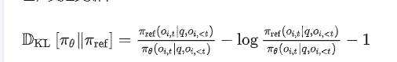
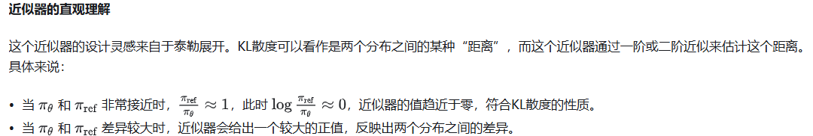

参考资料：

https://zhuanlan.zhihu.com/p/21046265072

https://www.zhihu.com/question/10766825126

# 1 PPO回顾

优势函数由奖励R和值函数V得到，其中R如下：

## PPO的缺点

PPO 中的***值函数通常是一个与策略模型大小相当的模型*** ，***这带来了显著的内存和计算负担*** 。此外，在 LLMs 的上下文中，值函数在训练过程中被用作优势计算中的Baseline，但通常只有最后一个 token 会被奖励模型赋予奖励分数，这可能使得值函数的训练变得复杂。

# 2 GRPO

为了解决这些问题，提出了 **Group Relative Policy Optimization (GRPO)** ，不再需要像PPO那样加入额外的价值函数近似，**而是直接使用多个采样输出的平均奖励作为Baseline** ，显著减少了训练资源的使用。

## 目标函数

与 PPO 不同，GRPO 通过直接使用奖励模型的输出来估计基线，避免了训练一个复杂的值函数。此外，GRPO 通过直接在损失函数中加入策略模型和参考模型之间的 KL 散度来正则化，而不是在奖励中加入 KL 惩罚项，从而简化了训练过程。

## GRPO流程

### 1. 生成补全（Generating completions）

提示词根据最大长度进行填充，采用**左填充**

在每一个训练步骤中，我们从提示（prompts）中采样一个批次（batch），并为每个提示生成一组G个补全（completions）（记为oi）。

G个补全输出不一样长，需要右填充 在终止符后填充到相同长度 

### 2. 计算优势值（Computing the advantage）

对于每一个G序列，使用奖励模型（reward model）计算其奖励（reward）。为了与奖励模型的比较性质保持一致——通常奖励模型是基于同一问题的输出之间的比较数据集进行训练的——优势的计算反映了这些相对比较。其归一化公式如下：

所以也可以单步和最后一步 **一般GRPO优势是在句子中优势的也就是后者**

在回顾整个图

GRPO通过优化PPO算法，解决了计算优势值时需要同时依赖奖励模型（reward model）和价值模型（value model）的问题，成功移除了value model（价值模型），显著降低了推理时的内存占用和时间开销。**Advantage（优势值）** 的核心价值在于为模型输出提供更精准的评估，不仅衡量答案的绝对质量，还通过相对比较（与其他回答的对比）来更全面地定位其优劣。

### 3. 估计KL散度（Estimating the KL divergence）

直接计算的挑战：

* **计算复杂度高** ：KL散度的定义涉及对两个概率分布的对数比值的期望计算。对于复杂的策略分布，直接计算KL散度可能需要大量的计算资源；
* **数值稳定性** ：在实际计算中，直接计算KL散度可能会遇到数值不稳定的问题，尤其是当两个策略的概率分布非常接近时，对数比值可能会趋近于零或无穷大。近似器可以通过引入一些数值稳定性的技巧（如截断或平滑）来避免这些问题；
* **在线学习** ：在强化学习中，策略通常需要在每一步或每几步更新一次。如果每次更新都需要精确计算KL散度，可能会导致训练过程变得非常缓慢。近似器可以快速估计KL散度，从而支持在线学习和实时更新。
*

**优化版本（近似器）**
k3估计 参考[KL散度的三种估计.md](../../杂谈/KL散度的三种估计.md)

这个近似器的优势在于它只需要计算当前策略和参考策略的概率比值，而不需要直接计算KL散度的积分或期望。因此，它可以在保证一定精度的同时，显著降低计算复杂度。

### 4. 计算损失（Computing the loss）

可选择裁剪和不裁剪版本

在很多代码实现，比如Huggingface的TRL中，与原始论文一样每次生成只进行一次更新，因此可以将损失简化为不裁剪版本。

### 算法伪代码

# 总结

GRPO通过优化PPO算法，移除了价值模型，降低了计算开销，同时利用群体相对优势函数和KL散度惩罚，确保策略更新既高效又稳定。

想象一下，你是个销售员，这个月业绩10万块，PPO算法就像个精明的老会计，拿着算盘噼里啪啦一顿算，考虑市场行情、产品类型，最后得出结论：“嗯，这10万还算靠谱，但GAE一算，发现你的优势值还不够高，还得再加把劲啊”

而GRPO呢，就像老板直接搞了个“内卷大赛”，把所有销售员拉到一个群里，每天晒业绩：“你10万，他15万，她20万……”老板还时不时发个红包，刺激大家继续卷。你的10万块在群里瞬间被淹没，老板摇摇头：“你这水平，还得加把劲啊！”

GRPO这招绝了，它把PPO的“算盘”扔了，省了不少计算功夫，直接搞“内卷PK”，用KL散度惩罚来确保大家别躺平。这样一来，策略更新既快又稳，老板再也不用担心有人摸鱼了，毕竟大家都在拼命卷，谁敢松懈？
