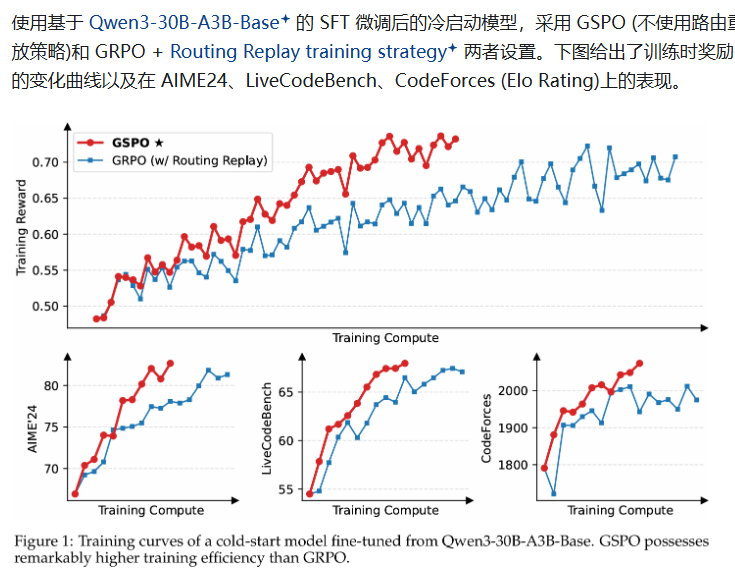
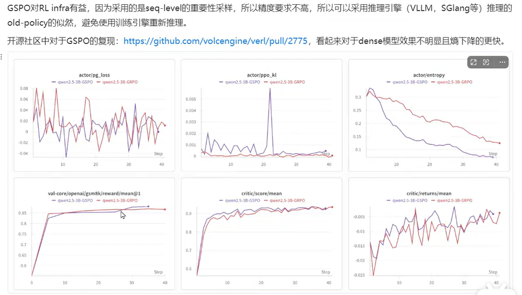
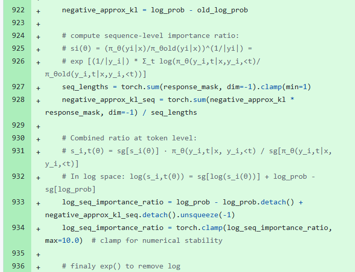

参考链接：
https://zhuanlan.zhihu.com/p/1932829167801574272
https://www.bilibili.com/video/BV14VhLzmEjg/?spm_id_from=333.337.search-card.all.click&vd_source=98e4164f2cbf19bf54ad534e5875112c
zotero论文

# 1 引言

在更大的语言模型上使用 GRPO 时，会出现训练不稳定的情况。在这篇论文，作者认为这种现象源于 GRPO 的重要性权重的设计错误，GRPO 对于 next-token 的重要性权重，容易引入高方差的噪声，在 response 的长度的增加和裁剪机制的作用下，最终导致训练崩溃。

为了解决这一问题，论文提出 GSPO (Group Sequence Policy Optimization)，将针对 token 分布的权重改换为针对 sequence 的重要性权重，并且从 sequence 的维度来计算梯度，而不是 token 的维度，和 reward 本身的定义保持一致。

最终，GSPO 在 **MoE 模型的** RL 训练上解决了稳定性问题，从而不必单独设计复杂的 trick 来维持稳定，**简化了 RL 架构**

# 2 GRPO的缺陷

## 重要性采样

RL 阶段，我们首先会采样一个 large rollout batch，为了提高采样效率，通常我们会将其切分成几个 mini-batches 来进行梯度更新，这一过程无可避免地会导致off-policy场景的出现，同时这也一定程度上说明了PPO和 GRPO 的 clip 机制可以防止那些过度 off-policy 的样本参与梯度计算

它的优化目标本质上是病态的（不适定的，ill-posed）这种病态源于对重要性采样权重的错误应用。

传统的重要性采样：

依赖多次的采样估计去除分布不匹配，但是GRPO**只采样一次**

GRPO的单条轨迹虽然是从同一个旧分布采样得到的，但 token-wise 的重要性权重意味着这条轨迹中每输出一个 token 旧分布的输入条件 y_{i,<t} 这部分就变一次，导致无法在同一个条件分布下多次采样并加权平均得到新分布下策略梯度的无偏估计（相当于预测i love **u/him** 不同的输出u/him对应不同词的重要性加权 ），而且还引入了高方差。

## 优化目标的单位应与奖励的单位不匹配

优化目标Advantage是sequence单元的  但是优化时在token上优化，也就是reward是token单元的

# 3 GSPO设计

GSPO追求优化目标的单位应与奖励的单位匹配，重要性采样改为在sequence单元上实现

**Clip粒度(token到序列)**

GRPO的clip也是在token粒度上，这样会带来一个问题:

当优势A大于0的时候，重要性权重的范围是0到1+E

当优势A小于0的时候，重要性权重的范围是1-c到正无穷。如果旧策略token的概率非常接近于0(1e-6)，而当前策略token的概率只要稍微高一点(0.001)，这个比值就会变得很大(1000)，当优势小于0的时候，clip只会约束过小的比值(即使过大的比值被clip了，但是取min之后仍然会保留clip前的值)。

这种大的范围波动，在不断的训练以及序列变长的情况下，嗓声会不断累积，可能导致moe模型最终崩溃GSPO采用序列级裁剪，直接排除整体偏离策略的完整样本，而非单个Token。这种方式与序列级奖励函数完全对齐，避免了token级裁剪带来的噪声和偏差。

Si使用序列的重要性采样的几何平均

这很自然地和 sequence-level reward 定义一致，也让 clip 的机制意义更明确 (筛去过度 off-policy 的 sequence 的梯度)。

不然某些token被裁减掉，其他不变会让句子奇怪 （？

# 4 GSPO-token

推导下来与sequence level的基本一致

# 实验

## 路由重放策略 Routing Replay

moe模型在进行梯度更新之后，专家激活模式会发生变化。比如当前策略在生成响应时激活的是专家1和2，在进行1次或者几次梯度更新之后，同样的一批样本在生成响应时可能激活的就变成专家1和3，相同的token激活不同的专家，会导致计算出的差异很大，进而造成token的重要性权重剧烈波动，很容易处罚clip机制，裁剪过后，这部分token可能没有梯度，那些仍然保留梯度的token，又会带有噪音，会导致训练及其不稳定

这个时候就需要使用路由回放，具体做法是记录旧策略采样时激活的专家，当使用相同样本去更新当前策略时，强制当前策略路由向和旧策略相同的专家。

GSPO在训练moe模型时，无需路由回放，其以序列为优化单元，对单个token的波动不敏感。

## MoE 训练中效果

**背景** . MoE 模型的训练中，使用 GRPO 算法，专家激活的不稳定性可能会导致强化学习训练无法正常收敛，进行一次梯度更新后，即使对于相同的 response，所激活的专家也可能发生显著变化。这一不稳定要素，导致 token 级别的重要性权重波动更大，从而如之前讨论的，最后导致模型崩溃。

相比于稠密模型的RL训练，MoE模型的稀疏激活特性引入了独特的稳定性挑战。特别地，我们发现当采用GRPO算法时，MoE模型的专家激活波动率可以防止RL训练正常收敛

网友评论：其实本质上来说还是方差（不过GRPO这个importance ratio的估计倒确实是biased），moe主要可能直接出现expert变换导致token-level的ratio估计发生巨大变化，dense相对来说就还好

# 总结

GSPO专攻MOE下的优化 对dense效果不大

对rL架构的优化没看明白

https://github.com/volcengine/verl/pull/2775

GSPO-token s_i 代码

