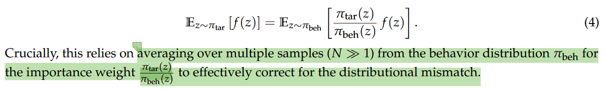
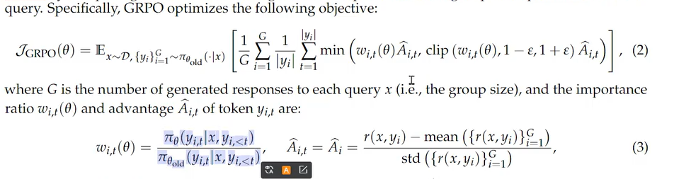
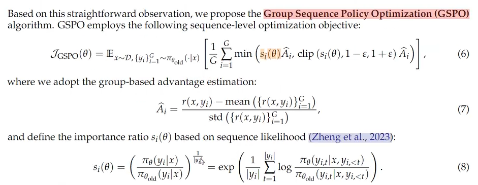
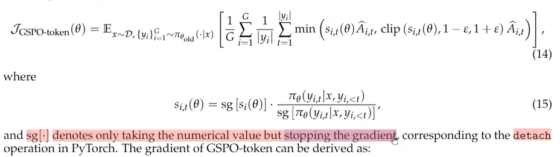
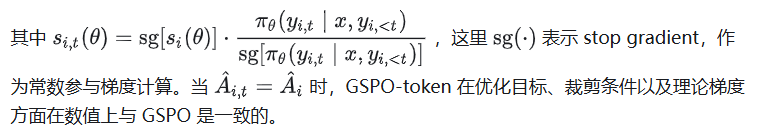

# 1

# 2 GRPO的缺陷

## 重要性采样

它的优化目标本质上是病态的（不适定的，ill-posed）这种病态源于对重要性采样权重的错误应用。

传统的重要性采样：

依赖多次的采样估计去除分布不匹配，但是GRPO**只采样一次**

GRPO的单条轨迹虽然是从同一个旧分布采样得到的，但 token-wise 的重要性权重意味着这条轨迹中每输出一个 token 旧分布的输入条件 y_{i,<t} 这部分就变一次，导致无法在同一个条件分布下多次采样并加权平均得到新分布下策略梯度的无偏估计（相当于预测i love **u/him** 不同的输出u/him对应不同词的重要性加权 ），而且还引入了高方差。

## 优化目标的单位应与奖励的单位不匹配

优化目标Advantage是sequence单元的  但是优化时在token上优化，也就是reward是token单元的

# 3 GSPO设计

GSPO追求优化目标的单位应与奖励的单位匹配，重要性采样改为在sequence单元上实现

Si使用序列的重要性采样的几何平均

这很自然地和 sequence-level reward 定义一致，也让 clip 的机制意义更明确 (筛去过度 off-policy 的 sequence 的梯度)。

不然某些token被裁减掉，其他不变会让句子奇怪 （？

# 4 GSPO-token

推导下来与sequence level的基本一致 

# 实验与总结

相比于稠密模型的RL训练，MoE模型的稀疏激活特性引入了独特的稳定性挑战。特别地，我们发现当采用GRPO算法时，MoE模型的专家激活波动率可以防止RL训练正常收敛

网友评论：其实本质上来说还是方差（不过GRPO这个importance ratio的估计倒确实是biased），moe主要可能直接出现expert变换导致token-level的ratio估计发生巨大变化，dense相对来说就还好
