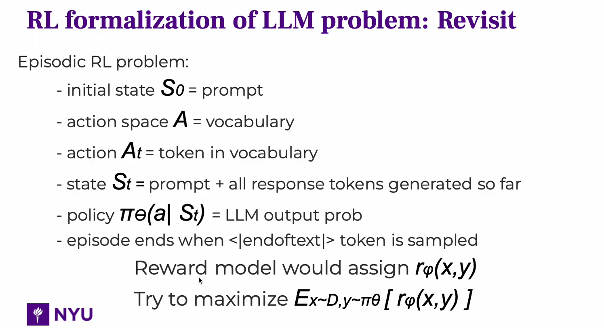

参考链接：

https://huggingface.co/blog/zh/rlhf

https://zhuanlan.zhihu.com/p/677607581（写得好）

https://www.zhihu.com/question/658316700/answer/3630596464 (还没细看)

广义优势估计（GAE）: https://zhuanlan.zhihu.com/p/7461863937

RLHF 是一项涉及多个模型和不同训练阶段的复杂概念，这里我们按三个步骤分解：

1. 预训练一个语言模型 (LM) ；
2. 聚合问答数据并训练一个奖励模型 (Reward Model，RM) ；
3. 用强化学习 (RL) 方式微调 LM。

让我们首先将微调任务表述为 RL 问题。首先，该 **策略** (policy) 是一个接受提示并返回一系列文本 (或文本的概率分布) 的 LM。这个策略的 **行动空间** (action space) 是 LM 的词表对应的所有词元 (一般在 50k 数量级) ，**观察空间** (observation space) 是可能的输入词元序列，也比较大 (词汇量 ^ 输入标记的数量) 。**奖励函数** 是偏好模型和策略转变约束 (Policy shift constraint) 的结合。

PPO 算法确定的奖励函数具体计算如下：将提示 *x* 输入初始 LM 和当前微调的 LM，分别得到了输出文本 *y1* , *y2* ，将来自当前策略的文本传递给 RM 得到一个标量的奖励 rθ**r****θ******。将两个模型的生成文本进行比较计算差异的惩罚项，在来自 OpenAI、Anthropic 和 DeepMind 的多篇论文中设计为输出词分布序列之间的 Kullback–Leibler [(KL) divergence](https://en.wikipedia.org/wiki/Kullback%E2%80%93Leibler_divergence) 散度的缩放，即 r=rθ−λrKL。这一项被用于惩罚 RL 策略在每个训练批次中生成大幅偏离初始模型，以确保模型输出合理连贯的文本。如果去掉这一惩罚项可能导致模型在优化中生成乱码文本来愚弄奖励模型提供高奖励值。此外，OpenAI 在 InstructGPT 上实验了在 PPO 添加新的预训练梯度，可以预见到奖励函数的公式会随着 RLHF 研究的进展而继续进化

