# 1 RLHF起源

https://blog.csdn.net/wxc971231/article/details/120588135 (原文翻译)

https://blog.csdn.net/wxc971231/article/details/121785301 (加一些分析)

## 1.1 异步流程

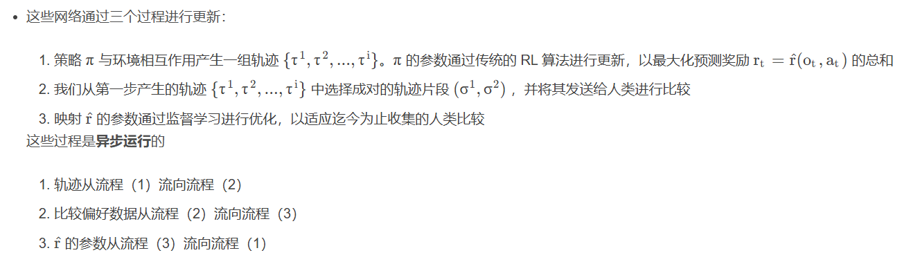

异步 (Asynchronous) 指的是这三个过程不需要严格同步进行，可以并行、交替或延迟执行，互相之间的时间点并不一致：

轨迹采样（策略与环境交互）可以持续运行，先存到缓冲区。

人类反馈收集速度慢，人类不可能实时看所有轨迹，所以会滞后于策略交互。

奖励模型训练不必等到所有反馈收集完成，可以在已有标注数据上不断迭代优化。

策略优化只要有一个当前版本的奖励模型，就能继续更新，不必等奖励模型完全收敛。

这就是典型的 异步管道（pipeline）：

策略 → 轨迹 → （送一部分给人类）

奖励模型 ← 人类反馈（异步产生数据）

策略 ← 奖励模型（异步更新参数）

举个类比：

想象你有一个工厂流水线：

一条产线（策略）不断生产零件（轨迹）。

质检员（人类反馈）会抽查一部分零件，但他们的检查速度不固定。

研发部门（奖励模型）用质检数据改进检测标准。

产线根据最新的检测标准调整工艺（策略更新）。

这四个角色互相传递信息，但节奏不需要对齐，就是异步。

## 1.2 思考

这篇文章是很有启发性的，首先这是 IRL 方法的一个变形，一般的模仿学习方法中，获取专家示范数据是成本最高的部分。为了降低成本，很多方法是从非专家指导，利用次优示范的角度来考虑的，而这篇文章则是改变了专家示范的形式，从人的认知能力入手，直接降低了示范任务的难度，从而让普通人也能给出有效的示范数据。

本文使用的异步方案也很不错，从工程角度看，确实提升了训练效率，而且监督人员可以逐渐看到自己提供监督信息的效果，有一定的反馈作用，在做模仿学习时可以考虑。

从更高的角度看，本文提出了一种新的向 agent 传递任务目标的方法，而且几乎是无偏的（因为online形式，即使出现偏差，也能由监督人员快速修正），请看 强化学习拾遗 —— 再看奖励函数 第4节。不管用什么方法，只要弄出比较偏好，就能接上本文得到一种新方法

下面提几个问题：
这个算法的性能上限是人类评估者对正确行为的直觉，所以如果监督人员对任务没有很好的把握，他们可能不会提供那么多有用的反馈，导致性能上不去

在某些领域，agent 可能会学到欺骗评价者的策略。例如，一个本应抓取物品的机器人将它的机械手放置在相机和物体之间，使它看起来只是在抓取它（这本质是一种特殊的 reward hacking 问题）

# 2 RLHF_LLM

## 2.1 InstructGPT

参考链接：

https://blog.csdn.net/weixin_43646592/article/details/130811139

https://blog.csdn.net/m0_48948682/article/details/138350055

**InstructGPT的训练机制主要分为了3步：**

* 1、SFT：Supervised Fine-Tuning，有监督微调。
* 2、训练奖励模型
* 3、强化学习（PPO方法）

### 2.1.1 监督微调（SFT）

SFT做的事情其实就是语言模型做的预训练。和GPT-3区别在于，InstructGPT的数据为人工标的高质量数据。

gpt3中对于某个下游任务，采用的是few-shot的形式（任务描述+例子+prompt），通常采用固定的任务描述形式，且需要人为去测试哪种任务表述方式好。很明显了，这种方式和实际场景中用户的表述存在很大的gap。

InstructGPT在SFT中标注的数据正是为了消除这种gap的。

具体数据来源从gpt3的真实用户请求中采样了大量下游任务的描述，然后标注人员对任务描述续写，从而得到高质量回答。真实用户请求又被称为某个任务的指令，所以也就是概念 “基于人类反馈的指令微调” 的由来。

实验中训练了 16 个 epoch ，使用余弦学习率衰减，残差正则化率为 0.2 。

实验中根据模型在验证集上输出内容输入 RM 获得的分数进行最终的 SFT 模型选择。

实验发现：SFT模型对 1 个 epoch 后的验证损失具有过拟合现象，然而随后发现，尽管存在过拟合，但训练更多的 epoch 有助于 RM 获得的分数提升和人类偏好评级

### 2.1.2 奖励模型建立（RM）

训练步骤如下：

1、基于SFT训练好的模型，对输入（提问）生成多个输出（答案）（根据输出概率分布进行采样即可得到多个输出或是beam-search类的方法等），然后人工去给这些输出打分。【其实**reward model = sft model + 二分类头**。数据集的样子，每条数据包含三部分：instruction，chosen answer，reject answer】

2、使用第一步得到的样本集，训练模型，模型的**输入为一个提问+一个答案**，模型的输出为对该答案的打分。【gpt模型下游的softmax改为MLP】

3、既然是排序问题，那loss用的是排序问题里常用的pairwise ranking loss。其中，K就是模型生成K个答案，论文采用的是K=9；这个**loss就是计算了两两的答案的损失**。也就是希望真实排序靠前标签对应的打分比排序靠后的标签对应的打分要高；最后再除与所有可能的组合数（从K个里选2个）。长得也就是LR的loss形式：sigmoid+log。

4、有了loss那就能反向传播更新模型参数了。

为了加快比较数据的收集，Openai 向标注人员呈现 K = 4到 K = 9 之间数量的响应供他们对比。这为每个展示给标注人员的提示词产生了Ck_2个比较。由于比较在每个标注任务中都高度相关，实验中发现，如果简单地将待比较的内容混合到一个数据集中，单次遍历该数据集就会导致奖励模型过拟合。相反， Openai 将每个提示的所有Ck_2比较作为单个批次元素进行训练。这种方式的计算效率要高得多，因为它只需要对每个完成项执行一次前向传递（而不是对 K个完成项执行 Ck_2次前向传递），并且由于不再过拟合，它可以实现大大改善的验证准确性和对数损失。

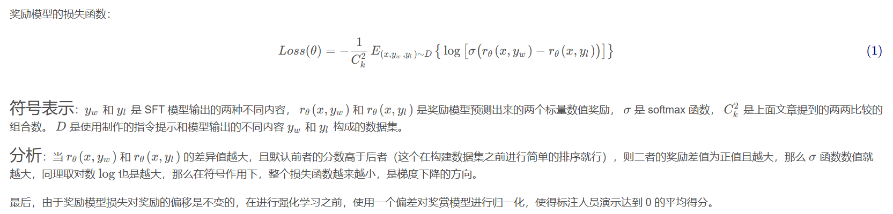

### 2.1.3 强化学习（RL）

PPO的主要思想。 强化学习的模型称为策略模型，又称为策略。其中rθ是RM，为了确保RM打分不至于被过度优化，增加了个log项，那是KL散度，为了保证PPO学习出的强化学习SFT的预测不至于偏离原SFT模型的预测太多，因为RL就是用SFT模型初始化的。这就是PPO的主要思想。

语言模型预训练项。 另外地，InstructGPT在PPO的loss基础上加上了预训练损失，为了防止强化学习SFT模型只对打分这个任务过度拟合，导致泛化性能损失，所以加上了预训练语言模型的损失来确保模型在公开NLP数据集上的表现。加上了这一项，PPO就变为了PPO-ptx。

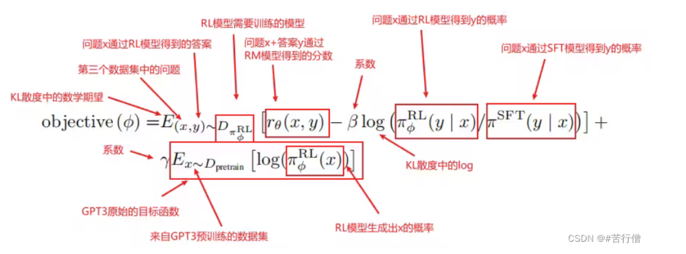

### 2.1.4 与先前GPT的区别

解决 GPT-3 的输出与人类意图之间的 Align 问题；
InstructGPT的输出比GPT3的输出更好，更真实可靠，更丰富。
InstructGPT对有害结果的生成控制地更好，但对于偏见问题没有明显改善。
InstructGPT泛化性更好，在缺乏人类指令数据上也表现不错；
InstructGPT基于SFT后的模型在公开数据集上表现也不错。

# 3 具体操作

参考链接：
https://zhuanlan.zhihu.com/p/677607581（写得好）

https://www.zhihu.com/question/658316700/answer/3630596464 (还没细看)

广义优势估计（GAE）: https://zhuanlan.zhihu.com/p/7461863937

## 3.1 问题描述

让我们首先将微调任务表述为 RL 问题。首先，该 **策略** (policy) 是一个接受提示并返回一系列文本 (或文本的概率分布) 的 LM。这个策略的 **行动空间** (action space) 是 LM 的词表对应的所有词元 (一般在 50k 数量级) ，**观察空间** (observation space) 是可能的输入词元序列，也比较大 (词汇量 ^ 输入标记的数量) 。**奖励函数** 是偏好模型和策略转变约束 (Policy shift constraint) 的结合。

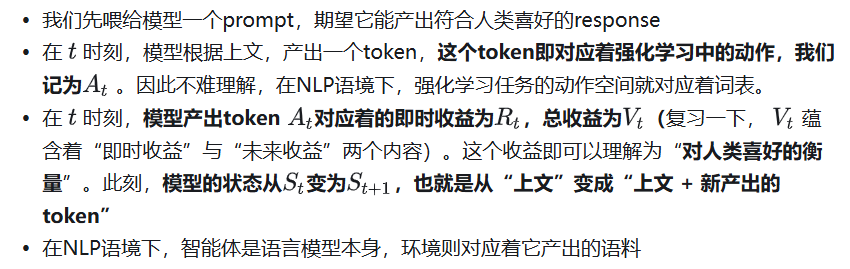

## 3.2 四个关键模型

如上图，**在RLHF-PPO阶段，一共有四个主要模型** ，分别是：

* **Actor Model：演员模型** ，这就是我们想要训练的目标语言模型
* **Critic Model：评论家模型** ，它的作用是预估总收益Vt
* **Reward Model：奖励模型** ，它的作用是计算即时收益Rt
* **Reference Model：参考模型** ，它的作用是在RLHF阶段给语言模型增加一些“约束”，防止语言模型训歪（朝不受控制的方向更新，效果可能越来越差）

其中：

* **Actor/Critic Model** 在RLHF阶段是**需要训练** 的（图中给这两个模型加了粗边，就是表示这个含义）；而**Reward/Reference Model** 是**参数冻结** 的。
* Critic/Reward/Reference Model共同组成了一个“奖励-loss”计算体系（我自己命名的，为了方便理解），我们综合它们的结果计算loss，用于更新Actor和Critic Model

### 3.2.1 actor model

**Actor就是我们想要训练的目标语言模型。我们一般用SFT阶段产出的SFT模型来对它做初始化。**

先喂给Actor一条prompt （这里假设batch_size = 1，所以是1条prompt），让它生成对应的response。然后，我们再将“prompt + response"送入我们的“奖励-loss”计算体系中去算得最后的loss，用于更新actor。

### 3.2.2 Reference Model

**一般也用SFT阶段得到的SFT模型做初始化，在训练过程中，它的参数是冻结的**

**我们希望训练出来的Actor模型既能达到符合人类喜好的目的，又尽量让它和SFT模型不要差异太大** 。简言之，**我们希望两个模型的输出分布尽量相似** 。

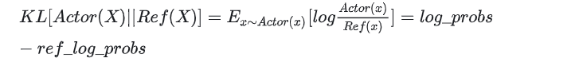

### 3.2.3 Critic Model

预测客观总收益

### 3.2.4 Reward Model

**为什么Critic模型要参与训练，而同样是和收益相关的Reward模型的参数就可以冻结呢？**
这是因为，Reward模型是站在上帝视角的。这个上帝视角有两层含义：

* 第一点，Reward模型是经过和“估算收益”相关的训练的，因此在RLHF阶段它可以直接被当作一个能产生客观值的模型。
* 第二点，Reward模型代表的含义就是“即时收益”，你的token 已经产生，因此即时收益自然可以立刻算出。

## 3.3 loss

### 3.3.1 actor loss

经典的loss

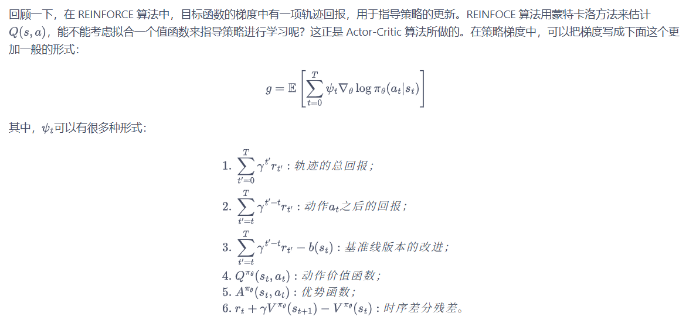

#### Rt设计

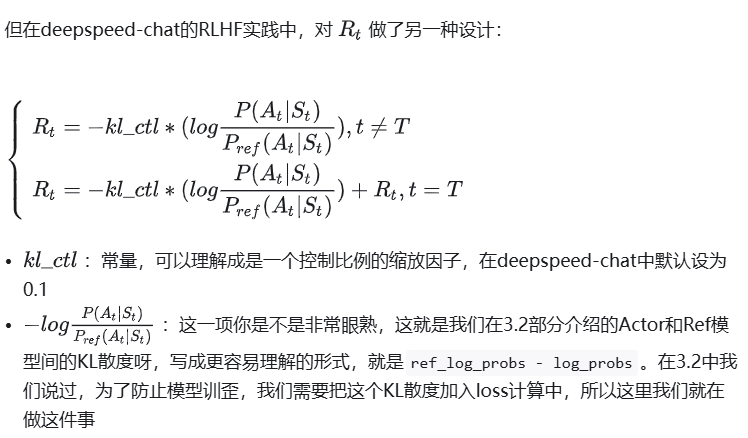

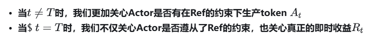

再设计

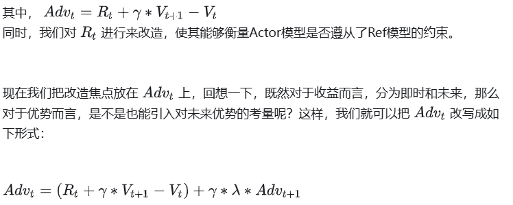

广义优势估计（GAE）: https://zhuanlan.zhihu.com/p/7461863937

最后一个ADvT = RT-VT 倒退即可’

#### 总结

具体再看 https://zhuanlan.zhihu.com/p/677607581

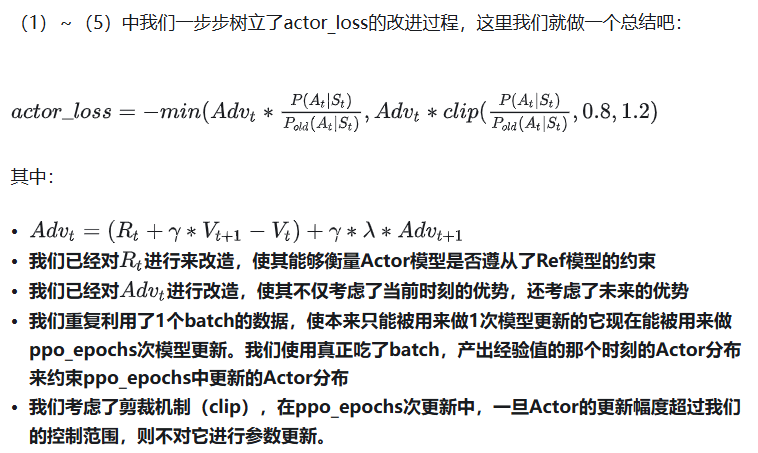

### 3.3.2 Critic loss

经典版本

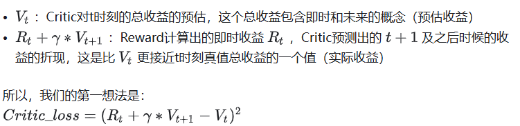

 PPO-epoch

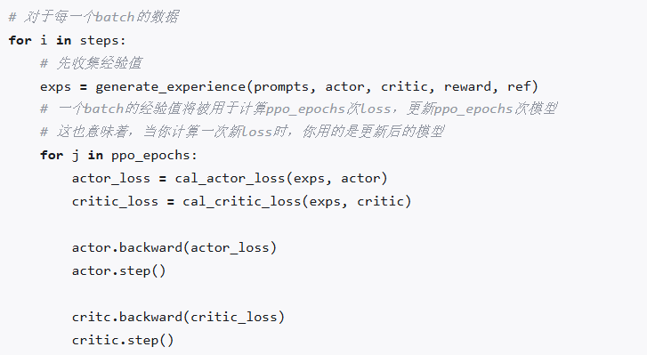

##### 实际收益优化
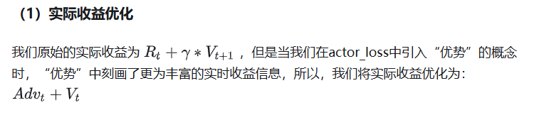

代入上面的ADvt公式 就是多加了一个未来的优势

实际收益时advt和Vt都是老Critic（真正吃了batch的那个，exps）

##### **预估收益优化**

实际收益时advt和Vt都是老Critic（真正吃了batch的那个）

产出的结果预估收益是随着ppo_epochs而变动的。

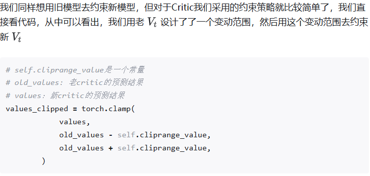
