# 1 RLAIF

参考链接：

https://zhuanlan.zhihu.com/p/682888070

总体来说，RLAIF和RLHF的训练过程基本一样，唯一的不同点只是在于reward model训练阶段的数据收集，它使用了现有的LLM对(x,1y1,y2)进行评价

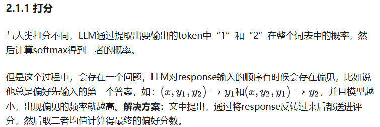

Prompt由以下四部分构成：

1. Preamble（前言）
2. Few-shot exemplars (optional)（示例）
3. Sample to annotate（要标注的样本）
4. Ending (e.g. preferred Response=)（结束语）

尝试从AI标注器中引出思维链 (COT) 推理，以提高与人类偏好的一致性。我们将标准提示的结尾(i.e. “Preferred Summary=”) 替换为 “Consider the coherence, accuracy, coverage, and overall quality of each summary and explain which one is better. Rationale:”，然后解码LLM的响应。最后，我们将原始提示、响应和原始结尾字符串“Preferred Summary=”连接在一起

## 两种形式

文中提出了两种形式的RLAIF，分别是蒸馏式的RLAIF（Distilled RLAIF）和直接式RLAIF（Direct RLAIF），主要区别仅在于训练RL的时候reward来自 reward model 还是直接来自现有LLM。

蒸馏式的RLAIF其实就是我们经典的训练步骤

直接式RLAIF不再收集偏好数据训练奖励模型，而是在RL阶段中直接给生成的answer打分，具体的打分方式如下：

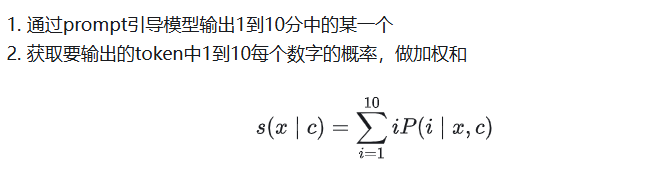

## 总结

RLAIF 达到了与 RLHF 相当的性能。首先，我们观察到 RLAIF 和 RLHF 策略分别在 71% 和 73% 的样例中比有监督微调 (SFT) 基线更受人类青睐，并且两种获胜率在统计上没有显着差异。其次，当被要求直接比较 RLAIF 和 RLHF 的生成时，人们对两者都具有较高偏好（即 50% 的胜率）。这些结果表明，RLAIF 是 RLHF 的可行替代方案，它不依赖于人工标注，并提供有吸引力的缩放特性

从文中提到的相关实验结果来看，本文提出的RLAIF方式确实有不小的吸引力，特别是对于收集数据很困难的团队来说，可以极大降低相关成本。（其实我觉得只是把成本从人工转到了AI计算资源上，不过方便点）

但是另一方面，它的**性能还是有上限，无法继续迭代升级数据质量来进一步提升模型性能**。因此，我认为更适合作为初始模型版本训练的数据收集器，后续进一步提高性能还是需要人工来精标偏好数据集。

# 2 ReMax

参考链接：
https://zhuanlan.zhihu.com/p/662191782

**PPO中的价值模型通常与LLM大小相似，这使存储需求翻了一番** 。此外，价值模型的训练需要存储其梯度、激活和优化器状态，这进一步增加了**近4倍的** GPU存储需求。 总结来说，PPO和它的价值模型（以及其训练相关部分）已成为RLHF奖励最大化阶段的主要计算障碍。

PPO和价值模型是为通用RL问题设计的，而不是针对像RLHF这样的特定问题（RLHF只是RL问题中的一个子类）。有趣的是，我们发现RLHF具有三个在PPO中未使用的重要特性

1. **快速模拟（fast simulation）：** 轨迹（即LLM中的整个响应）可以在很短的时间内迅速执行（小于1s），几乎没有时间开销。
2. **确定性转移（deterministic transitions）：** 上下文确定性依赖于过去的标记和当前生成的标记。
3. **轨迹级奖励（trajectory-level rewards）：** 奖励模型只在响应完成时提供一个奖赏值。

通过这三个观察，我们不难发现value model在RLHF的问题中是“冗余”的。这是因为value model 设计的初衷是为了随机环境下的样本效率和慢仿真环境的计算效率。 然而这在RLHF中是不需要的。

ReMax算法基于一个古老的策略梯度算法REINFORCE：

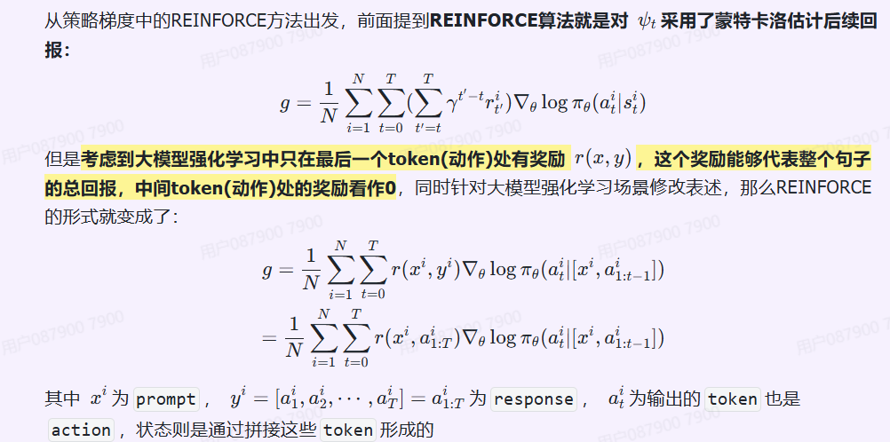

REINFORCE可以在计算层面利用好RLHF任务的三个性质，因为REINFORCE直接利用一个响应的奖励来进行优化，不需要像一般的RL算法一样需要知道中间步骤的奖励和值函数。然而，由于策略的随机性， REINFORCE梯度估计器存在高方差问题

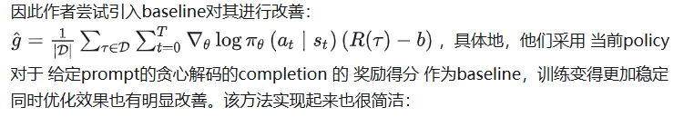

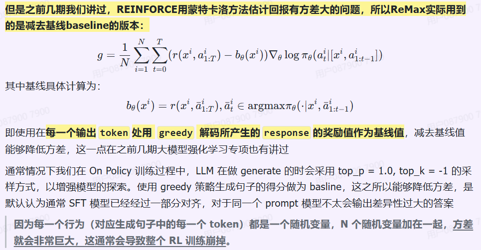

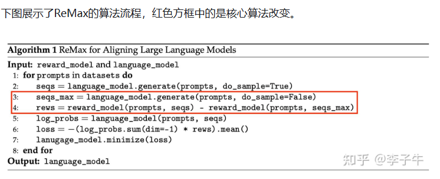

## 效果：

奖励上升，梯度稳定

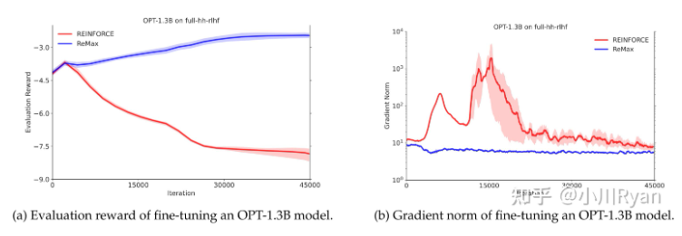

## **算法优点**

* ReMax的核心部分可以用6行代码来实现。相比之下，PPO里要额外引入重要性采样（importance sampling），广义优势估计（generalized advantage estimation，GAE)，价值模型学习等额外模块。
* ReMax的超参数很少。相比之下，PPO有额外的超参数，例如重要性采样剪切阈值（importance sampling clipping ratio）、GAE系数、价值模型学习率，离策略训练轮次（off-policy training epoch）等，这些超参数都需要花大量时间去调优。
* ReMax能理论上节省约50%内存。 相比于PPO，ReMax 成功移除了所有和价值模型相关的部件，大大减小了内存开销。 通过计算，我们发现相比于PPO，ReMax能节省约50%内存

# 3 RLOO

参考链接：

https://zhuanlan.zhihu.com/p/691297245

https://huggingface.co/blog/zh/putting_rl_back_in_rlhf_with_rloo

与Remax一致，直接采用更简单的policy gradient类强化学习算法。本文提出的RLOO（REINFORCE Leave-One-Out）算法在多种大模型任务中都取得了优于PPO/DPO的结果，同时也对噪声和KL约束更robust。

同样设计基线，RLOO使用一种蒙特卡洛的方式去计算b 这样的方式能够避免使用value model和GAE，减少显存占用

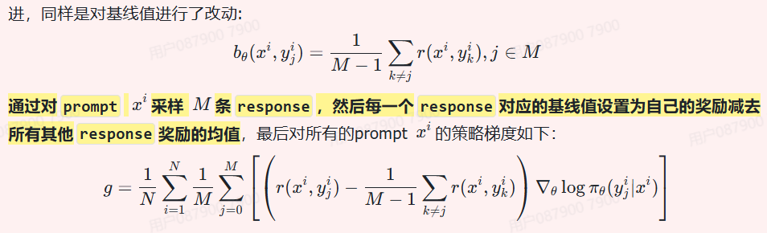

## 实验部分

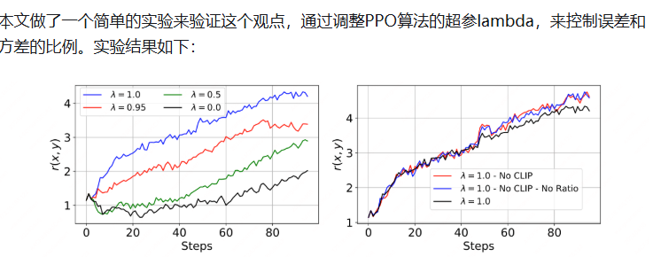

PPO 当lambda=1（方差最大，没有误差）时算法的表现最好，这说明方差在RLHF中不是最主要的影响因素。

另外，PPO中的clip在RLHF中也变得并不重要。本文同样做了clip的消融实验，结果表明实验中触发clip的比例很小，clip对实验结果几乎没有影响。

RLOO算法没有和PPO一样使用token-level的reward，而是将整个过程建模为bandit问题，将整个response视作action，只有单一的reward，即使用**sequence-level的reward**。

## 总结

RLOO原文的sample次数还行，用的是2次/4次效果就已经不错了 也没有很费算力

huggingface中（https://huggingface.co/blog/zh/putting_rl_back_in_rlhf_with_rloo）提到尽管 RLOO 在性能和计算效率方面有优势，但我们想要强调一些数值问题。具体来说，生成过程中获得的响应对数概率与 `bf16` 下训练前向传递期间获得的对数概率在数值上略有不同

在实际操作中，我们注意到 PPO 取消了大约 3% 的批次数据的梯度，而 RLOO 取消了大约 20-40% 的批次数据。

我们增加了在生成新批次之前的梯度步骤数 (通过 num_ppo_epochs 和 num_mini_batches)，RLOO 的裁剪比率并没有显著变化; 这提供了实证证据，表明裁剪比率确实是由于 bf16 的数值问题，而不是因为行为和最新策略有很大不同

这部分不是很懂 有关数值精度的内容有待学习

# 4 REINFORCE++

参考链接：

https://zhuanlan.zhihu.com/p/14888098807

https://arxiv.org/html/2501.03262?_immersive_translate_auto_translate=1

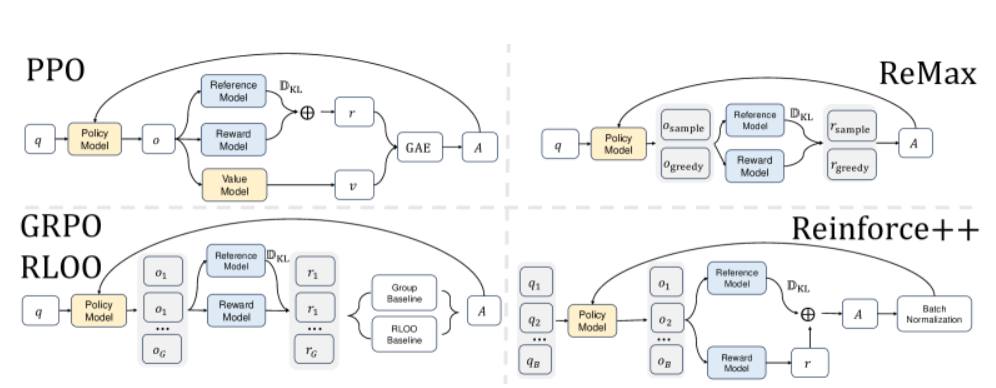

REINFORCE++的核心思想是将PPO中的各种优化技巧整合到经典的强化学习算法REINFORCE中，以提升其性能和稳定性。这样REINFORCE++不需要 Critic 从而节省计算资源，又有加持了 PPO 相关的优化技巧实现高效训练。 REINFORCE++的特点是 比 GRPO 稳定比PPO快。

我们在 REINFORCE 上集成下面的优化 Tricks 以稳定模型的训练:

## Token Level KL-Penalty

**Token Level KL-Penalty** 是一种在序列生成任务中使用的正则化技术。其主要目的是控制生成的文本与训练数据之间的差异，以避免模型生成过于偏离训练分布的输出。具体方法如下：

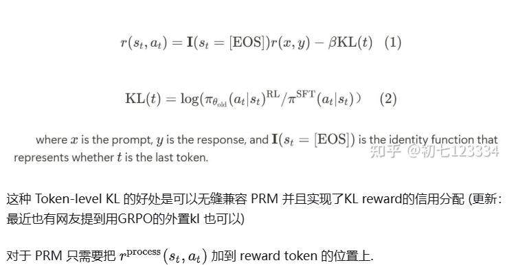

## Mini-batch Updates

- **小批量样本**：将训练数据划分为多个小批量（mini-batch），而不是使用整个数据集进行更新。
- **频繁更新**：通过在每个小批量上进行多次参数更新，可以更快地收敛，同时减少内存消耗。
- **随机性引入**：小批量更新引入了随机性，有助于避免局部最优解，提高模型的泛化能力。

## **Reward Normalization and Clipping**

- **奖励归一化**：通过对奖励进行标准化（例如，减去均值并除以标准差），使得奖励信号更为平稳，从而提高训练过程的稳定性。
- **奖励裁剪**：限制奖励值在某个范围内，以防止极端奖励对模型更新造成过大的影响。这有助于保持学习过程的稳定性，并防止梯度爆炸。

## **Advantage Normalization**

前面都是老生常谈，这里不一样一点

采用**全局训练批次的平均奖励作为基线奖励**，利用基于 KL 的 k1 损失 优势函数是Token-level的

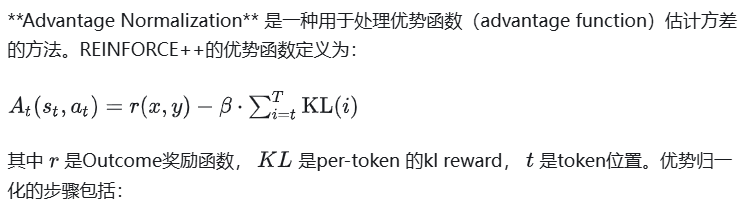

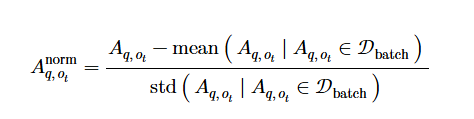

**REINFORCE++ 中用的是 PPO 的 loss function**，依然采用PPO-Clip

## 算法步骤

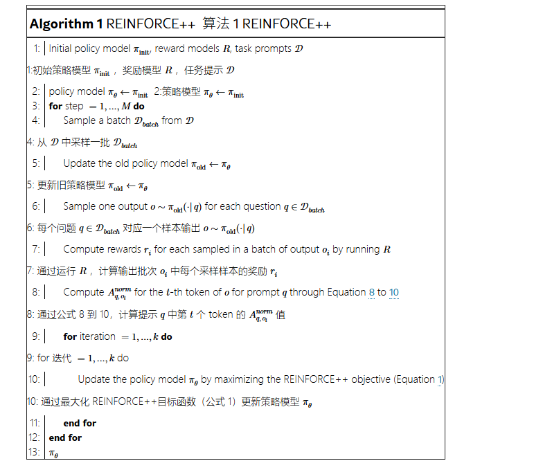

目标函数：

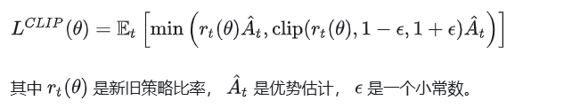

可以简单理解成，将GRPO的更新降级到token level，更新公式与PPO一样，无非是改了KL的实现形式，从ouput-level，到token level

## 结论

有大厂帮我们验证过了 确实可用 REINFORCE+PPO YYDS (2024/12/29)确实可用 REINFORCE+PPO YYDS (2024/12/29

# 5 REINFORCE++-baseline

参考链接：

与上面同一篇论文：https://arxiv.org/html/2501.03262?_immersive_translate_auto_translate=1

https://zhuanlan.zhihu.com/p/1938824375903183527

优势函数是sequence-level的

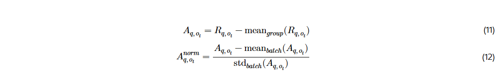

其中 **group 表示与相同提示对应的生成响应**。此基线计算方法与 GRPO 采用的方法类似；然而，GRPO 使用局部标准差，而 REINFORCE++ 则采用全局批归一化来增强训练稳定性。对于 REINFORCE++-基线，我们采用 k2 KL 估计器而不是 GRPO 中的 k3，因为 k2 提供无偏估计。
