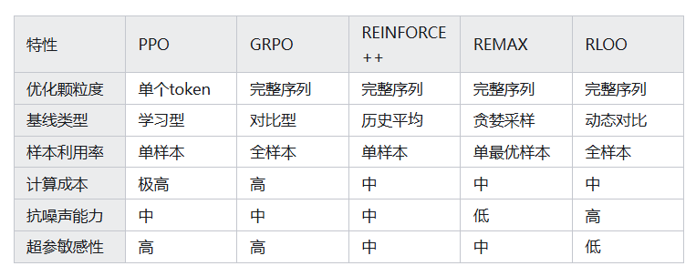

参考链接：
https://zhuanlan.zhihu.com/p/1898862420878947530

# 一、REINFORCE：用“结果”直接教模型

让模型生成一个结果（比如一段回答），然后用人类反馈的“奖励分数”（比如用奖励模型打分）告诉它这个结果好不好。

如果结果好，就鼓励模型以后多生成类似的；如果不好，就惩罚模型减少这类生成。

但 REINFORCE 有个问题：如果奖励分数波动大（比如偶尔打高分或低分），模型可能学偏。这时候就需要一个“稳定器”来平衡分数，这个稳定器就是 **基线-baseline** 。比如，用过去所有作业的平均分作为基线，高于基线的作业就重点表扬，低于基线的就批评，这样能减少偶然因素的影响。

# **二、RLOO 升级：用“多个结果互相比”让基线更聪明**

RLOO 是 REINFORCE 的升级版，核心思想是：一次生成多个结果，用它们互相作为参考基线，就像让学生们互相批改作业，找出谁更好。

**为什么这样有效？**

* **利用群体智慧** ：单个回答的分数可能有噪声（比如奖励模型偶尔出错），但多个回答的平均分数更稳定，能抵消偶然误差。
* **无偏估计** ：不需要提前设定固定基线（如历史平均分），而是用当前批次的样本动态计算基线，更贴合当前生成情况。
* **样本利用率高** ：每个回答既被评估，又参与基线计算，所有样本都被充分利用，不像有些方法只保留最高分样本（如 RAFT）。

# 三、**PPO（近端策略优化）：严格的“步步纠正”老师**

* **核心思路** ：把生成文本的每个字（token）当作一个“动作”，全程盯着模型的每一步输出。例如，生成“如何学习数学”时，每写一个字（如“如”），就用 value model判断当前状态的好坏，并用剪裁机制限制策略更新幅度，避免模型突然“学偏”。
* **缺点** ：
* 计算成本高：需要同时运行生成器、参考模型、价值模型、奖励模型 4 个模型，显存占用大，训练耗时（像老师全程陪读，成本高）。
* 调参复杂：剪裁参数、优势估计参数等超参数敏感，非专家难以调整（像老师的教学方法太精细，难以复制）

# 四、**GRPO（广义优势估计策略优化）：更“圆滑”的PPO**

**核心思路：**
GRPO 是 PPO 的序列级改进版，不依赖价值网络，而是通过生成同一输入的多个完整序列（如一段对话的多种回复），计算每个序列的奖励与组内平均奖励的差值（相对优势），并通过KL 散度约束策略偏离参考模型的程度。

* **缺点：**
* 超参敏感性高：需手动调整 KL 惩罚系数、每组生成序列数量（G 值），非专家难以优化。
* 计算成本中高：虽无需价值网络，但生成 G 个序列的计算量随 G 增大而线性增加（如 G=4 时计算量是单序列的 4 倍）。
* 依赖 KL 约束：过度约束可能限制模型多样性，尤其在需要探索新风格的场景中

# 对比

