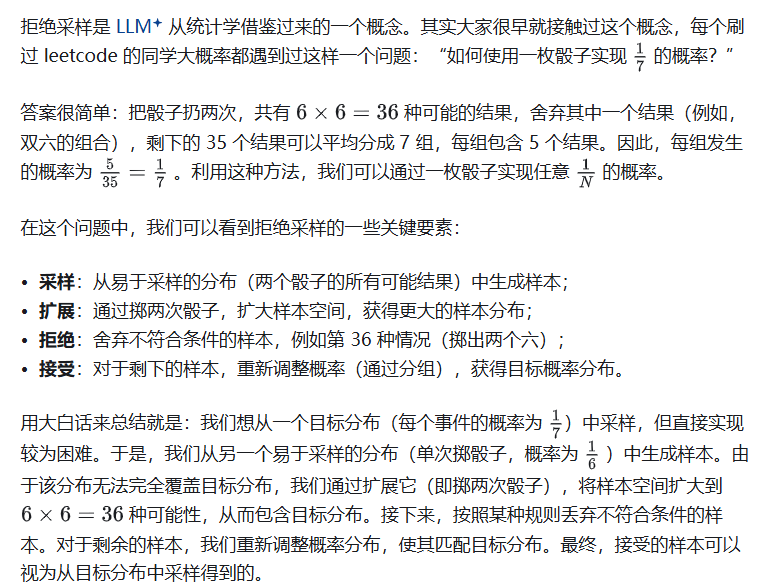
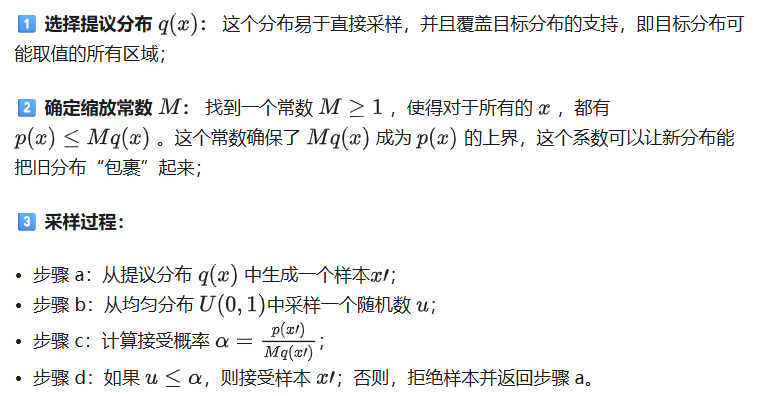
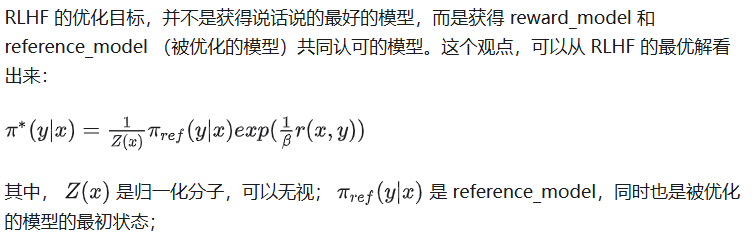
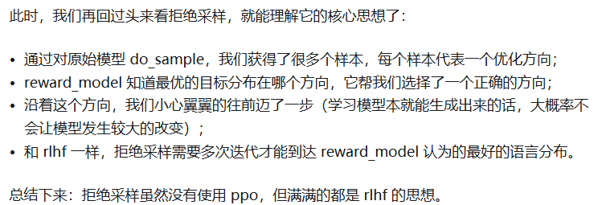

参考链接：
https://zhuanlan.zhihu.com/p/3907736367

# 作用

(1) 提升生成质量

LLM 生成文本时，模型可能会生成低概率或不合理的 token。

用拒绝采样，可以 过滤掉低质量 token，只保留高概率、符合约束的 token。

示例：

对抗性训练后，用 reward model 评估 token quality → 拒绝低分 token。

Speculative decoding 里，提前生成多 token 候选，再用接受概率过滤。

(2) 控制生成分布

可以把 奖励模型/校验器 的分数作为 accept_prob，实现条件生成或安全约束。

比如：

不生成敏感内容

强制保持风格一致

避免语法错误

(3) 结合 RLHF / SFT

在 RLHF 中，reward model 可以输出每个 token 的得分。

拒绝采样可以保证生成文本在 高 reward 区域，减少不合理采样。

# 引子

# 统计学的拒绝采样

我们再来看下统计学中是如何定义拒绝采样的：拒绝采样（Rejection Sampling）是一种 [Monte Carlo](https://zhida.zhihu.com/search?content_id=249804123&content_type=Article&match_order=1&q=Monte+Carlo&zhida_source=entity) 的统计方法，**用于从复杂的目标概率分布中生成随机样本** 。当直接从目标分布p(x)中采样困难或不可行时，使用一个易于采样的提议分布q(x)，并根据某种接受概率来决定是否接受采样结果。具体过程如下:

直觉：**让模型输出更接近目标分布，而不是盲目采样** 。

# LLM 的拒绝采样

LLM 的拒绝采样操作起来非常简单：让自己的模型针对 prompt 生成多个候选 response，然后用 [reward_model](https://zhida.zhihu.com/search?content_id=249804123&content_type=Article&match_order=1&q=reward_model&zhida_source=entity) 筛选出来高质量的 response （也可以是 pair 对），拿来再次进行训练。

解剖这个过程：

1. 提议分布是我们自己的模型，目标分布是最好的语言模型；
2. prompt + response = 一个采样结果；
3. do_sample 多次 = 缩放提议分布（也可以理解为扔多次骰子）；
4. 采样结果得到 reward_model 的认可 = 符合目标分布。

经过这一番操作，我们能获得很多的训练样本，“**这些样本既符合最好的语言模型的说话习惯，又不偏离原始语言模型的表达习惯** ”，学习它们就能让我们的模型更接近最好的语言模型。

目前为止，是不是看上去很有道理，很好理解。但其实这里有一个致命的逻辑漏洞：为什么我们的模型反复 do_sample，就一定能覆盖最好的语言模型呢？这不合逻辑啊，狗嘴里采样多少次也吐不出象牙啊。

紧接着，就需要我们引出另一个概念了：RLHF 的优化目标是什么？

在 RLHF 的训练框架下，reward_model 认为谁是最好的语言模型，谁就是最好的语言模型，人类的观点并不重要。与此同时，即使 reward_model 告诉了我们最好的语言模型距离当前十公里，但 reference_model 每次只允许我们走两公里，所以 RLHF 需要反复迭代进行。

