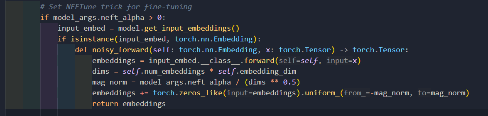

参考链接：

https://blog.csdn.net/Solo95/article/details/134451596

https://developer.volcengine.com/articles/7385013504173932582

NEFTune指的是Noise Embedding Finetuning（噪声嵌入精调），提出自论文：[NEFTune: NOISY EMBEDDINGS IMPROVE INSTRUCTION FINETUNING](https://arxiv.org/pdf/2310.05914.pdf)。

NEFTune方法的原理仅使用一句话就可以描述清楚：

在训练过程中，通过向嵌入层（embedding）的输出添加一定的噪声来增加模型的鲁棒性，从而提高模型的泛化能力。

如上图，基于 `AlpacaEval`进行评测，引入了噪声之后在Alpaca数据集上有34.9%的提升！！！其他数据集也有不低于7.5%的提升，效果惊人~。


引入方法后的整个finetune过程引用原文的算法描述如下：

因为方法很简单，实现自然也很简单：

`uniform_(a,b)`，即按替换原向量每一项为a到b之间的随机数。

```python
import torch
from torch.nn import functional as F


def NEFTune(model, noise_alpha=5):
    """
    Apply NEFTune: Noisy Embedding Fine-Tuning.

    During training, adds uniform random noise to embeddings 
    to improve generalization and robustness.
    """

    def noised_embed(orig_embed, noise_alpha):
        def new_func(x):
            # During training, we add noise to the embedding
            # During generation (inference), we don't
            if model.training:
                embed_init = orig_embed(x)
                dims = torch.tensor(embed_init.size(1) * embed_init.size(2))
                mag_norm = noise_alpha / torch.sqrt(dims)
                return embed_init + torch.zeros_like(embed_init).uniform_(-mag_norm, mag_norm)
            else:
                return orig_embed(x)
        return new_func

    ##### NOTE: this is for a LLaMA model #####
    ##### For a different model, you need to change the attribute path to the embedding #####
    model.base_model.model.model.embed_tokens.forward = noised_embed(
        model.base_model.model.model.embed_tokens, noise_alpha
    )
    return model
```

```bash
>>> a = torch.zeros(3, 3)
>>> print(a)
tensor([[0., 0., 0.],
        [0., 0., 0.],
        [0., 0., 0.]])
>>> a.uniform_(-1, 1)
tensor([[-0.8951, -0.6760, -0.1516],
        [-0.6764, -0.6086, -0.4051],
        [-0.7278,  0.2884,  0.7550]])
>>> 
```

hugging face已在 `TRL (Transformer Reinforcement Learning)` 库中支持了该方法。

项目中的实现




#### 参考文献

1. [NEFTune: NOISY EMBEDDINGS IMPROVE INSTRUCTION FINETUNING](https://arxiv.org/pdf/2310.05914.pdf)、
2. https://github.com/neelsjain/NEFTune
3. [Freelb: Enhanced adversarial training for natural language understanding](https://openreview.net/pdf?id=BygzbyHFvB)
