参考资料：

https://zhuanlan.zhihu.com/p/668087975

猛猿  https://zhuanlan.zhihu.com/p/646831196

写得更加不错 在猛猿基础上写的 https://zhuanlan.zhihu.com/p/702629428 

# 一、引言

**全量微调** 指的是，在下游任务的训练中，对预训练模型的每一个参数都做更新。例如图中，给出了Transformer的Q/K/V矩阵的全量微调示例，对每个矩阵来说，在微调时，其 `d*d`个参数，都必须参与更新。

全量微调的显著缺点是，**训练代价昂贵** 。例如GPT3的参数量有175B，我等单卡贵族只能望而却步，更不要提在微调中发现有bug时的覆水难收。同时，由于模型在预训练阶段已经吃了足够多的数据，收获了足够的经验，因此我**只要想办法给模型增加一个额外知识模块，让这个小模块去适配我的下游任务，模型主体保持不变（freeze）即可** 。

那这样的知识小模块，具体要怎么添加呢？

# 二、**Adapter Tuning与Prefix Tuning**

我们来看在LoRA出现前，两种主流的局部微调办法：Adapter Tuning与Prefix Tuning。这也是LoRA的原始论文中，重点比对的两种微调方式。

## 2.1 Adapter Tuning

Adapter Tuning的方法有很多种，这里我们举出Houlsby et al. ,2019提出的方法，这也是LoRA论文中提及这项技术时所引用的第一篇文章。

图例中的左边是一层Transformer Layer结构，其中的Adapter就是我们说的“额外知识模块”；右边是Adatper的具体结构。**在微调时，除了Adapter的部分，其余的参数都是被冻住的（freeze）** ，这样我们就能有效降低训练的代价。Adapter的内部架构不是本文所述的重点，这里我们就不再介绍了。

但这样的设计架构存在一个**显著劣势** ：**添加了Adapter后，模型整体的层数变深，会减慢训练速度和推理速度** ，原因是：

* 需要耗费额外的运算量在Adapter上
* 当我们采用并行训练时（例如Transformer架构常用的张量模型并行），Adapter层会产生额外的通讯量，增加通讯时间

## 2.2 Prefix Tuning

Prefix Tuning的方法也有很多种，这里我们选取Li&Liang,2021这一篇进行简述。在这篇中，作者通过对输入数据增加前缀（prefix）来做微调。**当然，prefix也可以不止加载输入层，还可以加在Transformer Layer输出的中间层** ，感兴趣的朋友可以查找论文自行研究。

如图所示，对于**GPT这样的生成式模型** ，在输入序列的最前面加入prefix token，图例中加入2个prefix token，在实际应用中，prefix token的个数是个超参，可以根据模型实际微调效果进行调整。对于**BART这样的Encoder-Decoder架构模型** ，则在x和y的前面同时添加prefix token。**在后续微调中，我们只需要冻住模型其余部分，单独训练prefix token相关的参数即可，每个下游任务都可以单独训练一套prefix token。**

**那么prefix的含义是什么呢？** prefix的作用是引导模型提取x相关的信息，进而更好地生成y。例如，我们要做一个**summarization** 的任务，那么经过微调后，prefix就能领悟到当前要做的是个“总结形式”的任务，然后引导模型去x中提炼关键信息；如果我们要做一个**情感分类** 的任务，prefix就能引导模型去提炼出x中和情感相关的语义信息，以此类推。这样的解释可能不那么严谨，但大家可以大致体会一下prefix的作用。

Prefix Tuning虽然看起来方便，但也存在以下两个显著劣势；

* 较难训练，且模型的效果并不严格随prefix参数量的增加而上升，这点在原始论文中也有指出
* 会使得输入层有效信息长度减少。为了节省计算量和显存，我们一般会固定输入数据长度。增加了prefix之后，留给原始文字数据的空间就少了，因此可能会降低原始文字中prompt的表达能力。

# 三、LoRA

总结一下，**全参数微调太贵，Adapter Tuning存在训练和推理延迟，Prefix Tuning难训且会减少原始训练数据中的有效文字长度** ，那是否有一种微调办法，能改善这些不足呢？

## 3.1 LoRA 简介

LoRA 是一种消耗较少内存同时加速大型模型微调的技术。

为了使得微调更有效，LoRA 的方法是通过低秩分解两个较小的矩阵 \[称为更新矩阵\] 用于参数更新。在维持较少更新参数的基础上，训练并适应新的微调数据。原始参数 W 保持冻结，不会进行更新训练。LoRA的思想也很简单，在原始PLM旁边增加一个旁路，做一个降维再升维的操作，来模拟所谓的 `intrinsic rank` 。训练的时候固定PLM的参数，只训练降维矩阵A与升维矩阵B。而模型的输入输出维度不变，输出时将BA与PLM的参数叠加。用随机高斯分布初始化A，用0矩阵初始化B，保证训练的开始此旁路矩阵依然是0矩阵。(只要这两者中任意一者为0，另一者不为0即可。)

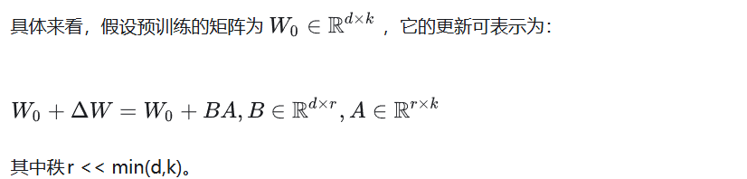

另外，**在原论文中提到过对于两个低秩矩阵，会用超参$ alpha$（一个常数）来做调整** ，**这个超参是作为scaling rate直接和低秩矩阵相乘的** ，也就是最终的输出为：

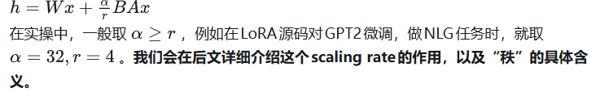

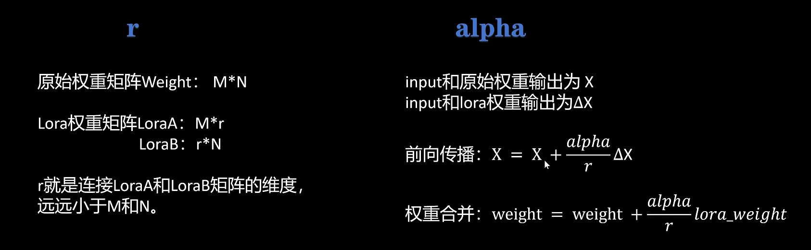

这种思想有点类似于残差连接，同时使用这个旁路的更新来模拟full finetuning的过程。并且，full finetuning可以被看做是LoRA的特例（当r等于k时）

该方法有如下优点：

◆ LoRA 通过大幅减少可训练参数数量，使微调更加效率。

◆ 基于 LoRA 的轻便型，可以构建多个轻量级 LoRA 模型用于不同下游任务

◆ LoRA 与许多其他参数有效方法正交，并且可以与其结合。

◆ 使用 LoRA 进行微调的模型的性能与完全微调模型的性能相当。

◆ LoRA 几乎不添加任何推理延迟，因为适配器权重可以与基本模型合并。

## 3.2 LoRA的训练和推理过程

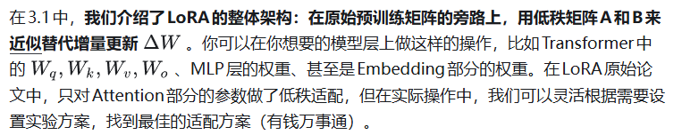

### **3.2.1 训练**

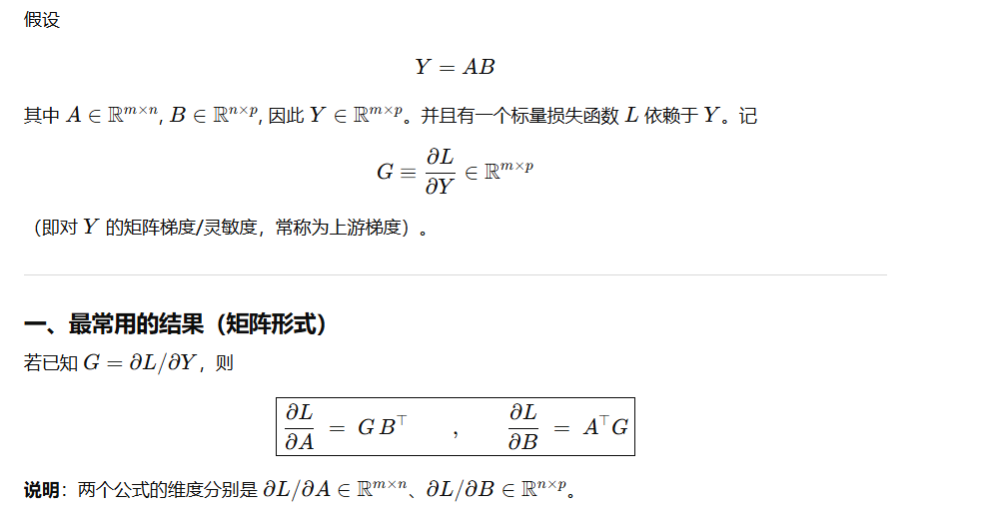

在**训练过程** 中，我们固定住预训练权重 W，只对低秩矩阵 A 和 B 进行训练。**在保存权重时，我们只需保存低秩矩阵的部分即可** 。

关于训练部分，我们再来看一个有趣的问题：总体上来看，LoRA对显存的节约是显著的，但是在训练的每一时刻，LoRA都能做到节省显存吗？

**猛猿版本**

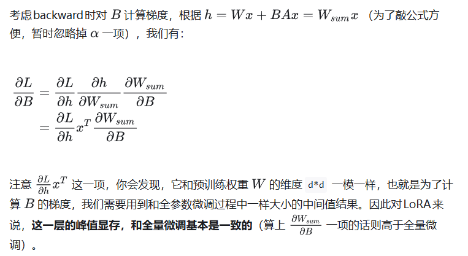

**LEONYi版本**

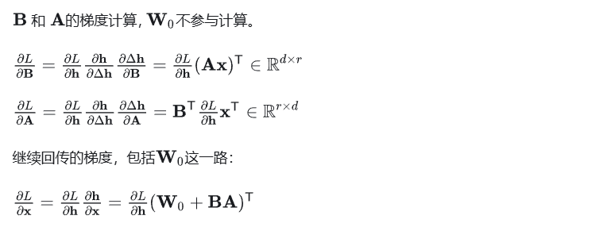

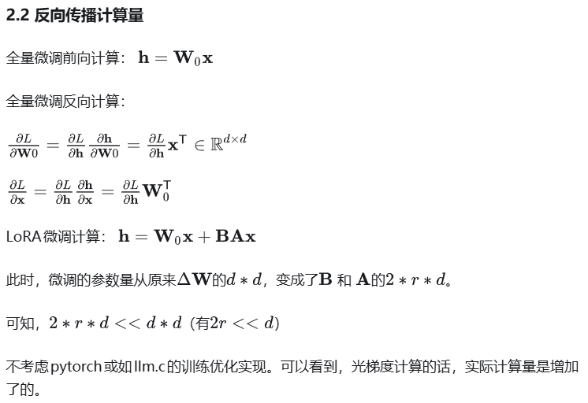

**但是为什么LoRA又能从整体上降低显存使用呢** ，因为：

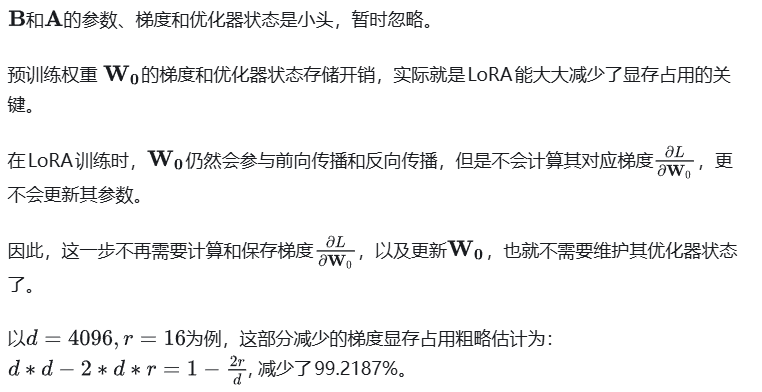

也就是说，加入LoRA训练的参数，对应的模型状态中的模型参数+梯度+优化器状态，节约了训练过程中优化器状态这部分的大头，引入了2个低秩矩阵的模型状态，这就是LoRA高效微调节约显存的原因。

* LoRA并不是作用在模型的每一层，例如论文里的LoRA只作用在attention部分
* LoRA虽然会导致某一层的峰值显存高于全量微调，但计算完梯度后，这个中间结果就可以被清掉了，不会一致保存
* **当待训练权重从 `d*d`降为 `2*r*d`时，需要保存的optimizer states也减少了（那可是fp32）。**

### **3.2.2 推理**

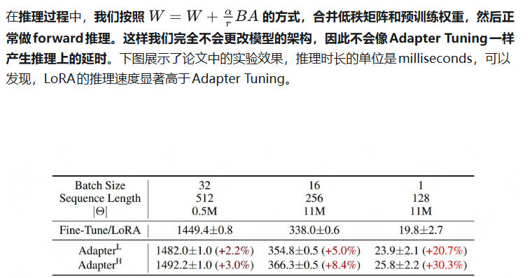

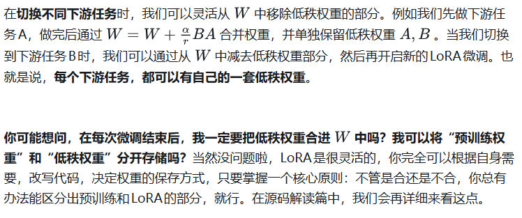

# 四、超参

## 4.1 α与α/r的意义

α 是一个固定常数，不参与反向传播。

在我们采用Adam做优化器时，调整的作用就相当于调整learning rate。一般而言，我们把设置 ` alpha`为我们第一次做实验时设置的r ，然后就把 `alpha`固定下来，之后只调整r即可，这样做的好处是当我们尝试不同的r时，我们不需要再去调整别的超参了。

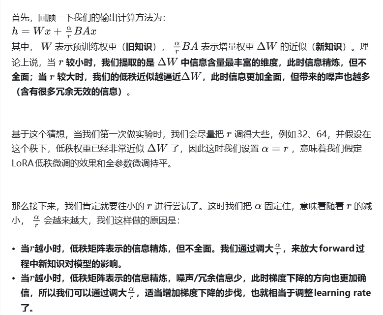

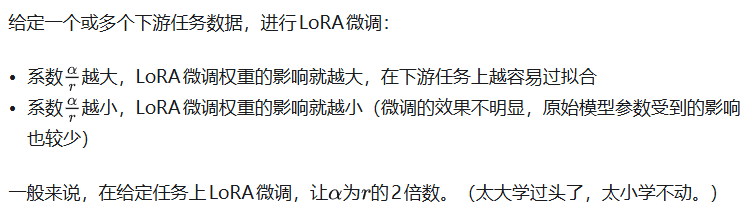

## 4.2 **LoRA的秩如何选择**

秩r成为了LoRA的超参数，随着秩维度的不断增加，参与训练的参数量也随之增加，LoRA的低秩适应能力将逐渐提高甚至过拟合。

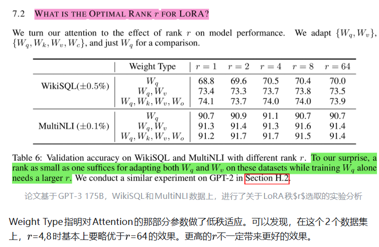

一些秩选取经验：

**微调的下游任务** ：
简单任务所需的秩r不大，任务越难/多任务混合的情况，需要更大的秩r

**基座能力** ：
越强的基座，所需的秩r应该更小。例如Qwen2-72B-Instruct对比Qwen2-7B-Instruct。

越强的基座在处理同等任务时，需要微调的样本数也通常会更少些。

**数据规模** ：
数据规模越大，需要更大的秩r
