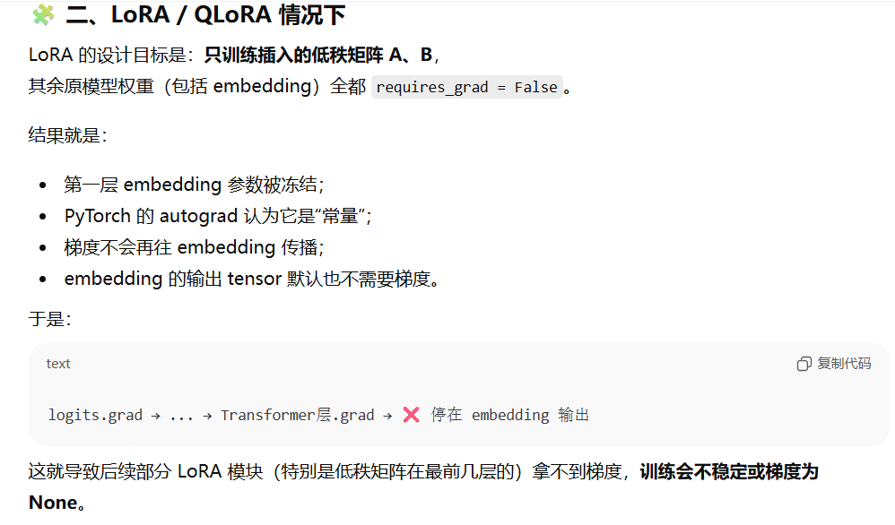
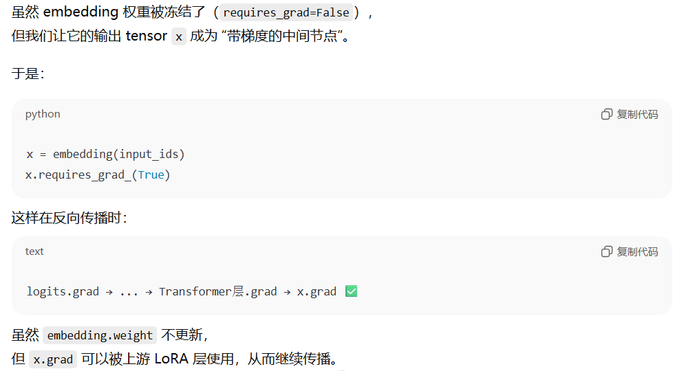
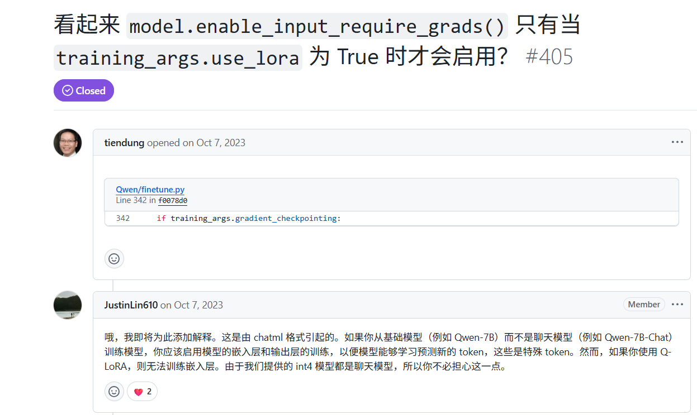

参考链接：

https://zhuanlan.zhihu.com/p/628232317

现阶段使用比较好的使用方式是 **[transformers](http://github.com/huggingface/transformers) + [Hugging peft](http://github.com/huggingface/peft) 进行低秩运算转换。**

安装

```powershell
pip install git+https://github.com/huggingface/peft.git
```

使用

```python3
from transformers import AutoModelForSeq2SeqLM
from peft import get_peft_config, get_peft_model, LoraConfig, TaskType
model_name_or_path = "bigscience/mt0-large"
tokenizer_name_or_path = "bigscience/mt0-large"

peft_config = LoraConfig(
    task_type=TaskType.SEQ_2_SEQ_LM, inference_mode=False, r=8, lora_alpha=32, lora_dropout=0.1
)

model = AutoModelForSeq2SeqLM.from_pretrained(model_name_or_path)
model = get_peft_model(model, peft_config)
model.print_trainable_parameters()
# output: trainable params: 2359296 || all params: 1231940608 || trainable%: 0.19151053100118282
```

**这里需要注意下，由于 peft 在支持上还有一些问题，使用 transformers 时，当配置 gradient\_checkpointing，需要配置 model.enable\_input\_require\_grads()。**

这里的问题是 LoRA 会冷冻 fine-tuning adapter weights，requires\_grad = False，反向传播时梯度会断。所以需要把模型的输出挂载上梯度。换句话说，模型第一层 embedding weights 的 requires\_grad = False，所以需要配置 model.enable\_input\_require\_grads()。参考 [issue](http://github.com/huggingface/peft/issues/137)




当你调用：

<pre class="overflow-visible!" data-start="753" data-end="801"><div class="contain-inline-size rounded-2xl relative bg-token-sidebar-surface-primary"><div class="sticky top-9"><div class="absolute end-0 bottom-0 flex h-9 items-center pe-2"><div class="bg-token-bg-elevated-secondary text-token-text-secondary flex items-center gap-4 rounded-sm px-2 font-sans text-xs"></div></div></div><div class="overflow-y-auto p-4" dir="ltr"><code class="whitespace-pre! language-python"><span><span>model.enable_input_require_grads()
</span></span></code></div></div></pre>

模型会在 **Embedding 层的前向传播** 上注册一个 *forward hook* ：

> 每次前向传播时，**强制让 Embedding 层的输出 tensor 开启梯度计算** 。






同时，如果使用 torchrun 启动训练，这时无论是否是多卡，transformers 会根据 local\_rank 启动 [DDP 训练](https://zhida.zhihu.com/search?content_id=227738794&content_type=Article&match_order=1&q=DDP+%E8%AE%AD%E7%BB%83&zhida_source=entity)。

transformers 源码

```python3
elif self.args.local_rank != -1:
    kwargs = {}
    if self.args.ddp_find_unused_parameters is not None:
        kwargs["find_unused_parameters"] = self.args.ddp_find_unused_parameters
    elif isinstance(model, PreTrainedModel):
        kwargs["find_unused_parameters"] = not model.is_gradient_checkpointing
    else:
        kwargs["find_unused_parameters"] = True
```

这里 kwargs\["find\_unused\_parameters"\] 会和 gradient\_checkpointing 冲突。故需要在 transformers 配置

时，把 ddp\_find\_unused\_parameters 设置 False。参考 [issue1](http://github.com/huggingface/peft/issues/313)，[issue2](http://github.com/huggingface/peft/issues/301)

**这里还有一点需要注意**，**由于 Hugging peft 默认将保存的 fine-tuning model 的配置文件增加** **"inference\_mode": true**，**如果还需要继续训练需要把这个选项删除。否则之前训练 frozen 的参数会有梯度，导致继续训练失败。**
