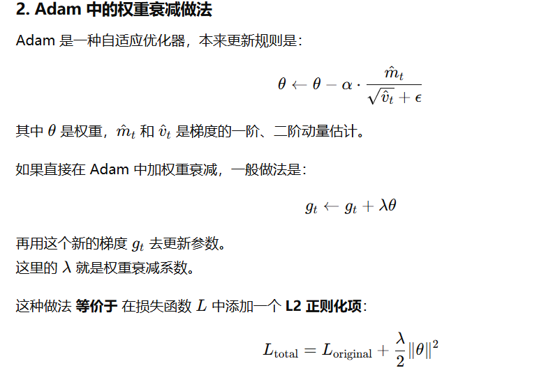
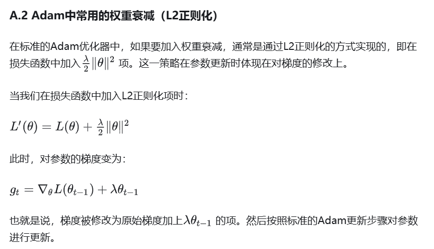

优化器类型：https://www.cnblogs.com/guoyaohua/p/8542554.html

移动平均和偏差修正：https://www.cnblogs.com/jiangxinyang/p/9705198.html

## Adam

https://www.cnblogs.com/wuliytTaotao/p/11101652.html

## AdamW：

权重衰减(Weight Decay): https://zhuanlan.zhihu.com/p/607909453

### adam和adamw区分

这篇文章写的不错（附录部分）   https://zhuanlan.zhihu.com/p/7272881104

AdamW

AdamW相对与Adam的改动十分简单，其将**权重衰减项从梯度的计算**中拿出来直接加在了**最后的权重更新步骤上**（式12）。其提出的动机在于：原先Adam的实现中如果采用了L2权重衰减，则相应的权重衰减项会被直接加在loss里，从而导致动量的一阶与二阶滑动平均均考虑了该权重衰减项（式6），而这影响了Adam的优化效果，而将权重衰减与梯度的计算进行解耦能够显著提升Adam的效果。目前，AdamW现在已经成为[transformer](https://zhida.zhihu.com/search?content_id=231119964&content_type=Article&match_order=1&q=transformer&zhida_source=entity)训练中的默认优化器了。（紫色绿色二选一就是两种算法）

