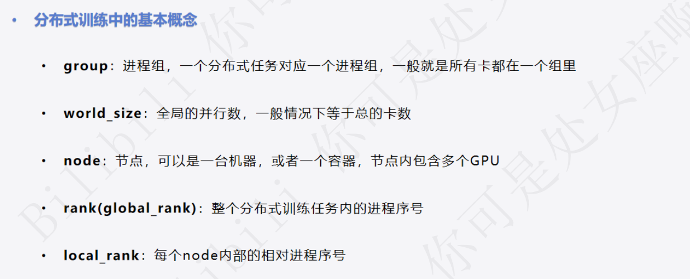

# 1 **DDP的代码修改部分：**

| 代码位置                                        | 功能说明                                                                       |
| ----------------------------------------------- | ------------------------------------------------------------------------------ |
| `dist.init_process_group(backend="nccl")`     | 初始化分布式训练环境（创建通信组），NCCL 是 GPU 上最常用的高性能通信后端。     |
| `DistributedSampler(trainset)`                | **数据划分** ：每个 GPU 只处理自己负责的数据子集，避免重复训练相同样本。 |
| `DistributedSampler(validset)`                | 验证集同样分布式划分。                                                         |
| `model = DDP(model)`                          | 将模型包装成 DDP 模型，负责自动同步梯度。                                      |
| `trainloader.sampler.set_epoch(ep)`           | 保证每个 epoch shuffle 不同，避免每轮都取相同数据。                            |
| `dist.all_reduce(loss, op=dist.ReduceOp.AVG)` | 将所有 GPU 上的 loss 求平均，只打印一次（rank=0）。                            |
| `dist.all_reduce(acc_num)`                    | 验证阶段同步各 GPU 的准确率计数。                                              |
| `print_rank_0(...)`                           | 只在主进程（rank=0）打印日志，避免多 GPU 重复输出。                            |

在 **分布式训练（Distributed Training）** 中，像 `local_rank`、`rank`、`world_size` 这些参数通常是 **由分布式启动器（launcher）自动传入的** ，并不是你自己在 Python 代码里手动设置的。下面我来详细解释一下它们的来源和作用

| 参数名         | 含义                                        | 示例                                    |
| -------------- | ------------------------------------------- | --------------------------------------- |
| `rank`       | 当前进程在所有进程中的全局编号（从 0 开始） | rank=0 表示主进程                       |
| `local_rank` | 当前进程在当前节点（机器）上的编号          | local_rank=0 通常是这台机器的第一个 GPU |
| `world_size` | 所有参与训练的进程总数（= 所有 GPU 数）     | 8 表示分布式共 8 个进程                 |

### 使用 `torchrun` 启动时：

<pre class="overflow-visible!" data-start="761" data-end="809">

<code class="whitespace-pre! language-bash">torchrun --nproc_per_node=4 train.py
</code>

</pre>

这条命令会自动为 4 个 GPU 启动 4 个进程，每个进程都会收到：

<pre class="overflow-visible!" data-start="847" data-end="899">

<code class="whitespace-pre!">LOCAL_RANK=0,1,2,3
RANK=0,1,2,3
WORLD_SIZE=4
</code>

</pre>

在代码中你就可以直接读取这些环境变量：

<pre class="overflow-visible!" data-start="921" data-end="1061">

<code class="whitespace-pre! language-python">import os
local_rank = int(os.environ["LOCAL_RANK"])
rank = int(os.environ["RANK"])
world_size = int(os.environ["WORLD_SIZE"])</code>

</pre>

# 2 accelerate代码修改

| 功能/代码位置         | DDP 原始代码                                                | Accelerate 改写                                                                        |
| --------------------- | ----------------------------------------------------------- | -------------------------------------------------------------------------------------- |
| 分布式初始化          | `dist.init_process_group(backend="nccl")`                 | `accelerator = Accelerator()`（自动处理分布式初始化）                                |
| 模型 GPU 指定         | `model.to(local_rank)`                                    | 不需要手动，`accelerator.prepare(model, ...)` 自动分配                               |
| 模型封装 DDP          | `model = DDP(model, device_ids=[local_rank])`             | 不需要手动，`accelerator.prepare(model, ...)` 自动封装                               |
| Optimizer 封装        | `optimizer = Adam(model.parameters())` + DDP 自动同步梯度 | 同样，`optimizer` 传给 `accelerator.prepare` 即可自动管理                          |
| DataLoader 分布式采样 | 使用 `DistributedSampler(train_dataset)`                  | 直接传给 `accelerator.prepare(trainloader, ...)`，自动处理 sampler 和分布式 batching |
| 将数据放到 GPU        | `batch = {k: v.to(local_rank) for k,v in batch.items()}`  | 不需要手动，Accelerate 自动处理                                                        |
| 反向传播              | `loss.backward()` + DDP 自动同步梯度                      | `accelerator.backward(loss)`                                                         |
| 统计 / 打印           | `if local_rank==0: print(...)`                            | `accelerator.print(...)`（自动只在 rank0 打印）                                      |
| 多 GPU 指标聚合       | `dist.all_reduce(acc_num)`                                | `accelerator.gather_for_metrics(...)` 自动收集、同步各 GPU 数据                      |
|                                                                                                                                                                      
| Loss 聚合             | `dist.all_reduce(loss, op=dist.ReduceOp.AVG)`             | `loss = accelerator.reduce(loss, "mean")`                                            |
