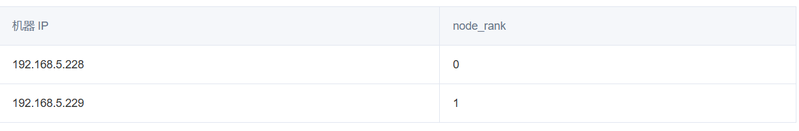
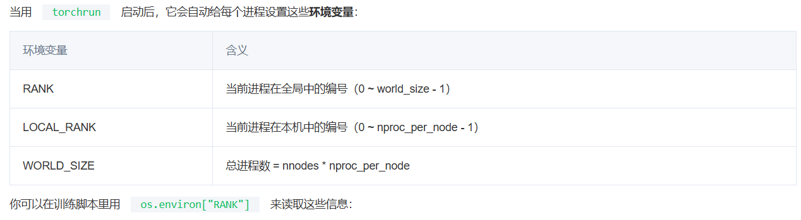
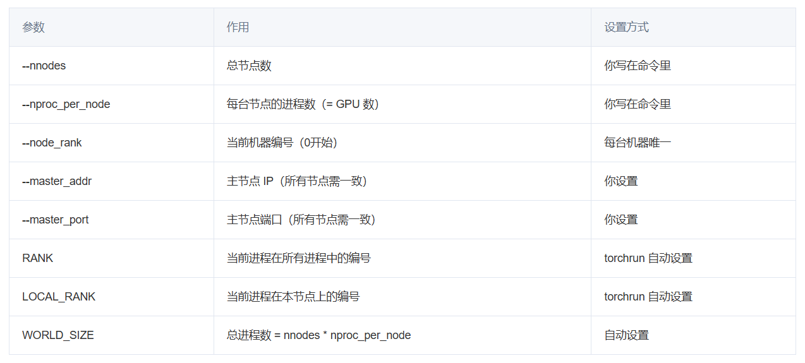
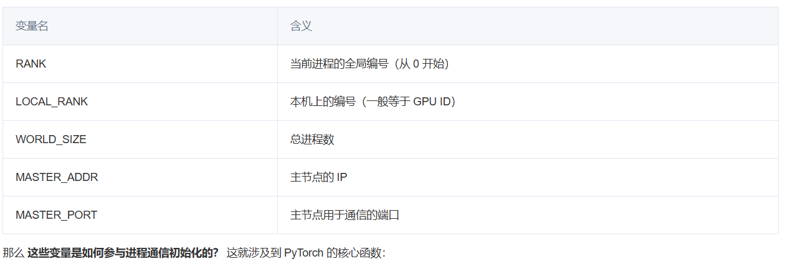

参考链接：

https://cloud.tencent.com/developer/article/2514642

---

> torchrun 与 torch.multiprocessing.spawn 的对比可以看这篇： [【知识】torchrun 与 torch.multiprocessing.spawn 的对比](/developer/tools/blog-entry?target=https%3A%2F%2Fblog.csdn.net%2Fsxf1061700625%2Farticle%2Fdetails%2F145916326&objectId=2514642&objectType=1&contentType=undefined)

**`torchrun`**
---

### 一、什么是 `torchrun`

`torchrun` 是 PyTorch 官方推荐的分布式训练启动器，它的作用是：

* 启动**多进程分布式训练**（支持多[GPU](https://cloud.tencent.com/product/gpu?from_column=20065&from=20065)，多节点）
* 自动设置每个进程的环境变量
* 协调节点之间建立通信

### 二、`torchrun` 的核心参数讲解

```javascript
torchrun \
  --nnodes=2 \
  --nproc_per_node=2 \
  --node_rank=0 \
  --master_addr=192.168.5.228 \
  --master_port=29400 \
  xxx.py
```


**🔹 1. `--nnodes`（Number of Nodes）**

* 表示**参与训练的总机器数**。
* 你有几台[服务器](https://cloud.tencent.com/product/cvm?from_column=20065&from=20065)，就写几。
* 在分布式训练中，**一个 node 就是一台物理或虚拟的主机。**
* node的编号从**0**开始。

✅ 例子：你用 2 台机器 → `--nnodes=2`

---

**🔹 2. `--nproc_per_node`（Processes Per Node）**

* 表示每台机器上要启动几个训练进程。
* 一个进程对应一个 GPU，因通常设置为你机器上要用到的GPU数。
* 因此，整个分布式环境下，总训练进程数 =`nnodes * nproc_per_node`

✅ 例子：每台机器用了 2 张 GPU → `--nproc_per_node=2`

---

**🔹 3. `--node_rank`**

* 表示当前机器是**第几台机器**。
* 从 0 开始编号，**必须每台机器都不同！**



---

**🔹 4. `--master_addr` 和 `--master_port`**

* 指定**主节点的 IP 和端口**，用于 rendezvous（进程对齐）和通信初始化。
* 所有机器必须填写相同的值！

✅ 建议：

* `master_addr` 就是你指定为主节点的那台机器的 IP
* `master_port` 选一个未被占用的端口，比如 29400

### 三、torchrun 会自动设置的环境变量



```javascript
import os
rank = int(os.environ["RANK"])
local_rank = int(os.environ["LOCAL_RANK"])
world_size = int(os.environ["WORLD_SIZE"])
```


> 示例分配图：


### 四、torchrun 启动过程举例

假设：

* 有 2 台机器
* 每台机器有 2 个 GPU
* 总共会启动 4 个进程

#### 机器 A（node\_rank=0）上运行

```javascript
torchrun \
  --nnodes=2 \
  --nproc_per_node=2 \
  --node_rank=0 \
  --master_addr=192.168.5.228 \
  --master_port=29400 \
  xxx.py
```


#### 机器 B（node\_rank=1）上运行

```javascript
torchrun \
  --nnodes=2 \
  --nproc_per_node=2 \
  --node_rank=1 \
  --master_addr=192.168.5.228 \
  --master_port=29400 \
  xxx.py
```


**torchrun 给每个进程编号的顺序（分配 RANK / LOCAL\_RANK）**

torchrun 按照每台机器上 `node_rank` 的顺序，**并在每台机器上**依次启动 `LOCAL_RANK=0, 1, ..., n-1`，最后合成 `RANK。`

```javascript
RANK = node_rank × nproc_per_node + local_rank
```

---

本质上：`torchrun` 是主从结构调度的

* 所有 node 启动后，都会和`master_addr` 通信。
* master 会统一收集所有 node 的状态。
* 每个 node 根据你给的`node_rank` 自行派生`local_rank=0~n-1`
* 所有节点通过`RANK = node_rank * nproc_per_node + local_rank` 得到自己的全局编号。

这个机制是 **可预测、可控、可复现** 的。

---

📦 node\_rank=0 (机器 1) ├── local\_rank=0 → RANK=0 └── local\_rank=1 → RANK=1 📦 node\_rank=1 (机器 2) ├── local\_rank=0 → RANK=2 └── local\_rank=1 → RANK=3

### 五、小结表格



---

PyTorch
-------

PyTorch 的分布式通信是如何通过 `init_process_group` 与 `torchrun` 生成的环境变量配合起来工作的。

### 一、背景回顾

你已经用 `torchrun` 启动了多个训练进程，并且 `torchrun` 为每个进程自动设置了这些环境变量：



---

### 二、`init_process_group`

`torch.distributed.init_process_group` 是 PyTorch 初始化分布式通信的入口：

```javascript
torch.distributed.init_process_group(
    backend="nccl",  # 或者 "gloo"、"mpi"
    init_method="env://",  # 通过环境变量读取设置
)
```

**关键点：**

* `backend="nccl"`：推荐用于 GPU 分布式通信（高性能）
* `init_method="env://"`：表示**通过环境变量来初始化**

---

**你不需要自己设置 `RANK` / `WORLD_SIZE` / `MASTER_ADDR`，只要写：**

```javascript
import torch.distributed as dist

dist.init_process_group(backend="nccl", init_method="env://")
```

PyTorch 会自动去环境中读这些变量：

* `RANK` → 当前进程编号
* `WORLD_SIZE` → 总进程数
* `MASTER_ADDR`、`MASTER_PORT` → 主节点 IP 和端口

然后就能正确初始化所有通信进程。

### 三、脚本中通常的典型写法

```javascript
import os
import torch

# 初始化 PyTorch 分布式通信环境
torch.distributed.init_process_group(backend="nccl", init_method="env://")

# 获取全局/本地 rank、world size
rank = int(os.environ.get("RANK", -1))
local_rank = int(os.environ.get("LOCAL_RANK", -1))
world_size = int(os.environ.get("WORLD_SIZE", -1))

# 设置 GPU 显卡绑定 
# 设置当前进程所使用的 默认 GPU 设备。
torch.cuda.set_device(local_rank)
device = torch.device("cuda")

# 打印绑定信息
print(f"[RANK {rank} | LOCAL_RANK {local_rank}] Using CUDA device {torch.cuda.current_device()}: {torch.cuda.get_device_name(torch.cuda.current_device())} | World size: {world_size}")
```


这段代码在所有进程中都一样写，但每个进程启动时带的环境变量不同，所以最终 `rank`、`local_rank`、`world_size` 就自然不同了。

通用启动脚本
------------

```javascript
#!/bin/bash

# 设置基本参数
MASTER_ADDR=192.168.5.228           # 主机IP
MASTER_PORT=29400                   # 主机端口
NNODES=2                            # 参与训练的总机器数
NPROC_PER_NODE=2                    # 每台机器上的进程数

# 所有网卡的IP地址，用于筛选
ALL_LOCAL_IPS=$(hostname -I)
# 根据本机 IP 配置通信接口
if [[ "$ALL_LOCAL_IPS" == *"192.168.5.228"* ]]; then
  NODE_RANK=0                       # 表示当前机器是第0台机器
  IFNAME=ens1f1np1  
  mytorchrun=~/anaconda3/envs/dglv2/bin/torchrun
elif [[ "$ALL_LOCAL_IPS" == *"192.168.5.229"* ]]; then
  NODE_RANK=1                       # 表示当前机器是第1台机器
  IFNAME=ens2f1np1
  mytorchrun=/opt/software/anaconda3/envs/dglv2/bin/torchrun
else
  exit 1
fi

# 设置 RDMA 接口
export NCCL_IB_DISABLE=0            # 是否禁用InfiniBand
export NCCL_IB_HCA=mlx5_1           # 使用哪个RDMA接口进行通信
export NCCL_SOCKET_IFNAME=$IFNAME   # 使用哪个网卡进行通信
export NCCL_DEBUG=INFO              # 可选：调试用
export GLOO_IB_DISABLE=0            # 是否禁用InfiniBand
export GLOO_SOCKET_IFNAME=$IFNAME   # 使用哪个网卡进行通信
export PYTHONUNBUFFERED=1           # 实时输出日志

# 启动分布式任务
$mytorchrun \
  --nnodes=$NNODES \
  --nproc_per_node=$NPROC_PER_NODE \
  --node_rank=$NODE_RANK \
  --master_addr=$MASTER_ADDR \
  --master_port=$MASTER_PORT \
  cluster.py

## 如果想获取准确报错位置，可以加以下内容，这样可以同步所有 CUDA 操作，错误不会“延迟触发”，你会看到确切是哪一行代码出了问题：
## CUDA_LAUNCH_BLOCKING=1 torchrun ...
```


