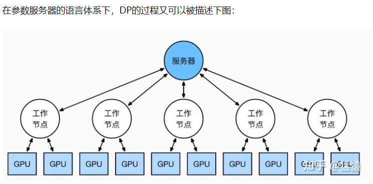
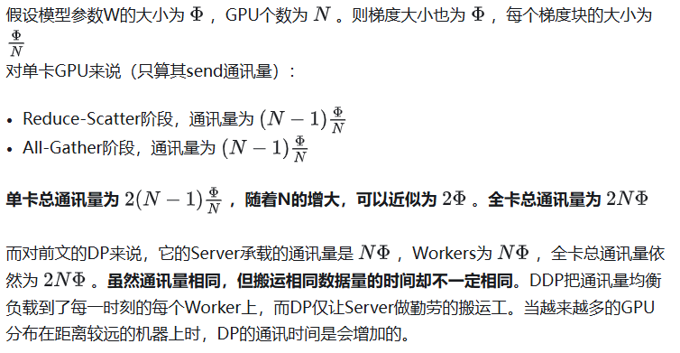

在上一篇的介绍中，我们介绍了以Google GPipe为代表的流水线并行范式。当模型太大，一块GPU放不下时，流水线并行将模型的不同层放到不同的GPU上，通过切割mini-batch实现对训练数据的流水线处理，提升GPU计算通讯比。同时通过re-materialization机制降低显存消耗。

但在实际应用中，流水线并行并不特别流行，主要原因是模型能否均匀切割，影响了整体计算效率，这就需要算法工程师做手调。因此，今天我们来介绍一种应用最广泛，最易于理解的并行范式：数据并行。

数据并行的核心思想是：在各个GPU上都拷贝一份完整模型，各自吃一份数据，算一份梯度，最后对梯度进行累加来更新整体模型。理念不复杂，但到了大模型场景，巨大的存储和GPU间的通讯量，就是系统设计要考虑的重点了。

* **DP（Data Parallelism）** ：最早的数据并行模式，一般采用参数服务器(Parameters Server)这一编程框架。实际中多用于单机多卡
* **DDP（Distributed Data Parallelism）** ：分布式数据并行，采用Ring AllReduce的通讯方式，实际中多用于多机场景

# 1 数据并行 DP

一个经典数据并行的过程如下：

* 若干块**计算GPU** ，如图中GPU0~GPU2；1块**梯度收集GPU** ，如图中AllReduce操作所在GPU。
* 在每块计算GPU上都拷贝一份完整的模型参数。
* 把一份数据X（例如一个batch）均匀分给不同的计算GPU。
* 每块计算GPU做一轮FWD和BWD后，算得一份梯度G。
* 每块计算GPU将自己的梯度**push** 给梯度收集GPU，做聚合操作。这里的聚合操作一般指**梯度累加** 。当然也支持用户自定义。
* 梯度收集GPU聚合完毕后，计算GPU从它那**pull** 下完整的梯度结果，用于更新模型参数W。更新完毕后，计算GPU上的模型参数依然保持一致。
* **聚合再下发梯度的操作，称为AllReduce** 。

前文说过，实现DP的一种经典编程框架叫“参数服务器”，在这个框架里，**计算GPU称为Worker** ，**梯度聚合GPU称为Server。** 在实际应用中，为了尽量减少通讯量，一般可选择一个Worker同时作为Server。比如可把梯度全发到GPU0上做聚合。需要再额外说明几点：

* 1个Worker或者Server下可以不止1块GPU。
* Server可以只做梯度聚合，也可以梯度聚合+全量参数更新一起做

## 问题 （通讯瓶颈与梯度异步更新

DP的框架理解起来不难，但实战中确有两个主要问题：

* **存储开销大** 。每块GPU上都存了一份完整的模型，造成冗余。关于这一点的优化，我们将在后文ZeRO部分做讲解。
* **通讯开销大** 。Server需要和每一个Worker进行梯度传输。当Server和Worker不在一台机器上时，Server的带宽将会成为整个系统的计算效率瓶颈。

我们对通讯开销再做详细说明。如果将传输比作一条马路，带宽就是马路的宽度，它决定每次并排行驶的数据量。例如带宽是100G/s，但每秒却推给Server 1000G的数据，消化肯定需要时间。那么当Server在搬运数据，计算梯度的时候，Worker们在干嘛呢？当然是在：

摸鱼!

人类老板不愿意了：“打工系统里不允许有串行存在的任务！”，于是**梯度异步更新** 这一管理层略诞生了。

上图刻画了在**梯度异步更新** 的场景下，某个Worker的计算顺序为：

* 在第10轮计算中，该Worker正常计算梯度，并向Server发送push&pull梯度请求。
* 但是，该Worker并不会实际等到把聚合梯度拿回来，更新完参数W后再做计算。而是直接拿旧的W，吃新的数据，继续第11轮的计算。**这样就保证在通讯的时间里，Worker也在马不停蹄做计算，提升计算通讯比。**
* 当然，异步也不能太过份。只计算梯度，不更新权重，那模型就无法收敛。图中刻画的是**延迟为1** 的异步更新，也就是在开始第12轮对的计算时，必须保证W已经用第10、11轮的梯度做完2次更新了。

参数服务器的框架下，延迟的步数也可以由用户自己决定，下图分别刻划了几种延迟情况：

* **(a) 无延迟**
* **(b) 延迟但不指定延迟步数** 。也即在迭代2时，用的可能是老权重，也可能是新权重，听天由命。
* **(c) 延迟且指定延迟步数为1** 。例如做迭代3时，可以不拿回迭代2的梯度，但必须保证迭代0、1的梯度都已拿回且用于参数更新。

总结一下，**异步很香，但对一个Worker来说，只是等于W不变，batch的数量增加了而已，在SGD下，会减慢模型的整体收敛速度** 。异步的整体思想是，比起让Worker闲着，倒不如让它多吃点数据，虽然反馈延迟了，但只要它在干活在学习就行。
batch就像活，异步就像画出去的饼，且往往不指定延迟步数，每个Worker干越来越多的活，但模型却没收敛取效，这又是刺伤了哪些打工仔们的心（狗头

# 2 分布式数据并行 DDP

受通讯负载不均的影响，**DP一般用于单机多卡场景** 。因此，DDP作为一种更通用的解决方案出现了，既能多机，也能单机。**DDP首先要解决的就是通讯问题：将Server上的通讯压力均衡转到各个Worker上。实现这一点后，可以进一步去Server，留Worker。**

前文我们说过，聚合梯度 + 下发梯度这一轮操作，称为AllReduce。**接下来我们介绍目前最通用的AllReduce方法：Ring-AllReduce** 。它由百度最先提出，非常有效地解决了数据并行中通讯负载不均的问题，使得DDP得以实现。

## 2.1 Ring-AllReduce

如下图，假设有4块GPU，每块GPU上的数据也对应被切成4份。AllReduce的最终目标，就是让每块GPU上的数据都变成箭头右边汇总的样子。

Ring-ALLReduce则分两大步骤实现该目标：**Reduce-Scatter** 和**All-Gather。**

### **Reduce-Scatter**

定义网络拓扑关系，使得每个GPU只和其相邻的两块GPU通讯。每次发送对应位置的数据进行**累加** 。每一次累加更新都形成一个拓扑环，因此被称为Ring。看到这觉得困惑不要紧，我们用图例把详细步骤画出来。

**3次** 更新之后，每块GPU上都有一块数据拥有了对应位置完整的聚合（图中红色）。此时，Reduce-Scatter阶段结束。进入All-Gather阶段。目标是把红色块的数据广播到其余GPU对应的位置上。

### **All-Gather**

如名字里Gather所述的一样，这操作里依然按照“相邻GPU对应位置进行通讯”的原则，但对应位置数据不再做相加，而是直接替换。All-Gather以红色块作为起点。

以此类推，同样经过**3轮迭代后** ，使得每块GPU上都汇总到了完整的数据。

## 2.2 Ring-AllReduce通讯量分析

最后，**请大家记住Ring-AllReduce的方法，因为在之后的ZeRO，Megatron-LM中，它将频繁地出现，是分布式训练系统中重要的算子。**

# 3 总结

1、在DP中，每个GPU上都拷贝一份完整的模型，每个GPU上处理batch的一部分数据，所有GPU算出来的梯度进行累加后，再传回各GPU用于更新参数

2、DP多采用参数服务器这一编程框架，一般由若个计算Worker和1个梯度聚合Server组成。Server与每个Worker通讯，Worker间并不通讯。因此Server承担了系统所有的通讯压力。基于此DP常用于单机多卡场景。

3、异步梯度更新是提升计算通讯比的一种方法，延迟更新的步数大小决定了模型的收敛速度。

4、Ring-AllReduce通过定义网络环拓扑的方式，将通讯压力均衡地分到每个GPU上，使得跨机器的数据并行（DDP）得以高效实现。

5、DP和DDP的总通讯量相同，但因负载不均的原因，DP需要耗费更多的时间搬运数据
