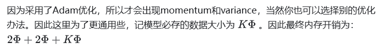
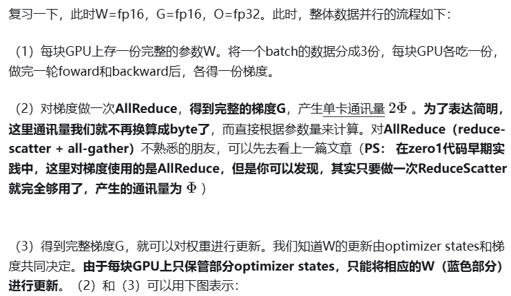
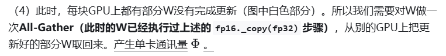
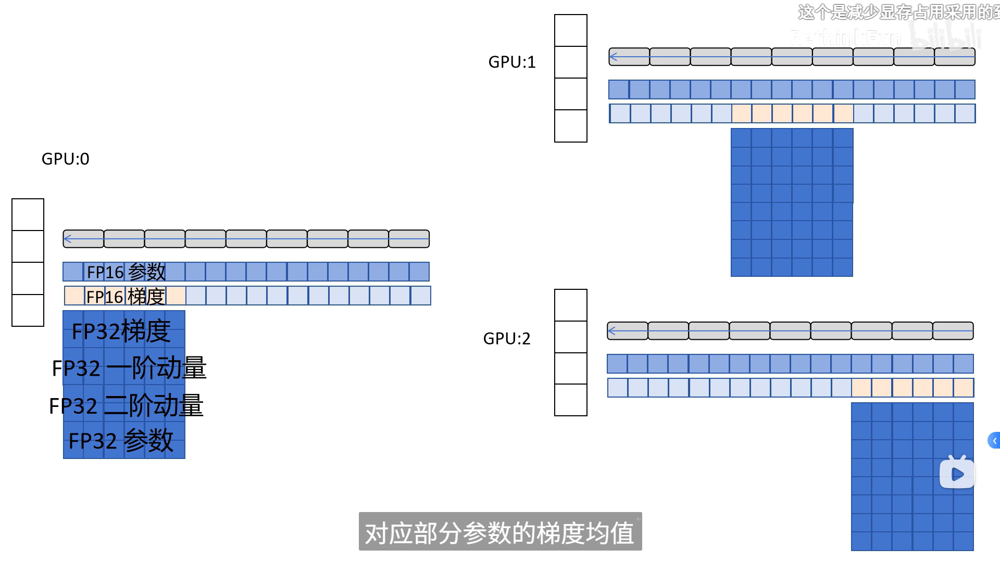
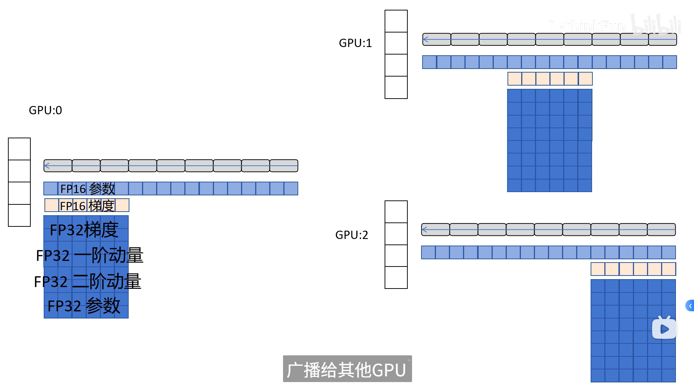
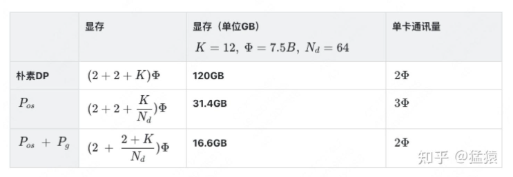
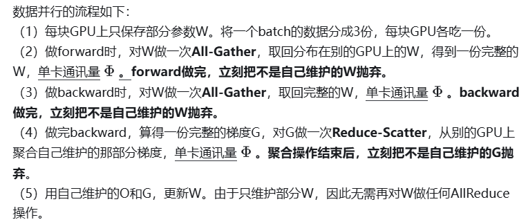
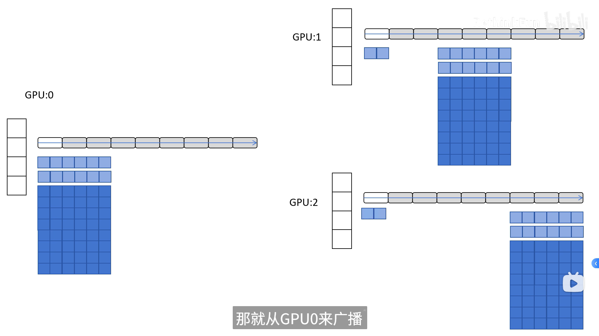

ZeRO：零冗余优化器。由微软推出并应用于其DeepSpeed框架中。严格来讲ZeRO采用数据并行+张量并行的方式，旨在降低存储

在数据并行上篇中，我们介绍了朴素数据并行（DP）与分布式数据并行（DDP）。两者的总通讯量虽然相同，但DP存在负载不均的情况，大部分的通讯压力集中在Server上，而Server的通讯量与GPU数量呈线性关系，导致**DP** 一般适用于**单机多卡** 场景。而**DDP** 通过采用**Ring-AllReduce** 这一NCCL操作，使得通讯量均衡分布到每块GPU上，且该通讯量为一固定常量，不受GPU个数影响，因此可实现**跨机器** 的训练。

在上篇介绍中，通讯负载不均的优化我们解释过了，但还遗留了一个显存开销问题：数据并行中，每个GPU上都复制了一份完整模型，当模型变大时，很容易打爆GPU的显存，那要怎么办呢？

今天这篇文章，我们将介绍由微软开发的ZeRO（零冗余优化），它是DeepSpeed这一分布式训练框架的核心，被用来解决大模型训练中的显存开销问题。ZeRO的思想就是用通讯换显存。如果初读ZeRO，觉得它逻辑跳跃，晦涩难懂，那么这篇文章或许可以帮到你～

# 一、存储消耗

## 1.1 存储分类

首先，我们来看在大模型训练的过程中，GPU都需要存什么内容。

存储主要分为两大块：Model States和Residual States
**Model States** 指和模型本身息息相关的，必须存储的内容，具体包括：

optimizer states：Adam优化算法中的momentum和variance
gradients：模型梯度
parameters：模型参数W

**Residual States** 指并非模型必须的，但在训练过程中会额外产生的内容，具体包括：

activation：激活值。在流水线并行中我们曾详细介绍过。在backward过程中使用链式法则计算梯度时会用到。有了它算梯度会更快，但它不是必须存储的，因为可以通过重新做Forward来算它。
temporary buffers: 临时存储。例如把梯度发送到某块GPU上做加总聚合时产生的存储。
unusable fragment memory：碎片化的存储空间。虽然总存储空间是够的，但是如果取不到连续的存储空间，相关的请求也会被fail掉。对这类空间浪费可以通过内存整理来解决。

## 1.2 精度混合训练

这部分后续详细学习下

知道了存储分类，进一步，我们想知道，假设模型的参数W大小是$\Phi $，那么每一类存储具体占了多大的空间呢？

在分析这个问题前，我们需要来了解**精度混合训练**。
对于模型，我们肯定希望其参数越精准越好，也即我们用**fp32（单精度浮点数，存储占4byte）** 来表示参数W。但是在forward和backward的过程中，fp32的计算开销也是庞大的。那么能否在计算的过程中，引入**fp16或bf16（半精度浮点数，存储占2byte）** ，来减轻计算压力呢？于是，混合精度训练就产生了，它的步骤如下图：

* 存储一份fp32的parameter，momentum和variance（统称model states）
* 在forward开始之前，额外开辟一块存储空间，将fp32 parameter减半到fp16 parameter。
* 正常做forward和backward，在此之间产生的activation和gradients，都用fp16进行存储。
* 用fp16 gradients去更新fp32下的model states。
* 当模型收敛后，fp32的parameter就是最终的参数输出。

通过这种方式，混合精度训练在计算开销和模型精度上做了权衡。

## 1.3 存储大小

现在，我们可以来计算模型在训练时需要的存储大小了，假设模型的参数W大小是$\Phi $，**以byte为单位** ，存储如下：

也就是论文里用的大小

另外，**这里暂不将activation纳入统计范围** ，原因是：

* activation不仅与模型参数相关，还与**batch size**相关
* activation的存储不是必须的。存储activation只是为了在用链式法则做backward的过程中，计算梯度更快一些。但你永远可以通过只保留最初的输入X，重新做forward来得到每一层的activation（虽然实际中并不会这么极端）。
* 因为activation的这种灵活性，纳入它后不方便衡量系统性能随模型增大的真实变动情况。因此在这里不考虑它，在后面会单开一块说明对activation的优化。

# 二、ZeRO-DP

知道了什么东西会占存储，以及它们占了多大的存储之后，我们就可以来谈如何优化存储了。
注意到，在整个训练中，有很多states并不会每时每刻都用到，举例来说；

* Adam优化下的optimizer states只在最终做update时才用到
* 数据并行中，gradients只在最后做AllReduce和updates时才用到
* 参数W只在做forward和backward的那一刻才用到
* 诸如此类

所以，ZeRO想了一个简单粗暴的办法：**如果数据算完即废，等需要的时候，我再想办法从个什么地方拿回来，那不就省了一笔存储空间吗？**
沿着这个思路，我们逐一来看ZeRO是如何递进做存储优化的。（通讯换显存 把上面的全给我优化掉！

## 2.1 **：优化状态分割** Zero-1

首先，从 optimizer state开始优化。将optimizer state分成若干份，每块GPU上各自维护一份。这样就减少了相当一部分的显存开销。如下图：

**实际上，zero1并不是直接更新蓝色权重（fp16），而是直接更新红色优化器中维护的权重(fp32)，蓝色权重是由红色权重cast而来（参见本文1.2节）**

### 总结

GPU0-2 更新前中后层的网络参数w （1）GPU0和1把后层的参数发给GPU2 其他一致 （2）获得梯度均值后转为FP32 （3）然后更新FP32的参数（优化器中）（4）接下来更新FP16的网络参数 （5）然后再广播到其他网络

通讯量其实是2$\Phi$

## 2.2：优化状态与梯度分割 Zero-2

现在，更近一步，我们把梯度也拆开，每个GPU格子维护一块梯度。

此时，数据并行的整体流程如下：
（1）每块GPU上存一份完整的参数W。将一个batch的数据分成3份，每块GPU各吃一份，做完一轮foward和backward后，**算得一份完整的梯度（下图中绿色+白色）** 。
（2）对梯度做一次**Reduce-Scatter** ，保证每个GPU上所维持的那块梯度是聚合梯度。例如对GPU1，它负责维护G1，因此其他的GPU只需要把G1对应位置的梯度发给GPU1做加总就可。汇总完毕后，白色块对GPU无用，可以从显存中移除。单卡通讯量$\Phi$ 。（1）和（2）见下图：

（3）每块GPU用自己对应的O和G去更新相应的W。更新完毕后，**每块GPU维持了一块更新完毕的W** 。同理，对W做一次**All-Gather** ，将别的GPU算好的W同步到自己这来。单卡通讯量 $\Phi$**。**

### 总结

升级后梯度也分开 GPU只保存只需要的梯度 从后到前更新梯度 按照桶的形式发送给负责更新的GPU 其他的发送后就释放显存 这样每个GPU都有了梯度 然后更新优化器状态、优化器更新FP16参数、再广播参数即可（与上面一致）

## 2.3：优化状态、梯度与参数分割 Zero-3

参数也分开

### 总结

参数也划分了 前向传播遇到自己没有的参数就靠其他的GPU广播 后向也是

## 2.4 总结

*仔细一想，ZeRO其实掌握了降本增效的精髓：用完即弃，需要再补。反正我补一个和你差不多的，也不会花费很多通（找）讯（人）时间，还大大降低了我的成本。模型的每一层多算（造）几（轮）遍（子）有啥关系呢，反正在我的预算里每个人都一刻不停地干活，就行啦！*

### **ZeRO VS 模型并行**

知道模型并行的朋友，可能会想，既然ZeRO都把参数W给切了，那它应该是个模型并行呀？为什么要归到数据并行里呢？
其实**ZeRO是模型并行的形式，数据并行的实质** 。

模型并行，是指在forward和backward的过程中，我只需要用自己维护的那块W来计算就行。即**同样的输入X，每块GPU上各算模型的一部分，最后通过某些方式聚合结果** 。

但对ZeRO来说，它做forward和backward的时候，是需要把各GPU上维护的W聚合起来的，即本质上还是用完整的W进行计算。**它是不同的输入X，完整的参数W，最终再做聚合** 。

# 三、ZeRO-R

说完了以上对model states的显存优化，现在来看对residual states的优化。

## 3.1 Partitioned Activation Checkpointing**

前面说过，对activation的存储是灵活的。不像optimizer states，gradients和parameters对模型更新是必须的，activation只是起到加速梯度计算的作用。因此，在哪几层保存activation，保存哪些activation都是可以灵活设置的。同样，我们也可以仿照以上切割方式，每块GPU上只维护部分的activation，需要时再从别的地方聚合过来就行。需要注意的是，activation对显存的占用一般会远高于模型本身，通讯量也是巨大的，所以这块要灵活、有效地实验设计。

## 3.2 : Constant Size Buffer**

固定大小的内存buffer，它的目的在于：

* 提升带宽利用率。当GPU数量上升，GPU间的通讯次数也上升，每次的通讯量可能下降（但总通讯量不会变）。数据切片小了，就不能很好利用带宽了。所以这个buffer起到了积攒数据的作用：等数据积攒到一定大小，再进行通讯。
* 使得存储大小可控。在每次通讯前，积攒的存储大小是常量，是已知可控的。更方便使用者对训练中的存储消耗和通讯时间进行预估。

## 3.3 : Memory Defragmentation

在前文提过，设置机制，对碎片化的存储空间进行重新整合，整出连续的存储空间。防止出现总存储足够，但连续存储不够而引起的存储请求fail
