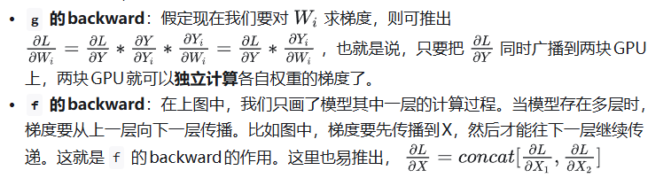
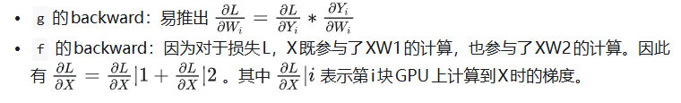
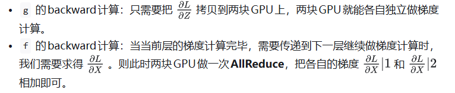
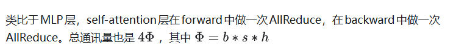
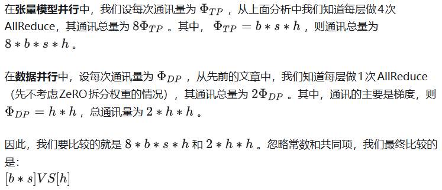

在之前的内容中，我们已经介绍过流水线并行、数据并行（DP，DDP和ZeRO）。**今天我们将要介绍最重要，也是目前基于Transformer做大模型预训练最基本的并行范式：来自NVIDIA的张量模型并行(TP)**。它的基本思想就是把模型的参数纵向切开，放到不同的GPU上进行独立计算，然后再做聚合。

在读Megatron的过程中，我发现要理解Megatron的大框架不难，但是涉及到细节，特别是混合并行部分，要考虑的就很多了。**所以我去看了Megatron的源码，在此基础上配合图例写了这篇文章，其中的很多设计思想和细节就来自对源码的阅读**。既然看都看了，因此我决定**在大模型系列的下一章里，和大家一起阅读Megatron的源码**。毕竟手动并行不像调API那样简单，需要根据实际模型设计并行框架，并知道在哪里打日志，做checkpoint。

如果对Transformer的设计不了解也没关系，在这篇文章里都会给出图解介绍，不过还是建议大家在阅读前可先看以下文章：

* [猛猿：Transformer学习笔记二：Self-Attention（自注意力机制）](https://zhuanlan.zhihu.com/p/455399791)
* [猛猿：图解大模型训练之：数据并行上篇(DP, DDP与ZeRO)](https://zhuanlan.zhihu.com/p/617133971)，这篇中对AllReduce通信有详细讲解。

顺便，Megatron，变形金刚反派队伍霸天虎首领

# 一、切分权重

设输入数据为X，参数为W。X的维度 = (b, s, h)，W的维度 = (h, h')。其中：

* `b`：batch\_size，表示批量大小
* `s`：sequence\_length，表示输入序列的长度
* `h`：hidden\_size，表示每个token向量的维度。
* `h'`：参数W的hidden\_size。

则每次forward的过程如下：

为画图方便，图中所绘是 `b=1`时的情况。假设现在W太大，导致单卡装不下。我们需要把W切开放到不同的卡上，则我们面临三个主要问题：

* 怎么切分W。
* 切完W后，怎么做forward。
* 做完forward后，怎么做backward，进而求出梯度，更新权重。

一般来说，我们可以沿着W的行（h维度），或者列（h'维度）切分W。下面我们分别介绍这两种切割办法，并说明它们是如何做forward和backward的。

## 1.1 按行切分权重

**(1) forward**

我们用 `N`来表示GPU的数量。有几块GPU，就把W按行维度切成几份。下图展示了N=2时的切割方式：

W按照行维度切开后，X的维度和它不对齐了，这可怎么做矩阵乘法呢？很简单，再把X“按列切开”就行了，如下图所示：

**(2) backward**

做完forward，取得预测值Y，进而可计算出损失L，接下来就能做backward了。我们重画一下forward的过程，并在其中加入backward的部分，整体流程图如下：

* **`f` 和 `g`**：分别表示两个算子，每个算子都包含一组forward + backward操作。forward操作已讲过，不再赘述。
* 图中的每一行，表示单独在一块GPU上计算的过程

## 1.2 按列切分权重

**（1）forward**

按列切分权重后，forward计算图如下：

**（2）backward**

现在，我们已分别介绍完了“按行”和“按列”切分权重的方法。在Megatron-LM中，权重的切分操作就是由这两个基础算子组合而成的。接下来，针对Transformer模型，我们依次来看在不同的部分里，Megatron-LM是怎么做切分的。

# 二、MLP层

## 2.1 MLP层的张量模型并行计算方法

MLP层构造最简单，所以我们先来看它。MLP层计算过程如下图：

其中，[GELU](https://zhida.zhihu.com/search?content_id=226400639&content_type=Article&match_order=1&q=GELU&zhida_source=entity)是激活函数，A和B分别为两个线性层。在Transformer里，一般设h' = 4h。假设现在有N块GPU，我们要把MLP层的权重拆到上面做计算，要怎么拆分呢？Megatron提供的拆分办法如下：

在MLP层中，**对A采用“列切割”，对B采用“行切割”**。

* `f` 的forward计算：把输入X拷贝到两块GPU上，每块GPU即可独立做forward计算。
* `g` 的forward计算：每块GPU上的forward的计算完毕，取得Z1和Z2后，GPU间做一次**AllReduce**，相加结果产生Z。

  

为什么我们对A采用列切割，对B采用行切割呢？**这样设计的原因是，我们尽量保证各GPU上的计算相互独立，减少通讯量**。对A来说，需要做一次GELU的计算，而GELU函数是非线形的，它的性质如下：

也就意味着，如果对A采用行切割，我们必须在做GELU前，做一次AllReduce，这样就会产生额外通讯量。但是如果对A采用列切割，那每块GPU就可以继续独立计算了。一旦确认好A做列切割，那么也就相应定好B需要做行切割了。

## 2.2 MLP层的通讯量分析

由2.1的分析可知，**MLP层做forward时产生一次AllReduce，做backward时产生一次AllReduce**。在[之前](https://zhuanlan.zhihu.com/p/617133971)的文章里我们讲过，AllReduce的过程分为两个阶段，Reduce-Scatter和All-Gather，每个阶段的通讯量都相等。现在我们设每个阶段的通讯量为 $\Phi$ ，则**一次AllReduce产生的通讯量为** 2$\Phi$ **。MLP层的总通讯量为** 4$\Phi$。
根据上面的计算图，我们也易知， $ \Phi = b * s * h $

# 三、Self-Attention层

现在，我们来看稍微复杂一点的self-attention层切割方式（Transformer中Encode和Decoder之间还有做cross-attention，但计算逻辑和self-attention一致，因此这里只拿self-attention举例）。
首先，我们快速过一下multi-head attention层的参数构造。对Transformer Attention不熟悉的读者，可以参见之前写的[这篇](https://zhuanlan.zhihu.com/p/455399791)文章，其中有详细的图解。

## 3.1 Multi-head Attention的计算方法

当head数量为1时，self-attention层的计算方法如下：

* seq\_len，d\_model分别为本文维度说明中的s和h，也即序列长度和每个token的向量维度
* W^Q, W^K, W^VW^Q, W^K, W^V 即attention层需要做训练的三块权重。
* k\_dim，v\_dim满足： k\\\_dim = v\\\_dim = d\\\_model//num\\\_heads = h // num\\\_heads

理清了单头，我们来看多头的情况，下图展示了当num\_heads = 2时attention层的计算方法。即对每一块权重，我们都沿着列方向（k\_dim）维度切割一刀。此时每个head上的 W^Q, W^K, W^VW^Q, W^K, W^V 的维度都变成(d\_model, k\_dim//2)。每个head上单独做矩阵计算，最后将计算结果concat起来即可。整个流程如下：

可以发现，attention的多头计算简直是为张量模型并行量身定做的，因为每个头上都可以独立计算，最后再将结果concat起来。也就是说，**可以把每个头的参数放到一块GPU上**。则整个过程可以画成：

对三个参数矩阵Q，K，V，**按照“列切割”**，每个头放到一块GPU上，做并行计算。对线性层B，**按照“行切割”**。切割的方式和MLP层基本一致，其forward与backward原理也一致，这里不再赘述。
最后，在实际应用中，**并不一定按照一个head占用一块GPU来切割权重，我们也可以一个多个head占用一块GPU，这依然不会改变单块GPU上独立计算的目的。所以实际设计时，我们尽量保证head总数能被GPU个数整除。**

## 3.2 Self-Attention层的通讯量分析

写到这里，我们可以把self-attention层拼接起来看整体的计算逻辑和通讯量：

# 四、Embedding层

讲完了中间的计算层，现在我们来看输入和输出层。首先看来自输入层的Embeddng。

## 4.1 输入层Embedding

我们知道Embedding层一般由两个部分组成：

* **word embedding**：维度(v, h)，其中v表示词表大小,h是词的维度。
* **positional embedding**：维度(max\_s, h)，其中max\_s表示模型允许的最大序列长度。

对positional embedding来说，max\_s本身不会太长，因此每个GPU上都拷贝一份，对显存的压力也不会太大。但是对word embedding来说，词表的大小就很客观了，因此需要把word embedding拆分到各个GPU上，具体的做法如下：

我们来详细说明下这张图。对于输入X，过word embedding的过程，就是等于用token的序号去word embedding中查找对应词向量的过程。例如，输入数据为\[0, 212, 7, 9\]，数据中的每一个元素代表词序号，我们要做的就是去word embedding中的0，212，7，9行去把相应的词向量找出来。

假设词表中有300个词，现在我们将word embedding拆分到两块GPU上，第一块GPU维护词表\[0, 150)，第二块GPU维护词表\[150, 299)。当输入X去GPU上查找时，能找到的词，就正常返回词向量，找到不到就把词向量中的全部全素都置0。按此方式查找完毕后，每块GPU上的数据做一次AllReduce，就能得到最终的输入。
例如例子中，第一块GPU的查找结果为\[ok, 0, ok, ok\]，第二块为\[0, ok, 0, 0\]，两个向量一相加，变为\[ok, ok, ok, ok\]

## 4.2 输出层Embedding

输出层中，同样有一个word embedding，把输入再映射回词表里，得到每一个位置的词。一**般来说，输入层和输出层共用一个word embeding**。其计算过程如下：

需要注意的是，**我们必须时刻保证输入层和输出层共用一套word embedding**。而在backward的过程中，我们在输出层时会对word embedding计算一次梯度，在输入层中还会对word embedding计算一次梯度。**在用梯度做word embedding权重更新时，我们必须保证用两次梯度的总和进行更新**。

**当模型的输入层到输入层都在一块GPU上时（即流水线并行深度=1），我们不必担心这点（实践中大部分用Megatron做并行的项目也是这么做的）。但若模型输入层和输出层在不同的GPU上时，我们就要保证在权重更新前，两块GPU上的word embedding梯度做了一次AllReduce**。现在看得有些迷糊没关系～在本系列下一篇的源码解读里，我们会来分析这一步。

# 五、Cross-entropy层

终于，我们来到了计算损失函数的一层。回顾一下4.2中，输出层过完embedding后的样子：

正常来说，我们需要对Y1和Y2做一次**All-Gather**，把它们concat起来形成Y，然后对Y的每一行做softmax，就可得到对于当前位置来说，每个词出现的概率。接着，再用此概率和真值组做cross-entropy即可。
但是All-Gather会产生额外的通讯量 b \* s \* v 。当词表v很大时，这个通讯开销也不容忽视。针对这种情况，可以做如下优化：

* 每块GPU上，我们可以先按行求和，得到各自GPU上的GPU\_sum(e)
* 将每块GPU上结果做AllReduce，得到每行最终的sum(e)，也就softmax中的分母。此时的**通讯量**为 b \*sb \*s
* 在每块GPU上，即可计算各自维护部分的e/sum(e)，将其与真值做cross-entropy，得到每行的loss，按行加总起来以后得到GPU上scalar Loss。
* 将GPU上的scalar Loss做AllReduce，得到总Loss。此时通讯量为N。

**这样，我们把原先的通讯量从 b \*s\*v 大大降至 b \* s + N**

**⚠️⚠️关于交叉熵计算，Megatron源码中的实现方式，可能和我们理解的交叉熵有些许不同，最终的版本和图解可以参见[猛猿：图解大模型训练之：Megatron源码解读2，模型并行](https://zhuanlan.zhihu.com/p/634377071) 的第八部分。

# 六、张量模型并行 + 数据并行

到这里为止，我们基本把张量模型并行的计算架构说完了。在实际应用中，对Transformer类的模型，采用最经典方法是张量模型并行 + 数据并行，并在数据并行中引入ZeRO做显存优化。具体的架构如下：

其中，node表示一台机器，**一般我们在同一台机器的GPU间做张量模型并行。在不同的机器上做数据并行**。图中颜色相同的部分，为一个数据并行组。凭直觉，我们可以知道这么设计大概率和两种并行方式的通讯量有关。具体来说，**它与TP和DP模式下每一层的通讯量有关，也与TP和DP的backward计算方式有关**。我们分别来看这两点。

## 6.1 TP与DP通讯量

首先，我们来分析两者的通讯量。我们关注Transformer中每一层的通讯情况。

在实际应用中，前者可能会比后者大一些，但量级基本在 10^5 左右。因此，从通讯量上来说，有差异但不会显著（主要还是和模型设计相关）。不过按照常理，通讯量大的，尽量放在一台机器里（机器内的带宽大，通讯时间也会小）。通讯量相对小的，可以考虑在不同机器间做并行

## 6.2 TP与DP计算backward的方式

回顾上文，我们知道TP在从上一层往下一层做backward的过程中，所有GPU间需要做一次AllReduce的。例如下图：

而对DP来说，本层算完梯度以后，就正常把本层的梯度发出去，和属于一个DP组的GPU做AllReduce，同时继续往下一层做backward。下一层也是同理。**也就是在DP组中，下一层不依赖上一层的梯度聚合结果**。因此在DP组中对带宽的要求就没那么高了。所以可以放到机器间做DP。例如下图：

七、实验效果
------------

看知乎吧  https://zhuanlan.zhihu.com/p/622212228

### 7.3 GPU效率计算

最后，在实验这块，咱们再来说说柱状图的weak scaling指标是怎么算出来的。毕竟在论文一开头，也摆出了一堆指标，乍一看还确实比较迷糊。

首先，在单卡装下一个模型的情况下，单GPU每秒计算量是39TeraFlOPs（可以近似理解成做矩阵乘法及加法的次数），不涉及通讯，是基线，因此计算效率为100%。

上到512卡的TP + DP后，512卡上总计每秒计算量为15100TeraFlops，因为涉及到通讯，GPU肯定不是每时每刻都在计算的，那么我们到底利用了多少GPU的算力呢？

假设512卡间无任何通讯影响，则理论算力应该为：39 \* 512 = 19968TeraFlops，实际算力为15100TeraFlops。**则算力利用比 = 15100/19968 = 76%。**这就是文章中贯穿的76%这一指标的由来，它体现了即使做分布式训练，GPU的计算能力也不会被通信浪费掉太多，这也是Megatron的卖点之一。

关于Megatron的理论介绍，就写到这里啦！在大模型训练的下个篇章里，我们将一起读Megatron的源码，一起学习经典的大模型预训练方法，顺便看看Megatron的第二个卖点：“我们的代码用起来很简单！”是不是个事实（狗头

八、参考
1、[https://arxiv.org/pdf/1909.08053.pdf](https://link.zhihu.com/?target=https%3A//arxiv.org/pdf/1909.08053.pdf)
2、[https://github.com/NVIDIA/Megatron-LM](https://link.zhihu.com/?target=https%3A//github.com/NVIDIA/Megatron-LM)
3、[https://github.com/THUDM/CodeGeeX](https://link.zhihu.com/?target=https%3A//github.com/THUDM/CodeGeeX)
4、[https://zhuanlan.zhihu.com/p/366906920](https://zhuanlan.zhihu.com/p/366906920)
