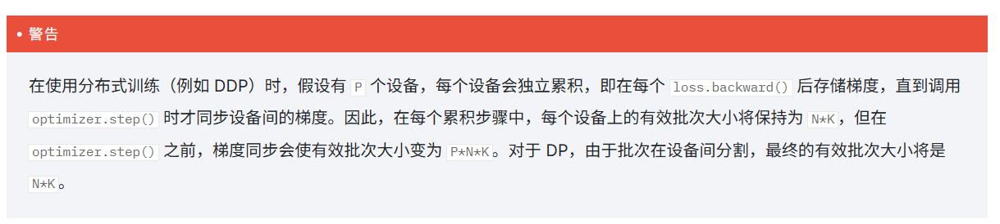

起因是看到 项目代码里的一段

```python
if ddp:
    training_args.gradient_accumulation_steps = training_args.gradient_accumulation_steps // world_size or 1

```

GPT解释：调整梯度积累步数，保持全局 batch 大小一致

# 1 累计梯度

累积梯度会在进行反向传播前运行 K 个小批次，每个批次大小为 N。其效果是得到一个等效的大批次大小为K*N，其中N 是批次大小。内部它不会堆叠批次并执行前向传播，而是累积 K 个批次的梯度，然后执行一个 `optimizer.ste`来确保等效批次大小增加，但不会增加内存开销。

在DP与DDP的区别



计算“全局有效 batch size（effective batch size）”

公式如下：

effective_batch_size = per_device_batch_size * gradient_accumulation_steps * world_size

| 参数                        | 含义                              |
| --------------------------- | --------------------------------- |
| per_device_train_batch_size | 每个 GPU 一次前向处理的样本数     |
| gradient_accumulation_steps | 每个 GPU 累积几次梯度才更新       |
| world_size                  | GPU 数（torchrun 启动的进程总数） |

---

# 2 举例

### 举例 1️⃣：单卡训练

```
per_device_train_batch_size = 1
gradient_accumulation_steps = 4
world_size = 1
```

那么：

```
effective_batch_size = 1 × 4 × 1 = 4
```

→ 每 4 个样本更新一次。

---

### 举例 2️⃣：双卡训练（未调整）

```
per_device_train_batch_size = 1
gradient_accumulation_steps = 4
world_size = 2
```

则：

```
effective_batch_size = 1 × 4 × 2 = 8
```

❗这会导致：

> 你的模型在每次参数更新前，看到的样本数翻倍了！

也就是说，你无意间扩大了 batch size，会影响：

* 学习率调度；
* loss 缩放；
* 模型收敛速度；
* 甚至最终精度。

---

# 三、为什么要“调整梯度积累步数”

为了让分布式（多 GPU）训练时，**全局 batch 与单卡时保持一致**。
因此在脚本里有：

```python
if ddp:
    training_args.gradient_accumulation_steps = training_args.gradient_accumulation_steps // world_size or 1
```

这行意思是：

> 多 GPU 训练时，梯度积累步数自动除以 GPU 数。

---

### 举例 3️⃣：调整后

仍然：

```
per_device_train_batch_size = 1
gradient_accumulation_steps = 4
world_size = 2
```

脚本执行：

```
gradient_accumulation_steps = 4 // 2 = 2
```

于是：

```
effective_batch_size = 1 × 2 × 2 = 4 ✅
```

💡 这就与单卡训练保持了一致。

# 总结

> 当用多 GPU 训练时，梯度积累步数会自动除以 GPU 数，以保持全局 batch 大小与单卡训练一致，避免学习率和收敛行为改变。

---
