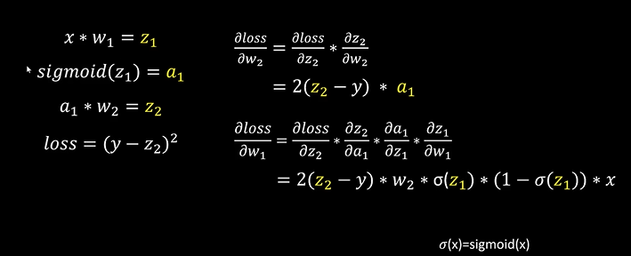
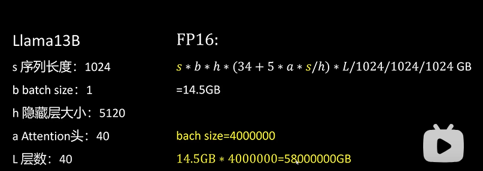

参考链接：
https://www.bilibili.com/video/BV1VD421571H/?spm_id_from=333.1387.upload.video_card.click&vd_source=e6a26642f7f1d14e5b11a109a4dfffe9

https://zhuanlan.zhihu.com/p/687226668

训练显存消耗（可估算部分）主要包括：**模型参数（Model）+ 优化器状态（Optimizer status）+梯度值（Gradient）+激活值（Activation）** 。根据数值的变化，可将显存消耗分为静态/动态值。训练过程中，模型参数、优化器状态一般不会变化，这两部分归属于静态值；激活值、梯度值会随着计算过程发生变化，将它们归类到动态值。

以LLama 13B为例
b Batch size =1
s Sequence length =1024
h Hidden size =5120
FP16训练

1 输入输出：
Embedding：b * s * h *2 /1024 / 1024 = 10MB
共计20MB

2 模型参数：

1B模型需要3.725GB存储空间，进一步近似认为 1B 约等于 **4GB** ，
FP16的模型大致为 26GB （1000约等于1024计算）

实际上 示例（13B）：
13e9 × 2 = 26e9 bytes ≈ 24.21 GiB

3 优化器：
Adam优化器为例
梯度指数平滑值： 13x 4 = 52GB
梯度平方指数平滑值： 13 x 4 = 52GB
模型参数  13 x 4 = 52GB
共计 156GB

优化器必须fp32 需要高精度 梯度一般都很小 加上学习率更小了

4 激活值：

中间结果要保存 其实也可以不用

具体计算过程：https://zhuanlan.zhihu.com/p/1886785548305294057

与batch和seqlen相关

5 梯度值：

FP16 13B*2 = 26G
