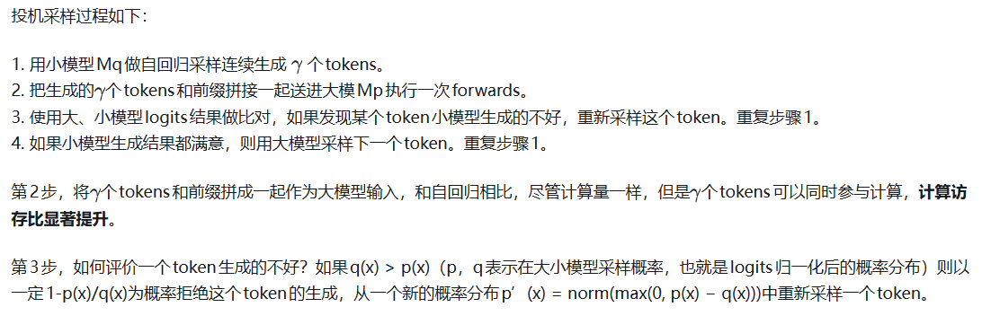
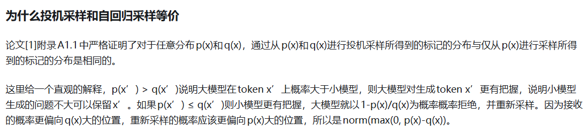

参考链接：

https://zhuanlan.zhihu.com/p/674802804

https://zhuanlan.zhihu.com/p/651359908

基于[Transformer Decoder](https://zhida.zhihu.com/search?content_id=238086034&content_type=Article&match_order=1&q=Transformer+Decoder&zhida_source=entity)的大(语言)模型在进行推理时，不同于训练过程，推理时我们并不能知道下一个字是什么，只能进行串行的预测，将预测到的下一个词，连同之前的句子，一起作为输入，继续预测下一个词，这样每生成一个token，都需要将所有参数从内存传输到缓存中。也就是说，我们的答案有几个字，模型就要跑几次，而大模型的参数量巨大，这个过程受[内存带宽](https://zhida.zhihu.com/search?content_id=238086034&content_type=Article&match_order=1&q=%E5%86%85%E5%AD%98%E5%B8%A6%E5%AE%BD&zhida_source=entity)(memory bound)的限制，这就是大模型推理的瓶颈。

当前业内一直在致力于研究大模型推理的优化技术。当前已有的大语言模型推理提速的方式，包括[低精度计算](https://zhida.zhihu.com/search?content_id=238086034&content_type=Article&match_order=1&q=%E4%BD%8E%E7%B2%BE%E5%BA%A6%E8%AE%A1%E7%AE%97&zhida_source=entity)、[模型量化](https://zhida.zhihu.com/search?content_id=238086034&content_type=Article&match_order=1&q=%E6%A8%A1%E5%9E%8B%E9%87%8F%E5%8C%96&zhida_source=entity)、[适配器微调](https://zhida.zhihu.com/search?content_id=238086034&content_type=Article&match_order=1&q=%E9%80%82%E9%85%8D%E5%99%A8%E5%BE%AE%E8%B0%83&zhida_source=entity)、[模型剪枝](https://zhida.zhihu.com/search?content_id=238086034&content_type=Article&match_order=1&q=%E6%A8%A1%E5%9E%8B%E5%89%AA%E6%9E%9D&zhida_source=entity)、[批量推理](https://zhida.zhihu.com/search?content_id=238086034&content_type=Article&match_order=1&q=%E6%89%B9%E9%87%8F%E6%8E%A8%E7%90%86&zhida_source=entity)、[多GPU并行](https://zhida.zhihu.com/search?content_id=238086034&content_type=Article&match_order=1&q=%E5%A4%9AGPU%E5%B9%B6%E8%A1%8C&zhida_source=entity)和其他推理优化工具等方法，这些方法需要对模型架构、训练过程等做出修改，模型的输出分布也会发生变化，但“[投机采样](https://zhida.zhihu.com/search?content_id=238086034&content_type=Article&match_order=1&q=%E6%8A%95%E6%9C%BA%E9%87%87%E6%A0%B7&zhida_source=entity)”避免了这些变化，通过引入一个“小模型”辅助解码，使部署的大模型能够进行“并行”解码，从而提高推理速度。

**投机采样原理**
------------

[投机采样](https://zhida.zhihu.com/search?content_id=232876036&content_type=Article&match_order=1&q=%E6%8A%95%E6%9C%BA%E9%87%87%E6%A0%B7&zhida_source=entity)（Speculative Decoding）是Google[1]和[DeepMind](https://zhida.zhihu.com/search?content_id=232876036&content_type=Article&match_order=1&q=DeepMind&zhida_source=entity)[2]在2022年同时发现的大模型推理加速方法。它可以在不损失生成效果前提下，获得3x以上的加速比。[GPT-4](https://zhida.zhihu.com/search?content_id=232876036&content_type=Article&match_order=1&q=GPT-4&zhida_source=entity)泄密报告也提到[OpenAI](https://zhida.zhihu.com/search?content_id=232876036&content_type=Article&match_order=1&q=OpenAI&zhida_source=entity)线上模型推理使用了它。

投机采样(Speculative Sampling)引入小模型的关键在于，许多常见的单词和句子是很容易被预测出来的，可以用更简单的模型来近似。在自回归解码中加入投机采样，其原理简单来说就是：使用两个模型，一个是原始目标模型，另一个是比目标模型小得多的近似模型。近似模型用于进行自回归的串行采样，大模型对采样的结果进行评估，决定是否接受近似模型的采样结果，这样大模型只需要处理小模型无法处理的复杂部分，这个方法不需要修改大模型的结构，也不需要重新训练模型，降低推理成本的同时，实现推理提速。

在整个推理过程的while循环(多次投机采样)中

\

p(x)<q(x)的时候应该是小模型分布和大模型的分布存在突变(小模型出错的地方), 需要一定概率放弃, 然后从正常部分[p(x)>q(x)]的分布中去采样

[“Transformers是如何实现大模型的投机采样的” \]([https://zhuanlan.zhihu.com/p/654804707](https://zhuanlan.zhihu.com/p/654804707))这篇文章通过图解的方式讲解了投机编码过程，推荐大家看一下，很清晰！

接下来通过参考文献\[2\]论文中的一个例子来解释投机采样的过程：

**说明**：图中的每一行都表示一次迭代，其中，绿色的tokens表示大模型接受小模型给出的结果，红色tokens表示被拒绝的小模型的结果，蓝色tokens表示对被拒绝的tokens进行修正后的结果，每个词或字母下面的下划线表示这是一个完整的token。

在第一次迭代中，小模型生成了五个tokens，分别为“japan”、“'”、“s”、“benchmark”、“bond”，将前缀和小模型生成的5个tokens一起作为输入，进行一次推理，可以看到，最后一个token“bond”被目标模型拒绝，并重新进行采样，生成token “n”；在第二次迭代中，目标模型接受了小模型生成了5个tokens，并拒绝了最后一个token，以此类推，在第九次迭代结束后，生成了完整的句子，共38个tokens。可以看出，投机采样的方式比只用大模型进行自回归采样进行推理要更加高效。

提速效果
--------

我们在看性能分析结果，下图是一个encoder-decoder结构网络的时间分解图。顶部一行显示了 γ=7的投机采样，中间一行显示了γ= 3的投机解码，γ是小模型一次生成token数目。Mp大模型，Mq的小模型。可见，使用投机采样，解码时间大幅缩减。

当然，投机采样的推理方式并不适用于所有的应用场景，例如，文学艺术类的诗词等，大小模型生成的tokens差异可能较大，但对于代码生成类问题，投机采样就比较适合。投机采样的推理方式并不是完美的，主要考虑两个方面，首先是小模型的选择，要求与大模型接口统一、概率分布接近，其生成质量也不能比大模型差太多；另一方面就是相比单个模型的部署，两个模型的部署更加复杂。

**总结**
----

虽然投机采样的方式有缺陷，但明显优点远大于缺点，他能够实现将大模型直接跑在终端桌面上，不再依赖服务器，大大降低成本预算，根据OpenAI泄露的消息，GPT-4可能也在使用投机采样进行推理加速，这对于成本的节约，无疑是更好的选择。
