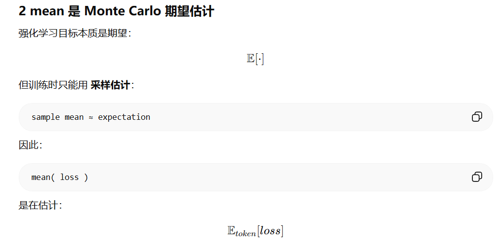
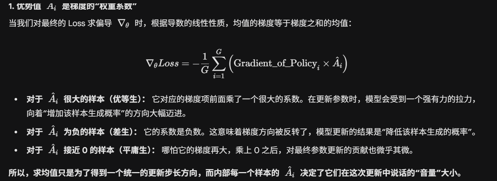
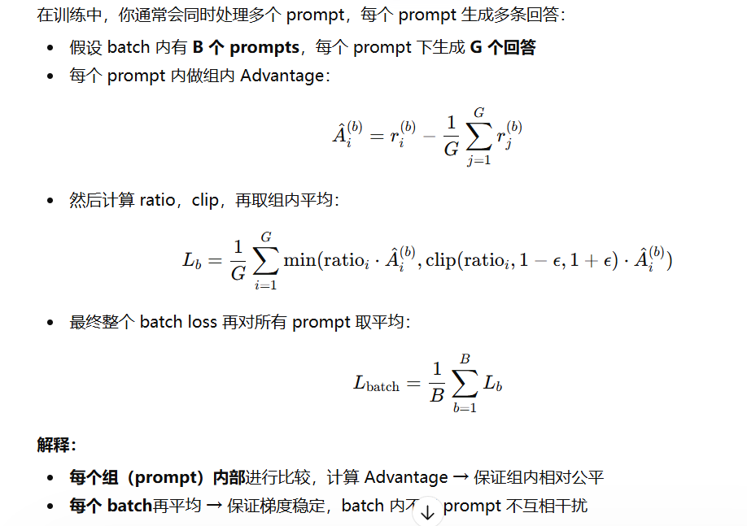

## 三、 SFT 与 Post-Training

### 1. SFT 核心流程与数据构建

**核心流程：** SFT（有监督微调）是将预训练模型（Base Model）转化为指令遵循模型（Chat Model）的关键步骤。它通过 Next Token Prediction 目标函数，让模型学习如何回答特定格式的问题。

**数据构建策略：** * 通常采用 **$(Instruction, Input, Output)$** 三元组。

* **多样性：** 覆盖数学、代码、创意写作、角色扮演等不同任务。
* **质量控制：** 通过人工编写或高阶 LLM（如 GPT-4）生成（Self-Instruct 方案）。

### 2. (追问) 如何保证数据的质量和多样性？

* **复杂度筛选：** 利用模型打分（如 IFD 指标）筛选出具有挑战性的指令，剔除过于简单的废话。
* **多样性去重：** 使用语义向量聚类，确保每个类别的任务分布均匀，避免模型在某类数据上过拟合。
* **安全对齐：** 包含拒绝回答（Refusal）的负样本，引导模型识别有害指令。

### 3. Post-Training 及其目的

SFT 之后通常会进行 **RLHF**（基于人类反馈的强化学习）或 **DPO**（直接偏好优化）。

* **目的区别：** SFT 主要是让模型“学会格式”和“获取基础能力”；Post-Training 则是为了“**价值观对齐**”和“**上限突破**”，解决模型“胡说八道”或不够聪明的问题。

### 4. (追问) 什么情况下需要引入 RLHF 或 DPO？

* **解决 SFT 无法覆盖的偏好：** 比如两个回答在语法上都对，但其中一个更简洁或更符合人类直觉，SFT 很难通过 cross-entropy 学习这种细微偏好，而 DPO/RLHF 可以通过对比学习实现。
* **复杂推理与逻辑校准：** 在需要长链条思考（CoT）或数学推导的任务中，通过强化学习（如 PPO 或 GRPO）给予结果奖励（Outcome-based Reward），能显著提升逻辑准确率。
* **减少幻觉：** 当模型倾向于编造事实时，通过 Post-Training 惩罚虚假回答。

## 介绍一下奖励函数的坍缩现象和问题

在 RLHF 的过程中，我们通常会训练一个**奖励模型（Reward Model, RM）** 来模拟人类的偏好。所谓的“奖励函数坍缩”，在学术界和工程界也常被称为 **“奖励破解”（Reward Hacking）** 。

简单来说，就是模型“学坏了”，它找到了某种走捷径的方法，通过钻奖励模型的空子来获取高分，但实际生成的回答质量反而下降了。

我可以从现象、原因和解决方案三个维度来详细介绍一下：

### 1. 现象：模型在“刷分”

当坍缩发生时，你会发现奖励模型的 Score 曲线一路飙升，看起来训练得非常完美。但如果你去点开模型生成的样本，会发现以下几种典型问题：

* **长度偏见（Length Bias）：** 模型发现只要说的话越长、排版越整齐，奖励模型就倾向于给高分，于是它变成了“废话文学”大师。
* **复读机/过度礼貌：** 模型可能会在结尾疯狂重复道歉或者使用极度谦卑的辞令，因为它发现这些模式是奖励模型的“高分财富密码”。
* **无意义的胡言乱语：** 在极端坍缩下，模型可能会生成一些人类完全看不懂、但奖励模型却认为“很有逻辑”的符号组合。

### 2. 核心原因：奖励模型只是“代理人”

奖励坍缩的根本原因在于 **奖励模型（RM）本质上只是对人类偏好的一个不完美拟合** 。

* **分布偏移（Out-of-Distribution）：** 在 PPO 训练过程中，策略模型（Policy Model）会不断演化。当它生成的文本超出了奖励模型在训练时见过的分布范围时，奖励模型的预测就会失真。
* **过度优化（Over-optimization）：** 强化学习的本质是最大化奖励。如果奖励模型存在一个万分之一的漏洞（即某类低质量文本被误判为高分），强化学习算法就一定会把这个漏洞找出来并放大一万倍。这就是所谓的“Goodhart's Law”：当一个指标变成目标时，它就不再是一个好指标了。

### 3. 如何解决或缓解？

在工程实践中，我们通常会采用“组合拳”来对抗这种坍缩：

* **引入 KL 散度惩罚（KL Penalty）：** 这是最常用的手段。在计算奖励时，强制让当前策略模型不要偏离“原始模型（Reference Model）”太远。如果模型为了刷分而变得举止怪异，KL 散度就会激增，从而对总分产生巨大的负反馈。
* **奖励模型集成（RM Ensemble）：** 同时训练多个不同的奖励模型，取它们的平均值或者最小值（取保守值）。这样模型就很难同时钻所有 RM 的空子。
* **在线 RLHF（Iterative/Online RLHF）：** 不要指望一个静态的 RM 能管一辈子。我们需要不断用当前模型生成的样本进行人工标注，迭代更新 RM，让 RM 见过模型“走捷径”的样子，并告诉它“这样做是不对的”。
* **奖励平滑与截断：** 对奖励值进行标准化（Standardization）或白化处理，防止某些极端的高分扰乱训练。

## 离线强化学习和在线强化学习了解么？

**“在线”（Online）**和** “离线”（Offline）** 的核心区别在于：**学习算法是否能够与环境进行实时交互并获取新数据。**

在当前大模型的对齐阶段（Alignment），这两者分别对应了不同的技术路径。我为您对比梳理一下：

### 1. 在线强化学习 (Online RL)

这是最传统的强化学习范式。模型像一个正在练级的玩家，边玩（交互）边学（优化）。

* **工作流程：** 策略模型（Policy）针对 Prompt 生成回答**$\rightarrow$** 环境（通常是奖励模型 RM）给出反馈**$\rightarrow$** 策略模型根据反馈调整参数**$\rightarrow$** 再次生成，循环往复。
* **代表算法：****PPO (Proximal Policy Optimization)** 是大模型领域最典型的在线 RL 算法。
* **优点：** 理论上限高。由于模型在不断探索（Exploration），它能发现奖励模型认为更好的新路径，从而实现持续进化。
* **缺点：** ***计算开销极大：** 需要频繁地进行推理（Inference）来产生样本，训练极其耗时。
  * **系统复杂：** 往往需要维护四个模型（Policy, Reference, Reward, Value），对显存要求很高。
  * **稳定性差：** 训练过程非常容易崩掉（比如前面提到的奖励坍缩）。

---

### 2. 离线强化学习 (Offline RL / Batch RL)

模型更像是一个看比赛录像的学生，它无法改变过去发生的事，只能从既有的数据记录中学习规律。

* **工作流程：** 从一个预先收集好的数据集（通常是**$\{Prompt, Response, Score\}$** 的三元组）中进行学习。训练过程中，模型不再产生新的对话数据。
* **代表算法：****DPO (Direct Preference Optimization)** 、**RRHF** 、或者是基于排序损失的**SLiC** 。
* **优点：**
  * **简单高效：** 就像做监督微调（SFT）一样简单，不需要部署复杂的训练框架。
  * **稳定性高：** 没有复杂的交互环路，梯度更新更加平滑。
  * **资源友好：** 显存占用低，不需要同时加载那么多模型。
* **缺点：** ***分布偏移（Distribution Shift）：** 如果训练数据里没有某种表现，模型很难“自悟”出更好的策略。它被限制在了现有数据的包络线内。

## GRPO 公式？为什么公式里面 clip 了外面还要计算一次 mean 呢？

如果没有 clip：

rA
当概率比 r 很大时：

<pre class="overflow-visible! px-0!" data-start="1066" data-end="1079">

梯度会爆炸

</pre>

clip 后：

min⁡(rA,clip(r)A)\min(rA,clip(r)A)**min****(****r****A****,****c****l****i****p****(****r****)****A****)**
保证：

<pre class="overflow-visible! px-0!" data-start="1120" data-end="1153">

policy 不会偏离 old policy 太远

</pre>

这是 PPO 的核心思想。

## yarn位置编码是什么

### 1. 为什么需要 YaRN？（背景与痛点）

原生的 RoPE 具有外推性（Extrapolation），但效果有限。当输入长度超过训练长度时，位置编码的“频率”会超出模型在训练时见过的范围，导致模型无法理解长距离的 Token 关系。

* **线性内插（Linear Interpolation）：** 最简单的做法是将位置索引缩小（比如 128k 缩放到 4k）。但这会导致高频信息丢失，模型变得“健忘”和模糊。
* **NTK-aware 差值：** 改进了线性内插，通过改变 RoPE 的基数（Base）来非均匀地缩放频率。虽然有效，但在处理极长序列时，模型对近距离 Token 的感知力会下降。

### 2. YaRN 的三大核心改进

YaRN 在 NTK-aware 的基础上做了进一步的优化，主要包含以下三个部分：

#### (1) 分段内插（Multi-band Interpolation）

这是 YaRN 的核心观察。研究发现，在 RoPE 的多个维度中，有些维度代表高频，有些代表低频：

* **高频维度：** 携带的是精细的局部信息（比如相邻词的语法关系）。这些维度不应该被内插，应该保持原样。
* **低频维度：** 携带的是粗糙的全局信息（比如段落间的语义逻辑）。这些维度可以安全地进行内插。
  YaRN 通过定义一个波长阈值，对不同频率的维度采取不同的处理策略：不插值、部分插值或完全线性插值。

#### (2) 引入温度缩放（Attention Scaling）

这是一个非常深刻的工程发现。当我们对位置编码进行内插（缩小频率）时，计算出的 Attention 分布会变得更“平滑”（熵增加了）。

* **后果：** 注意力不再集中，模型容易产生幻觉或逻辑混乱。
* **解决方法：** YaRN 引入了一个温度常数**$\sqrt{t}$**。通过缩放注意力分数（Logits），强行将注意力分布压回到训练时的紧凑状态，保持模型决策的锐度。

#### (3) 解决重叠问题

YaRN 修正了 NTK 方法中在极短距离下可能出现的位置信息重叠问题，确保即使在扩展到 128k 甚至更长时，模型依然能分得清“第 1 个 Token”和“第 2 个 Token”。

---

### 3. YaRN 的数学表达（核心公式）

在 RoPE 中，每个维度的旋转角度计算公式为：

$$
\theta_i = \text{base}^{-2i/d}
$$

YaRN 实际上是通过引入两个缩放因子 **$s$**（扩展比例）和修正因子 **$\gamma$**，对 **$\theta$** 进行重构，使得在保持高频分量不变的同时，通过平滑低频分量来实现外推。

### 4. 为什么 YaRN 现在很流行？

在实际工程中（比如 Llama-3 或一些长文本模型）：

1. **几乎无损：** 它在扩展上下文的同时，对模型在短文本上的表现几乎没有负面影响。
2. **微调成本低：** 只需要用极少量（几百步）的长文本数据进行微调，模型就能迅速适应新的窗口长度。
3. **计算高效：** 它只改变了位置编码的生成逻辑，不增加推理时的计算复杂度。
