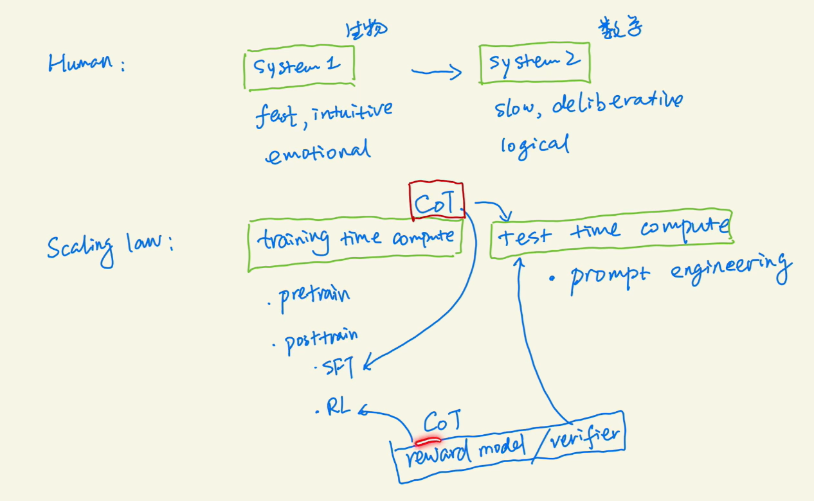
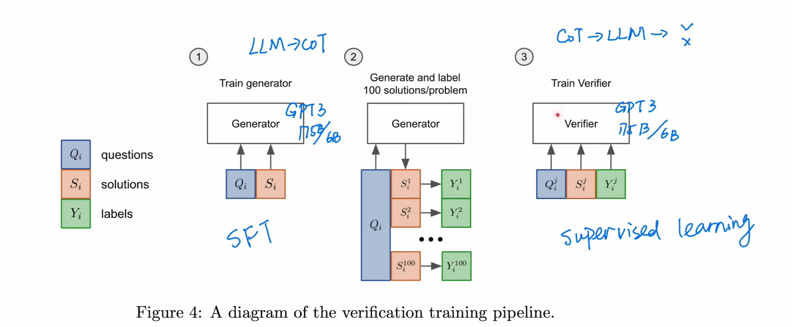
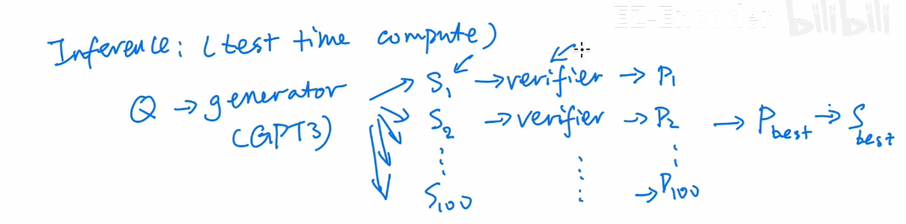
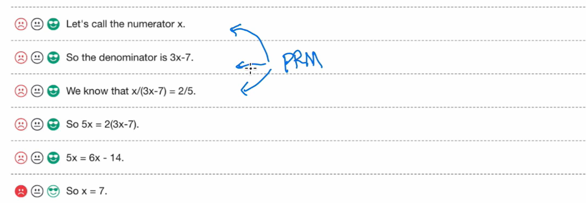
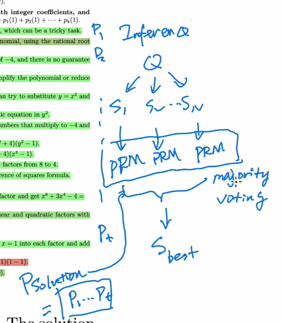
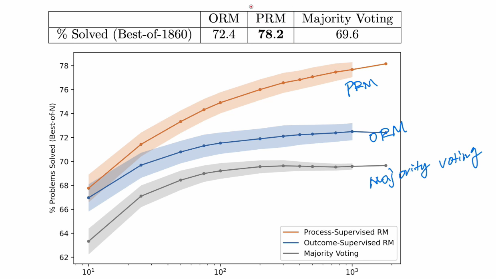
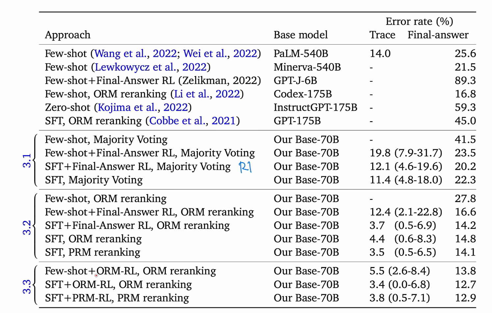
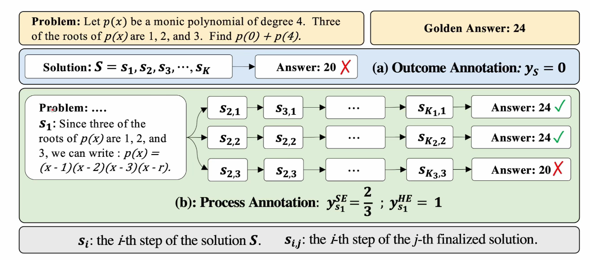
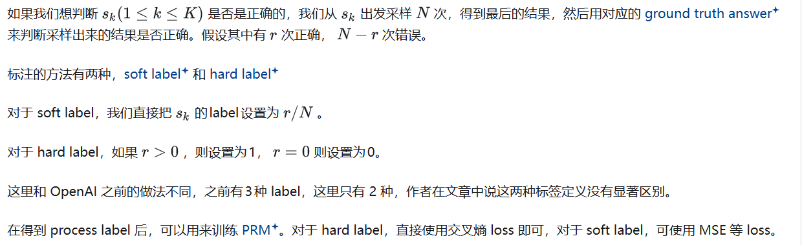

**Test-time compute（TTC，测试时计算）** 指的是：

在模型已经训练完成之后，仅在“推理/测试阶段”额外投入更多计算资源，以换取更高的输出质量或稳定性。

它和训练无关，只发生在 inference / decoding / evaluation 阶段。

# Training Verifiers to Solve Math Word Problems

第一步生成数据 第二部人工标注思维链的正确与否 第三部训练Verifier

训练verifier 判断Cot好不好   我们可以对排名靠前的 verifier 解决方案进行多数投票，而不是只选择单一的最高排名解决方案

verifier：评估模型生成解法的正确程度（token-level评估输出是否正确 + 联合训练语言模型目标函数）
verifier由generator初始化
（原理：分类一般比生成任务简单）
（存在推理错误，但是结果正确的场景）
在训练时同时训练验证任务和语言模型任务（训练时两种数据一样多，相当于对语言模型数据的100倍上采样）

token-level比solution-level效果好 预测每个标记的价值函数是比仅判断完整解答**更具挑战性且噪声更大** 的任务。然而，**尽管初期训练较慢** ，标记级验证器最终的表现优于解答级验证器。

# Let's Verify Step by Step

上面是对GSM8k 训练ORM

这里对PRM800k 训练PRM 对每一步的思维链都标注了

PRM可以用于RL训练的label 也可以用于verifier 这里研究后者

* `positive`：对的过程，对解答有帮助。
* `negative`：错的过程。
* `neutral`：对的过程，但是对解答没帮助

使用PRM选回答 每一步的p乘积最大值选择 不是majority voting

# Solving math word problems with process- and outcome-based feedback

ORM、PRM 用于RL和Decoding

Deepmind认为ORM和PRM差不多 R1用的比较原始（可能跟RL算法和基座大小相关）

作者似乎把PRM的性能和ORM一致的原因归结于数学这个领域里，答案的正确性和中间步骤的正确性是强耦合。这点其实被后面的大规模工作《Let’s Verify Step by Step, 2023》否定了，里面实验证明了PRM其实各方面都更强，步骤的标签可能没白打。

# Math-Shepherd: Verify and Reinforce LLMs Step-by-step without Human Annotations

https://zhuanlan.zhihu.com/p/27445260708

deepseek提出 自动标注PRM 借鉴蒙特卡洛树思想

受蒙托卡罗树搜索的启发，将推理步骤的质量定义为其推断出正确答案的潜力。该标准源于推理过程的主要目标，推理过程本质上是一种认知过程，可帮助人类或智体得出有理有据的结果 (Huang & Chang, 2023)。因此，具有推断出有理有据结果潜力的步骤可被视为良好的推理步骤。

为了量化和估计给定推理步骤 si 的潜力，如图所示，用“完成器”来完成此步骤的 N 个后续推理过程：{(s/i+1,j,··· ,s/Kj,j,aj)}，其中 aj 和 Kj 分别是解码后的答案和第 j 个最终解决方案的总步骤数。然后，根据所有解码答案的正确性 A = {aj} 来估计此步骤的潜力。

