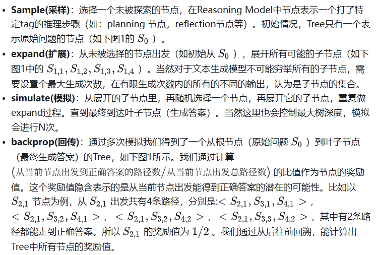
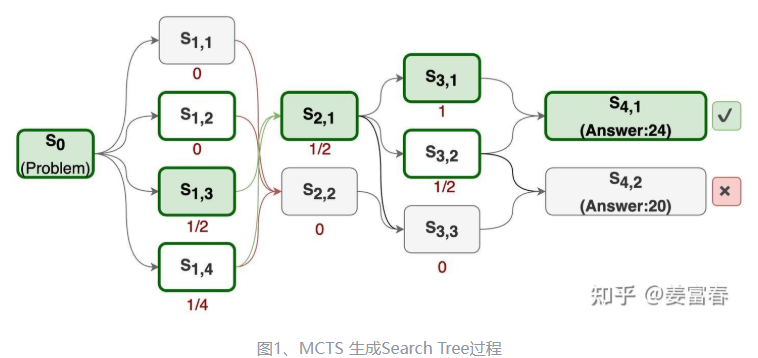
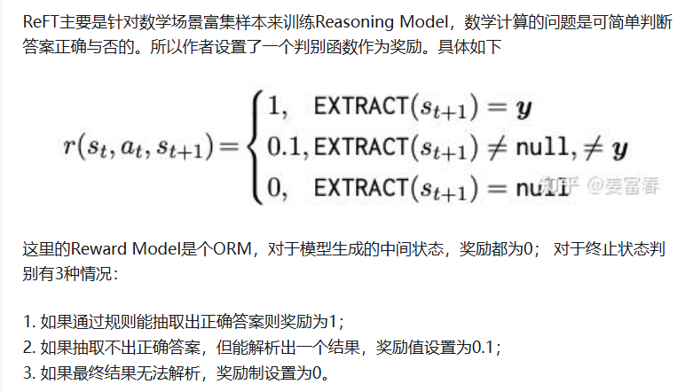
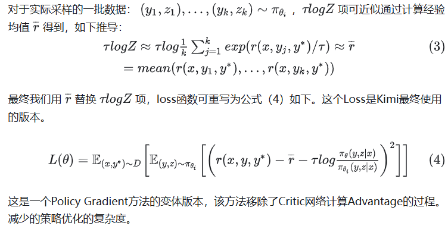

参考链接：

https://zhuanlan.zhihu.com/p/20356958978

推理语言模型（英语：Reasoning language model），或称推理大模型或大型推理模型，是一个进阶的大型语言模型，它能经过进一步训练，可以解决多步骤推理任务。推理语言模型在逻辑、数学或程式任务上的表现，一般都比传统的自我回归的大型语言模型更好，具有回溯能力，并使用时间测试计算作为训练范例、参数计数。

主要有三篇工作比较清晰的讲述了Reasoning Model的探索过程，分别是：**字节的ReFT、Kimi的K1.5和DeepSeek的R1** 。看完总结下来：大家方法趋同，**核心都是在Post-Training阶段通过RL（Reinforcement learning）提升模型的推理能力** 。

# 1 早期猜想

自从OpenAI发布o1模型后，让我们体验到LLM在复杂问题的推理能力上的进步。Reasoning Model（推理模型）的复现之路也成为各家大模型追捧的热点。在猜想和复现的过程中，试图从OpenAI、Google、微软的近期的研究中找到一些蛛丝马迹，其中主流的一些猜测集中在使用**PRM和MCTS**方法，在Post-training和Inference阶段提升推理性能。

## 1.1 PRM增强推理能力

PRM（Process-supervised Reward Model）是OpenAI在[Let’s Verify Step by Step](http://arxiv.org/pdf/2305.20050)一文中首次提出的概念。与之相对应的是ORM（Outcome-supervised Reward Model）。PRM和ORM都是奖励模型，两者区别：

* PRM：过程奖励模型，是在生成过程中，分步骤，对每一步进行打分，是更细粒度的奖励模型。
* ORM：结果奖励模型，是不管推理有多少步，对完整的生成结果进行一次打分，是一个反馈更稀疏的奖励模型。

使用PRM可以在Post-Training和Inference两阶段提升模型的推理性能。

* Post-Training阶段：在偏好对齐阶段，通过在RL过程中增加PRM，对采样的结果按步骤输出奖励值，为模型提供更精细的监督信号，来指导策略模型优化，提升模型按步推理的能力。
* Inference阶段：对于一个训练好的PRM，可以在Inference阶段来筛选优质生成结果。具体来说。对generator模型做N次采样（如Beam Search方法等），并通过PRM对每个采样的每步推理进行打分，最终拟合一个整体过程打分，并选取打分最高的结果作为最终的答案。

> 这里我们假设基础的generator模型在pretrain后做了指令微调（SFT），有基本的推理能力（能按步骤生成答案，但推理准确性可能较差）

## 1.2. MCTS增强推理能力

MCTS（Monte Carlo Tree Search）是强化学习领域提出的方法，通过采样方式预估当前动作或状态的价值。具体操作步骤：使用已有的策略与环境做仿真交互，进行多次rollout采样，最终构成了一个从当前节点出发的一颗Tree（每个rollout表示从当前节点到最终结束状态的多次与环境仿真交互的过程）。这颗Tree的所有叶子节点都是结束状态，结束状态是能量化收益的（量化收益的方法：比如方法1：答案错误收益-1， 答案正确收益 +3；再比如方法2：叶子节点的收益是**到达叶子节点路径数/总路径数** 的概率，这是一种根据投票机制预估的价值，越多路径到达叶子节点，说明这个叶子节点越置信，那么这个叶子节点就有更高的奖励）。一颗Tree的叶子节点有了奖励值，就可通过反向传播，计算每个中间节点的奖励值，最终计算出整个Tree所有节点的奖励值。MCTS一次rollout包括：select，expand，simulate，backprop四个步骤。我们展开描述下四个步骤的具体工作。

使用MCTS提升模型的推理能力，也可在Post-Training和inference两阶段来实现。

* Post-Traing阶段：对于每个problem 通过上述方法构造一个搜索Tree，然后进行Tree的游走遍历采样，再用采样的样本SFT或RL训练模型。
* Inference阶段：在推理阶段，也是对一个problem探索多节点构造一颗搜索Tree，对于到达正确答案的路径，根据节点路径的置信度打分，贪心选取最优路径作为最终的推理结果。

  使用PRM和MCTS训练推理模型的大致框图，如图2所示，主要是在Post Training和Inference阶段使用来提升模型的推理能力。

## 1.3 缺陷

PRM和MCTS方法，都会引入模型训练和推理的复杂性。在实际的复现Reasoning Model工作中，大家并没有应用这些技术，而是不约而同的选择了更轻量、更直接的方案。下面我们来看看国内3篇有价值的Reasoning Model的技术报告。

# 2. Reasoning Model三篇有价值的工作

三篇工作附原文链接，如下

* **字节ReFT** : [REFT: Reasoning with REinforced Fine-Tuning](http://arxiv.org/pdf/2401.08967)
* **kimi K1.5** ：[KIMI K1.5: SCALING REINFORCEMENT LEARNING WITH LLMS](http://arxiv.org/pdf/2501.12599)
* **deepseek R1** ： [DeepSeek-R1: Incentivizing Reasoning Capability in LLMs via Reinforcement Learning](http://arxiv.org/pdf/2501.12948)

本文并不是对三篇工作做从头到尾的翻译，二是主**要讲解核心的实现思路** ，不会对效果、实验等细节展开讲解。如需要了解更多细节，请参考原文阅读

# 3.ReFT

ReFT(Reinforced Fine-Turning)是字节24年初的一篇工作，ReFT方法包括两个阶段：SFT冷启阶段 和 强化学习训练阶段。

## **SFT冷启阶段（warm-up stage）**

SFT阶段通过构造一批带推理过程的数据，来精调Base LLM模型，这个阶段主要是让模型有基本的CoT推理能力。ReFT的做法也非常简单，就是用一批开源的数据，通过Prompt工程来发压GPT-3.5t来收集样本，再SFT微调自己的小模型。

具体实现细节上，**样本数据** 主要来源于GSM8K，SVAMP和MathQA 三个数据集，通过GPT-3.5-turbo few-shot prompting的方法收集的训练数据。数据集有两种推理格式： N-CoT， P-CoT。

## **强化学习训练阶段（Reinforcement Learning Stage）**

PPO同样的训练

Reward model 一般可以基于SFT model 热启 或 基于 Pretrain model 热启训练 （热启（Warm/Hot Start）”指的是**在已有模型参数基础上继续训练，而不是从随机初始化开始**

Critic Model是对每个状态做打分的价值模型，衡量当前token到生成结束的整体价值打分，模型的结构一般跟Reward Model一致，通常也会用Reward热启。但本文中，并没有Reward Model，那么Critic Model如何设计的呢？

作者对Critic Model的设计还是遵从Reward Model的设计方式，在Base Model之上，增加一个回归头（regresion head）对每个生成的状态进行打分。ReFT也做了些优化，为了减少训练时模型的计算量和显存占用， Critic Model的参数与Actor Model(Policy Model)的参数共享。如下图所示：

## **总结ReFT**

ReFT核心使用PPO算法来提升Reasoning的能力，相对于传统的PPO算法，主要做了两方面优化： 1) 简化Reward Model ，使用的是Rule-Base Reward而非训练一个模型。2) Critic Model参数与Policy Model共享，压缩训练阶段模型的参数的存储空间，也进一步降低模型训练的复杂度。

# 4.Kimi-K1.5

Kimi K1.5是个多模态的Reasoning Model，论文中对模型训练过程描述的比较详细。主要包括： 预训练、监督微调和强化学习（RL）三个阶段，其中RL阶段仍然是Kimi重点优化的阶段。我们先来快速看看预训练和SFT阶段的一些细节，之后再重点看下RL阶段。

## **4.1. 预训练**

预训练阶段比较常规，数据集包括文本和图像多领域多模态高质量数据集，训练包括三个阶段：

1. Vision-language 预训练阶段：首先基于文本语料训练语言模型，然后进行多模态融合训练；
2. 退火阶段：筛选公开的和合成的高质量数据来进一步提升模型的基础能力，特别富集了针对推理和知识型任务的高质量数据集，做模型训练
3. Long-context训练阶段：这也是当前模型扩展长文能力的主要方法，在预训练的最后阶段，通过feed长文数据集提升长文理解和生成能力，Kimi最终将长文能力扩展到128K。

## 4.2 监督微调

对于SFT精调阶段，Kimi做了两个阶段，分别是**覆盖通用能力的基础监督微调** 和**强化推理能力的long-CoT的监督微调**

**长思维链（long-CoT）监督微调**

这一阶段重点通过Prompt方式生成长思维链的推理路径的小规模数据集，来做SFT训练。目的是让模型能够先内置一些推理的知识，学会基本的long-CoT的生成模式，能对推理过程的必要动作如：planning，evaluation，reflection，exploration等步骤做正确的、连贯的响应。

> 注：该步骤的数据集是基于RL阶段的数据集做后处理得到的，后面RL阶段会详细讲述数据集的富集过程

经过上述几步，模型除了具备了通用的能力，同时也有了基础的推理能力，下面就是KIMI重点优化的RL阶段，进一步提升模型的推理性能。

# 4.3 RL模型

Kimi的RL训练过程，并没有采用PPO的方法， 而是采用了一种更轻量的类Policy Gradient的方法。具体方法如下：

### **Reward Model设计**

K1.5中对于reward的设计还是比较精细的。对可直接规则判别对错的问题，用Rule-Base Reward简化打分过程。对于开放问答类问题，用Model-Base Reward。同时对于超长的CoT过程做了惩罚处理。

具体几种Reward设计如下：

* Rule-Base Reward : 对于能简单判断对错的数学问题，直接通过规则函数来计算Reward，对于编程问题通过评估是否通过测试用例来直接判断Reward打分。
* Model-Base Reward: 对于开放的问答类问题，训练一个Reward Model，通过模型打分
* Length Penalty Reward：Kimi做了一个warmup的设置，在训练初始阶段不增加这个惩罚因子，让模型能学习生成long CoT，在训练后面阶段，为了防止生成过长的CoT，增加了生成长度的惩罚因子，鼓励模型进行适当思考，而不是生成过于冗长的内容。

### 采样策略

Kimi也对RL训练过程的采样策略做了精心设计，主要通过两个方法来提高训练效率：

* 课程采样（Curriculum Sampling）：作者设计先从训练较简单的任务开始，逐渐过渡到更具挑战性的任务。主要考虑是初始阶段，强化学习模型性能有限，将有限的计算预算花在非常困难的问题上往往只能产生很少的正确样本，从而导致训练效率降低。
* 优先采样（Prioritized Sampling)：关注模型表现不佳的问题。跟踪每个问题的成功率，对成功率低的问题进行更大概率采样，引导模型将精力集中在最薄弱的环节，从而实现更快的学习和更好的整体性能。

# 5.DeepSeek-R1

DeepSeek做了两阶段探索：**DeepSeek-R1-Zero 和 DeepSeek-R1** 。

DeepSeek-R1-Zero：是个纯做RL的阶段，验证RL对推理性能的提升的有效性。

DeepSeek-R1：由于DeepSeek-R1-Zero训练的模型可读性是比较差的，通常有多语言混合输出的问题，通用能力也较差。为了解决这些问题，并产出一个实际可用的模型。DeepSeek在R1阶段，做了多阶段的模型训练，并通过混合多任务数据，同时提升模型的通用能力和复杂问题推理能力

## DeepSeek-R1-Zero

RL训练为GRPO

**Reward Model的设计：Rule-Base RM**

R1-Zero阶段只关注数学、程序类推理问题，都是能简单通过规则判别答案对错的，所以奖励模型采用的是纯Rule-Base 的设计，主要包括2类Reward：

* **正确性校验Reward（Accuracy rewards）：** 数学问题通过简单的规则抽取答案与ground truth对比校验。对于程序题，通过编译生成的程序，校验是否能通过测试用例，产生一致的答案
* **格式校验Reward（Format rewards）：** 校验是否thought内容是包含在‘<think>’ 和 ‘</think>’tags之间

## DeepSeek-R1

DeepSeek-R1-Zero 是个纯RL驱动模型训练过程，问题推理能力显著提升，但模型的通用能力有很多瑕疵，比如会输出可读性非常差的混合语言的结果。为了进一步提升模型的可用性，在R1-Zero基础上，DeepSeek又做了多阶段细致的优化过程，即DeepSeek-R1。主要的优化包括四个阶段：**SFT -> RL -> 增强SFT -> 增强RL** 。（有点左脚踩右脚，然后直接起飞的架势...）

**阶段1：SFT Cold Start 阶段**

SFT的样本通过两种方式获取： 1）拒绝采样：通过few-shot prompt方式，基于已有的生成模型直接生成，来富集 long-CoT的样本；2）人工标注：获取 R1-Zero可读的样本，然后通过人工方式精编样本。

**阶段2： Reasoning-oriented RL 阶段**

这个阶段基本就是R1-Zero的过程，为了解决多语言混合输出的问题，在训练R1过程，对Reward Model增加了语言一致性的奖励设置。具体来说，增加了Language Consistency Reward，它通过计算推理CoT过程的字符与目标语言一致的字符比例，来作为奖励打分，一致率越高奖励越高。这个奖励对模型性能有轻微的影响，但趋向于更便于人可读性的优化，是一个有用的偏好奖励的设置。

**阶段3：增强SFT阶段（Rejection Sampling and Supervised Fine-Tuning）**

这个阶段主要是提升模型的通用能力，包括：创作，角色扮演和其他一些通用任务。对于Reasoning 和 Non-Reasoning的样本通过不同方式富集：

* Reasoning data ： 通过拒绝采样获取。这个阶段引入了一批新的Prompt数据，基于上一步得到的模型，生成多结果，最终通过Rule-Base Reward 和 强大的DeepSeek-V3作为裁判模型，精选样本。同时根据一些规则，对于混合语言的，冗长的推理CoT样本做规则过滤。最终筛选了600K的Reasoning样本。
* Non-Reasoning data ： 引入训练DeepSeek-V3的通用高质量SFT数据，包括： 创作、事实问答、自我认知和翻译。样本处理上，通过prompt方式调用DeepSeek-V3，在回答问题前，先生成一个思维链，保证与Reasoning Data的样本格式一致。最后收集了200K的Non-Reasoning样本。

（注：这里并没有基于上个阶段的模型继续微调，**而是在基模上微调的**，主要是为了保证更好的通用能力，然后进一步通过过滤后的样本继续微调，保留refine后的推理能力。）

**阶段4：增强RL阶段（Reinforcement Learning for all Scenarios）**

这阶段其实跟K1.5的工作差不多，对于多样的数据，采用多种奖励方式来做精细化的奖励反馈。复用了R1-Zero和 DeepSeek-V3的Reward Model的设置。其他并没有太多可关注的地方。

## 6.总结

本文主要介绍了「国产之光」的三篇做Reasoning Model的工作，对于复杂问题的推理能力的探索，大家都不约而同的采用了精巧、简洁的复现方案。通过设定清晰的目标，减少过多的人为设定，基于RL端到端的自驱探索能力上限。我觉得本文最终可以用一句话总结：**Reasoning Model，RL is all your need ！！！**
