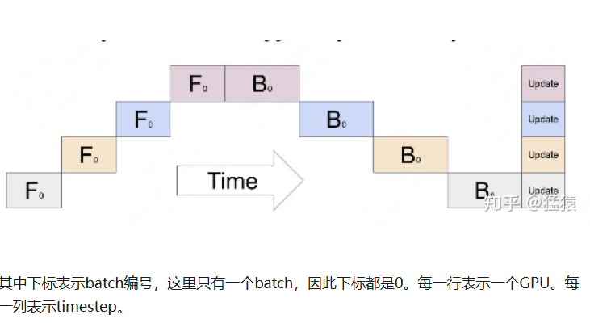
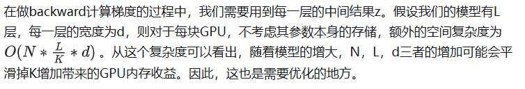
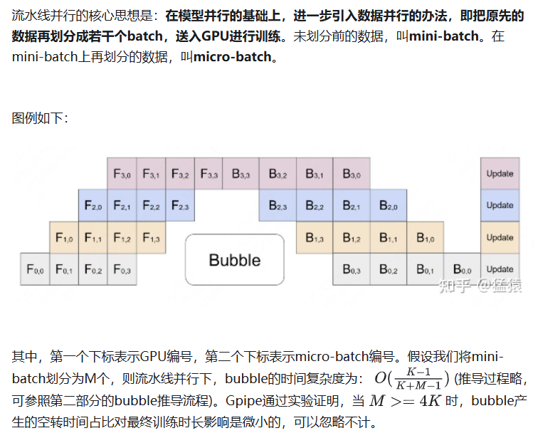
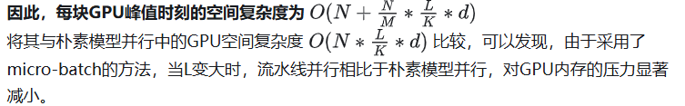

# 看猛猿！

回顾ChatGPT的发展历程，我们可以总结出大语言模型（LLM）取得惊艳效果的要点（重要性从高到低排序）：

1. 愿意烧钱，且接受“烧钱 != 好模型”的现实
2. 高质量的训练语料
3. 高效的分布式训练框架和充沛优质的硬件资源
4. 算法的迭代创新

在大模型训练这个系列里，我们将一起探索学习几种经典的分布式并行范式，包括流水线并行（Pipeline Parallelism），数据并行（Data Parallelism）和张量并行（Tensor Parallesim）。微软开源的分布式训练框DeepSpeed，融合了这三种并行范式，开发出3D并行的框架，实现了千亿级别模型参数的训练。

# 1 图解大模型训练之：流水线并行（Pipeline Parallelism），以Gpipe为例

链接：
https://zhuanlan.zhihu.com/p/613196255

在 **llm整体架构\训练trick\gradient_checkpointing.ipynb** 也有涉及

## 1.1 优化目标

多卡

* **能训练更大的模型** 。理想状况下，模型的大小和GPU的数量成线性关系。即GPU量提升x倍，模型大小也能提升x倍。
* **能更快地训练模型** 。理想状况下，训练的速度和GPU的数量成线性关系。即GPU量提升x倍，训练速度也能提升x倍。

这是目标，也是难点，难在于：

* 训练更大的模型时，每块GPU里不仅要存模型参数，还要存中间结果（用来做Backward）。而更大的模型意味着需要更多的训练数据，进一步提高了中间结果的大小。加重了每块GPU的内存压力。我们将在下文详细分析这一点。（**对应着GPU中的内存限制** ）
* 网络通讯开销。数据在卡之间进行传输，是需要通讯时间的。不做设计的话，这个通讯时间可能会抹平多卡本身带来的训练速度提升。（**对应着GPU间的带宽限制** ）

## 1.2 模型并行

问题：

bubble时间复杂度 O（K-1/k） 接近1

内存问题：

## 1.3 流水线并行

内存问题解决

Gpipe采用了一种非常简单粗暴但有效的办法：**用时间换空间，在论文里，这种方法被命名为re-materalization，后人也称其为active checkpoint** 。

**几乎不存中间结果，等到backward的时候，再重新算一遍forward** ，图例如下：

f
