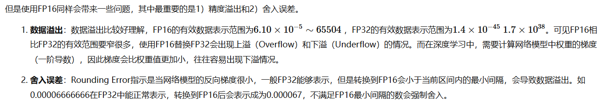
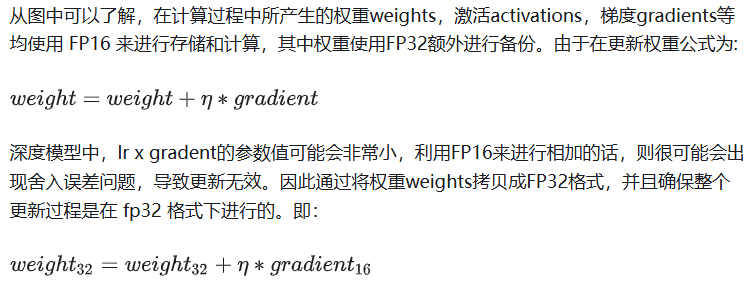

参考链接：https://www.cnblogs.com/ZOMI/articles/15647856.html

通常我们训练神经网络模型的时候默认使用的数据类型为单精度FP32。近年来，为了加快训练时间、减少网络训练时候所占用的内存，并且保存训练出来的模型精度持平的条件下，业界提出越来越多的混合精度训练的方法。这里的混合精度训练是指在训练的过程中，同时使用单精度（FP32）和半精度（FP16）。

# 1、浮点数据类型

参考   ** 杂谈\浮点数精度.md**

# 2、使用FP16训练问题

首先来看看为什么需要混合精度。使用FP16训练神经网络，相对比使用FP32带来的优点有：

1. **减少内存占用**：FP16的位宽是FP32的一半，因此权重等参数所占用的内存也是原来的一半，节省下来的内存可以放更大的网络模型或者使用更多的数据进行训练。
2. **加快通讯效率**：针对分布式训练，特别是在大模型训练的过程中，通讯的开销制约了网络模型训练的整体性能，通讯的位宽少了意味着可以提升通讯性能，减少等待时间，加快数据的流通。
3. **计算效率更高**：在特殊的AI加速芯片如华为Ascend 910和310系列，或者NVIDIA VOTAL架构的Titan V and Tesla V100的GPU上，使用FP16的执行运算性能比FP32更加快。

**上溢（Overflow）**

* **定义** ：数值 **超过 FP16 可表示的最大值（≈ 65504）** 时，会变成 **+∞ 或 -∞** 。
* **例子** ：训练时在梯度累积、矩阵乘法时，数值可能轻松超过 1e5。
* **结果** ：出现 `NaN` 或 `Inf`，训练崩溃。

---

**下溢（Underflow）**

* **定义** ：数值 **小于 FP16 可表示的最小正数（≈ 6e-8）** 时，会被 **截断为 0** 。
* **例子** ：在 softmax 的分母里经常会出现很小的概率（比如 `1e-10`），在 FP16 下直接变 0。
* **结果** ：
  * 梯度消失（梯度被压成 0）
  * 数值不稳定，模型收敛困难

# 3、混合精度相关技术

为了想让深度学习训练可以使用FP16的好处，又要避免精度溢出和舍入误差。于是可以通过FP16和FP32的混合精度训练（Mixed-Precision），混合精度训练过程中可以引入权重备份（Weight Backup）、损失放大（Loss Scaling）、精度累加（Precision Accumulated）三种相关的技术。

## 3.1、权重备份（Weight Backup）

---

权重备份主要用于解决舍入误差的问题。其主要思路是把神经网络训练过程中产生的激活activations、梯度 gradients、中间变量等数据，在训练中都利用FP16来存储，同时复制一份FP32的权重参数weights，用于训练时候的更新。具体如下图所示。

从图中可以了解，在计算过程中所产生的权重weights，激活activations，梯度gradients等均使用 FP16 来进行存储和计算，其中权重使用FP32额外进行备份。由于在更新权重公式为:

权重用FP32格式备份一次，那岂不是使得内存占用反而更高了呢？是的，额外拷贝一份weight的确增加了训练时候内存的占用。 但是实际上，在训练过程中内存中分为动态内存和静态内容，其中动态内存是静态内存的3-4倍，主要是中间变量值和激活activations的值。而这里备份的权重增加的主要是**静态内存**。只要动态内存的值基本都是使用FP16来进行存储，则最终模型与整网使用FP32进行训练相比起来， 内存占用也基本能够减半。

## 3.2、损失缩放（Loss Scaling）

如图所示，如果仅仅使用FP32训练，模型收敛得比较好，但是如果用了混合精度训练，会存在网络模型无法收敛的情况。原因是梯度的值太小，使用FP16表示会造成了数据下溢出（Underflow）的问题，导致模型不收敛，如图中灰色的部分。于是需要引入**损失缩放（Loss Scaling）技术**。

下面是在网络模型训练阶段， 某一层的激活函数梯度分布式中，其中有68%的网络模型激活参数位0，另外有4%的精度在2^-32~2^-20这个区间内，**直接使用FP16对这里面的数据进行表示，会截断下溢的数据，所有的梯度值都会变为0。😕 **

为了解决梯度过小数据下溢的问题，对前向计算出来的Loss值进行放大操作，也就是把FP32的参数乘以某一个因子系数后，把可能溢出的小数位数据往前移，平移到FP16能表示的数据范围内。根据链式求导法则，放大Loss后会作用在反向传播的每一层梯度，这样比在每一层梯度上进行放大更加高效。

损失放大是需要结合混合精度实现的，其主要的主要思路是：

* **Scale up阶段**，网络模型前向计算后在反响传播前，将得到的损失变化值DLoss增大2^K倍。
* **Scale down阶段**，反向传播后，在更新FP32权重时，将梯度除以相同的放大系数，确保更新幅度正确。

**动态损失缩放（Dynamic Loss Scaling）** 上面提到的损失缩放都是使用一个默认值对损失值进行缩放，为了充分利用FP16的动态范围，可以更好地缓解舍入误差，尽量使用比较大的放大倍数。总结动态损失缩放算法，就是每当梯度溢出时候减少损失缩放规模，并且间歇性地尝试增加损失规模，从而实现在不引起溢出的情况下使用最高损失缩放因子，更好地恢复精度。

**动态损失缩放的算法如下：**

1. 动态损失缩放的算法会从比较高的缩放因子开始（如2^24），然后开始进行训练迭代中检查数是否会溢出（Infs/Nans）；
2. 如果没有梯度溢出，则不进行缩放，继续进行迭代；如果检测到梯度溢出，则缩放因子会减半，重新确认梯度更新情况，直到数不产生溢出的范围内；
3. 在训练的后期，loss已经趋近收敛稳定，梯度更新的幅度往往小了，这个时候可以允许更高的损失缩放因子来再次防止数据下溢。
4. 因此，动态损失缩放算法会尝试在每N（N=2000）次迭代将损失缩放增加F倍数，然后执行步骤2检查是否溢出。

3.3、精度累加（Precision Accumulated）
--------------------------------------

在混合精度的模型训练过程中，使用FP16进行矩阵乘法运算，利用FP32来进行矩阵乘法中间的累加（accumulated），然后再将FP32的值转化为FP16进行存储。简单而言，就是利用FP16进行矩阵相乘，利用FP32来进行加法计算弥补丢失的精度。 这样可以有效减少计算过程中的舍入误差，尽量减缓精度损失的问题。

例如在Nvidia Volta 结构中带有Tensor Core，可以利用FP16混合精度来进行加速，还能保持精度。Tensor Core主要用于实现FP16的矩阵相乘，在利用FP16或者FP32进行累加和存储。在累加阶段能够使用FP32大幅减少混合精度训练的精度损失。

# 4、混合精度训练策略（Automatic Mixed Precision，AMP）

混合精度训练有很多有意思的地方，不仅仅是在深度学习，另外在HPC的迭代计算场景下，从迭代的开始、迭代中期和迭代后期，都可以使用不同的混合精度策略来提升训练性能的同时保证计算的精度。以动态的混合精度达到计算和内存的最高效率比也是一个较为前言的研究方向。

以NVIDIA的APEX混合精度库为例，里面提供了4种策略，分别是默认使用FP32进行训练的O0，只优化前向计算部分O1、除梯度更新部分以外都使用混合精度的O2和使用FP16进行训练的O3。具体如图所示。

这里面比较有意思的是O1和O2策略。

O1策略中，会根据实际Tensor和Ops之间的关系建立黑白名单来使用FP16。例如GEMM和CNN卷积操作对于FP16操作特别友好的计算，会把输入的数据和权重转换成FP16进行运算，而softmax、batchnorm等标量和向量在FP32操作好的计算，则是继续使用FP32进行运算，另外还提供了动态损失缩放（dynamic loss scaling）。

而O2策略中，模型权重参数会转化为FP16，输入的网络模型参数也转换为FP16，Batchnorms使用FP32，另外模型权重文件复制一份FP32用于跟优化器更新梯度保持一致都是FP32，另外还提供动态损失缩放（dynamic loss scaling）。使用了权重备份来减少舍入误差和使用损失缩放来避免数据溢出。

当然上面提供的策略是跟硬件有关系，并不是所有的AI加速芯片都使用，这时候针对自研的AI芯片，需要找到适合得到混合精度策略。

5、实验结果
-----------

从下图的Accuracy结果可以看到，混合精度基本没有精度损失：

Loss scale的效果：

