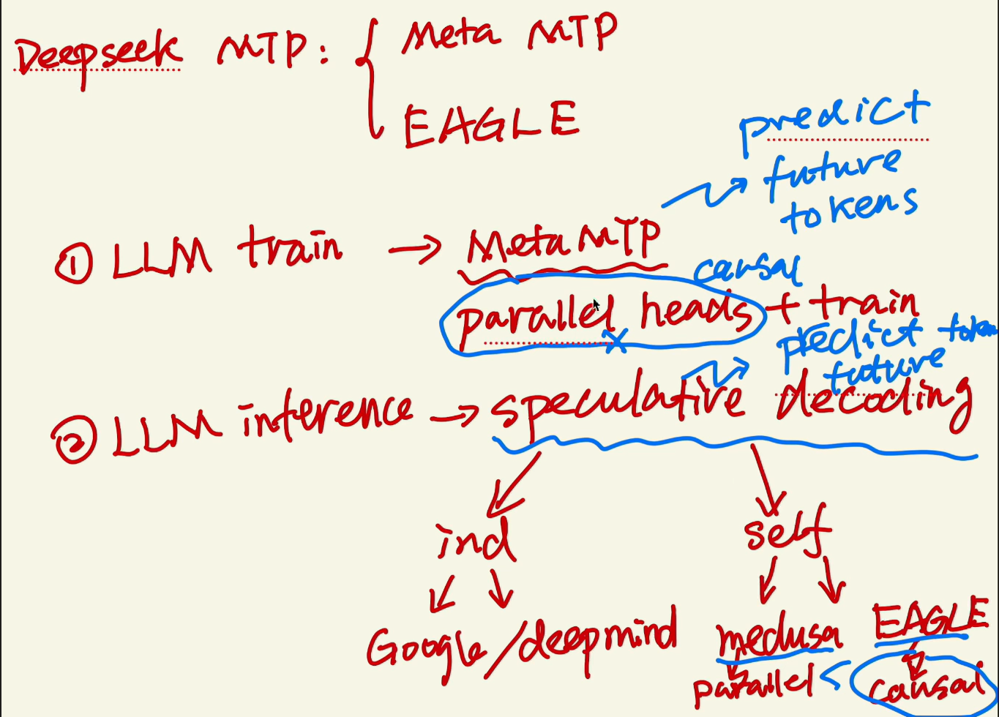
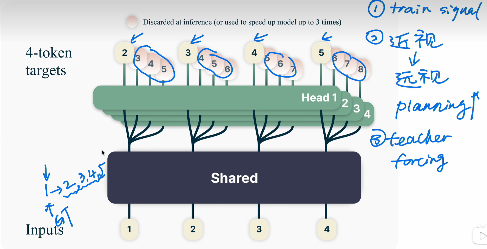
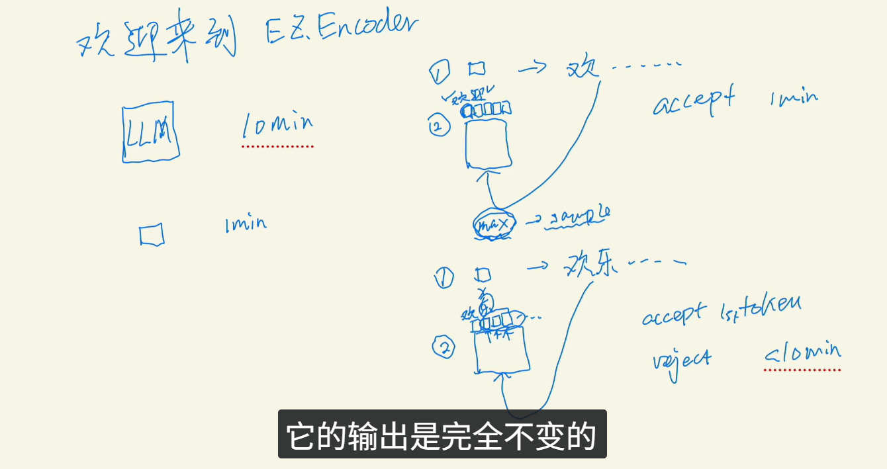
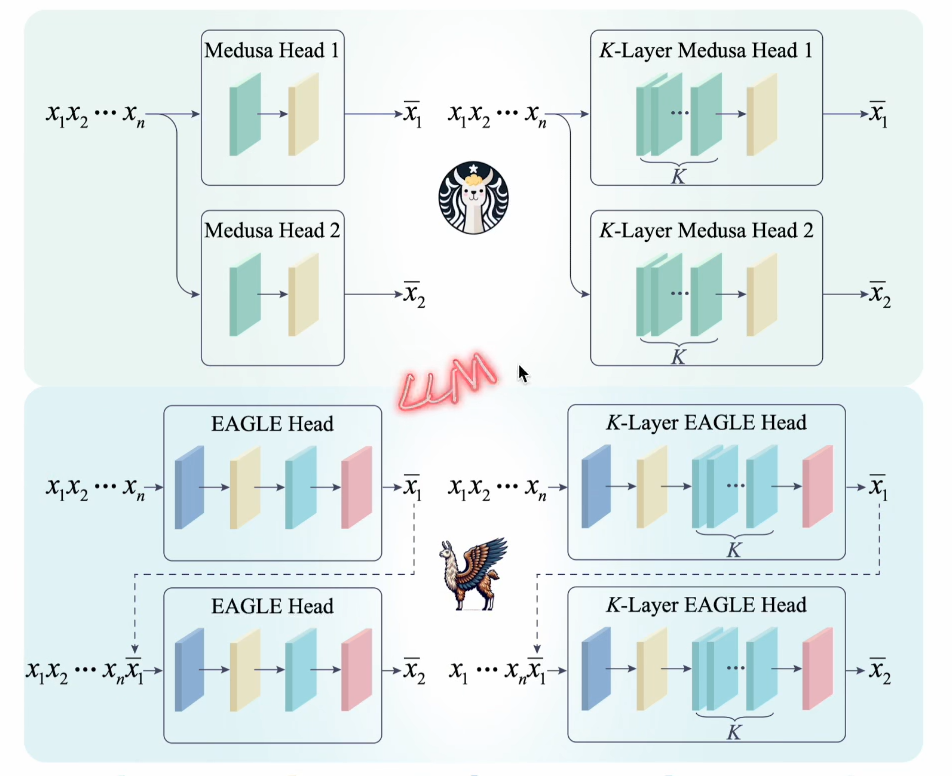
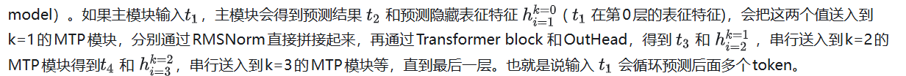
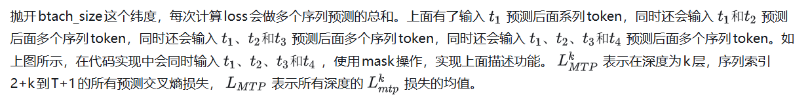

参考链接：
https://www.bilibili.com/video/BV1iQFQeFEwH?spm_id_from=333.788.videopod.sections&vd_source=e6a26642f7f1d14e5b11a109a4dfffe9

https://zhuanlan.zhihu.com/p/22985118565

## 历史溯源

Meta 提粗了parallel heads的预测 在投机采样哪里 有论文提到causal比并行好 deepseek就想到用 causal代替parallel 在前人的基础上

不同的输出头预测后面的token head2 要预测next next token 以此类推  并行有小问题 违背了auto regressive

**投机采样**

一次让小模型生成多个 token，大模型只做一次前向，用“拒绝采样”思想决定接受多少个 token。

合成一个系统后

EAGLE 更符合自回归方式

## 多token预测（MTP，**Multi-Token Prediction）**

为 DeepSeek-V3 设计并制定了一个多token预测（MTP）目标，将预测范围扩展到每个位置的多个后续token。一方面，MTP 增强了训练信号的密度，提高数据效率。另一方面，MTP 可能使模型能够预先规划其表示，从而更好地预测后续token。与之前并行训练不同，MTP是依次预测额外的token，并在每次预测深度保持完整的因果链。

**其中每一个MTP模块由一个共享嵌入层Embedding Layer组成，共享输出层OutHead， 一个Transformer block 模块和投影矩阵（ projection matrix，**是指将低维特征映射到高维空间的矩阵，或是指将高维特征映射到低维空间的矩阵**）组成。** 深度k表示，p表示预测结果，表示第k个MTP模型，k=0表示主模块（main model）。

* 从 2+k2**开始：表示前面 2+k−1**个位置不纳入该深度的 loss
* 到 T+1**结束：很多实现会把训练目标写成“向右 shift 一位”的形式**
* **除以 T** 是一种“固定归一化”的写法 公式上肯定是T-k

