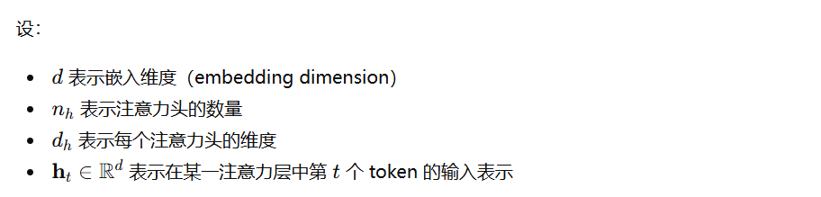
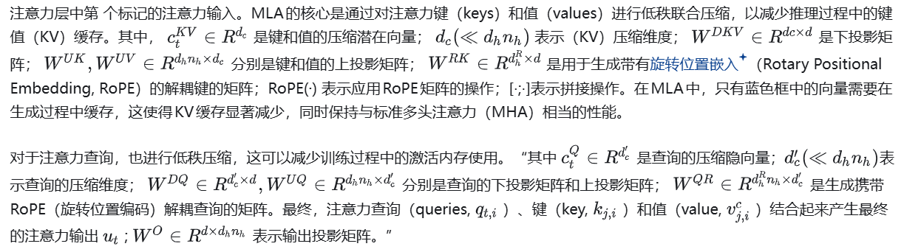

参考链接：
https://zhuanlan.zhihu.com/p/22985118565

## 注意力MLA（Multi-head Latent Attention）


近些年，Attention的模型出现了很多改进版本（GQA，MQA等），但主要思想是，减少KV的数量，达到减少KV Cache显存的使用量，MLA的思想是对KV的纬度降为，实现减少对显存的占用率。**简洁版MLA结构图：**


**MLA公式：**






**671B代码流程图，流程图是根据官网代码画的：**


**流程看着很复杂，实际很简单（代码越简洁，画图看起来就越复杂）**。输入序列批大小batch\_size=2，序列长度seq\_len=32，字映射纬度toekn\_embedding=7168，n\_heads=128每个特特征向量分解为128个头。****其中对q分支做了低纬映射，由7168映射到1536（q\_lora\_rank=1536），再升纬度24576（128\*（128+64））**。对kv分支也做了低纬映射，由7168映射到64和512（kv\_lora\_rank=512），减少KV cache显存使用，其中标上颜色的需要KV cache缓存保存。**q和k都由两部分组成，没有加了旋转位置编码（RoPE）的q和k，会计算一个注意力分数（scores0），加了旋转位置编码（RoPE）的q和k，会计算一个注意力分数（scores1），再把sscores0乘一个softmax\_scale系数加上scores1得到注意力分数（scores），再与kv相乘，最后通过wkv\_b0和wo还原到原始尺寸， **可以看出来kv即作为k的一部分，也作为v** 。

x
│
├── wkv_a ──► c_t^{KV} ──┐
│                        ├── wkv_b（kv解码为V） ──► K_nope, V
└── wkv_a ──► k_t^R ─────┘

**代码：**

```text
{
    "vocab_size": 129280,
    "dim": 7168,
    "inter_dim": 18432,
    "moe_inter_dim": 2048,
    "n_layers": 61,
    "n_dense_layers": 3,
    "n_heads": 128,
    "n_routed_experts": 256,
    "n_shared_experts": 1,
    "n_activated_experts": 8,
    "n_expert_groups": 8,
    "n_limited_groups": 4,
    "route_scale": 2.5,
    "score_func": "sigmoid",
    "q_lora_rank": 1536,
    "kv_lora_rank": 512,
    "qk_nope_head_dim": 128,
    "qk_rope_head_dim": 64,
    "v_head_dim": 128,
    "dtype": "fp8"
}

class MLA(nn.Module):
    """
    Multi-Headed Attention Layer (MLA).

    Attributes:
        dim (int): Dimensionality of the input features.
        n_heads (int): Number of attention heads.
        n_local_heads (int): Number of local attention heads for distributed systems.
        q_lora_rank (int): Rank for low-rank query projection.
        kv_lora_rank (int): Rank for low-rank key/value projection.
        qk_nope_head_dim (int): Dimensionality of non-positional query/key projections.
        qk_rope_head_dim (int): Dimensionality of rotary-positional query/key projections.
        qk_head_dim (int): Total dimensionality of query/key projections.
        v_head_dim (int): Dimensionality of value projections.
        softmax_scale (float): Scaling factor for softmax in attention computation.
    """
    def __init__(self, args: ModelArgs):
        super().__init__()
        self.dim = args.dim
        self.n_heads = args.n_heads
        self.n_local_heads = args.n_heads // world_size
        self.q_lora_rank = args.q_lora_rank
        self.kv_lora_rank = args.kv_lora_rank
        self.qk_nope_head_dim = args.qk_nope_head_dim
        self.qk_rope_head_dim = args.qk_rope_head_dim
        self.qk_head_dim = args.qk_nope_head_dim + args.qk_rope_head_dim
        self.v_head_dim = args.v_head_dim

        if self.q_lora_rank == 0:
            self.wq = ColumnParallelLinear(self.dim, self.n_heads * self.qk_head_dim)
        else:
            self.wq_a = Linear(self.dim, self.q_lora_rank)
            self.q_norm = RMSNorm(self.q_lora_rank)
            self.wq_b = ColumnParallelLinear(self.q_lora_rank, self.n_heads * self.qk_head_dim)
        self.wkv_a = Linear(self.dim, self.kv_lora_rank + self.qk_rope_head_dim)
        self.kv_norm = RMSNorm(self.kv_lora_rank)
        self.wkv_b = ColumnParallelLinear(self.kv_lora_rank, self.n_heads * (self.qk_nope_head_dim + self.v_head_dim))
        self.wo = RowParallelLinear(self.n_heads * self.v_head_dim, self.dim)
        self.softmax_scale = self.qk_head_dim ** -0.5
        if args.max_seq_len > args.original_seq_len:
            mscale = 0.1 * args.mscale * math.log(args.rope_factor) + 1.0
            self.softmax_scale = self.softmax_scale * mscale * mscale

        if attn_impl == "naive":
            self.register_buffer("k_cache", torch.zeros(args.max_batch_size, args.max_seq_len, self.n_local_heads, self.qk_head_dim), persistent=False)
            self.register_buffer("v_cache", torch.zeros(args.max_batch_size, args.max_seq_len, self.n_local_heads, self.v_head_dim), persistent=False)
        else:
            self.register_buffer("kv_cache", torch.zeros(args.max_batch_size, args.max_seq_len, self.kv_lora_rank), persistent=False)
            self.register_buffer("pe_cache", torch.zeros(args.max_batch_size, args.max_seq_len, self.qk_rope_head_dim), persistent=False)

    def forward(self, x: torch.Tensor, start_pos: int, freqs_cis: torch.Tensor, mask: Optional[torch.Tensor]):
        """
        Forward pass for the Multi-Headed Attention Layer (MLA).

        Args:
            x (torch.Tensor): Input tensor of shape (batch_size, seq_len, dim).
            start_pos (int): Starting position in the sequence for caching.
            freqs_cis (torch.Tensor): Precomputed complex exponential values for rotary embeddings.
            mask (Optional[torch.Tensor]): Mask tensor to exclude certain positions from attention.

        Returns:
            torch.Tensor: Output tensor with the same shape as the input.
        """
        bsz, seqlen, _ = x.size()
        end_pos = start_pos + seqlen
        if self.q_lora_rank == 0:
            q = self.wq(x)
        else:
            q = self.wq_b(self.q_norm(self.wq_a(x)))
        q = q.view(bsz, seqlen, self.n_local_heads, self.qk_head_dim)
        q_nope, q_pe = torch.split(q, [self.qk_nope_head_dim, self.qk_rope_head_dim], dim=-1)
        q_pe = apply_rotary_emb(q_pe, freqs_cis)
        kv = self.wkv_a(x)
        kv, k_pe = torch.split(kv, [self.kv_lora_rank, self.qk_rope_head_dim], dim=-1)
        k_pe = apply_rotary_emb(k_pe.unsqueeze(2), freqs_cis)
        if attn_impl == "naive":
            q = torch.cat([q_nope, q_pe], dim=-1)
            kv = self.wkv_b(self.kv_norm(kv))
            kv = kv.view(bsz, seqlen, self.n_local_heads, self.qk_nope_head_dim + self.v_head_dim)
            k_nope, v = torch.split(kv, [self.qk_nope_head_dim, self.v_head_dim], dim=-1)
            k = torch.cat([k_nope, k_pe.expand(-1, -1, self.n_local_heads, -1)], dim=-1)
            self.k_cache[:bsz, start_pos:end_pos] = k
            self.v_cache[:bsz, start_pos:end_pos] = v
            scores = torch.einsum("bshd,bthd->bsht", q, self.k_cache[:bsz, :end_pos]) * self.softmax_scale
        else:
            wkv_b = self.wkv_b.weight if self.wkv_b.scale is None else weight_dequant(self.wkv_b.weight, self.wkv_b.scale, block_size) 
            wkv_b = wkv_b.view(self.n_local_heads, -1, self.kv_lora_rank)
            q_nope = torch.einsum("bshd,hdc->bshc", q_nope, wkv_b[:, :self.qk_nope_head_dim])
            self.kv_cache[:bsz, start_pos:end_pos] = self.kv_norm(kv)
            self.pe_cache[:bsz, start_pos:end_pos] = k_pe.squeeze(2)
            scores = (torch.einsum("bshc,btc->bsht", q_nope, self.kv_cache[:bsz, :end_pos]) +
                      torch.einsum("bshr,btr->bsht", q_pe, self.pe_cache[:bsz, :end_pos])) * self.softmax_scale
        if mask is not None:
            scores += mask.unsqueeze(1)
        scores = scores.softmax(dim=-1, dtype=torch.float32).type_as(x)
        if attn_impl == "naive":
            x = torch.einsum("bsht,bthd->bshd", scores, self.v_cache[:bsz, :end_pos])
        else:
            x = torch.einsum("bsht,btc->bshc", scores, self.kv_cache[:bsz, :end_pos])
            x = torch.einsum("bshc,hdc->bshd", x, wkv_b[:, -self.v_head_dim:])
        x = self.wo(x.flatten(2))
        return x
```

总结把原始的Multi-head Self-Attention设计成MLA（Multi-head Latent Attention）主要作用：**1、是为了降低了kv-cache显存缓存。2、降低使用降维度减少计算量。3、在注意力分数中引入旋转位置编码，对时序更加敏感。**

[wenjtop：注意力MHA、MQA、GQA、Linear Attention到MLA45 赞同 · 4 评论 文章](https://zhuanlan.zhihu.com/p/18071594122)
