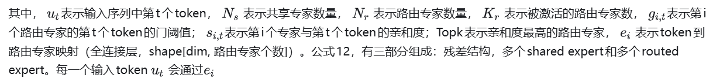
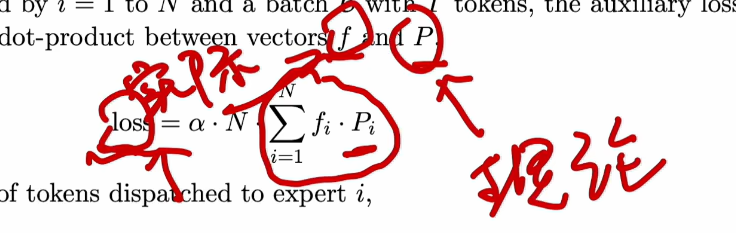
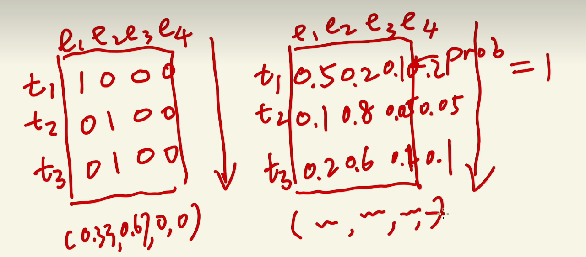

参考链接：
https://zhuanlan.zhihu.com/p/22985118565

https://www.bilibili.com/video/BV15XFQebEBM/?spm_id_from=333.1387.favlist.content.click&vd_source=e6a26642f7f1d14e5b11a109a4dfffe9

两大改进 expert增多 添加了share expert 采用bias这样的loss free方式

## 3.3 混合专家DeepSeekMoE （Mixture-of-Experts）

**3.3.1 DeepSeekMoE是替换了原始self-attention前向传播，DeepSeekMoE可以理解为在前向传播层有很多专家，每个token会选择一些擅长当前任务专家进行特征处理，（这也就是为什么671B的参数，为什么只有37B激活），这样既能保证准确率，又能减少计算量。其中Experts（专家）分为两组shared expert和routed expert，shared expert：是共享专家，每一个输入都会通过它的计算，671B中n\_shared\_experts=1。routed expert：是路由专家，是根据输入选择性选择topk个(8个)被激活，671B中n\_routed\_experts=256。**


上图中左边是共享专家，右边是路由专家，下面是公式：




全连接层nn.Linear(input\_dim, n\_routed\_experts)，得到n\_routed\_experts个分数，再挑选前**Topk=8**个routed expert做为当前token的路径。**每一个专家就是三层全连接网络，专家代码：**

```text
dim: int = 7168
inter_dim: int = 18432
class Expert(nn.Module):
    def __init__(self, dim: int, inter_dim: int):
        super().__init__()
        self.w1 = Linear(dim, inter_dim)
        self.w2 = Linear(inter_dim, dim)
        self.w3 = Linear(dim, inter_dim)

    def forward(self, x: torch.Tensor) -> torch.Tensor:
        return self.w2(F.silu(self.w1(x)) * self.w3(x))
```

**topk筛选代码（每一个token会选不同的几个routed\_experts）：**

```text
topk=8
n_expert_groups=1
# 返回每一个token需要的路由专家权值和选定的专家指标
class Gate(nn.Module):
    def __init__(self, args: ModelArgs):
        super().__init__()
        self.dim = args.dim
        self.topk = args.n_activated_experts
        self.n_groups = args.n_expert_groups
        self.topk_groups = args.n_limited_groups
        self.score_func = args.score_func
        self.route_scale = args.route_scale
        self.weight = nn.Parameter(torch.empty(args.n_routed_experts, args.dim))
        self.bias = nn.Parameter(torch.empty(args.n_routed_experts)) if self.dim == 7168 else None

    def forward(self, x: torch.Tensor) -> Tuple[torch.Tensor, torch.Tensor]:
        scores = linear(x, self.weight)
        if self.score_func == "softmax":
            scores = scores.softmax(dim=-1, dtype=torch.float32)
        else:
            scores = scores.sigmoid()
        original_scores = scores
        if self.bias is not None:
            scores = scores + self.bias
        if self.n_groups > 1:
            scores = scores.view(x.size(0), self.n_groups, -1)
            if self.bias is None:
                group_scores = scores.amax(dim=-1)
            else:
                group_scores = scores.topk(2, dim=-1)[0].sum(dim=-1)
            indices = group_scores.topk(self.topk_groups, dim=-1)[1]
            mask = torch.zeros_like(scores[..., 0]).scatter_(1, indices, True)
            scores = (scores * mask.unsqueeze(-1)).flatten(1)
        indices = torch.topk(scores, self.topk, dim=-1)[1]
        weights = original_scores.gather(1, indices)
        if self.score_func == "sigmoid":
            weights /= weights.sum(dim=-1, keepdim=True)
        weights *= self.route_scale
        return weights.type_as(x), indices
```

**3.3.2 辅助无损负载均衡（Auxiliary-Loss-Free Load Balancing）：**

之前的设计会存在一个问题，某些专家会被多次激活，影响负载均衡，所以引入了奖惩值，使每一个专家激活次数接近。设计了辅助无损负载均衡，对于每一个专家引入了一个偏置项 b\_i ,它会联合亲和度分数 s\_{i,t} 去决定当前路由专家是否会被选中。全程监控每个训练步骤的专家负荷，**对于访问概率较低的专家会在偏置项 b 上增加 ，使该专家有更高的概率被访问。对于访问概率较高的专家会在偏置项 bb 上减去 ，降低该专家选中的概率。** 是一个叫做偏差更新速度的超参数。


**3.3.3 互补序列辅助损失（Complementary Sequence-Wise Auxiliary Loss）：**

DeepSeek-V3主要依靠辅助无丢失策略来实现负载平衡，**为了防止任何单个序列内的极端不平衡，还采用了互补序列辅助损失**， \\alpha\是平衡因子超参数（极小的值，可学习系数）； f\_i表示可以理解为在一个序列中每个token访问第i个路由专家的频率占序列长度 T的比例； P\_i可以理解为在一个序列中每个token访问第i个路由专家的概率均值； 表示序列中令牌的数量， L\_{Bal}考虑在一个序列中，访问所有专家的频率和概率两个因子，**再求损失最小化，**就可以实现在每个序列上的专家负载得到平衡。


这里参考switch transformer 只是改成了sentence维度



实际VS理论

实际上公式有错误在的（错误理解了）  最终都成为uniform不是最低值 比如说0.1 0.9和0.9 0.1就比他小 （f和P不是独立的，都受到router的控制，所以不会发生我的例子.）

fi*Pi可以理解成抑制expert i, fi表示这个expert的受重视程度，Pi表示分配到它的prob；如果fi越大，说明实际上路由到它的token越多，相对应的降低它的Pi；每次压制高个，最后Pi在各个expert之间自然就是uniform了


**3.3.4 路由专家节点限制** 为了减少节点之前的通信，确保每个令牌将被发送到最多M个节点（M台服务器），K\_r表示被激活的路由专家数，根据分布在每个节点上的专家中最高 K\_r/m个亲和度得分的总和来选定的（m=4，k=8，表示选中4个节点，每个节点选中2个路由专家）。**在这个约束条件下，MoE训练框架几乎可以实现完全的计算和通信重叠。

**3.3.5 不丢弃token**。采用了有效的负载均衡策略，DeepSeek-V3 在整个训练过程中能保持良好的负载均衡，不会丢弃任何标记。还实施了特定的部署策略以确保推理负载均衡，所以在推理期间也不会丢弃token。
