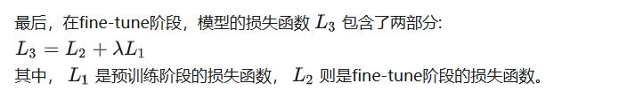
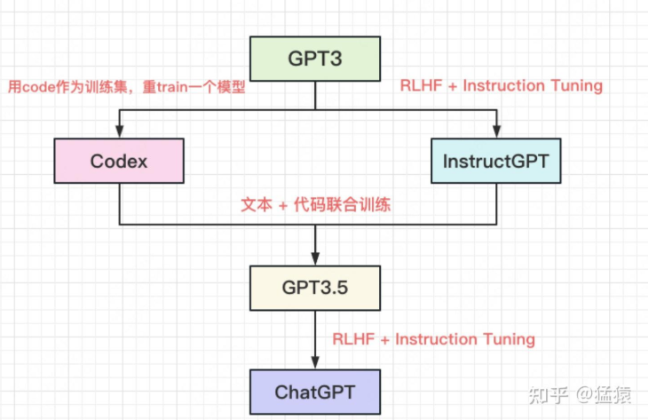
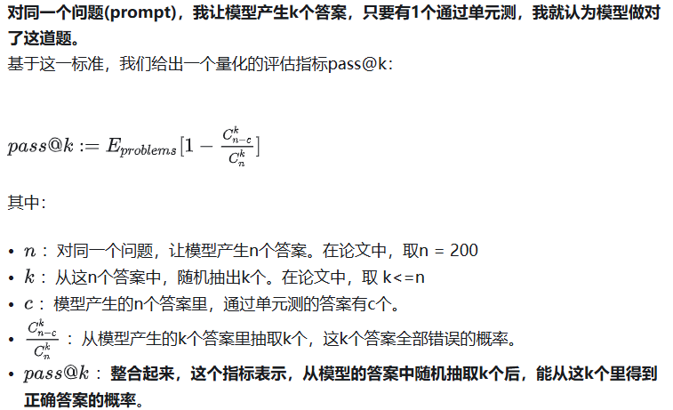

实际上没必要列出，大部分技术已经单独列出了，这里看看进化历史

参考链接：

https://zhuanlan.zhihu.com/p/609367098

# 1 演变历史

2017年，Google推出Transformer，利用Attention完全替代过往深度学习中的Recurrence和Convolutions
结构，直白地展现出了“大一统模型”的野心，"xxx is ALL you need"也成了一个玩不烂的梗。

2018年6月，openAI推出基于**Transformer Decoder** 改造的第一代**GPT（Generative Pre-Training）** ，有效证明了在NLP领域上使用**预训练+微调** 方式的有效性。紧随其后，同年10月Google推出基于**Transformer Encoder** 部分的**Bert** ，在同样参数大小的前提下，其效果领跑于GPT1，一时成为NLP领域的领头羊。

不甘示弱的openAI在4个月后，推出更大的模型GPT2（GPT1: 110M，Bert: 340M,，GPT2: 1.5B），同时，openAI也知道，光靠增加模型大小和训练数据集来获得一个和Bert差不多效果的模型，其实是没有技术含量的。于是，在GPT2里，openAI引入zero-shot并证明了其有效性。

此后，openAI在LLM上义无反顾地走了下去，在2020年6月推出巨人GPT3，参数量高达175B，各类实验效果达到顶峰，（据说）一次训练费用为1200w美元，“贵”也成了普通工业界踏足GPT系列的壁垒之一

# 2 GPT1

在CV里，**pre-training + fine-tune** 的方式盛行已久：先用海量有标注的数据集，通过有监督的训练生成一个预训练模型，然后通过下游任务，在这个模型上做微调。但是在NLP中，这个方式一直很难做起来，原因是：

* 缺乏大量标注好的文本数据集
* 比起图像信息，文字的信息更难被模型理解

Transformer出世后，模型对文字上下文的理解能力得到显著增强，在这一铺垫下，GPT1诞生了

**训练流程**：❤️

* 首先，用**无标注的数据** （可以理解为一段普通的文字）训练一个预训练模型。在这个环节里，我们培养模型**文字接龙** 的能力，也就是给定前k个词，模型能预测出第k+1个词。（pre-training）
* 然后，在模型能够理解文字含义的基础上，用**有标注的数据** 训练模型去定向做一些下游任务。例如文本分类，文本相似性比较等。有标注的数据集是远小于无标注数据集的，在这个环节，我们只是对模型做了一些微小的调整。（fine-tuning）

# 3 GPT2

Encoder VS Decoder，Bert VS GPT1，战火已经拉开，但是此时GPT1仍处在劣势。前面说过，基于Decoder的模型，模型和数据量越大，效果越好。但如果只做到这一点，从技术上来说又太逊色了，性价比也不高。因此，openAI从训练数据上进行改进，**引入了zero-shot这一创新点**，GPT2就诞生了。（没什么创新 就是大力）

GPT2的核心思想是：**只要我的数据够多够好，只要我的模型够大够强。我可以直接去掉fine-tune，训练出一个通用的模型。**

Zero-shot，One-shot和Few-shot的区别见下文:

[zero-shot](../../杂谈/学习方式.md)

GPT2希望通过喂给模型Zero-shot类型的样本，不告诉模型“做什么”，“怎么做”，让模型自己去体会。但是，你总不能让所有的数据都长成图例里Zero-shot那样吧，那和去标注数据有什么区别？所以，这时候，语言的魅力就来了。**一段普通的文字里，可能已经蕴含了“任务描述”、“任务提示”和“答案”这些关键信息** 。比如，我想做英法文翻译这件事，那么我从网上爬取的资料里可能有这样的内容：

1. ”I’m not the cleverest man in the world, but like they say in French: **Je ne suis pas un imbecile [I’m not a fool]** .
2. “I hate the word ‘**perfume** ,”’ Burr says. ‘It’s somewhat better in French: ‘**parfum** .’

# 3 GPT3

GPT3沿用了去除fine-tune，只做通用模型的思路，同时技术上小做替换（sparse Transformer），然后在训练数据中引入Few-shot（毕竟完全不给模型任何显性提示，效果确实没达到预期），最终生成了一个大小高达175B的庞然大物，当然效果也是一骑绝尘的。

# 4 GPT-3.5

靠着codex和instructGPT实现突变，instructGPT部分在post-training/RLHFRLHF中

根据openAI官网介绍，GPT3.5是一个系列模型，也就是保持基本训练框架不变，用不同的数据做指令微调，会得到不同的模型，这些模型都叫做GPT3.5。我们为了简化，就不罗列不同版本间的迭代关系了。只需要记住核心一点：**上述中的所有模型，都是以GPT3的模型架构为准，通过变换训练数据做指令微调，或引入RLHF（Reinformcement Learning from Human Feedback）得到的** 。

本文将重点关注图中的Codex，来介绍ChatGPT是如何拥有编写代码的能力的。本文中介绍的是初代Codex，只具有编写Python的能力。后续的迭代版本中对训练数据做了改进，直至引入ChatGPT时，能编写多种语言代码，也拥有更高的准确率。在这过程中，算法层面的设计思想，是基本保持不变的。

## 4.1 Codex

### 流程

**（1）训练数据** ：从github上爬下小于1MB的python文件，去除掉那些可能是自动生成的、平均每行长度大于100的、最大行长度大于1000的、几乎不含字母数字的。经过清洗处理后，最终得到1**59GB的训练集** 。
**（2）预训练** ：将清洗过后的数据集送入GPT3架构的模型中，**重新训练一个模型** 。注意这里不再是基于GPT3做微调，也不再使用GPT3训好的权重。而是整个重新训练。**最终得到一个12B参数量的模型Codex。**
**（3）有监督微调** ：为了解决训练数据和评估数据间的的gap（下文会细说），需要新的训练数据做微调。
格式上，这批数据需要满足：

* **prompt + completion形式** 。prompt中包含函数签名(def部分)和函数注释，completion即代码的主体，是根据注视要求写出的代码，也即监督训练的文本标签。
* **单元测（unit tests）** 。用于测试代码是否准确。**这也是代码文本和文字文本在评估方面的主要差异** ，下文会展开说。

### 评估

Codex在评估时，构造了全新数据集**HumanEval** 。它的组成为：

* 函数签名（function signature，即def部分）
* 函数注释（docstring）
* 函数主体
* 单元测（unit tests）

为了防止模型在训练时看到过类似题目，HumanEval中的全部数据都是人类亲自构造的。虽然不能保证算法题目具有创新性，但是整体表达，特别是注释表达上，是全新的。这套数据集一共有164个题目。
示例数据如下，白色部分是输入给模型的数据（prompt），黄色部分是期待模型给出的答案（completion）。

**评估标准**

**当k越大时，模型更有可能产出正确的答案。因此研究时，也要考虑k对评估指标的影响** 。

**模型输出**

**（1）停止条件**
评估阶段，我们不能让模型一直无条件地生成代码，必须给定一个停止标志。当模型遇到'\nclass'，'\ndef'，'\n#'，'\nif'，'\nprint'时，停止输出。这里碰到'\nif'停止，主要原因可能是HumanEval数据集里，所有的if...elif...else的条件都放在一行进行表述。'\nclass'和'\ndef'则表示开启了一个新类/方法。遇到'\nprint'停止则是防止开始产生废话。

采样方法 top-p

# 总结

当你读到这里的时候，你已经发现了，GPT1-3系列越写越短，和GPT的越来越大成正比。这也证实了GPT发展的核心思想：大力出奇迹。
