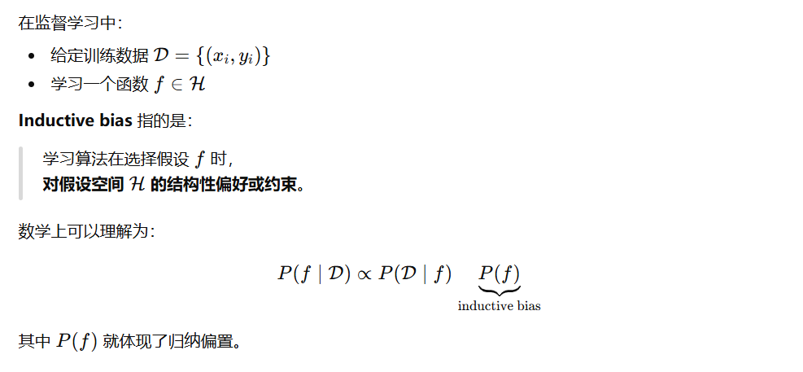

**Inductive bias（归纳偏置）**是机器学习里一个** 非常核心但经常被一句话带过** 的概念。我分四层来解释：**直觉 → 正式定义 → 常见类型 → 在深度学习/大模型中的具体例子** 。

---

## 一、一句话直觉版（最好记）

> **Inductive bias = 模型在“没看完数据之前，就已经倾向相信的假设”。**

换句话说：

> **当数据不足或存在歧义时，模型“更愿意相信哪种解释”。**

---

## 二、为什么一定需要 inductive bias？

假设没有任何 inductive bias：

* 训练数据有限
* 可行的函数有无穷多个
* **所有函数都同样合理**

👉 结果：**无法泛化（generalization）**

> **没有 inductive bias，就没有学习。**
> （这是 No Free Lunch 定理的直观含义）

---

## 三、正式一点的定义

---

## 四、Inductive bias 从哪里来？（非常重要）

### 1️⃣ 模型结构（architecture）

这是**最强的 inductive bias** 。

| 结构        | 隐含假设            |
| ----------- | ------------------- |
| CNN         | 局部性 + 平移不变性 |
| RNN         | 时间顺序重要        |
| Transformer | 任意位置可交互      |
| GNN         | 图结构、邻居相关    |

👉 比如 CNN 假设：

> “相邻像素比远处像素更相关”

---

### 2️⃣ 参数共享（parameter sharing）

* 卷积核共享
* 多头注意力共享投影结构

假设的是：

> **同一种模式会在不同位置重复出现**

---

### 3️⃣ 正则化（regularization）

* L2 / weight decay
* Dropout
* Early stopping

本质是在说：

> **简单模型比复杂模型更可信**

（Occam’s Razor）

---

### 4️⃣ 损失函数（loss function）

不同 loss 强迫模型学不同东西：

| Loss             | 偏好               |
| ---------------- | ------------------ |
| MSE              | 平滑、平均         |
| Cross-Entropy    | 正确分类概率       |
| Contrastive loss | 拉近相似、推远不同 |

---

### 5️⃣ 数据与数据增强

* 数据本身就是 bias
* augmentation = 人工注入先验

例如：

* 翻转图片 → “左右不影响类别”
* Mask language modeling → “上下文决定词义”

---

## 五、Inductive bias 的“好与坏”

### ✅ 好处

* 提高样本效率
* 更快收敛
* 泛化更好

### ❌ 风险

* 假设错了 → 模型上限被锁死
* 过强 bias → 欠拟合

👉 核心是：**bias 是否和任务结构匹配**

---

## 六、在大模型（LLM）里的 inductive bias

这是你现在聊的内容的**关键落点** 。

### 1️⃣ Transformer 的 inductive bias

相比 CNN / RNN：

* **bias 很弱**
* 几乎不假设结构

这意味着：

> **Transformer 更依赖数据规模来“学结构”**

---

### 2️⃣ 但它仍然有 bias

| 设计      | 隐含 bias          |
| --------- | ------------------ |
| 自回归    | 语言是序列         |
| Attention | 依赖关系可稀疏     |
| RoPE      | 相对位置信息重要   |
| MLA       | 低秩相关性足够表达 |
| MTP       | 未来 token 可预测  |

你前面问的 **MLA、MTP、Speculative decoding**
**本质都是在“补 inductive bias”** ，而不是随便加技巧。

---

## 七、一个非常重要的总结（适合论文）

> Modern large language models rely less on strong architectural inductive biases and instead learn structure from large-scale data; however, carefully designed biases—such as positional encoding, low-rank attention, and multi-token prediction—remain crucial for efficiency, stability, and generalization.

---

## 八、用一句最“通俗但准确”的话收尾

> **Inductive bias 就是模型在还没学会之前，就已经“站好队”的那部分倾向。**
