参考链接：
bilibili.com/video/BV1x8sQerEar/?spm_id_from=333.1387.homepage.video_card.click

研究问题
--------

[Quiet-STaR](https://zhida.zhihu.com/search?content_id=248326752&content_type=Article&match_order=1&q=Quiet-STaR&zhida_source=entity)旨在解决语言模型在处理文本时如何更有效地进行推理的问题。具体来说，它试图解决以下几个挑战：

1. **计算成本**：生成文本续写（continuations）的计算成本很高，尤其是在需要为文本中的每个token生成推理（rationales）时。
2. **初始能力缺失**：语言模型最初并不知道如何生成或使用内部思考（internal thoughts）来辅助预测。
3. **超越单个token的预测**：需要模型能够预测文本中不仅仅是下一个token，而是更远未来的token。

   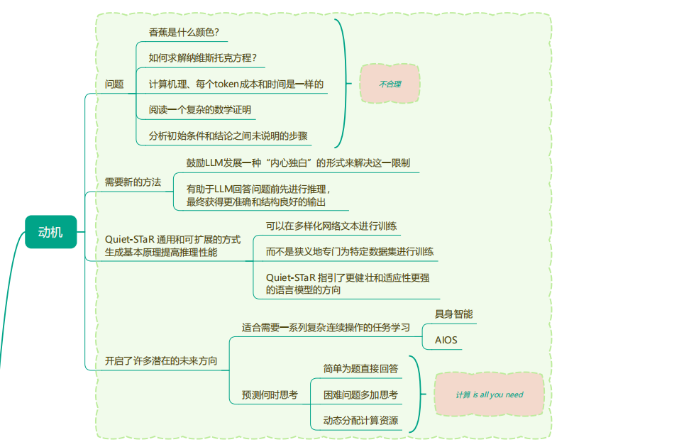

Quiet-STaR通过以下方式来应对这些挑战：

* **并行采样算法**：通过学习token来指示思考的开始和结束，同时生成推理，以解释未来的文本并改进预测。
* **混合头部（mixing head）**：使用混合头部来决定在给定推理的情况下，应该如何结合基于推理的下一个token预测和原始语言模型的预测。
* **[REINFORCE算法](https://zhida.zhihu.com/search?content_id=248326752&content_type=Article&match_order=1&q=REINFORCE%E7%AE%97%E6%B3%95&zhida_source=entity)**：使用REINFORCE算法来增加那些有助于模型预测未来文本的推理的可能性，同时丢弃那些使未来文本预测变得不太可能的推理。

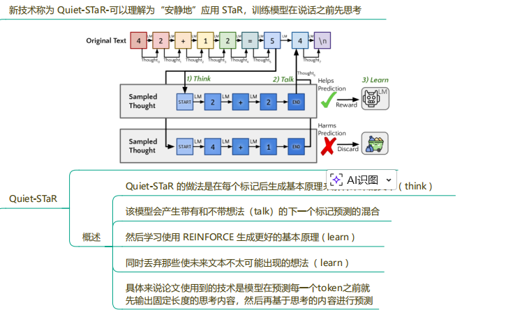

解决方案
--------

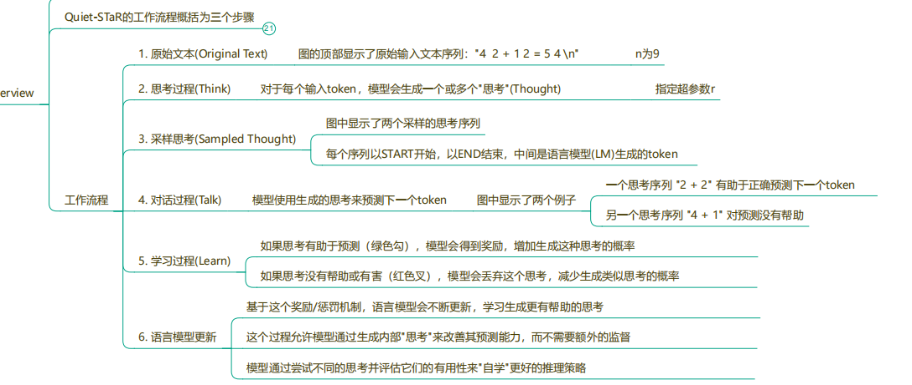

Quiet-STaR（Quiet Self-Taught Reasoner）的原理是通过训练语言模型（LM）在生成每个token时都生成一个推理过程（rationale），从而提高模型对后续文本的预测能力。这种方法的核心思想是，通过在每个token后面插入一个推理步骤，可以帮助模型更好地理解和预测文本的深层含义。Quiet-STaR的工作原理可以概括为以下三个主要步骤：

1. **并行推理生成（Parallel Rationale Generation）**： 在输入序列的每个token后面，模型并行生成多个推理（rationales）。这些推理由特定的起始和结束标记（如`<|startofthought|>`和`<|endofthought|>`）标识。
2. **混合推理和基础预测（Mixing Post-Rationale and Base Predictions）**： 模型使用一个“混合头”（mixing head），这是一个浅层的多层感知机（MLP），它输出一个权重，决定在给定推理后生成的下一个token预测（logits）与基础语言模型预测之间的混合程度。
3. **优化推理生成（Optimizing Rationale Generation）**： 使用REINFORCE算法，根据推理对未来token预测的影响来优化推理生成参数。模型通过增加那些使未来文本预测更有可能的推理的可能性，同时减少那些使预测变得不太可能的推理的可能性，来提高推理的质量。

该方法表面上与**传统的 Chain-of-Thought（CoT）**类似，但其核心创新在于将推理能力内化为模型本身的固有能力，而非依赖人工标注的推理示例进行监督训练。模型通过自我生成与自我对照的方式学习推理，不需要人工构造的 step-by-step 数据，从而具备更强的普适性与可扩展性——即使仅在大规模通用网络文本上训练，也能显著提升诸如数学等领域测试上的表现。由于无需人工标注，其训练过程易于 scale，论文中仅使用 1 台 8 卡 H100、7B 规模基座模型便取得明显提升，理论上更大模型与更长训练可获得更优效果。其独特价值体现在：① **通用性** ：可从任意文本中自发学习推理模式；② **可扩展性** ：摆脱人工 CoT 数据依赖，可利用海量原始文本训练；③ **自主学习** ：模型通过自我探索不断改进其内部推理过程。

## 并行采样

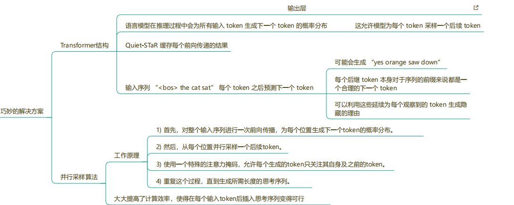

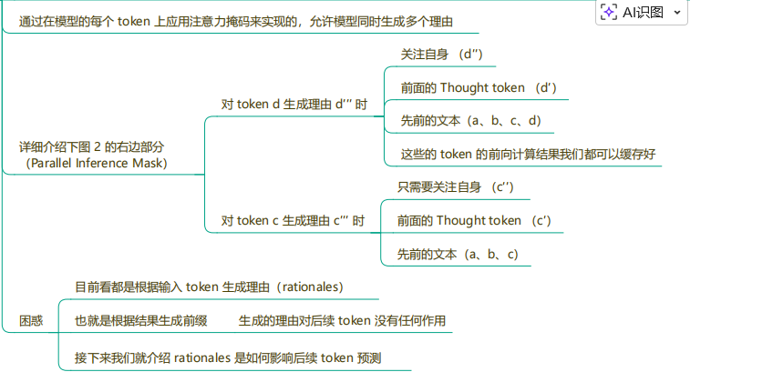

### **Mixing (Residual) Heads**

Mixing (Residual) Heads 示意图

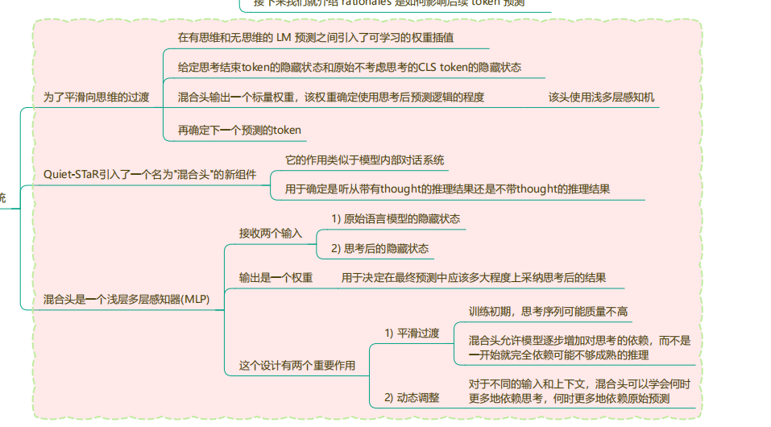

## REINFORCE优化

### 非短视评分

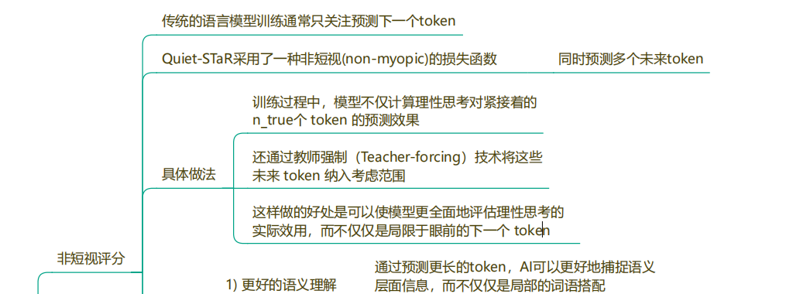

### teacher Forcing

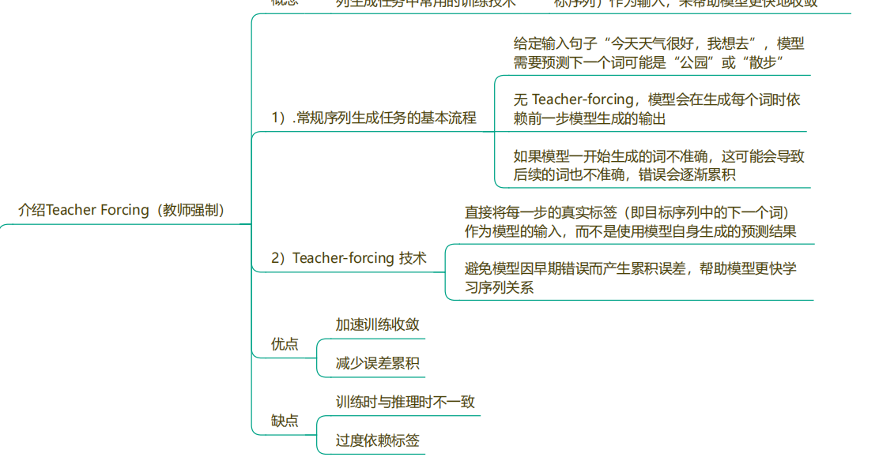

在这种方法里，模型的训练方式跟传统序列生成不太一样。它会把“真实未来的序列值”（也就是标签）直接当成下一个时间步的输入，这其实就和 teacher-forcing 很像。这样做的好处是：即使模型生成的 thought 本身没有真实标注可以对齐，它也不会因为无法反向传播而卡住。

传统方法只能一条线、一条线地生成 token，并且用“生成 token 和真实 token 的差距”来反向传播。但在这个方法里，模型是**并行地** 为序列中的每一个 token 生成多个可能的思考（thought）。举个简单例子，假设文本是 “The cat sat on the mat.” 模型在看到 token “cat” 时，可能会同时生成：

* “Because it is an animal.”
* “Because it is a pet.”
* “Because it is mentioned in the text.”

对于每一个 token，模型都会生成一堆“可能都对”的解释。问题是：这里没有一个唯一正确的 thought，thought 也无法和某个真实标签对齐。所以传统的“预测错误 → 算损失 → 反向传播”那一套完全不适用。

因此，这个方法的训练重点不是让模型学会“生成正确 token”，而是让模型知道“哪些 thought 是有效的”。每个 thought 的好坏都必须立即反馈给模型，让模型知道哪些思考是合理的、哪些是无效噪声。

总结一下：

* 模型并不是按顺序生成一个 token 的思考，而是一次性为整个序列所有 token 产生多个 reasoning thoughts。
* 因为这些 thought 没有“标准答案”，反向传播不能像生成 token 那样进行。
* 训练的核心是评估 thought 是否有效，让模型逐渐掌握“什么样的思考有帮助”。

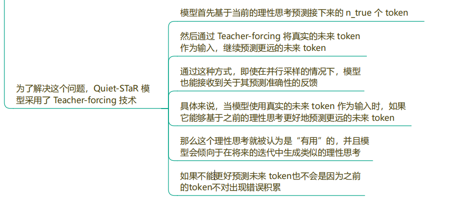

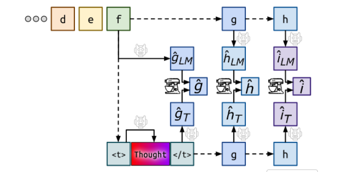

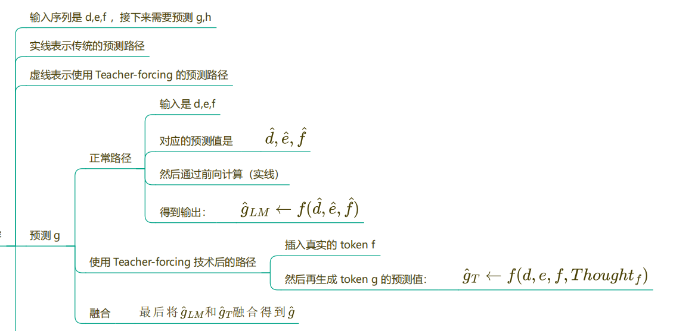

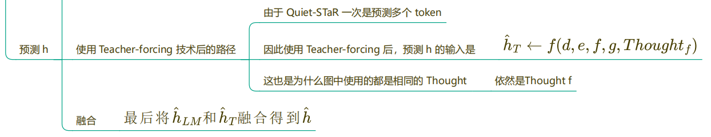

### RL

为了让模型学会“更有用的理性思考（thought）”，这篇工作用了 **REINFORCE** 来优化——简单理解，就是把每个 thought 当成一个“动作”，然后根据它到底有没有帮到后面的预测，给它发“奖金”或“扣分”，用这个奖励来更新模型参数。

训练时，模型的目标函数不是单一的交叉熵（NLL Loss），而是一个**“NLL + REINFORCE” 的组合损失**：

* NLL 这部分还是负责让模型把文本本身学好，不乱预测；
* REINFORCE 这部分则专门用来调教 thought 的质量——哪些思考方式能真的帮助预测后面的 token，就多奖励；没什么用甚至误导的 thought，就少给甚至负奖励。

在 Quiet-STaR 里，对**每个输入位置 j** ，模型都会生成**多条不同的思考（thoughts）** 。然后，每一条 thought 都要拿去预测接下来的一段真实文本（比如后面 n_true 个 token），如果在这条 thought 的“加持”下，模型预测得更准，那这条 thought 的 reward 就高，反之就低。最后，REINFORCE 用这些 reward 来调整模型：

* 有帮助的思考习惯被“强化”；
* 没帮助的思考方式被“淡化”。

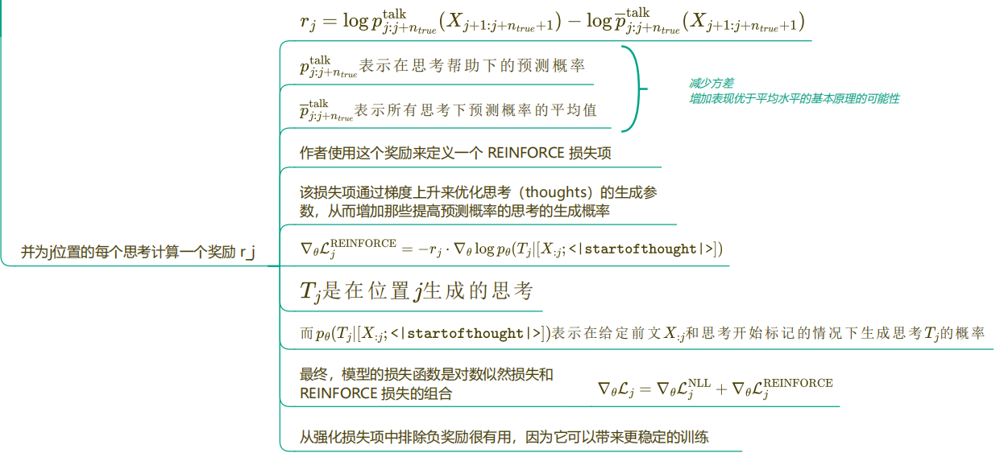

REINFORCE用于优化生成的推理（rationales）以提高语言模型对后续文本的预测能力。REINFORCE通过调整生成推理的过程，使得模型更倾向于生成那些能够提高未来文本预测准确性的推理。具体步骤如下：

REINFORCE 优化算法为 Quiet-STaR 提供了一个灵活且强大的框架，使其能够学习生成有助于提高语言模型预测能力的内部推理。这种方法克服了传统监督学习在处理复杂生成任务时的局限性，并允许模型通过与环境的交互来学习。

### 总体流程

**算法输入（Inputs）**

算法需要以下几个基本设定：

* **初始语言模型参数 θ**

  就是训练前模型的权重。
* **训练步数 num_steps**

  要训练多少步。
* **序列长度 l**

  每次输入给模型的文本长度。
* **思考长度 t**

  每个位置要生成的 thought 的最大长度。
* **学习率 α**

  更新参数时的步长。
* **批量大小 b**

  每次训练读取多少条样本。
* **每个 token 生成的 thought 数量 k**

  表示模型在每个位置 j 会生成多少条不同的思考（例如 4 条）。
* **用于监督每个 thought 的真实 token 数 n_true**

  比如 n_true = 6，就是让模型在生成每一条 thought 后，去预测接下来 **6 个真实 token** ，并据此计算 loss。
*

**算法输出（Output）**

* **训练后的语言模型 θ′**

  这个模型不仅能预测下一个 token，还能**在预测前生成 Thought** ，并利用 Thought 来提升未来 token 的预测能力。

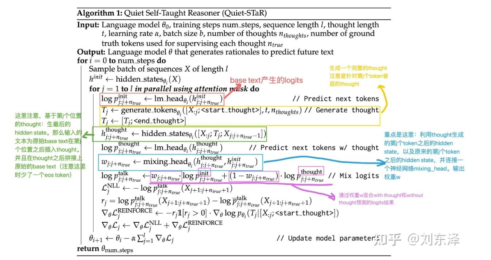
