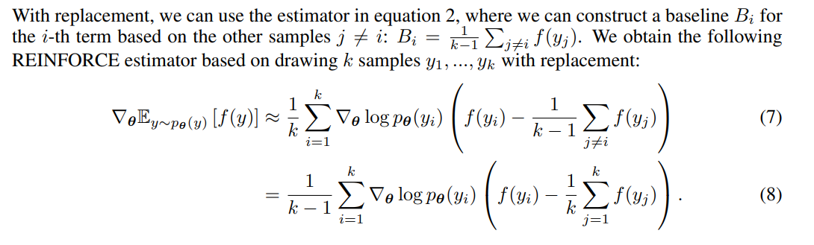

参考链接：
chapfa https://yuanchaofa.com/post/kimi-k1.5-paper-reading-notes.html

kimi研究员  https://www.zhihu.com/question/10114790245/answer/84028353434

### o1 实际上是 In Context RL with Self-Critique

o1 实际上是把in context rl的完整trajectory当做一条message给训进去了。

如下面的code:

什么是In Context RL呢？

[**In-context Reinforcement Learning with Algorithm Distillation****arxiv.org/abs/2210.14215**](http://arxiv.org/abs/2210.14215)

不了解的同学可以看这边，简单的说就是模型做next token prediction的过程本身就是一个rl探索过程。

模型做一个题，在Long CoT下，实际上在做什么呢？

实际上也在学习做这个题，它输出的整个轨迹就是：

s1,a1,r1,a2,r2,a3,r3,.....

其中a可以认为是一种解决方法，可以看做action，而r就是reward，但这里是模型自己做reflection得到的reward，所以我说它是自带critic/world model的in context rl。

最近有相关blog也终于说了这件事，大家也是可以看看：

[**https://blog.ml.cmu.edu/2025/01/08/optimizing-llm-test-time-compute-involves-solving-a-meta-rl-problem/****blog.ml.cmu.edu/2025/01/08/optimizing-llm-test-time-compute-involves-solving-a-meta-rl-problem/**](http://blog.ml.cmu.edu/2025/01/08/optimizing-llm-test-time-compute-involves-solving-a-meta-rl-problem/)

但它没有提到self-critique这个问题。

所以这个事情变复杂了呀。

如果把long cot输出建模成in context rl with self-critique，那么我们怎么优化它呢？

首当其冲的问题就是每一句话的value是多少？

然后你会发现这个value已经非常难以估计了。

举个非常简单的例子：计算1+1=？

然后模型输出 1+1=3，不对，1+1=4呢？也不对，因为4-1=3。那么1+1=1呢？ 不对，因1不等于1-1=0..... 哦对了，左手有一颗糖，右手也有一颗糖，左手的糖放到右手，那么我右手有两颗糖，我知道了，1+1=2

你会发现：

> 如果模型不会反思，那么犯错了就是错的，value就会是负值。但如果模型会反思，那么只要知错能改，最终是对的，那么这些错误都不算错误。value就不应该为负。

由此，我们看到Policy会不会反思，其对应的value差异非常大。我们没办法用一个off policy的value 去优化Policy，而对于next token prediction的场景，我们已非常难以去分解step，也不太可能每一个step都去做大规模mc rollout来估计当前value。更进一步的设想一个context 几乎无限长的场景（10M)，比如可以几乎无限悔棋的围棋，那么这个场景已经无限接近非MDP的状态，以至于value难以估计。

这让我想到了人生：

o1 即 人生。人生就是一条有限的串行轨迹，各种探索，各种犯错，然而除了杀人放火你无法评价某种犯错/挫折的价值会是好还是坏（比如steve jobs可以被自己创立的公司解雇），最终的结局都取决于自己的目标。 **

所以，我们可以从逻辑上判断**我们不要训value，不要搞prm了，因为不会准的。**

> **不管模型中间做错了什么，只要不是重复的，那么最后模型做对了，我们就认为这是一个好的探索，值得鼓励。反之，如果模型一顿探索，最后做错了，那么再努力也是错，要惩罚。**

我们把问题变成了[Contextual Bandit](https://zhida.zhihu.com/search?content_id=709920330&content_type=Answer&match_order=1&q=Contextual+Bandit&zhida_source=entity)的问题。那么我们就可以用[REINFORCE](https://zhida.zhihu.com/search?content_id=709920330&content_type=Answer&match_order=1&q=REINFORCE&zhida_source=entity)的变种来做啦。

上面这就是最基本的REINFORCE的公式，简单的说就是做对加梯度，做错减梯度。当然，我们需要让训练更稳定，所以可以加KL，加reward的normalization等等一些小trick，具体可以看下paper。但基本的思想就是这么简单。

有了基本思路，那么剩下的就是实操了。但这里其实还有一个重要问题：

**Long CoT是如何变长的？这可能是最关键的事情。**

惊喜的是在我们实际训练的过程中，我们有了重要的发现：

> 模型会随着训练提升performance也不断增加token数！

也就是这是RL训练过程中模型可以自己涌现的！
