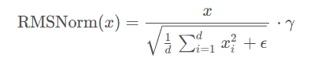
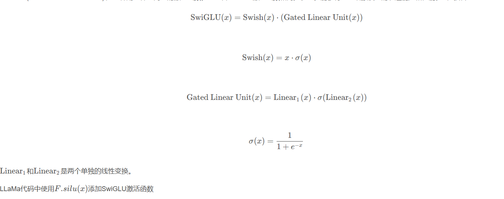
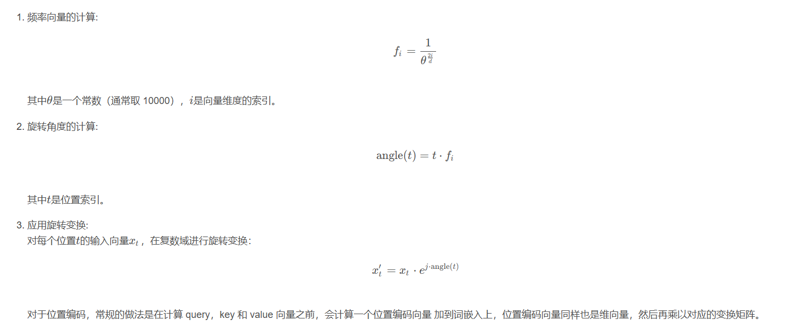

LLaMA详解
---------

LLaMA（Large Language Model Meta AI）是由Meta（前身为Facebook）开发的一种大规模语言模型，旨在提高自然语言处理（NLP）任务的性能。LLaMA基于变换器（Transformer）架构，并经过大规模数据训练，以便在多种语言任务中表现出色。

**Meta AI认为：对于给定的计算预算，最佳性能不是通过最大的模型实现的，而是通过在更多数据上训练的较小模型实现的。**

模型结构
--------

与GPT等生成模型类似，LLaMA也只使用了Transformer的解码器，但基于Transformer进行了三个改进：

1. 使用了GPT3的预标准化。为了提高训练稳定性，对每个Transformer子层的输入进行归一化，而不是对输出进行归一化。使用由RMSNorm 归一化函数。
2. 用 SwiGLU 激活函数替换 ReLU 非线性，以提高性能。使用$\frac{2}{3}4d$的维度代替PaLM中的4d。
3. 类似GPTNeo，删除了绝对位置嵌入，而是添加了旋转位置嵌入（RoPE）。

下面逐一介绍这三个改进：

### RMSNorm

RMSNorm（Root Mean Square Normalization）是一种归一化技术，用于稳定和加速神经网络的训练过程。与其他归一化方法（如BatchNorm和LayerNorm）不同，RMSNorm通过计算输入张量的均方根（RMS）来进行归一化。RMSNorm公式如下：



其中x是输入向量，d是输入向量的维度，ϵ是一个小常数，用于避免除零错误，γ是一个可学习的缩放参数。

LLaMa中的实现如下：

```python
class RMSNorm(torch.nn.Module):  
    def __init__(self, dim: int, eps: float = 1e-6):  
        super().__init__()  
        self.eps = eps  
        self.weight = nn.Parameter(torch.ones(dim))  
  
    def _norm(self, x):  
        return x * torch.rsqrt(x.pow(2).mean(-1, keepdim=True) + self.eps)  
  
    def forward(self, x):  
        output = self._norm(x.float()).type_as(x)  
        return output * self.weight
```

### SwiGLU激活函数

SwiGLU (Swish-Gated Linear Unit) 是一种用于神经网络的激活函数，它结合了Swish激活函数和门控机制，能够有效地增强模型的表达能力和性能。公式如下：



### RoPE

旋转位置嵌入（Rotary Position Embedding, RoPE）是一种为序列模型（如Transformer）提供位置编码的方法。RoPE通过将输入向量在复数域进行旋转变换，来编码序列中位置的信息。与传统的位置编码方法（如正弦-余弦位置编码）相比，RoPE能够更好地捕捉序列中的相对位置信息，提高模型的表现力。

旋转位置嵌入（RoPE）是一种为序列模型提供位置编码的方法。其通过将输入向量在复数域进行旋转变换来编码位置信息。以下是RoPE的具体实现步骤：



**RoPE 的 self-attention 操作的流程是：对于 token 序列中的每个词嵌入向量，首先计算其对应的 query 和 key 向量，然后对每个 token 位置都计算对应的旋转位置编码，接着对每个 token 位置的 query 和 key 向量的元素按照**两两一组**应用旋转变换，最后再计算 query 和 key 之间的内积得到 self-attention 的计算结果。**

下图很直观的展示了旋转变换的过程：


旋转编码 RoPE 可以有效地保持位置信息的相对关系，**即相邻位置的编码之间有一定的相似性，而远离位置的编码之间有一定的差异性。** 这样可以增强模型对位置信息的感知和利用。这一点是其他绝对位置编码方式（如正弦位置编码、学习的位置编码等）所不具备的，因为它们只能表示绝对位置，而不能表示相对位置。

> 为什么旋转位置嵌入有效？
>
> 1. 捕捉相对位置信息：传统的位置嵌入方法通常仅编码绝对位置，这可能在处理长序列或需要捕捉相对位置信息的任务中表现不佳。而RoPE通过旋转变换自然地引入了相对位置信息，使得模型能够更好地理解序列中各个位置之间的相对关系。
> 2. 由于RoPE通过复数域的旋转变换来编码位置，这种变换能够捕捉更加丰富的位置信息。相比于简单的线性变换，旋转变换提供了更强的非线性表达能力，使得模型在处理复杂任务时具有更好的表现力。
> 3. RoPE的计算相对简单，不需要复杂的矩阵运算。预计算频率向量和应用旋转变换的过程可以高效地实现，适合在实际应用中大规模部署。
> 4. RoPE能够无缝集成到现有的Transformer架构中，不需要对模型结构进行大的修改。这种兼容性使得RoPE成为一种易于应用和推广的位置编码方法。
> 5. 在长序列处理任务中，传统的位置编码方法可能会遇到信息稀释或计算复杂度增加的问题。RoPE通过引入旋转变换，可以更好地保持长序列中的位置信息，使得模型在长序列任务中表现更加稳定和高效。
> 6. (这一点是我的猜想)在高维向量中，方向是比模长更重要的量，常规位置编码直接在词嵌入上加上位置编码，相当于改变了模长，旋转位置编码改变了方向，实际上比常规位置编码多获得了一部分信息。

下面这篇文章给出了公式原理和推导，讲解十分详细：[点击此处](https://blog.csdn.net/qq_27590277/article/details/132703524?ops_request_misc=&request_id=&biz_id=102&utm_term=RoPE&utm_medium=distribute.pc_search_result.none-task-blog-2~all~sobaiduweb~default-2-132703524.142%5Ev100%5Epc_search_result_base9&spm=1018.2226.3001.4187)

在LLaMA中，RoPE使用下面的方式实现：

```python
def precompute_freqs_cis(dim: int, end: int, theta: float = 10000.0):  
    freqs = 1.0 / (theta ** (torch.arange(0, dim, 2)[: (dim // 2)].float() / dim))  
    t = torch.arange(end, device=freqs.device)  # type: ignore  
    freqs = torch.outer(t, freqs).float()  # type: ignore  
    freqs_cis = torch.polar(torch.ones_like(freqs), freqs)  # complex64  
    return freqs_cis  
  
  
def reshape_for_broadcast(freqs_cis: torch.Tensor, x: torch.Tensor):  
    ndim = x.ndim  
    assert 0 <= 1 < ndim  
    assert freqs_cis.shape == (x.shape[1], x.shape[-1])  
    shape = [d if i == 1 or i == ndim - 1 else 1 for i, d in enumerate(x.shape)]  
    return freqs_cis.view(*shape)  
  
  
def apply_rotary_emb(  
    xq: torch.Tensor,  
    xk: torch.Tensor,  
    freqs_cis: torch.Tensor,  
) -> Tuple[torch.Tensor, torch.Tensor]:  
    xq_ = torch.view_as_complex(xq.float().reshape(*xq.shape[:-1], -1, 2))  
    xk_ = torch.view_as_complex(xk.float().reshape(*xk.shape[:-1], -1, 2))  
    freqs_cis = reshape_for_broadcast(freqs_cis, xq_)  
    xq_out = torch.view_as_real(xq_ * freqs_cis).flatten(3)  
    xk_out = torch.view_as_real(xk_ * freqs_cis).flatten(3)  
    return xq_out.type_as(xq), xk_out.type_as(xk)
```

下面的代码给出了加入旋转位置嵌入的注意力机制：

```python
class Attention(nn.Module):  
    def __init__(self, args: ModelArgs):  
        super().__init__()  
  
        self.n_local_heads = args.n_heads // fs_init.get_model_parallel_world_size()  
        self.head_dim = args.dim // args.n_heads  
  
        self.wq = ColumnParallelLinear(  
            args.dim,  
            args.n_heads * self.head_dim,  
            bias=False,  
            gather_output=False,  
            init_method=lambda x: x,  
        )  
        self.wk = ColumnParallelLinear(  
            args.dim,  
            args.n_heads * self.head_dim,  
            bias=False,  
            gather_output=False,  
            init_method=lambda x: x,  
        )  
        self.wv = ColumnParallelLinear(  
            args.dim,  
            args.n_heads * self.head_dim,  
            bias=False,  
            gather_output=False,  
            init_method=lambda x: x,  
        )  
        self.wo = RowParallelLinear(  
            args.n_heads * self.head_dim,  
            args.dim,  
            bias=False,  
            input_is_parallel=True,  
            init_method=lambda x: x,  
        )  
  
        self.cache_k = torch.zeros(  
            (args.max_batch_size, args.max_seq_len, self.n_local_heads, self.head_dim)  
        ).cuda()  
        self.cache_v = torch.zeros(  
            (args.max_batch_size, args.max_seq_len, self.n_local_heads, self.head_dim)  
        ).cuda()  
  
    def forward(self, x: torch.Tensor, start_pos: int, freqs_cis: torch.Tensor, mask: Optional[torch.Tensor]):  
        bsz, seqlen, _ = x.shape  
        xq, xk, xv = self.wq(x), self.wk(x), self.wv(x)  
  
        xq = xq.view(bsz, seqlen, self.n_local_heads, self.head_dim)  
        xk = xk.view(bsz, seqlen, self.n_local_heads, self.head_dim)  
        xv = xv.view(bsz, seqlen, self.n_local_heads, self.head_dim)  
  
        xq, xk = apply_rotary_emb(xq, xk, freqs_cis=freqs_cis)  
  
        self.cache_k = self.cache_k.to(xq)  
        self.cache_v = self.cache_v.to(xq)  
  
        self.cache_k[:bsz, start_pos : start_pos + seqlen] = xk  
        self.cache_v[:bsz, start_pos : start_pos + seqlen] = xv  
  
        keys = self.cache_k[:bsz, : start_pos + seqlen]  
        values = self.cache_v[:bsz, : start_pos + seqlen]  
  
        xq = xq.transpose(1, 2)  
        keys = keys.transpose(1, 2)  
        values = values.transpose(1, 2)  
        scores = torch.matmul(xq, keys.transpose(2, 3)) / math.sqrt(self.head_dim)  
        if mask is not None:  
            scores = scores + mask  # (bs, n_local_heads, slen, cache_len + slen)  
        scores = F.softmax(scores.float(), dim=-1).type_as(xq)  
        output = torch.matmul(scores, values)  # (bs, n_local_heads, slen, head_dim)  
        output = output.transpose(  
            1, 2  
        ).contiguous().view(bsz, seqlen, -1)  
  
        return self.wo(output)
```

接下来给出LLaMA实现的全部代码：

```python
# Copyright (c) Meta Platforms, Inc. and affiliates.  
# This software may be used and distributed according to the terms of the GNU General Public License version 3.  
  
from typing import Optional, Tuple  
from dataclasses import dataclass  
import math  
  
import torch  
from torch import nn  
import torch.nn.functional as F  
  
import fairscale.nn.model_parallel.initialize as fs_init  
from fairscale.nn.model_parallel.layers import (  
    ParallelEmbedding,  
    RowParallelLinear,  
    ColumnParallelLinear,  
)  
  
  
@dataclass  
class ModelArgs:  
    dim: int = 512  
    n_layers: int = 8  
    n_heads: int = 8  
    vocab_size: int = -1  # defined later by tokenizer  
    multiple_of: int = 256  # make SwiGLU hidden layer size multiple of large power of 2  
    norm_eps: float = 1e-5  
  
    max_batch_size: int = 32  
    max_seq_len: int = 2048  
  
  
class RMSNorm(torch.nn.Module):  
    def __init__(self, dim: int, eps: float = 1e-6):  
        super().__init__()  
        self.eps = eps  
        self.weight = nn.Parameter(torch.ones(dim))  
  
    def _norm(self, x):  
        return x * torch.rsqrt(x.pow(2).mean(-1, keepdim=True) + self.eps)  
  
    def forward(self, x):  
        output = self._norm(x.float()).type_as(x)  
        return output * self.weight  
  
  
def precompute_freqs_cis(dim: int, end: int, theta: float = 10000.0):  
    freqs = 1.0 / (theta ** (torch.arange(0, dim, 2)[: (dim // 2)].float() / dim))  
    t = torch.arange(end, device=freqs.device)  # type: ignore  
    freqs = torch.outer(t, freqs).float()  # type: ignore  
    freqs_cis = torch.polar(torch.ones_like(freqs), freqs)  # complex64  
    return freqs_cis  
  
  
def reshape_for_broadcast(freqs_cis: torch.Tensor, x: torch.Tensor):  
    ndim = x.ndim  
    assert 0 <= 1 < ndim  
    assert freqs_cis.shape == (x.shape[1], x.shape[-1])  
    shape = [d if i == 1 or i == ndim - 1 else 1 for i, d in enumerate(x.shape)]  
    return freqs_cis.view(*shape)  
  
  
def apply_rotary_emb(  
    xq: torch.Tensor,  
    xk: torch.Tensor,  
    freqs_cis: torch.Tensor,  
) -> Tuple[torch.Tensor, torch.Tensor]:  
    xq_ = torch.view_as_complex(xq.float().reshape(*xq.shape[:-1], -1, 2))  
    xk_ = torch.view_as_complex(xk.float().reshape(*xk.shape[:-1], -1, 2))  
    freqs_cis = reshape_for_broadcast(freqs_cis, xq_)  
    xq_out = torch.view_as_real(xq_ * freqs_cis).flatten(3)  
    xk_out = torch.view_as_real(xk_ * freqs_cis).flatten(3)  
    return xq_out.type_as(xq), xk_out.type_as(xk)  
  
  
class Attention(nn.Module):  
    def __init__(self, args: ModelArgs):  
        super().__init__()  
  
        self.n_local_heads = args.n_heads // fs_init.get_model_parallel_world_size()  
        self.head_dim = args.dim // args.n_heads  
  
        self.wq = ColumnParallelLinear(  
            args.dim,  
            args.n_heads * self.head_dim,  
            bias=False,  
            gather_output=False,  
            init_method=lambda x: x,  
        )  
        self.wk = ColumnParallelLinear(  
            args.dim,  
            args.n_heads * self.head_dim,  
            bias=False,  
            gather_output=False,  
            init_method=lambda x: x,  
        )  
        self.wv = ColumnParallelLinear(  
            args.dim,  
            args.n_heads * self.head_dim,  
            bias=False,  
            gather_output=False,  
            init_method=lambda x: x,  
        )  
        self.wo = RowParallelLinear(  
            args.n_heads * self.head_dim,  
            args.dim,  
            bias=False,  
            input_is_parallel=True,  
            init_method=lambda x: x,  
        )  
  
        self.cache_k = torch.zeros(  
            (args.max_batch_size, args.max_seq_len, self.n_local_heads, self.head_dim)  
        ).cuda()  
        self.cache_v = torch.zeros(  
            (args.max_batch_size, args.max_seq_len, self.n_local_heads, self.head_dim)  
        ).cuda()  
  
    def forward(self, x: torch.Tensor, start_pos: int, freqs_cis: torch.Tensor, mask: Optional[torch.Tensor]):  
        bsz, seqlen, _ = x.shape  
        xq, xk, xv = self.wq(x), self.wk(x), self.wv(x)  
  
        xq = xq.view(bsz, seqlen, self.n_local_heads, self.head_dim)  
        xk = xk.view(bsz, seqlen, self.n_local_heads, self.head_dim)  
        xv = xv.view(bsz, seqlen, self.n_local_heads, self.head_dim)  
  
        xq, xk = apply_rotary_emb(xq, xk, freqs_cis=freqs_cis)  
  
        self.cache_k = self.cache_k.to(xq)  
        self.cache_v = self.cache_v.to(xq)  
  
        self.cache_k[:bsz, start_pos : start_pos + seqlen] = xk  
        self.cache_v[:bsz, start_pos : start_pos + seqlen] = xv  
  
        keys = self.cache_k[:bsz, : start_pos + seqlen]  
        values = self.cache_v[:bsz, : start_pos + seqlen]  
  
        xq = xq.transpose(1, 2)  
        keys = keys.transpose(1, 2)  
        values = values.transpose(1, 2)  
        scores = torch.matmul(xq, keys.transpose(2, 3)) / math.sqrt(self.head_dim)  
        if mask is not None:  
            scores = scores + mask  # (bs, n_local_heads, slen, cache_len + slen)  
        scores = F.softmax(scores.float(), dim=-1).type_as(xq)  
        output = torch.matmul(scores, values)  # (bs, n_local_heads, slen, head_dim)  
        output = output.transpose(  
            1, 2  
        ).contiguous().view(bsz, seqlen, -1)  
  
        return self.wo(output)  
  
  
class FeedForward(nn.Module):  
    def __init__(  
        self,  
        dim: int,  
        hidden_dim: int,  
        multiple_of: int,  
    ):  
        super().__init__()  
        hidden_dim = int(2 * hidden_dim / 3)  
        hidden_dim = multiple_of * ((hidden_dim + multiple_of - 1) // multiple_of)  
  
        self.w1 = ColumnParallelLinear(  
            dim, hidden_dim, bias=False, gather_output=False, init_method=lambda x: x  
        )  
        self.w2 = RowParallelLinear(  
            hidden_dim, dim, bias=False, input_is_parallel=True, init_method=lambda x: x  
        )  
        self.w3 = ColumnParallelLinear(  
            dim, hidden_dim, bias=False, gather_output=False, init_method=lambda x: x  
        )  
  
    def forward(self, x):  
        return self.w2(F.silu(self.w1(x)) * self.w3(x))  
  
  
class TransformerBlock(nn.Module):  
    def __init__(self, layer_id: int, args: ModelArgs):  
        super().__init__()  
        self.n_heads = args.n_heads  
        self.dim = args.dim  
        self.head_dim = args.dim // args.n_heads  
        self.attention = Attention(args)  
        self.feed_forward = FeedForward(  
            dim=args.dim, hidden_dim=4 * args.dim, multiple_of=args.multiple_of  
        )  
        self.layer_id = layer_id  
        self.attention_norm = RMSNorm(args.dim, eps=args.norm_eps)  
        self.ffn_norm = RMSNorm(args.dim, eps=args.norm_eps)  
  
    def forward(self, x: torch.Tensor, start_pos: int, freqs_cis: torch.Tensor, mask: Optional[torch.Tensor]):  
        h = x + self.attention.forward(self.attention_norm(x), start_pos, freqs_cis, mask)  
        out = h + self.feed_forward.forward(self.ffn_norm(h))  
        return out  
  
  
class Transformer(nn.Module):  
    def __init__(self, params: ModelArgs):  
        super().__init__()  
        self.params = params  
        self.vocab_size = params.vocab_size  
        self.n_layers = params.n_layers  
  
        self.tok_embeddings = ParallelEmbedding(  
            params.vocab_size, params.dim, init_method=lambda x: x  
        )  
  
        self.layers = torch.nn.ModuleList()  
        for layer_id in range(params.n_layers):  
            self.layers.append(TransformerBlock(layer_id, params))  
  
        self.norm = RMSNorm(params.dim, eps=params.norm_eps)  
        self.output = ColumnParallelLinear(  
            params.dim, params.vocab_size, bias=False, init_method=lambda x: x  
        )  
  
        self.freqs_cis = precompute_freqs_cis(  
            self.params.dim // self.params.n_heads, self.params.max_seq_len * 2  
        )  
  
    @torch.inference_mode()  
    def forward(self, tokens: torch.Tensor, start_pos: int):  
        _bsz, seqlen = tokens.shape  
        h = self.tok_embeddings(tokens)  
        self.freqs_cis = self.freqs_cis.to(h.device)  
        freqs_cis = self.freqs_cis[start_pos : start_pos + seqlen]  
  
        mask = None  
        if seqlen > 1:  
            mask = torch.full((1, 1, seqlen, seqlen), float("-inf"), device=tokens.device)  
            mask = torch.triu(mask, diagonal=start_pos + 1).type_as(h)  
  
        for layer in self.layers:  
            h = layer(h, start_pos, freqs_cis, mask)  
        h = self.norm(h)  
        output = self.output(h[:, -1, :])  # only compute last logits  
        return output.float()
```

本文转自 [https://blog.csdn.net/qq_51957239/article/details/139013895](https://blog.csdn.net/qq_51957239/article/details/139013895)，如有侵权，请联系删除。
