# Qwen2密集模型

Qwen2密集模型的架构由多个Transformer层组成，每层都配备了**因果注意力机制** 和**前馈神经网络（FFNs）** 。与Qwen相比，主要有以下几个区别：

* **分组查询注意力** ：Qwen2采用**分组查询注意力（Grouped Query Attention, [GQA](https://zhida.zhihu.com/search?content_id=245783327&content_type=Article&match_order=1&q=GQA&zhida_source=entity)）** 取代传统的**多头注意力（Multi-Head Attention, MHA）** 。GQA优化了推理期间的KV-Cache使用，显著提高了数据处理的吞吐量。
* **双块注意力和YARN** ：为了扩展Qwen2的上下文窗口，Qwen2实现了**双块注意力（Dual Chunk Attention, DCA）** ，将长序列分割成可管理长度的块。如果输入可以在一个块内处理，DCA会产生与原始注意力机制相同的结果。否则，DCA有助于有效捕捉块内和跨块之间的相对位置信息，从而提升长上下文处理性能。
  此外，Qwen2还采用了**YARN** 重新调整注意力权重，以更好地进行长度外推。

Qwen2延续了Qwen的**SwiGLU** 激活函数，**旋转位置向量（[RoPE](https://zhida.zhihu.com/search?content_id=245783327&content_type=Article&match_order=1&q=RoPE&zhida_source=entity)）** 进行位置编码，**QKV偏置** 进行注意力处理，以及**[RMSNorm](https://zhida.zhihu.com/search?content_id=245783327&content_type=Article&match_order=1&q=RMSNorm&zhida_source=entity)** 和**预归一化方法** 以确保训练的稳定性。

## DCA

https://blog.csdn.net/qq_28385535/article/details/148910761

https://www.cnblogs.com/rossiXYZ/p/18751758#log-softmax

DCA（Dual Chunk Attention）：双块注意力（DCA）是一个无需训练的框架，用于推断LLMs的上下文窗口。DCA没有使用线性缩放位置索引或增加RoPE的基频。相反，它选择重用预训练模型中的原始位置索引及其嵌入，但重新设计了相对位置矩阵的构建，以尽可能准确地反映两个标记之间的相对位置。DCA的创新点也在于它与Flash Attention的兼容性，仅需要对推理代码进行修改，无需进行大量的重新训练。

受高效的基于块的注意力模式的启发，DCA 将长序列的自注意力计算分割成小块，每个块的大小小于预训练窗口的大小。DCA 由三个部分组成：

(1) 块内注意力机制，用于处理同一块内的 token；

(2) 块间注意力机制，用于处理不同块之间的 token；

(3) 连续块注意力机制，用于处理连续、不同块中的 token。这些相应的处理方式有助于模型有效地捕捉序列中的长距离和短距离依赖关系。此外，基于块的注意力计算可以与 Flash Attention 2 无缝集成，这是开源社区中实现长上下文扩展的关键元素。

块内注意力

块间注意力

连续块注意力，这是块间注意力的特殊case。连续块注意力用来保持LLM的局部性，局部性意味着LLM倾向于主要依赖相邻token来预测下一个token。

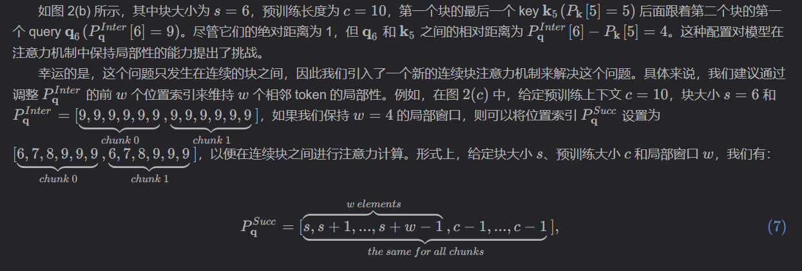

## **yARN**

https://zhuanlan.zhihu.com/p/683863159

https://zhuanlan.zhihu.com/p/1944715652926538312

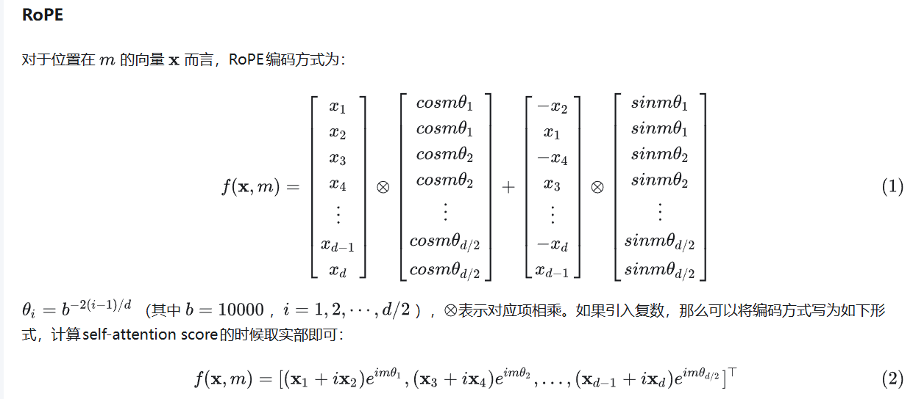

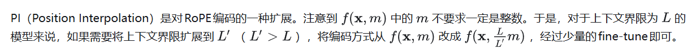

1. **高频信息的损失** ：PI方法通过在预训练限制内插值位置索引来扩展上下文窗口。这种方法在一定程度上忽略了高频位置信息的重要性，这些信息对于模型正确理解和处理输入序列的细微差别至关重要。YaRN通过采用"NTK-aware"插值来解决这个问题，该方法特别关注于保留高频信息。
2. **相对局部距离的损失** ：PI将所有RoPE维度等同对待，没有考虑到不同维度可能对模型性能的不同影响。这可能导致模型在处理接近的词汇时，无法准确理解它们之间的位置关系。YaRN通过"NTK-by-parts"插值方法改进了这一点，该方法对不同的频率维度采用不同的插值策略，以保持模型对局部关系的敏感性。
3. **动态缩放的缺乏** ：PI方法在扩展上下文窗口时采用静态的插值策略，不考虑输入序列的实际长度。这可能导致在处理长度变化的序列时性能下降。YaRN引入了动态缩放（"Dynamic NTK"插值），允许模型根据当前处理的序列长度动态调整其位置编码，从而更灵活地处理不同长度的输入序列。
4. **计算效率** ：尽管PI方法在扩展上下文窗口方面取得了一定的成功，但其对计算资源的需求仍然相对较高。YaRN方法在设计时特别考虑了计算效率，通过减少所需的训练步骤和数据量，使得上下文窗口的扩展更为高效。

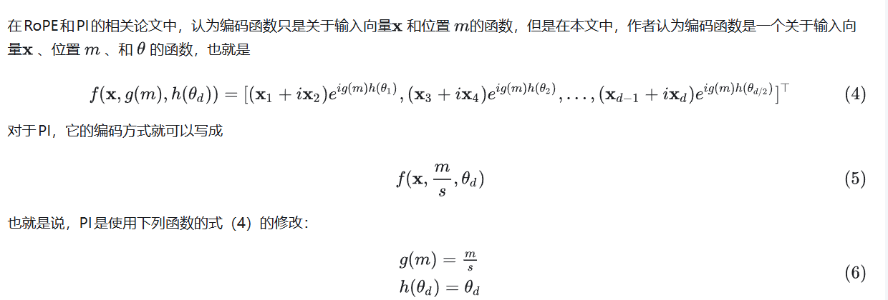

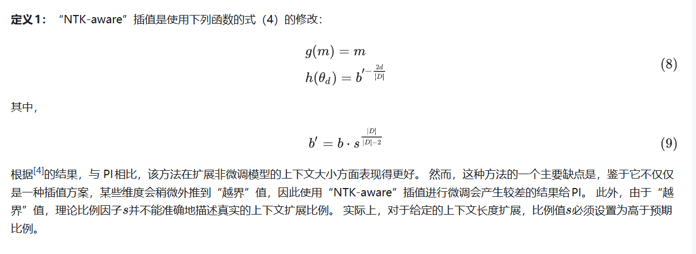

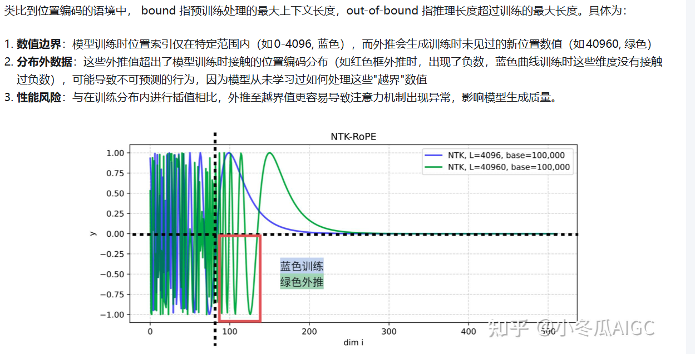

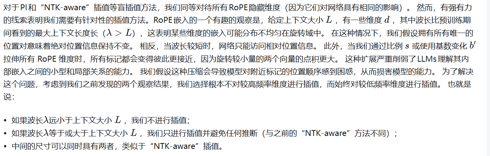

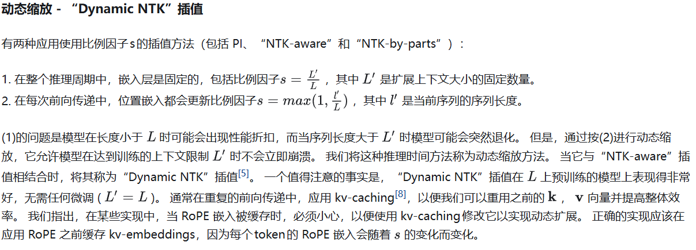

### **YarN**

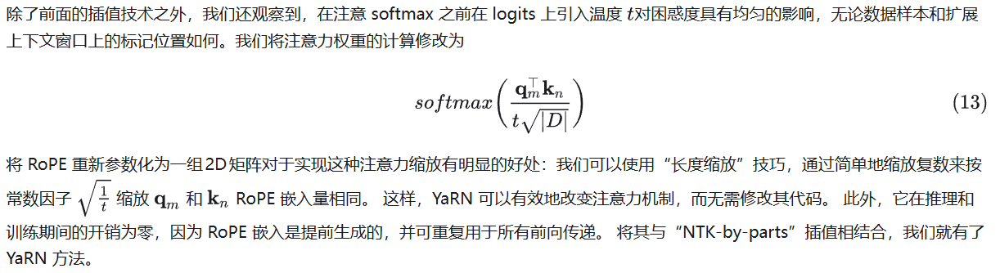

将其与“NTK-by-parts”插值相结合，我们就有了 YaRN 方法。

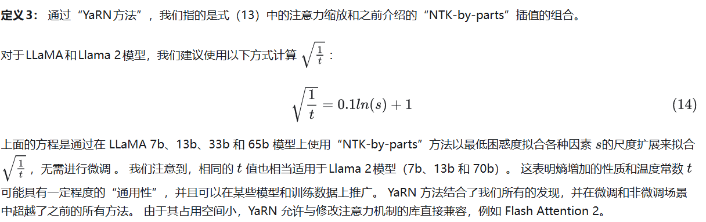

# Qwen2 MOE

模型规模是提升模型性能的关键因素之一。在有限的计算资源预算下，用更少的训练步数训练一个更大的模型，往往比用更多的步数训练一个较小的模型效果更佳。

混合专家模型 (MoE) 的一个显著优势是它们能够在远少于稠密模型所需的计算资源下进行有效的预训练。这意味着在相同的计算预算条件下，您可以显著扩大模型或数据集的规模。特别是在预训练阶段，与稠密模型相比，混合专家模型通常能够更快地达到相同的质量水平。

那么，究竟什么是一个混合专家模型 (MoE) 呢？作为一种基于 Transformer 架构的模型，混合专家模型主要由两个关键部分组成:

* **稀疏 MoE 层** : 这些层代替了传统 Transformer 模型中的前馈网络 (FFN) 层。MoE 层包含若干“专家”(例如 8 个)，每个专家本身是一个独立的神经网络。在实际应用中，这些专家通常是前馈网络 (FFN)，但它们也可以是更复杂的网络结构，甚至可以是 MoE 层本身，从而形成层级式的 MoE 结构。
* **门控网络或路由** : 这个部分用于决定哪些令牌 (token) 被发送到哪个专家。例如，在下图中，“More”这个令牌可能被发送到第二个专家，而“Parameters”这个令牌被发送到第一个专家。有时，一个令牌甚至可以被发送到多个专家。令牌的路由方式是 MoE 使用中的一个关键点，因为路由器由学习的参数组成，并且与网络的其他部分一同进行预训练。

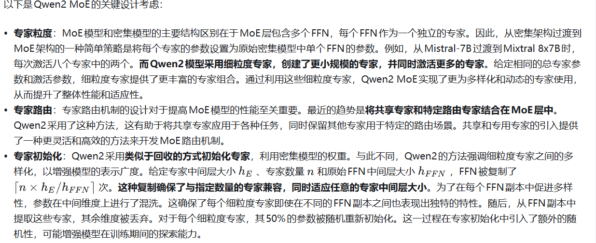

Dense FFN 权重
        │
        │
复制 FFN
        │
        │
shuffle 中间层通道
        │
        │
切片生成 n 个 experts
        │
        │
随机重初始化 50% 参数
        │
        │
得到最终 MoE experts