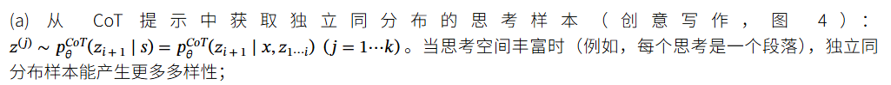
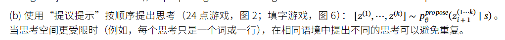
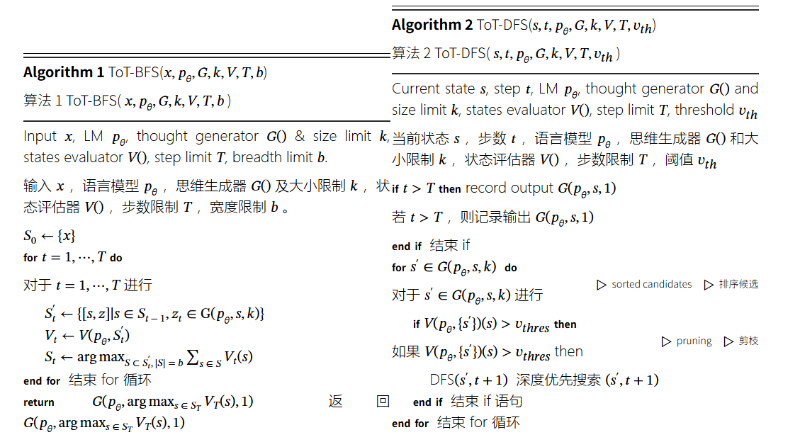

参考链接：

https://www.promptingguide.ai/zh/techniques/tot

https://arxiv.org/html/2305.10601?_immersive_translate_auto_translate=1 (原文

*一个真实的问题解决过程涉及反复使用可用信息来启动探索，进而揭示更多信息，直到最终发现获得解决方案的方法。—— Newell 等人 (1959)*

[Yao et el. (2023)](https://arxiv.org/abs/2305.10601) 提出了思维树（Tree of Thoughts，ToT）框架，该框架基于思维链提示进行了总结，引导语言模型探索把思维作为中间步骤来解决通用问题。

本质是一种推理框架，而不是模型训练方法

ToT 维护着一棵思维树，思维由连贯的语言序列表示，这个序列就是解决问题的中间步骤。使用这种方法，LM 能够自己对严谨推理过程的中间思维进行评估。LM 将生成及评估思维的能力与搜索算法（如广度优先搜索和深度优先搜索）相结合，在系统性探索思维的时候可以向前验证和回溯。

ToT 框架原理如下：

### 1. 思维分解（Thought decomposition）

* **CoT（思维链）** ：隐式生成中间推理步骤。
* **ToT（思维树）** ：显式地把问题拆解成若干中间思维步骤。
* 思维单元的大小因任务而异（可能是几个字、一行方程、或一段计划）。
* 要求思维既不能太大（否则不连贯），也不能太小（否则没法评估价值）。

---

### 2. 思维生成器（Thought generator）

在当前状态下生成下一步思维，有两种策略：

* **(a) 独立采样 Sample** ：从 CoT 提示中独立采样多个候选（适合思维空间大，比如写作）。

  
* **(b) 顺序提议***Propose*：在同一语境下依次生成不同候选（适合思维空间小，比如一个词或一行方程，避免重复）。

  

---

### 3. 状态评估器（State evaluator）

评估不同思维状态的价值，决定哪些状态继续探索。提出用 **大模型来做启发式评估** ，区别于传统编程规则或学习模型。

* **(a) 独立评估 **Value**** ：对每个状态单独打分（数值或分类），结合少量前瞻模拟和常识。
* **(b) 跨状态投票** vote：比较多个候选状态，投票选出最有前景的那个（类似逐步自洽/多选问答）。

(a) 广度优先搜索（BFS）（算法 1）每步维护一组最有潜力的状态。这用于 24 点游戏和创意写作，其中树深度有限（ T≤3 ），初始思维步骤可以被评估并剪枝到一个小集合（ b≤5 ）。

(b) 深度优先搜索（DFS）（算法 2）首先探索最有潜力的状态，直到达到最终输出（ t>T ），或者状态评估器认为从当前 s 无法解决问题（ V⁢(pθ,{s})⁢(s)≤vt⁢h 对于一个值阈值 vt⁢h ）。在后一种情况下，从 s 开始的子树被剪枝，以权衡探索和利用。在这两种情况下，DFS 回溯到 s 的父状态以继续探索。

## example

ToT 需要针对不同的任务定义思维/步骤的数量以及每步的候选项数量。例如，论文中的“算 24 游戏”是一种数学推理任务，需要分成 3 个思维步骤，每一步都需要一个中间方程。而每个步骤保留最优的（best） 5 个候选项。

ToT 完成算 24 的游戏任务要执行广度优先搜索（BFS），每步思维的候选项都要求 LM 给出能否得到 24 的评估：“sure/maybe/impossible”（一定能/可能/不可能） 。作者讲到：“目的是得到经过少量向前尝试就可以验证正确（sure）的局部解，基于‘太大/太小’的常识消除那些不可能（impossible）的局部解，其余的局部解作为‘maybe’保留。”每步思维都要抽样得到 3 个评估结果。整个过程如下图所示：

从下图中报告的结果来看，ToT 的表现大大超过了其他提示方法：

从大方向上来看，[Yao et el. (2023)](https://arxiv.org/abs/2305.10601) 和 [Long (2023)](https://arxiv.org/abs/2305.08291) 的核心思路是类似的。两种方法都是以多轮对话搜索树的形式来增强 LLM 解决复杂问题的能力。主要区别在于 [Yao et el. (2023)](https://arxiv.org/abs/2305.10601) 采用了深度优先（DFS）/广度优先（BFS）/集束（beam）搜索，而 [Long (2023)](https://arxiv.org/abs/2305.08291) 则提出由强化学习（Reinforcement Learning）训练出的 “ToT 控制器”（ToT Controller）来驱动树的搜索策略(包括什么时候回退和搜索到哪一级回退等等)。深度优先/广度优先/集束搜索是通用搜索策略，并不针对具体问题。相比之下，由强化学习训练出的 ToT 控制器有可能从新的数据集学习，或是在自对弈（AlphaGo vs. 蛮力搜索）的过程中学习。因此，即使采用的是冻结的 LLM，基于强化学习构建的 ToT 系统仍然可以不断进化，学习新的知识。

### 资源使用情况

根据不同方法，资源消耗如下：

* **IO方法** ：需要 6960 个完成令牌，2185 个提示令牌，成本为 0.48315。
* **CoT-SC方法** ：到目前为止的使用情况包括 7349 个完成令牌，4000 个提示令牌，成本为 0.56094。
* **ToT方法** ：涉及 9161 个完成令牌，28451 个提示令牌，总成本为 1.40319。
