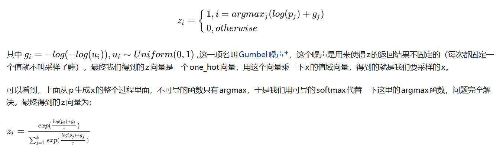
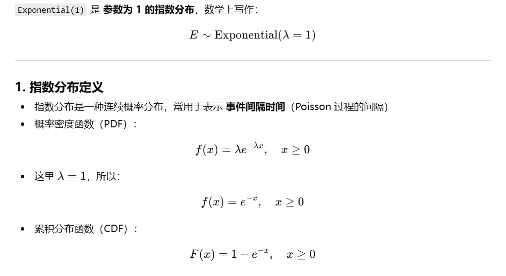
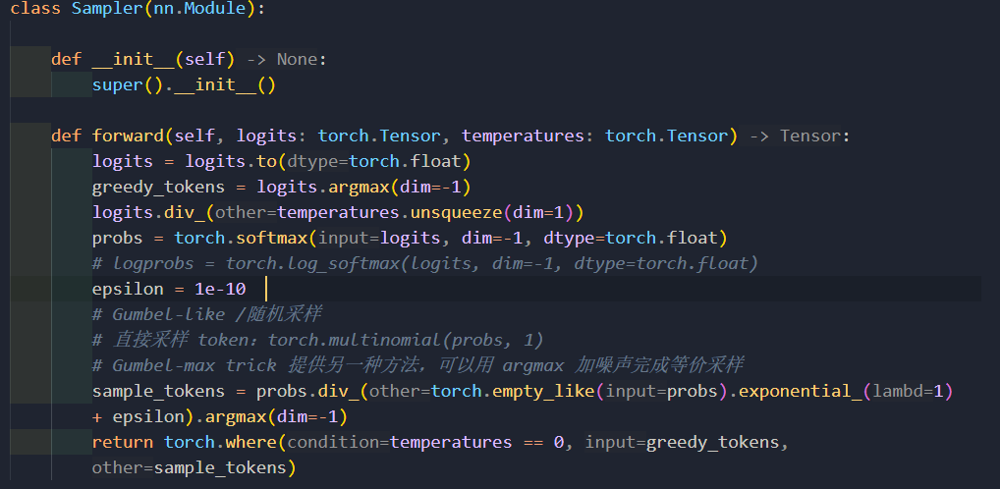

参考链接：
https://www.zhihu.com/question/62631725

注意！**我不讲Gumbel-Max的数学正确性，只说它是用来做什么的，以及我们为什么需要它** 。

Gumbel-Max解决了这么一个问题：

我们知道一个[离散随机变量](https://zhida.zhihu.com/search?content_id=122422600&content_type=Answer&match_order=1&q=%E7%A6%BB%E6%95%A3%E9%9A%8F%E6%9C%BA%E5%8F%98%E9%87%8F&zhida_source=entity)X的分布，比如说p(X=1)=p1=0.2,p(X=2)=p2=0.3,p(X=3)=p2=0.5，然后**我们想得到一些服从这个分布的离散的x的值。** 我们一般的思路当然是，就按照这个概率去采样嘛，采样一些x来用就行了。

但是这么做有一个问题：**我们采样出来的x只有值，没有生成x的式子。** 本来x的值和p1,p2,p3是相关的，但是我们使用采样这么一个办法之后，我们**得到的x没有办法对p1,p2,p3求导** ，这在[神经网络](https://zhida.zhihu.com/search?content_id=122422600&content_type=Answer&match_order=1&q=%E7%A5%9E%E7%BB%8F%E7%BD%91%E7%BB%9C&zhida_source=entity)里面就是一个大问题，没法BP了嘛。很多时候我们只是要x的期望，那么我们就是x=p1+2*p2+3*p3，x对p1,p2,p3的导数都很清楚，[逆向传播](https://zhida.zhihu.com/search?content_id=122422600&content_type=Answer&match_order=1&q=%E9%80%86%E5%90%91%E4%BC%A0%E6%92%AD&zhida_source=entity)很好实现。但是我们这里的需求是采样，要得到一些实际的x值，就像上面说的，不能求导的问题就来了。

那么，**能不能给一个以p1,p2,p3为参数的公式，让这个公式返回的结果是x的采样呢？** 这样的话，我们**就可以对这个公式求导，从而得到采样的x对p1,p2,p3的导数** 了！答案当然是：能！

我们所想要的就是下面这个式子，即gumbel-max技巧：



这个式子里的参数 τ 越小，z越接近one_hot向量。然后我们得到了一些可以对p求导的x的取样值，当然因为我们最后用的是softmax，所以x的值跟纯粹的取样也不完全一样，但比起直接求期望，我们至少得到了样本，不是吗？

这个过程相当于我们把不可导的取样过程，从x本身转嫁到了求取x的公式中的一项g上面，而g不依赖于p1,p2,p3。这样一来，x对p1,p2,p3仍然是可导的，而我们得到的x仍然是离散值的采样。目标达成。这样的采样过程转嫁的技巧有一个专门的名字，叫[再参化技巧](https://zhida.zhihu.com/search?content_id=122422600&content_type=Answer&match_order=1&q=%E5%86%8D%E5%8F%82%E5%8C%96%E6%8A%80%E5%B7%A7&zhida_source=entity)(reparameterization trick)，有兴趣的同学可以去搜一下。


‘

```
import torch

# 生成与 logits 相同形状的指数分布随机数
logits = torch.tensor([[2.0, 1.0, 0.5]])
exp_noise = torch.empty_like(logits).exponential_(1.0)
print(exp_noise)
```

## nanovllm采样环节


